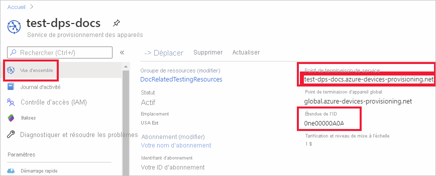

# <a name="quickstart-provision-a-symmetric-key-device-using-c"></a>Démarrage rapide : Provisionner un appareil à clé symétrique avec C#

Dans ce guide de démarrage rapide, vous allez apprendre à provisionner un ordinateur de développement Windows en tant qu’appareil sur un hub IoT à l’aide de C#. Cet appareil utilise une clé symétrique et une inscription individuelle pour s’authentifier auprès d’une instance du service Device Provisioning afin d’être attribué à un hub IoT. L’exemple de code issu des [exemples Azure IoT pour C#](https://github.com/Azure-Samples/azure-iot-samples-csharp) est utilisé pour provisionner l’appareil. 

Bien que cet article illustre le provisionnement avec une seule inscription, vous pouvez aussi utiliser des groupes d’inscription. Il existe cependant quelques différences lorsque vous utilisez des groupes d’inscription. Par exemple, vous devez utiliser une clé d’appareil dérivée avec un ID d’inscription unique pour l’appareil. [Provisionner des appareils avec des clés symétriques](how-to-legacy-device-symm-key.md) fournit un exemple de groupe d’inscription. Pour plus d’informations sur les groupes d’inscription, consultez [Inscriptions de groupe pour l’attestation de clé symétrique](concepts-symmetric-key-attestation.md#group-enrollments).

Si vous ne connaissez pas le processus de provisionnement automatique, révisez la présentation du [provisionnement](about-iot-dps.md#provisioning-process) avant de poursuivre. 

Vérifiez également que vous avez suivi la procédure décrite dans [Configurer le service IoT Hub Device Provisioning avec le portail Azure](./quick-setup-auto-provision.md) avant de poursuivre ce démarrage rapide. Ce guide de démarrage rapide nécessite au préalable la création d’une instance du service Device Provisioning.

Cet article traite d’une station de travail Windows. Toutefois, vous pouvez effectuer les procédures sur Linux. Pour obtenir un exemple sur Linux, consultez [Provisionnement pour la multilocation](how-to-provision-multitenant.md).


[!INCLUDE [quickstarts-free-trial-note](../../includes/quickstarts-free-trial-note.md)]


## <a name="prerequisites"></a>Prérequis

* Vérifiez que le kit [SDK .NET Core 2.1](https://www.microsoft.com/net/download/windows) ou version ultérieure est installé sur votre ordinateur Windows.

* Dernière version de [Git](https://git-scm.com/download/) installée.

<a id="setupdevbox"></a>


## <a name="create-a-device-enrollment"></a>Créer une inscription d’appareil

1. Connectez-vous au [portail Azure](https://portal.azure.com), sélectionnez le bouton **Toutes les ressources** dans le menu de gauche et ouvrez votre instance de service Device Provisioning (DPS).

2. Sélectionnez l’onglet **Gérer les inscriptions**, puis le bouton **Ajouter une inscription individuelle** dans la partie supérieure. 

3. Dans le volet **Ajouter une inscription**, entrez les informations suivantes, puis appuyez sur le bouton **Enregistrer**.

   - **Mécanisme** : sélectionnez **Clé symétrique** comme *mécanisme* d’attestation d’identité.

   - **Générer automatiquement les clés** : cochez cette case.

   - **ID d’inscription** : entrez un ID d’inscription pour identifier l’inscription. Utilisez uniquement des caractères alphanumériques en minuscules et des tirets (« - »). Par exemple, **symm-key-csharp-device-01**.

   - **ID de l’appareil IoT Hub** : entrez un identificateur d’appareil. Par exemple, **csharp-device-01**.

     

4. Une fois que vous avez enregistré votre inscription, la **Clé primaire** et la **Clé secondaire** sont générées et ajoutées à l’entrée d’inscription. Votre inscription d’appareil à clé symétrique apparaît sous le nom **symm-key-csharp-device-01** sous la colonne *ID d’inscription* de l’onglet *Inscriptions individuelles*. 

5. Ouvrez l’inscription et copiez la valeur de vos **Clé primaire** et **Clé secondaire** générées. Vous allez utiliser cette valeur de clé et l’**ID d’inscription** plus tard quand vous ajouterez des variables d’environnement à utiliser avec l’exemple de code de provisionnement des appareils.


## <a name="prepare-the-c-environment"></a>Préparer l’environnement C# 

1. Ouvrez un environnement de ligne de commande Git CMD ou Git Bash. Clonez le dépôt GitHub d’[exemples Azure IoT pour C#](https://github.com/Azure-Samples/azure-iot-samples-csharp) à l’aide de la commande suivante :

    ```cmd
    git clone https://github.com/Azure-Samples/azure-iot-samples-csharp.git
    ```


<a id="firstbootsequence"></a>

## <a name="prepare-the-device-provisioning-code"></a>Préparer le code de provisionnement des appareils

Dans cette section, vous allez ajouter les quatre variables d’environnement suivantes qui seront utilisées comme paramètres pour l’exemple de code de provisionnement afin de provisionner votre appareil à clé symétrique. 

* `DPS_IDSCOPE`
* `PROVISIONING_REGISTRATION_ID`
* `PRIMARY_SYMMETRIC_KEY`
* `SECONDARY_SYMMETRIC_KEY`

Le code de provisionnement contacte l’instance du service DPS en fonction de ces variables afin d’authentifier votre appareil. L’appareil est alors attribué à un hub IoT déjà lié à l’instance du service DPS en fonction de la configuration de l’inscription individuelle. Une fois provisionné, l’exemple de code envoie des données de télémétrie de test au hub IoT.

1. Dans le [portail Azure](https://portal.azure.com), dans le menu Service Device Provisioning, sélectionnez **Vue d’ensemble** et copiez votre _point de terminaison de service_ et votre _ID d’étendue_. Vous allez utiliser ces valeurs pour les variables d’environnement `PROVISIONING_HOST` et `DPS_IDSCOPE`.

    

2. Ouvrez une invite de commandes et accédez à *SymmetricKeySample* dans le dépôt d’exemples cloné :

    ```cmd
    cd provisioning\Samples\device\SymmetricKeySample
    ```

3. Dans le dossier *SymmetricKeySample*, ouvrez *Program.cs* dans un éditeur de texte et recherchez les lignes de code qui définissent les chaînes `individualEnrollmentPrimaryKey` et `individualEnrollmentSecondaryKey`. Mettez à jour ces lignes de code comme suit afin que les variables d’environnement soient utilisées au lieu de coder en dur les clés.
 
    ```csharp
        //These are the two keys that belong to your individual enrollment. 
        // Leave them blank if you want to try this sample for an individual enrollment instead
        //private const string individualEnrollmentPrimaryKey = "";
        //private const string individualEnrollmentSecondaryKey = "";

        private static string individualEnrollmentPrimaryKey = Environment.GetEnvironmentVariable("PRIMARY_SYMMETRIC_KEY");;
        private static string individualEnrollmentSecondaryKey = Environment.GetEnvironmentVariable("SECONDARY_SYMMETRIC_KEY");;
    ```

    Recherchez également la ligne de code qui définit la chaîne `registrationId` et mettez-la à jour comme suit, afin d’utiliser également une variable d’environnement comme suit :

    ```csharp
        //This field is mandatory to provide for this sample
        //private static string registrationId = "";

        private static string registrationId = Environment.GetEnvironmentVariable("PROVISIONING_REGISTRATION_ID");;
    ```

    Enregistrez les modifications apportées à *Program.cs*.

3. À votre invite de commandes, ajoutez les variables d’environnement de l’étendue d’ID, de l’ID d’inscription et des clés symétriques primaire et secondaire que vous avez copiées à partir de l’inscription individuelle dans la section précédente.  

    Les commandes suivantes sont des exemples qui illustrent la syntaxe de commande. Veillez à utiliser vos valeurs correctes.

    ```console
    set DPS_IDSCOPE=0ne00000A0A
    ```

    ```console
    set PROVISIONING_REGISTRATION_ID=symm-key-csharp-device-01
    ```

    ```console
    set PRIMARY_SYMMETRIC_KEY=sbDDeEzRuEuGKag+kQKV+T1QGakRtHpsERLP0yPjwR93TrpEgEh/Y07CXstfha6dhIPWvdD1nRxK5T0KGKA+nQ==
    ```

    ```console
    set SECONDARY_SYMMETRIC_KEY=Zx8/eE7PUBmnouB1qlNQxI7fcQ2HbJX+y96F1uCVQvDj88jFL+q6L9YWLLi4jqTmkRPOulHlSbSv2uFgj4vKtw==
    ```


4. Générez et exécutez l’exemple de code à l’aide de la commande suivante.

    ```console
    dotnet run
    ```

5. La sortie attendue doit ressembler à ce qui suit, c’est-à-dire montrer le hub IoT lié auquel l’appareil a été attribué en fonction des paramètres de l’inscription individuelle. Un exemple de chaîne « TestMessage » est envoyé au hub en guise de test :

    ```output
    D:\azure-iot-samples-csharp\provisioning\Samples\device\SymmetricKeySample>dotnet run
    RegistrationID = symm-key-csharp-device-01
    ProvisioningClient RegisterAsync . . . Assigned
    ProvisioningClient AssignedHub: docs-test-iot-hub.azure-devices.net; DeviceID: csharp-device-01
    Creating Symmetric Key DeviceClient authentication
    DeviceClient OpenAsync.
    DeviceClient SendEventAsync.
    DeviceClient CloseAsync.
    Enter any key to exit
    ```
    
6. Dans le portail Azure, accédez au hub IoT lié à votre service de provisionnement et ouvrez le panneau **Appareils IoT**. Une fois l’appareil à clé symétrique correctement configuré dans le hub, l’ID de l’appareil apparaît avec l’*ÉTAT* **activé**. Notez que vous devrez peut-être appuyer sur le bouton **Actualiser** dans la partie supérieure si vous avez déjà ouvert le panneau avant d’exécuter l’exemple de code de l’appareil. 

     

> [!NOTE]
> Si vous avez modifié la valeur par défaut de l’*état du jumeau d’appareil initial* dans l’entrée d’inscription de votre appareil, l’état du jumeau souhaité peut être extrait du hub et agir en conséquence. Pour en savoir plus, consultez [Comprendre et utiliser les jumeaux d’appareil IoT Hub](../iot-hub/iot-hub-devguide-device-twins.md).
>


## <a name="clean-up-resources"></a>Nettoyer les ressources

Si vous envisagez de manipuler et d’explorer davantage l’exemple de client d’appareil, ne nettoyez pas les ressources créées dans ce guide de démarrage rapide. Sinon, effectuez les étapes suivantes pour supprimer toutes les ressources créées par ce guide.

1. Dans le menu de gauche du portail Azure, sélectionnez **Toutes les ressources**, puis votre service Device Provisioning. Ouvrez **Gérer les inscriptions** pour votre service, puis sélectionnez l’onglet **Inscriptions individuelles**. Cochez la case à côté de l’*ID D’INSCRIPTION* de l’appareil que vous avez inscrit dans ce guide de démarrage rapide, puis appuyez sur le bouton **Supprimer** dans la partie supérieure du volet. 
1. À partir du menu de gauche, dans le portail Azure, sélectionnez **Toutes les ressources**, puis votre hub IoT. Ouvrez **Appareils IoT** pour votre hub, cochez la case en regard de l’*ID D’APPAREIL* de l’appareil que vous avez inscrit dans ce guide de démarrage rapide, puis appuyez sur le bouton **Supprimer** dans la partie supérieure du volet.

## <a name="next-steps"></a>Étapes suivantes

Dans ce guide de démarrage rapide, vous avez provisionné un appareil à clé symétrique Windows dans votre IoT Hub à l’aide du service IoT Hub Device Provisioning. Pour découvrir comment provisionner des appareils à certificat X.509 avec C#, poursuivez avec le guide de démarrage rapide ci-dessous pour les appareils X.509. 

> [!div class="nextstepaction"]
> [Démarrage rapide Azure : Provisionner des appareils X.509 à l’aide de DPS et C#](quick-create-simulated-device-x509-csharp.md)
