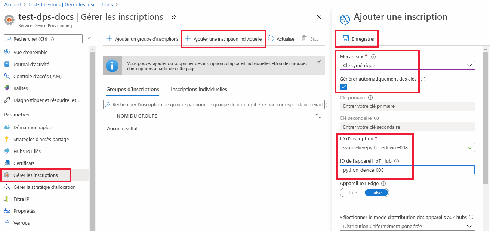
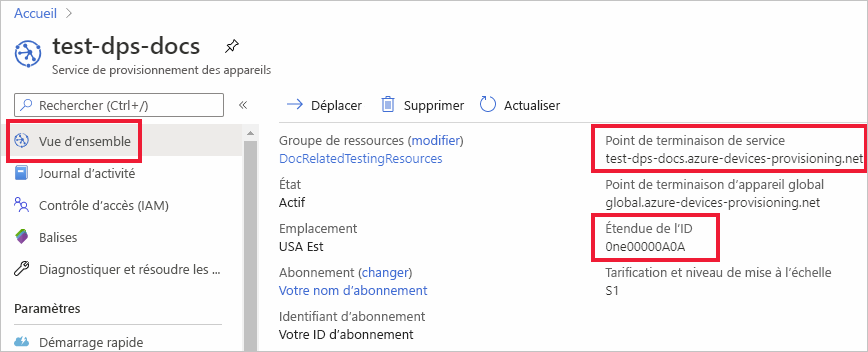
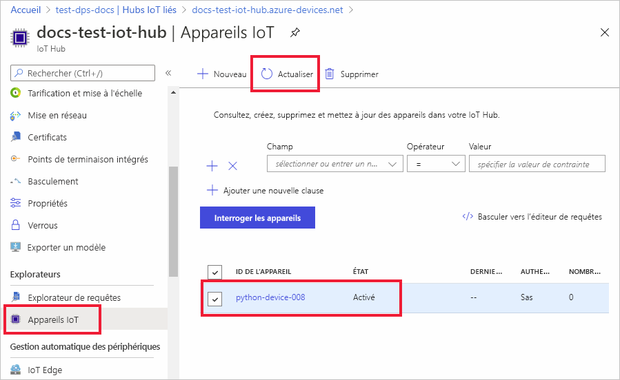

# <a name="quickstart-provision-a-python-device-with-symmetric-keys"></a>Provisionner un appareil Python avec des clés symétriques

Dans ce guide de démarrage rapide, vous allez apprendre à provisionner un ordinateur de développement Windows comme un appareil sur un hub IoT à l’aide de Python. Cet appareil utilise une clé symétrique et une inscription individuelle pour s’authentifier auprès d’une instance du service Device Provisioning afin d’être attribué à un hub IoT. L’exemple de code issu du [SDK Azure IoT Python](https://github.com/Azure/azure-iot-sdk-python) est utilisé pour provisionner l’appareil. 

Bien que cet article illustre le provisionnement avec une seule inscription, vous pouvez aussi utiliser des groupes d’inscription. Il existe cependant quelques différences lorsque vous utilisez des groupes d’inscription. Par exemple, vous devez utiliser une clé d’appareil dérivée avec un ID d’inscription unique pour l’appareil. Bien que les groupes d’inscription avec des clés symétriques ne soient pas limités aux appareils d’ancienne génération, le [Guide pratique pour provisionner des appareils d’ancienne génération à l’aide d’une attestation de clé symétrique](how-to-legacy-device-symm-key.md) fournit un exemple de groupe d’inscription. Pour plus d’informations, consultez [Inscriptions de groupe pour l’attestation de clé symétrique](concepts-symmetric-key-attestation.md#group-enrollments).

Si vous ne connaissez pas le processus de provisionnement automatique, révisez la présentation du [provisionnement](about-iot-dps.md#provisioning-process) avant de poursuivre. 

Vérifiez également que vous avez suivi la procédure décrite dans [Configurer le service IoT Hub Device Provisioning avec le portail Azure](./quick-setup-auto-provision.md) avant de poursuivre ce démarrage rapide. Ce guide de démarrage rapide nécessite au préalable la création d’une instance du service Device Provisioning.

Cet article traite d’une station de travail Windows. Toutefois, vous pouvez effectuer les procédures sur Linux. Pour obtenir un exemple sur Linux, consultez [Guide pratique du provisionnement pour la multilocation](how-to-provision-multitenant.md).


[!INCLUDE [quickstarts-free-trial-note](../../includes/quickstarts-free-trial-note.md)]


## <a name="prerequisites"></a>Prérequis

* Assurez-vous que [Python version 3.7](https://www.python.org/downloads/) ou ultérieure est installé sur votre ordinateur Windows. Vous pouvez vérifier votre version de Python en exécutant `python --version`.

* Dernière version de [Git](https://git-scm.com/download/) installée.

<a id="setupdevbox"></a>

## <a name="prepare-the-python-sdk-environment"></a>Préparer l’environnement du SDK Python 

1. Assurez-vous que Git est installé sur votre machine et ajouté aux variables d’environnement accessibles à la fenêtre de commande. Consultez la section relative aux [outils clients de Software Freedom Conservancy](https://git-scm.com/download/) pour accéder à la dernière version des outils `git` à installer, qui inclut **Git Bash**, l’application de ligne de commande que vous pouvez utiliser pour interagir avec votre référentiel Git local. 

2. Ouvrez une invite de commandes. Clonez le dépôt GitHub pour le SDK Azure IoT Python :
    
    ```console
    git clone https://github.com/Azure/azure-iot-sdk-python.git --recursive
    ```
3. Accédez au répertoire `azure-iot-sdk-python\azure-iot-device\samples\async-hub-scenarios` dans lequel se trouve l’exemple de fichier, _provision_symmetric_key.py_.
   
   ```console
   cd azure-iot-sdk-python\azure-iot-device\samples\async-hub-scenarios
   ```
4. Installez la bibliothèque _azure-iot-device_ en exécutant la commande suivante.

    ```console
    pip install azure-iot-device
    ```


## <a name="create-a-device-enrollment"></a>Créer une inscription d’appareil

1. Connectez-vous au [portail Azure](https://portal.azure.com), sélectionnez le bouton **Toutes les ressources** dans le menu de gauche et ouvrez votre instance de service Device Provisioning (DPS).

2. Sélectionnez l’onglet **Gérer les inscriptions**, puis le bouton **Ajouter une inscription individuelle** dans la partie supérieure. 

3. Dans le volet **Ajouter une inscription**, entrez les informations suivantes, puis appuyez sur le bouton **Enregistrer**.

   - **Mécanisme** : sélectionnez **Clé symétrique** comme *mécanisme* d’attestation d’identité.

   - **Générer automatiquement les clés** : cochez cette case.

   - **ID d’inscription** : entrez un ID d’inscription pour identifier l’inscription. Utilisez uniquement des caractères alphanumériques en minuscules et des tirets (« - »). Par exemple, **symm-key-python-device-008**.

   - **ID de l’appareil IoT Hub** : entrez un identificateur d’appareil. Par exemple, **python-device-008**.

     

4. Une fois que vous avez enregistré votre inscription, la **Clé primaire** et la **Clé secondaire** sont générées et ajoutées à l’entrée d’inscription. Votre inscription d’appareil à clé symétrique apparaît sous le nom **symm-key-python-device-008** sous la colonne *ID d’inscription* de l’onglet *Inscriptions individuelles*. 

5. Ouvrez l’inscription et copiez la valeur de votre **Clé primaire** générée. Vous allez utiliser cette valeur de clé et l’**ID d’inscription** plus tard quand vous ajouterez des variables d’environnement à utiliser avec l’exemple de code de provisionnement des appareils.


<a id="firstbootsequence"></a>

## <a name="prepare-the-device-provisioning-code"></a>Préparer le code de provisionnement des appareils

Dans cette section, vous ajoutez les quatre variables d’environnement suivantes qui sont utilisées comme paramètres pour l’exemple de code de provisionnement de votre appareil à clé symétrique. 

* `PROVISIONING_HOST`
* `PROVISIONING_IDSCOPE`
* `PROVISIONING_REGISTRATION_ID`
* `PROVISIONING_SYMMETRIC_KEY`

Le code de provisionnement contacte l’instance du service DPS en fonction de ces variables afin d’authentifier votre appareil. L’appareil est alors attribué à un hub IoT déjà lié à l’instance du service DPS en fonction de la configuration de l’inscription individuelle. Une fois provisionné, l’exemple de code envoie des données de télémétrie de test au hub IoT.

1. Dans le [portail Azure](https://portal.azure.com), dans le menu Service Device Provisioning, sélectionnez **Vue d’ensemble** et copiez votre _point de terminaison de service_ et votre _ID d’étendue_. Vous allez utiliser ces valeurs pour les variables d’environnement `PROVISIONING_HOST` et `PROVISIONING_IDSCOPE`.

    

2. Dans votre invite de commandes Python, ajoutez les variables d’environnement à l’aide des valeurs que vous avez copiées. 

    Les commandes suivantes sont des exemples qui illustrent la syntaxe de commande. Veillez à utiliser vos valeurs correctes.

    ```console
    set PROVISIONING_HOST=test-dps-docs.azure-devices-provisioning.net
    ```

    ```console
    set PROVISIONING_IDSCOPE=0ne00000A0A
    ```

3. Dans votre invite de commandes Python, ajoutez les variables d’environnement de l’ID d’inscription et de la clé symétrique que vous avez copiés à partir de l’inscription individuelle dans la section précédente. 

    Les commandes suivantes sont des exemples qui illustrent la syntaxe de commande. Veillez à utiliser vos valeurs correctes.

    ```console
    set PROVISIONING_REGISTRATION_ID=symm-key-python-device-008
    ```

    ```console
    set PROVISIONING_SYMMETRIC_KEY=sbDDeEzRuEuGKag+kQKV+T1QGakRtHpsERLP0yPjwR93TrpEgEh/Y07CXstfha6dhIPWvdD1nRxK5T0KGKA+nQ==
    ```

4. Exécutez l’exemple de code Python dans _provision_symmetric_key.py_.

    ```console
    D:\azure-iot-sdk-python\azure-iot-device\samples\async-hub-scenarios>python provision_symmetric_key.py
    ```

5. La sortie attendue doit ressembler à ce qui suit, c’est-à-dire montrer le hub IoT lié auquel l’appareil a été attribué en fonction des paramètres de l’inscription individuelle. Des exemples de messages de télémétrie de la vitesse du vent sont également envoyés au hub en tant que test :

    ```output
    D:\azure-iot-sdk-python\azure-iot-device\samples\async-hub-scenarios>python provision_symmetric_key.py
    RegistrationStage(RequestAndResponseOperation): Op will transition into polling after interval 2.  Setting timer.
    The complete registration result is
    python-device-008
    docs-test-iot-hub.azure-devices.net
    initialAssignment
    null
    Will send telemetry from the provisioned device
    sending message #8
    sending message #9
    sending message #3
    sending message #10
    sending message #4
    sending message #2
    sending message #6
    sending message #7
    sending message #1
    sending message #5
    done sending message #8
    done sending message #9
    done sending message #3
    done sending message #10
    done sending message #4
    done sending message #2
    done sending message #6
    done sending message #7
    done sending message #1
    done sending message #5
    ```
    
6. Dans le portail Azure, accédez au hub IoT lié à votre service de provisionnement et ouvrez le panneau **Appareils IoT**. Une fois l’appareil à clé symétrique correctement configuré dans le hub, l’ID de l’appareil apparaît avec l’*ÉTAT* **activé**. Notez que vous devrez peut-être appuyer sur le bouton **Actualiser** dans la partie supérieure si vous avez déjà ouvert le panneau avant d’exécuter l’exemple de code de l’appareil. 

     

> [!NOTE]
> Si vous avez modifié la valeur par défaut de l’*état du jumeau d’appareil initial* dans l’entrée d’inscription de votre appareil, l’état du jumeau souhaité peut être extrait du hub et agir en conséquence. Pour en savoir plus, consultez [Comprendre et utiliser les jumeaux d’appareil IoT Hub](../iot-hub/iot-hub-devguide-device-twins.md).
>


## <a name="clean-up-resources"></a>Nettoyer les ressources

Si vous envisagez de manipuler et d’explorer davantage l’exemple de client d’appareil, ne nettoyez pas les ressources créées dans ce guide de démarrage rapide. Sinon, effectuez les étapes suivantes pour supprimer toutes les ressources créées par ce guide.

1. Dans le menu de gauche du portail Azure, sélectionnez **Toutes les ressources**, puis votre service Device Provisioning. Ouvrez **Gérer les inscriptions** pour votre service, puis sélectionnez l’onglet **Inscriptions individuelles**. Cochez la case à côté de l’*ID D’INSCRIPTION* de l’appareil que vous avez inscrit dans ce guide de démarrage rapide, puis appuyez sur le bouton **Supprimer** dans la partie supérieure du volet. 
1. À partir du menu de gauche, dans le portail Azure, sélectionnez **Toutes les ressources**, puis votre hub IoT. Ouvrez **Appareils IoT** pour votre hub, cochez la case en regard de l’*ID D’APPAREIL* de l’appareil que vous avez inscrit dans ce guide de démarrage rapide, puis appuyez sur le bouton **Supprimer** dans la partie supérieure du volet.

## <a name="next-steps"></a>Étapes suivantes

Dans ce guide de démarrage rapide, vous avez provisionné un appareil à clé symétrique Windows dans votre IoT Hub à l’aide du service IoT Hub Device Provisioning. Pour découvrir comment provisionner des appareils à certificat X.509 à l’aide de Python, poursuivez avec le démarrage rapide ci-dessous pour les appareils X.509. 

> [!div class="nextstepaction"]
> [Démarrage rapide Azure : Provisionner des appareils X.509 à l’aide de DPS et Python](quick-create-simulated-device-x509-python.md)
