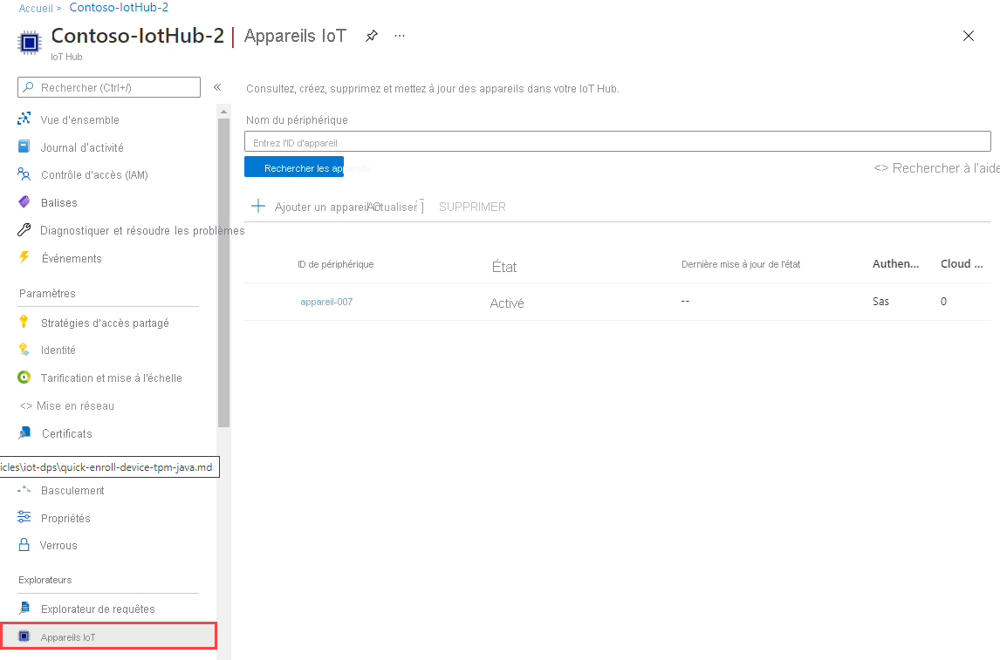

# <a name="quickstart-provision-a-simulated-device-with-symmetric-keys"></a>Démarrage rapide : Provisionner un appareil simulé avec des clés symétriques

Dans ce guide de démarrage rapide, vous allez apprendre à créer et à exécuter un simulateur d’appareil sur une machine de développement Windows. Vous allez configurer cet appareil simulé à affecter à un hub IoT de manière à ce qu’il utilise une clé symétrique pour s’authentifier auprès d’une instance du service Device Provisioning. Un exemple de code du [SDK Azure IoT pour C](https://github.com/Azure/azure-iot-sdk-c) est utilisé pour simuler une séquence de démarrage pour l’appareil qui lance le provisionnement. L’appareil est reconnu en fonction d’une inscription individuelle auprès de l’instance du service de provisionnement et affecté à un hub IoT.

Bien que cet article illustre le provisionnement avec une seule inscription, vous pouvez utiliser des groupes d’inscription. Il existe cependant quelques différences lorsque vous utilisez des groupes d’inscription. Par exemple, vous devez utiliser une clé d’appareil dérivée avec un ID d’inscription unique pour l’appareil. Bien que les groupes d’inscription avec des clés symétriques ne soient pas limités aux appareils d’ancienne génération, le [Guide pratique pour provisionner des appareils d’ancienne génération à l’aide d’une attestation de clé symétrique](how-to-legacy-device-symm-key.md) fournit un exemple de groupe d’inscription. Pour plus d’informations, consultez [Inscriptions de groupe pour l’attestation de clé symétrique](concepts-symmetric-key-attestation.md#group-enrollments).

Si vous ne connaissez pas le processus d’approvisionnement automatique, consultez [Concepts de provisionnement automatique](concepts-auto-provisioning.md). 

Vérifiez également que vous avez suivi la procédure décrite dans [Configurer le service IoT Hub Device Provisioning avec le portail Azure](./quick-setup-auto-provision.md) avant de poursuivre ce démarrage rapide. Ce guide de démarrage rapide nécessite au préalable la création d’une instance du service Device Provisioning.

Cet article traite d’une station de travail Windows. Toutefois, vous pouvez effectuer les procédures sur Linux. Pour obtenir un exemple sur Linux, consultez [Guide pratique du provisionnement pour la multilocation](how-to-provision-multitenant.md).


[!INCLUDE [quickstarts-free-trial-note](../../includes/quickstarts-free-trial-note.md)]


## <a name="prerequisites"></a>Conditions préalables requises

Les prérequis suivants s’appliquent à un environnement de développement Windows. Pour Linux ou macOS, consultez la section appropriée de [Préparer votre environnement de développement](https://github.com/Azure/azure-iot-sdk-c/blob/master/doc/devbox_setup.md) dans la documentation du kit de développement logiciel (SDK).

* [Visual Studio](https://visualstudio.microsoft.com/vs/) 2019 avec la charge de travail [« Développement Desktop en C++ »](https://docs.microsoft.com/cpp/?view=vs-2019#pivot=workloads) activée. Visual Studio 2015 et Visual Studio 2017 sont également pris en charge.

* Dernière version de [Git](https://git-scm.com/download/) installée.

<a id="setupdevbox"></a>

## <a name="prepare-an-azure-iot-c-sdk-development-environment"></a>Préparer un environnement de développement pour le SDK Azure IoT pour C

Dans cette section, vous allez préparer un environnement de développement pour générer le [SDK Azure IoT pour C](https://github.com/Azure/azure-iot-sdk-c). 

Le SDK inclut l’exemple de code pour un appareil simulé. Cet appareil simulé tente le provisionnement durant la séquence de démarrage de l’appareil.

1. Téléchargez le [système de génération CMake](https://cmake.org/download/).

    Il est important que les composants requis Visual Studio (Visual Studio et la charge de travail « Développement Desktop en C++ ») soient installés sur votre machine, **avant** de commencer l’installation de l’élément `CMake`. Une fois les composants requis en place et le téléchargement effectué, installez le système de génération de CMake.

    Les versions antérieures du système de génération CMake ne permettent pas de générer le fichier solution utilisé dans cet article. Veillez donc à utiliser une version plus récente de CMake.

2. Cliquez sur **Étiquettes** pour rechercher le nom d’étiquette de la dernière [version du SDK C Azure IoT](https://github.com/Azure/azure-iot-sdk-c/releases/latest).

3. Ouvrez une invite de commandes ou l’interpréteur de commandes Git Bash. Exécutez les commandes suivantes pour cloner la dernière version du dépôt GitHub du [Azure IoT C SDK](https://github.com/Azure/azure-iot-sdk-c). Utilisez l’étiquette obtenue à l’étape précédente comme valeur pour le paramètre `-b` :

    ```cmd/sh
    git clone -b <release-tag> https://github.com/Azure/azure-iot-sdk-c.git
    cd azure-iot-sdk-c
    git submodule update --init
    ```

    Attendez-vous à ce que cette opération prenne plusieurs minutes.

4. Créez un sous-répertoire `cmake` dans le répertoire racine du référentiel Git et accédez à ce dossier. Exécutez les commandes suivantes à partir du répertoire `azure-iot-sdk-c` :

    ```cmd/sh
    mkdir cmake
    cd cmake
    ```

5. Exécutez la commande suivante qui génère une version du SDK propre à votre plateforme cliente de développement. Une solution Visual Studio pour l’appareil simulé est générée dans le répertoire `cmake`. 

    ```cmd
    cmake -Dhsm_type_symm_key:BOOL=ON -Duse_prov_client:BOOL=ON  ..
    ```
    
    Si `cmake` ne trouve pas votre compilateur C++, vous obtiendrez peut-être des erreurs de build lors de l’exécution de la commande ci-dessus. Si cela se produit, essayez d’exécuter cette commande dans [l’invite de commandes de Visual Studio](https://docs.microsoft.com/dotnet/framework/tools/developer-command-prompt-for-vs). 

    Une fois la génération terminée, les dernières lignes de sortie doivent ressembler à la sortie suivante :

    ```cmd/sh
    $ cmake -Dhsm_type_symm_key:BOOL=ON -Duse_prov_client:BOOL=ON  ..
    -- Building for: Visual Studio 15 2017
    -- Selecting Windows SDK version 10.0.16299.0 to target Windows 10.0.17134.
    -- The C compiler identification is MSVC 19.12.25835.0
    -- The CXX compiler identification is MSVC 19.12.25835.0

    ...

    -- Configuring done
    -- Generating done
    -- Build files have been written to: E:/IoT Testing/azure-iot-sdk-c/cmake
    ```

## <a name="create-a-device-enrollment-entry-in-the-portal"></a>Créer une entrée d’inscription d’appareil dans le portail

1. Connectez-vous au [portail Azure](https://portal.azure.com), sélectionnez le bouton **Toutes les ressources** dans le menu de gauche, puis ouvrez votre service Device Provisioning.

2. Sélectionnez l’onglet **Gérer les inscriptions**, puis le bouton **Ajouter une inscription individuelle** dans la partie supérieure. 

3. Dans le volet **Ajouter une inscription**, entrez les informations suivantes, puis appuyez sur le bouton **Enregistrer**.

   - **Mécanisme** : sélectionnez **Clé symétrique** comme *Mécanisme* d'attestation d'identité.

   - **Générer automatiquement des clés** : cochez cette case.

   - **ID d'inscription** : entrez un ID pour identifier l'inscription. Utilisez uniquement des caractères alphanumériques en minuscules et des tirets (« - »). Par exemple, **symm-key-device-007**.

   - **ID de l’appareil IoT Hub :** entrez un identificateur d'appareil. Par exemple : **device-007**.

     

4. Une fois que vous avez enregistré votre inscription, la **Clé primaire** et la **Clé secondaire** sont générées et ajoutées à l’entrée d’inscription. Votre inscription d’appareil à clé symétrique apparaît sous la forme **symm-key-device-007** sous la colonne *ID d’inscription* de l’onglet *Inscriptions individuelles*. 

    Ouvrez l’inscription et copiez la valeur de votre **Clé primaire** générée.


<a id="firstbootsequence"></a>

## <a name="simulate-first-boot-sequence-for-the-device"></a>Simuler la première séquence de démarrage de l’appareil

Dans cette section, mettez à jour l’exemple de code pour envoyer la séquence de démarrage de l’appareil vers votre instance de service Device Provisioning. Cette séquence de démarrage entraîne la reconnaissance et l’affectation de l’appareil à un hub IoT lié à l’instance de service Device Provisioning.


1. Dans le portail Azure, sélectionnez l’onglet **Vue d’ensemble** de votre service Device Provisioning et notez la valeur **_Étendue de l’ID_** .

     

2. Dans Visual Studio, ouvrez le fichier de solution **azure_iot_sdks.sln** généré en exécutant CMake. Le fichier solution doit être à l’emplacement suivant :

    ```
    \azure-iot-sdk-c\cmake\azure_iot_sdks.sln
    ```

    Si le fichier n’a pas été généré dans votre répertoire CMake, vérifiez que vous avez utilisé une version récente du système de génération CMake.

3. Dans la fenêtre *Explorateur de solutions* de Visual Studio, accédez au dossier **Provision\_Samples**. Développez l’exemple de projet nommé **prov\_dev\_client\_sample**. Développez **Fichiers sources**, puis ouvrez **prov\_dev\_client\_sample.c**.

4. Recherchez la constante `id_scope` et remplacez la valeur par la valeur **Étendue de l’ID** que vous avez copiée précédemment. 

    ```c
    static const char* id_scope = "0ne00002193";
    ```

5. Recherchez la définition de la fonction `main()` dans le même fichier. Vérifiez que la variable `hsm_type` a la valeur `SECURE_DEVICE_TYPE_SYMMETRIC_KEY`, comme indiqué ci-dessous :

    ```c
    SECURE_DEVICE_TYPE hsm_type;
    //hsm_type = SECURE_DEVICE_TYPE_TPM;
    //hsm_type = SECURE_DEVICE_TYPE_X509;
    hsm_type = SECURE_DEVICE_TYPE_SYMMETRIC_KEY;
    ```

6. Recherchez l'appel vers `prov_dev_set_symmetric_key_info()` dans **prov\_dev\_client\_sample.c** qui est commenté.

    ```c
    // Set the symmetric key if using they auth type
    //prov_dev_set_symmetric_key_info("<symm_registration_id>", "<symmetric_Key>");
    ```

    Supprimez les marques de commentaire de l'appel de fonction et remplacez les valeurs d'espace réservé (y compris les crochets) par votre ID d'inscription et les valeurs de clé primaire.

    ```c
    // Set the symmetric key if using they auth type
    prov_dev_set_symmetric_key_info("symm-key-device-007", "your primary key here");
    ```
   
    Enregistrez le fichier .

7. Cliquez avec le bouton droit sur le projet **prov\_dev\_client\_sample** et sélectionnez **Définir comme projet de démarrage**. 

8. Dans le menu Visual Studio, sélectionnez **Déboguer** > **Exécuter sans débogage** pour exécuter la solution. Dans l’invite pour régénérer le projet, sélectionnez **Oui** pour régénérer le projet avant de l’exécuter.

    La sortie suivante est un exemple illustrant le démarrage réussi de l’appareil simulé et sa connexion à une instance de service Device Provisioning pour l’affecter à un hub IoT :

    ```cmd
    Provisioning API Version: 1.2.8

    Registering Device

    Provisioning Status: PROV_DEVICE_REG_STATUS_CONNECTED
    Provisioning Status: PROV_DEVICE_REG_STATUS_ASSIGNING
    Provisioning Status: PROV_DEVICE_REG_STATUS_ASSIGNING

    Registration Information received from service: 
    test-docs-hub.azure-devices.net, deviceId: device-007    
    Press enter key to exit:
    ```

9. Dans le portail, accédez au hub IoT auquel votre appareil simulé a été affecté, puis sélectionnez l’onglet **Appareils IoT**. En cas de réussite du provisionnement de l’appareil simulé sur le hub, son ID d’appareil s’affiche sur le panneau **Appareils IoT**, avec un *ÉTAT***activé**. Vous devrez peut-être appuyer sur le bouton **Actualiser** dans la partie supérieure. 

     


## <a name="clean-up-resources"></a>Nettoyer les ressources

Si vous envisagez de manipuler et d’explorer davantage l’exemple de client d’appareil, ne nettoyez pas les ressources créées dans ce guide de démarrage rapide. Sinon, effectuez les étapes suivantes pour supprimer toutes les ressources créées par ce guide.

1. Fermez la fenêtre de sortie de l’exemple de client d’appareil sur votre machine.
1. Dans le menu de gauche du portail Azure, sélectionnez **Toutes les ressources**, puis votre service Device Provisioning. Ouvrez **Gérer les inscriptions** pour votre service, puis sélectionnez l’onglet **Inscriptions individuelles**. Cochez la case à côté de l’*ID D’INSCRIPTION* de l’appareil que vous avez inscrit dans ce guide de démarrage rapide, puis appuyez sur le bouton **Supprimer** dans la partie supérieure du volet. 
1. À partir du menu de gauche, dans le portail Azure, sélectionnez **Toutes les ressources**, puis votre hub IoT. Ouvrez **Appareils IoT** pour votre hub, cochez la case en regard de l’*ID D’APPAREIL* de l’appareil que vous avez inscrit dans ce guide de démarrage rapide, puis appuyez sur le bouton **Supprimer** dans la partie supérieure du volet.

## <a name="next-steps"></a>Étapes suivantes

Dans ce guide de démarrage rapide, vous avez créé un appareil simulé sur un ordinateur Windows et l’avez provisionné sur votre hub IoT à l’aide d’une clé symétrique avec le service Azure IoT Hub Device Provisioning sur le portail. Pour apprendre à inscrire un appareil programmatiquement, passez au guide de démarrage rapide sur l’inscription programmatique des appareils X.509. 

> [!div class="nextstepaction"]
> [Démarrage rapide Azure - Inscrire des appareils X.509 auprès du service Azure IoT Hub Device Provisioning](quick-enroll-device-x509-java.md)
