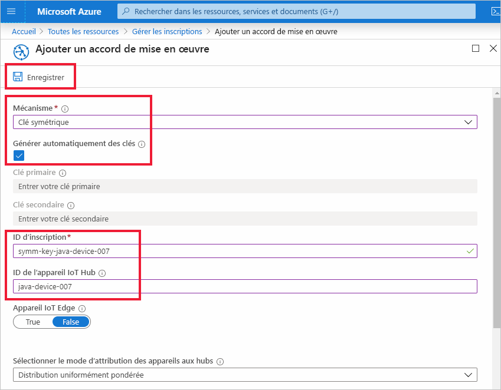
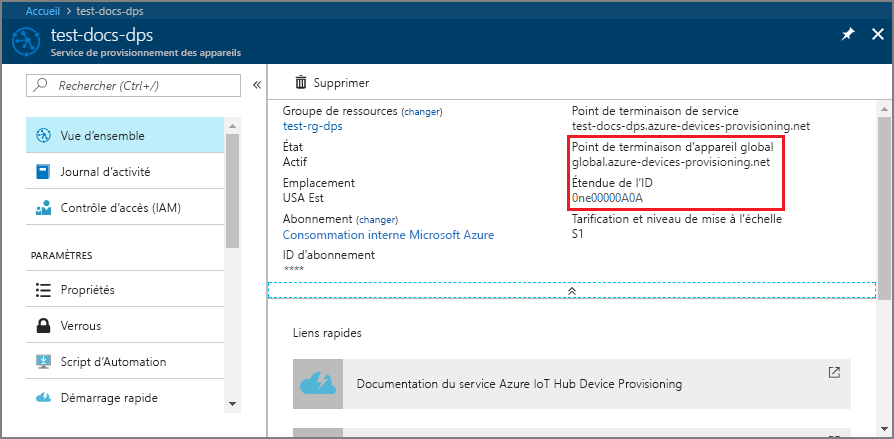
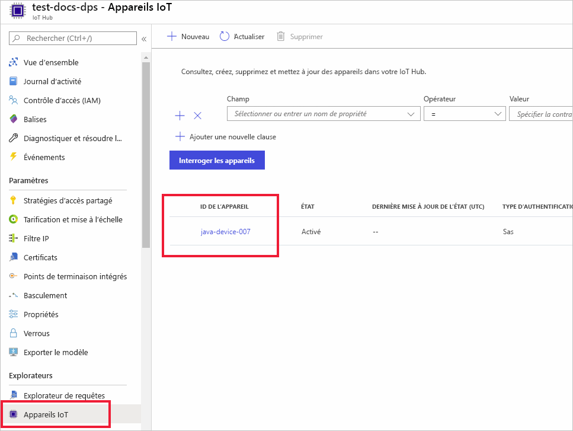

# <a name="quickstart-provision-a-simulated-device-to-iot-hub-with-symmetric-keys"></a>Démarrage rapide : Provisionner un appareil simulé sur IoT Hub avec des clés symétriques

Dans ce guide de démarrage rapide, vous allez apprendre à créer et à exécuter un simulateur d’appareil sur une machine de développement Windows. Vous allez configurer cet appareil simulé à affecter à un hub IoT de sorte qu’il utilise une clé symétrique pour s’authentifier auprès d’une instance du service DPS (Device Provisioning Service). Un exemple de code des [SDK Microsoft Azure IoT pour Java](https://github.com/Azure/azure-iot-sdk-java) sera utilisé pour simuler une séquence de démarrage pour l’appareil qui lance le provisionnement. L’appareil sera reconnu sur la base d’une inscription individuelle auprès d’une instance du service DPS et affecté à un hub IoT.

Bien que cet article illustre le provisionnement avec une seule inscription, vous pouvez utiliser des groupes d’inscription. Il existe cependant quelques différences lorsque vous utilisez des groupes d’inscription. Par exemple, vous devez utiliser une clé d’appareil dérivée avec un ID d’inscription unique pour l’appareil. Bien que les groupes d’inscription avec des clés symétriques ne soient pas limités aux appareils d’ancienne génération, le [Guide pratique pour provisionner des appareils d’ancienne génération à l’aide d’une attestation de clé symétrique](how-to-legacy-device-symm-key.md) fournit un exemple de groupe d’inscription. Pour plus d’informations, consultez [Inscriptions de groupe pour l’attestation de clé symétrique](concepts-symmetric-key-attestation.md#group-enrollments).

Si vous ne connaissez pas le processus d’approvisionnement automatique, consultez [Concepts de provisionnement automatique](concepts-auto-provisioning.md). 

Vérifiez également que vous avez suivi la procédure décrite dans [Configurer le service IoT Hub Device Provisioning avec le portail Azure](./quick-setup-auto-provision.md) avant de poursuivre ce démarrage rapide. Ce guide de démarrage rapide nécessite au préalable la création d’une instance du service Device Provisioning.

Cet article traite d’une station de travail Windows. Toutefois, vous pouvez effectuer les procédures sur Linux. Pour obtenir un exemple sur Linux, consultez [Guide pratique du provisionnement pour la multilocation](how-to-provision-multitenant.md).


[!INCLUDE [quickstarts-free-trial-note](../../includes/quickstarts-free-trial-note.md)]


## <a name="prerequisites"></a>Prérequis

* Vérifiez que [Java SE Development Kit 8](https://aka.ms/azure-jdks) ou une version ultérieure est bien installé sur votre ordinateur.

* Téléchargez et installez [Maven](https://maven.apache.org/install.html).

* Dernière version de [Git](https://git-scm.com/download/) installée.

<a id="setupdevbox"></a>

## <a name="prepare-the-java-sdk-environment"></a>Préparer l’environnement du SDK Java 

1. Assurez-vous que Git est installé sur votre machine et ajouté aux variables d’environnement accessibles à la fenêtre de commande. Consultez la section relative aux [outils clients de Software Freedom Conservancy](https://git-scm.com/download/) pour accéder à la dernière version des outils `git` à installer, qui inclut **Git Bash**, l’application de ligne de commande que vous pouvez utiliser pour interagir avec votre référentiel Git local. 

2. Ouvrez une invite de commandes. Clonez le référentiel GitHub pour l’exemple de code de simulation d’appareil :
    
    ```cmd/sh
    git clone https://github.com/Azure/azure-iot-sdk-java.git --recursive
    ```
3. Accédez au répertoire `azure-iot-sdk-java` racine et créez le projet pour télécharger tous les packages nécessaires.
   
   ```cmd/sh
   cd azure-iot-sdk-java
   mvn install -DskipTests=true
   ```

## <a name="create-a-device-enrollment"></a>Créer une inscription d’appareil

1. Connectez-vous au [portail Azure](https://portal.azure.com), sélectionnez le bouton **Toutes les ressources** dans le menu de gauche et ouvrez votre instance de service Device Provisioning (DPS).

2. Sélectionnez l’onglet **Gérer les inscriptions**, puis le bouton **Ajouter une inscription individuelle** dans la partie supérieure. 

3. Dans le volet **Ajouter une inscription**, entrez les informations suivantes, puis appuyez sur le bouton **Enregistrer**.

   - **Mécanisme** : sélectionnez **Clé symétrique** comme *Mécanisme* d'attestation d'identité.

   - **Générer automatiquement des clés** : cochez cette case.

   - **ID d'inscription** : entrez un ID pour identifier l'inscription. Utilisez uniquement des caractères alphanumériques en minuscules et des tirets (« - »). Par exemple, **symm-key-java-device-007**.

   - **ID de l’appareil IoT Hub :** entrez un identificateur d'appareil. Par exemple, **java-device-007**.

     

4. Une fois que vous avez enregistré votre inscription, la **Clé primaire** et la **Clé secondaire** sont générées et ajoutées à l’entrée d’inscription. Votre inscription d’appareil à clé symétrique apparaît sous le nom **symm-key-java-device-007** sous la colonne *ID d’inscription* de l’onglet *Inscriptions individuelles*. 

    Ouvrez l’inscription et copiez la valeur de votre **Clé primaire** générée. Vous utiliserez cette valeur de clé et l’**ID d’inscription** plus tard au moment de mettre à jour le code Java pour l’appareil.


<a id="firstbootsequence"></a>

## <a name="simulate-device-boot-sequence"></a>Simuler la séquence de démarrage de l’appareil

Dans cette section, vous allez mettre à jour l’exemple de code d’appareil pour envoyer la séquence de démarrage de l’appareil à votre instance DPS. Grâce à cette séquence de démarrage, l’appareil sera reconnu, authentifié et affecté à un hub IoT lié à l’instance DPS.

1. À partir du menu Service Device Provisioning, sélectionnez **Vue d’ensemble**, puis notez les valeurs des champs _Étendue de l’ID_ et _Point de terminaison global du service de provisionnement_.

    

2. Ouvrez l’exemple de code d’appareil Java pour le modifier. Le chemin complet de l’exemple de code d’appareil est le suivant :

    `azure-iot-sdk-java/provisioning/provisioning-samples/provisioning-symmetrickey-sample/src/main/java/samples/com/microsoft/azure/sdk/iot/ProvisioningSymmetricKeySampleSample.java`

   - Ajoutez les valeurs des champs _Étendue de l’ID_ et _Point de terminaison global du service de provisionnement_ de votre instance DPS. De même, incluez la clé symétrique principale et l’ID d’inscription que vous avez choisis pour votre inscription individuelle. Enregistrez vos modifications. 

      ```java
        private static final String SCOPE_ID = "[Your scope ID here]";
        private static final String GLOBAL_ENDPOINT = "[Your Provisioning Service Global Endpoint here]";
        private static final String SYMMETRIC_KEY = "[Enter your Symmetric Key here]";
        private static final String REGISTRATION_ID = "[Enter your Registration ID here]";
      ```

3. Ouvrez une invite de commandes pour la génération. Accédez à l’exemple de dossier de projet de projet de provisionnement du référentiel SDK Java.

    ```cmd/sh
    cd azure-iot-sdk-java/provisioning/provisioning-samples/provisioning-symmetrickey-sample
    ```

4. Générez l’exemple, puis accédez au dossier `target` pour exécuter le fichier .jar créé.

    ```cmd/sh
    mvn clean install
    cd target
    java -jar ./provisioning-symmetrickey-sample-{version}-with-deps.jar
    ```

5. La sortie attendue doit être semblable à ce qui suit :

    ```cmd/sh
      Starting...
      Beginning setup.
      Waiting for Provisioning Service to register
      IotHUb Uri : <Your DPS Service Name>.azure-devices.net
      Device ID : java-device-007
      Sending message from device to IoT Hub...
      Press any key to exit...
      Message received! Response status: OK_EMPTY
    ```

6. Dans le portail Azure, accédez au IoT Hub lié à votre service d’approvisionnement et ouvrez le panneau **Device Explorer**. Une fois que l’appareil à clé symétrique simulé a été provisionné sur le hub, son ID d’appareil s’affiche dans le panneau **Device Explorer** (Explorateur d’appareils) avec le *STATUT* **activé**.  Notez que vous devrez peut-être appuyer sur le bouton **Actualiser** dans la partie supérieure si vous avez déjà ouvert le panneau avant d’exécuter l’exemple d’application de l’appareil. 

     

> [!NOTE]
> Si vous avez modifié la valeur par défaut de l’*état du jumeau d’appareil initial* dans l’entrée d’inscription de votre appareil, l’état du jumeau souhaité peut être extrait du hub et agir en conséquence. Pour en savoir plus, consultez [Comprendre et utiliser les jumeaux d’appareil IoT Hub](../iot-hub/iot-hub-devguide-device-twins.md).
>


## <a name="clean-up-resources"></a>Nettoyer les ressources

Si vous envisagez de manipuler et d’explorer davantage l’exemple de client d’appareil, ne nettoyez pas les ressources créées dans ce guide de démarrage rapide. Sinon, effectuez les étapes suivantes pour supprimer toutes les ressources créées par ce guide.

1. Fermez la fenêtre de sortie de l’exemple de client d’appareil sur votre machine.
1. Dans le menu de gauche du portail Azure, sélectionnez **Toutes les ressources**, puis votre service Device Provisioning. Ouvrez **Gérer les inscriptions** pour votre service, puis sélectionnez l’onglet **Inscriptions individuelles**. Cochez la case à côté de l’*ID D’INSCRIPTION* de l’appareil que vous avez inscrit dans ce guide de démarrage rapide, puis appuyez sur le bouton **Supprimer** dans la partie supérieure du volet. 
1. À partir du menu de gauche, dans le portail Azure, sélectionnez **Toutes les ressources**, puis votre hub IoT. Ouvrez **Appareils IoT** pour votre hub, cochez la case en regard de l’*ID D’APPAREIL* de l’appareil que vous avez inscrit dans ce guide de démarrage rapide, puis appuyez sur le bouton **Supprimer** dans la partie supérieure du volet.

## <a name="next-steps"></a>Étapes suivantes

Dans ce guide de démarrage rapide, vous avez créé un appareil simulé sur un ordinateur Windows et l’avez provisionné sur votre hub IoT à l’aide d’une clé symétrique avec le service Azure IoT Hub Device Provisioning sur le portail. Pour apprendre à inscrire un appareil programmatiquement, passez au guide de démarrage rapide sur l’inscription programmatique des appareils X.509. 

> [!div class="nextstepaction"]
> [Démarrage rapide Azure - Inscrire des appareils X.509 auprès du service Azure IoT Hub Device Provisioning](quick-enroll-device-x509-java.md)
