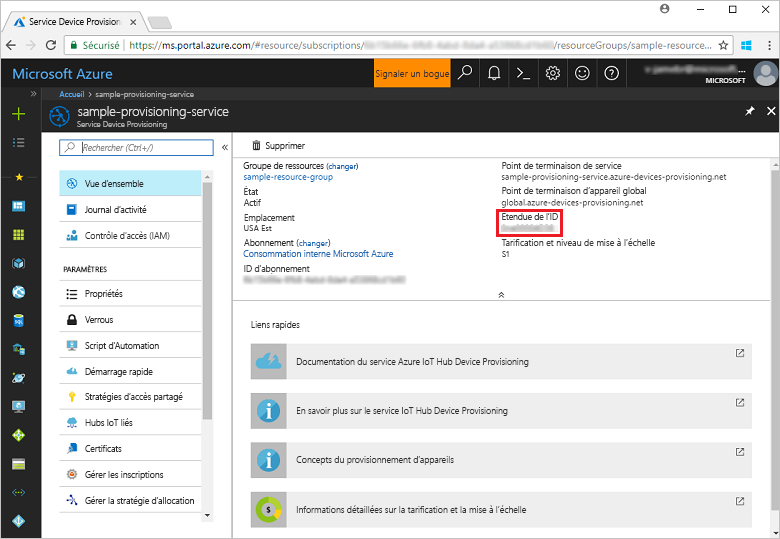
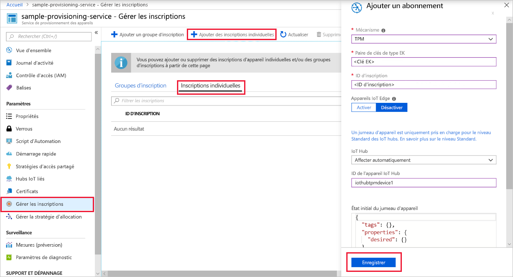
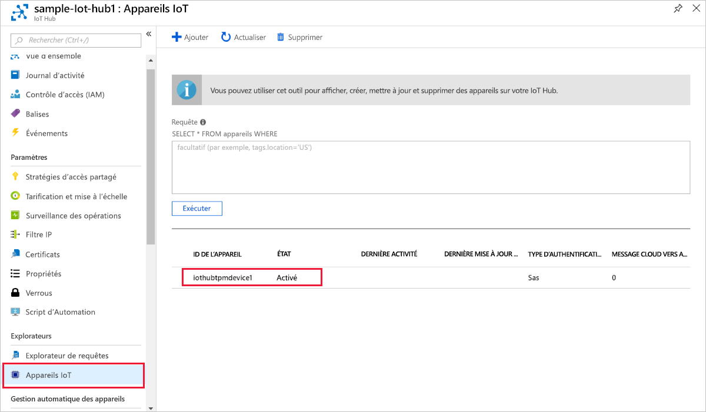

# <a name="quickstart-create-and-provision-a-simulated-tpm-device-using-c-device-sdk-for-iot-hub-device-provisioning-service"></a>Démarrage rapide - Créer et provisionner un appareil TPM simulé à l’aide du kit Java device SDK pour le service IoT Hub Device Provisioning.

[!INCLUDE [iot-dps-selector-quick-create-simulated-device-tpm](../../includes/iot-dps-selector-quick-create-simulated-device-tpm.md)]

Ces étapes expliquent comment utiliser les [échantillons Azure IoT pour C#](https://github.com/Azure-Samples/azure-iot-samples-csharp) afin de simuler un appareil TPM sur une machine de développement exécutant le système d'exploitation Windows. L'échantillon connecte également l'appareil simulé à un IoT Hub à l'aide de l'instance de Device Provisioning Service. 

Cet exemple de code utilise le simulateur de module de plateforme sécurisée Windows comme [module de sécurité matériel (HSM)](https://azure.microsoft.com/blog/azure-iot-supports-new-security-hardware-to-strengthen-iot-security/) de l’appareil. 

Si vous ne connaissez pas le processus de provisionnement automatique, veuillez consulter la vue d’ensemble du [provisionnement](about-iot-dps.md#provisioning-process). Vérifiez également que vous avez suivi la procédure décrite dans [Configurer le service d’approvisionnement d’appareil IoT Hub avec le portail Azure](./quick-setup-auto-provision.md) avant de continuer. 

Le service Azure IoT Device Provisioning prend en charge deux types d’inscriptions :

- [Groupes d’inscription](concepts-service.md#enrollment-group) : utilisés pour inscrire plusieurs appareils connexes.
- [Inscriptions individuelles](concepts-service.md#individual-enrollment) : utilisées pour inscrire un seul appareil.

Cet article présente les inscriptions individuelles.

[!INCLUDE [IoT Device Provisioning Service basic](../../includes/iot-dps-basic.md)]

<a id="setupdevbox"></a>
## <a name="prepare-the-development-environment"></a>Préparer l’environnement de développement 

1. Vérifiez que le kit [SDK .NET Core 2.1 ou version ultérieure](https://dotnet.microsoft.com/download) est installé sur votre machine. 

1. Assurez-vous que l’élément `git` est installé sur votre machine et est ajouté aux variables d’environnement accessibles à la fenêtre de commande. Consultez la section relative aux [outils clients de Software Freedom Conservancy](https://git-scm.com/download/) pour accéder à la dernière version des outils `git` à installer, qui inclut **Git Bash**, l’application de ligne de commande que vous pouvez utiliser pour interagir avec votre référentiel Git local. 

1. Ouvrez une invite de commandes ou Git Bash. Clonez les échantillons Azure IoT pour le référentiel C# GitHub :

    ```cmd
    git clone https://github.com/Azure-Samples/azure-iot-samples-csharp.git
    ```

## <a name="provision-the-simulated-device"></a>Approvisionner l’appareil simulé

1. Connectez-vous au portail Azure. Sélectionnez le bouton **Toutes les ressources** dans le menu de gauche, puis ouvrez votre service Device Provisioning. Dans le panneau **Vue d’ensemble**, notez la valeur **_Étendue de l’ID_**.

     

1. Dans une invite de commandes, accédez au répertoire du projet contenant l’exemple d’approvisionnement d’appareil TPM.

    ```cmd
    cd .\azure-iot-samples-csharp\provisioning\Samples\device\TpmSample
    ```

1. Tapez la commande suivante pour générer et exécuter l’exemple d’approvisionnement d’appareil TPM. Remplacez la valeur `<IDScope>` par l’étendue de l’ID de votre service d’approvisionnement. 

    ```cmd
    dotnet run <IDScope>
    ```

    Cette commande lancera le simulateur de puce TPM dans une invite de commandes distincte. Sur Windows, vous pouvez rencontrer une alerte de sécurité Windows qui vous demande si vous voulez autoriser Simulator.exe à communiquer sur des réseaux publics. Dans le cadre de cet exemple, vous pouvez annuler la demande.

1. La fenêtre de commande d’origine affiche la **_paire de clés de type EK (Endorsement Key)_**, l’**_ID d’inscription_** et un **_ID d’appareil_** nécessaires à l’inscription de l’appareil. Prenez note de ces valeurs. Vous utiliserez ces valeurs pour créer une inscription individuelle dans votre instance de Device Provisioning Service. 
   > [!NOTE]
   > Ne confondez pas la fenêtre contenant la sortie de la commande avec la fenêtre contenant la sortie du simulateur TPM Vous devrez peut-être sélectionner la fenêtre de commande d’origine pour l’amener au premier plan.

     

1. Dans le menu du service Device Provisioning du portail Azure, sélectionnez **Gérer les inscriptions**. Sélectionnez l’onglet **Inscriptions individuelles**, puis le bouton **Ajouter une inscription individuelle** dans la partie supérieure. 

1. Dans le volet **Ajouter une inscription**, entrez les informations suivantes :
   - Sélectionnez **TPM** comme *mécanisme* d’attestation d’identité.
   - Entrez l’*ID d’inscription* et la *paire de clés de type EK (Endorsement Key)* pour votre appareil TPM notés plus tôt.
   - Sélectionnez un hub IoT lié à votre service d’approvisionnement.
   - Si vous le souhaitez, vous pouvez fournir les informations suivantes :
       - Entrez un *ID d’appareil* unique (vous pouvez utiliser la suggestion ou fournir votre propre ID). Veillez à éviter les données sensibles lorsque vous affectez un nom à votre appareil. Si vous choisissez de ne pas en fournir un, l’ID d’inscription est utilisé à la place pour identifier l’appareil.
       - Mettez à jour l’**état du jumeau d’appareil initial** à l’aide de la configuration initiale de votre choix pour l’appareil.
   - Cela fait, appuyez sur le bouton **Enregistrer**. 

       

   Lorsque l’inscription aboutit, *l’ID d’inscription* de votre appareil s’affiche dans la liste sous l’onglet *Inscriptions individuelles*. 

1. Appuyez sur *Entrée* dans la fenêtre de commande (celle qui affichait la **_paire de clés de type EK (Endorsement Key)_**, l’**_ID d’inscription_** et un **_ID d’appareil_**) pour inscrire l’appareil simulé. Notez les messages qui simulent le démarrage et la connexion de l’appareil au service d’approvisionnement d’appareil pour obtenir des informations concernant votre IoT Hub. 

1. Vérifiez que l’appareil a bien été approvisionné. En cas de réussite du provisionnement de l’appareil simulé auprès du hub IoT lié à votre service de provisionnement, l’ID d’appareil s’affiche sur le panneau **Appareils IoT** du hub. 

     

    Si vous avez modifié la valeur par défaut de l’*état du jumeau d’appareil initial* dans l’entrée d’inscription de votre appareil, l’état du jumeau souhaité peut être extrait du hub et agir en conséquence. Pour en savoir plus, consultez [Comprendre et utiliser les jumeaux d’appareil IoT Hub](../iot-hub/iot-hub-devguide-device-twins.md).

## <a name="clean-up-resources"></a>Nettoyer les ressources

Si vous envisagez de manipuler et d’explorer davantage l’exemple de client d’appareil, ne nettoyez pas les ressources créées dans ce guide de démarrage rapide. Sinon, effectuez les étapes suivantes pour supprimer toutes les ressources créées par ce guide.

1. Fermez la fenêtre de sortie de l’exemple de client d’appareil sur votre machine.
1. Fermez la fenêtre du simulateur TPM sur votre machine.
1. Dans le menu de gauche du portail Azure, sélectionnez **Toutes les ressources**, puis votre service Device Provisioning. Dans la partie supérieure du panneau **Vue d’ensemble**, appuyez sur **Supprimer** en haut du volet.  
1. À partir du menu de gauche, dans le portail Azure, sélectionnez **Toutes les ressources**, puis votre hub IoT. Dans la partie supérieure du panneau **Vue d’ensemble**, appuyez sur **Supprimer** en haut du volet.  

## <a name="next-steps"></a>Étapes suivantes

Dans ce guide de démarrage rapide, vous avez créé un appareil simulé TPM sur votre machine et l’avez provisionné auprès de votre hub IoT à l’aide du service IoT Hub Device Provisioning. Pour apprendre à inscrire un appareil TPM programmatiquement, passez au guide de démarrage rapide correspondant. 

> [!div class="nextstepaction"]
> [Démarrage rapide Azure - Inscrire un appareil TPM auprès du service Azure IoT Hub Device Provisioning](quick-enroll-device-tpm-csharp.md)
