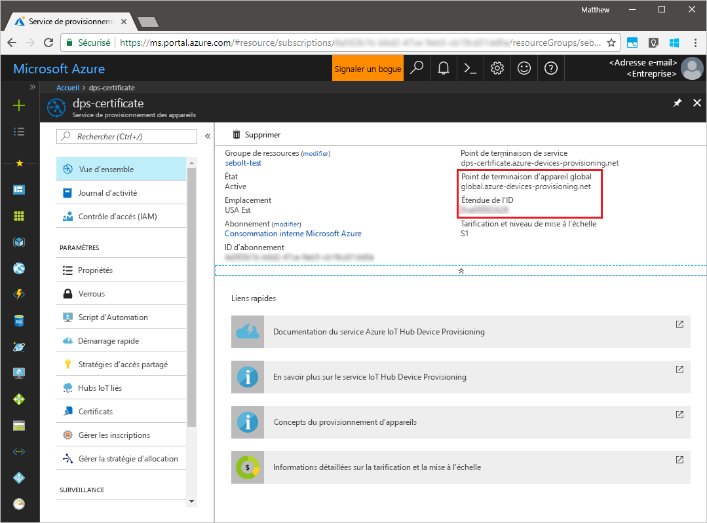
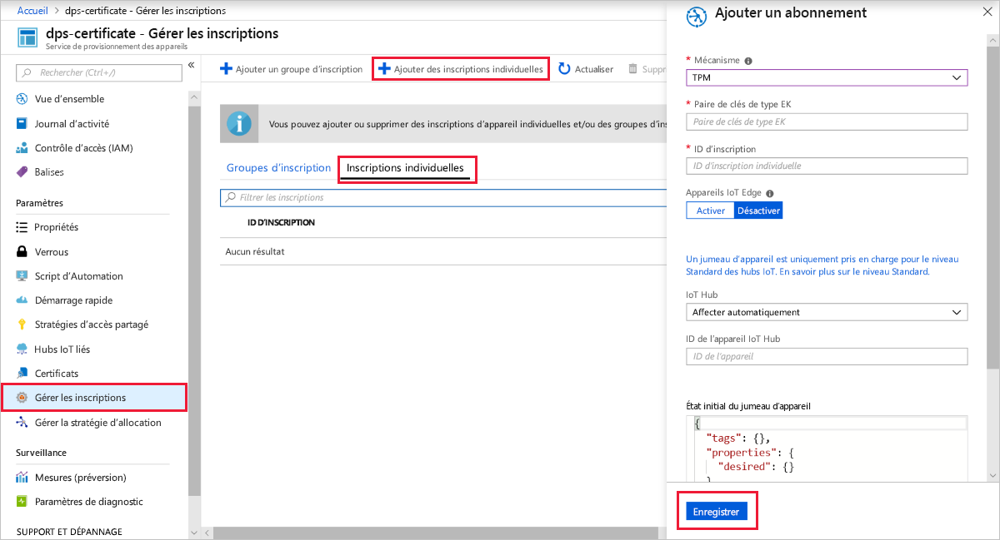
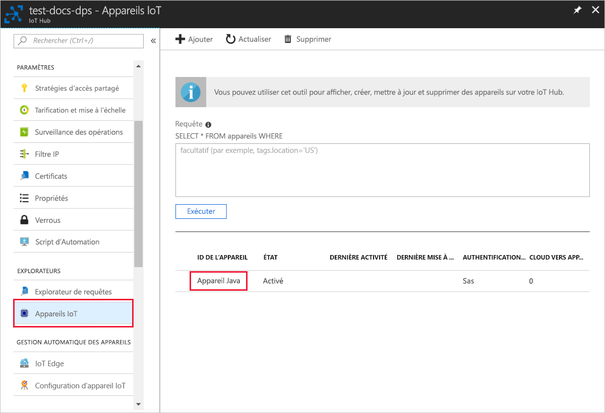

# <a name="quickstart-create-and-provision-a-simulated-tpm-device-using-java-device-sdk-for-azure-iot-hub-device-provisioning-service"></a>Démarrage rapide - Créer et provisionner un appareil TPM simulé à l’aide du kit Java device SDK pour le service Azure IoT Hub Device Provisioning.

[!INCLUDE [iot-dps-selector-quick-create-simulated-device-tpm](../../includes/iot-dps-selector-quick-create-simulated-device-tpm.md)]

Dans ce guide de démarrage rapide, vous allez créer un appareil IoT simulé sur un ordinateur Windows. L’appareil simulé comprend un simulateur TPM sous forme de module de sécurité matériel (HSM). Vous allez utiliser l’exemple de code Java de l’appareil pour connecter cet appareil simulé à votre hub IoT en utilisant une inscription individuelle auprès du service de provisionnement des appareils (DPS).

## <a name="prerequisites"></a>Prérequis

- Connaissance des concepts liés au [provisionnement](about-iot-dps.md#provisioning-process).
- Exécution des étapes décrites dans [Configurer le service IoT Hub Device Provisioning avec le portail Azure](./quick-setup-auto-provision.md).
- Compte Azure avec un abonnement actif. [Créez-en un gratuitement](https://azure.microsoft.com/free/?ref=microsoft.com&utm_source=microsoft.com&utm_medium=docs&utm_campaign=visualstudio).
- [Java SE Development Kit 8](/azure/developer/java/fundamentals/java-jdk-long-term-support).
- [Maven](https://maven.apache.org/install.html).
- [Git](https://git-scm.com/download/).

[!INCLUDE [IoT Device Provisioning Service basic](../../includes/iot-dps-basic.md)]

## <a name="prepare-the-environment"></a>Préparer l’environnement 

1. Assurez-vous que le [Java SE Development Kit 8](/azure/developer/java/fundamentals/java-jdk-long-term-support) est bien installé sur votre ordinateur.

1. Téléchargez et installez [Maven](https://maven.apache.org/install.html).

1. Assurez-vous que l’élément `git` est installé sur votre machine et est ajouté aux variables d’environnement accessibles à la fenêtre de commande. Consultez la section relative aux [outils clients de Software Freedom Conservancy](https://git-scm.com/download/) pour accéder à la dernière version des outils `git` à installer, qui inclut **Git Bash**, l’application de ligne de commande que vous pouvez utiliser pour interagir avec votre référentiel Git local. 

1. Ouvrez une invite de commandes. Clonez le référentiel GitHub pour l’exemple de code de simulation d’appareil.
    
    ```cmd/sh
    git clone https://github.com/Azure/azure-iot-sdk-java.git --recursive
    ```

1. Exécutez le simulateur [TPM](/windows/device-security/tpm/trusted-platform-module-overview) pour en faire le [HSM](https://azure.microsoft.com/blog/azure-iot-supports-new-security-hardware-to-strengthen-iot-security/) de l’appareil simulé. Cliquez sur **Autoriser l’accès** pour autoriser les modifications des paramètres de _pare-feu Windows_. Il écoute un socket sur les ports 2321 et 2322. Ne fermez pas cette fenêtre ; vous devez laisser ce simulateur s’exécuter jusqu’à la fin de ce guide de démarrage rapide. 

    ```cmd/sh
    .\azure-iot-sdk-java\provisioning\provisioning-tools\tpm-simulator\Simulator.exe
    ```

    

1. Dans une invite de commandes distincte, accédez au dossier racine et exécutez les exemples de dépendances.

    ```cmd/sh
    cd azure-iot-sdk-java
    mvn install -DskipTests=true
    ```

1. Accédez à l’exemple de dossier.

    ```cmd/sh
    cd provisioning/provisioning-samples/provisioning-tpm-sample
    ```

1. Connectez-vous au portail Azure, sélectionnez le bouton **Toutes les ressources** dans le menu de gauche et ouvrez votre service Device Provisioning. Notez votre _étendue de l’ID_ et _point de terminaison global de service d’approvisionnement_.

    

1. Modifiez `src/main/java/samples/com/microsoft/azure/sdk/iot/ProvisioningTpmSample.java` pour inclure votre _étendue de l’ID_ et _point de terminaison global de service d’approvisionnement_ notés précédemment.  

    ```java
    private static final String idScope = "[Your ID scope here]";
    private static final String globalEndpoint = "[Your Provisioning Service Global Endpoint here]";
    private static final ProvisioningDeviceClientTransportProtocol PROVISIONING_DEVICE_CLIENT_TRANSPORT_PROTOCOL = ProvisioningDeviceClientTransportProtocol.HTTPS;
    ```
    Enregistrez le fichier .

1. Utilisez les commandes suivantes pour générer le projet, accédez au dossier cible, puis exécutez le fichier .jar créé. Remplacez l’espace réservé `version` par votre version de Java.

    ```cmd/sh
    mvn clean install
    cd target
    java -jar ./provisioning-tpm-sample-{version}-with-deps.jar
    ```

1. Le programme commence à s’exécuter. Notez la _paire de clés de type EK_ et l’_ID d’inscription_ pour la section suivante et laissez le programme s’exécuter.

    
    

## <a name="create-a-device-enrollment-entry"></a>Créer une entrée d’inscription d’appareil

Le service Azure IoT Device Provisioning prend en charge deux types d’inscriptions :

- [Groupes d’inscription](concepts-service.md#enrollment-group) : utilisés pour inscrire plusieurs appareils connexes.
- [Inscriptions individuelles](concepts-service.md#individual-enrollment) : utilisées pour inscrire un seul appareil.

Cet article présente les inscriptions individuelles.

1. Connectez-vous au portail Azure, sélectionnez le bouton **Toutes les ressources** dans le menu de gauche et ouvrez votre service Device Provisioning.

1. Dans le menu du service Device Provisioning, sélectionnez **Gérer les inscriptions**. Sélectionnez l’onglet **Inscriptions individuelles**, puis le bouton **Ajouter une inscription individuelle** dans la partie supérieure. 

1. Dans le volet **Ajouter une inscription**, entrez les informations suivantes :
   - Sélectionnez **TPM** comme *mécanisme* d’attestation d’identité.
   - Entrez l’*ID d’inscription* et la *paire de clés de type EK (Endorsement Key)* pour votre appareil TPM notés plus tôt.
   - Sélectionnez un hub IoT lié à votre service d’approvisionnement.
   - Si vous le souhaitez, vous pouvez fournir les informations suivantes :
       - Entrez un *ID d’appareil* unique. Veillez à éviter les données sensibles lorsque vous affectez un nom à votre appareil. Si vous choisissez de ne pas en fournir un, l’ID d’inscription est utilisé à la place pour identifier l’appareil.
       - Mettez à jour l’**état du jumeau d’appareil initial** à l’aide de la configuration initiale de votre choix pour l’appareil.
   - Cela fait, appuyez sur le bouton **Enregistrer**. 

       

   Lorsque l’inscription aboutit, *l’ID d’inscription* de votre appareil s’affiche dans la liste sous l’onglet *Inscriptions individuelles*. 


## <a name="simulate-the-device"></a>Simuler l’appareil

1. Dans la fenêtre de commande exécutant l’exemple de code Java sur votre machine, appuyez sur *Entrée* pour continuer à exécuter l’application. Notez les messages qui simulent le démarrage et la connexion de l’appareil au service d’approvisionnement d’appareil pour obtenir des informations concernant votre IoT Hub.  

    

1. En cas de réussite du provisionnement de votre appareil simulé auprès du hub IoT lié à votre service de provisionnement, l’ID d’appareil s’affiche sur le panneau **Appareils IoT** du hub.

     

    Si vous avez modifié la valeur par défaut de l’*état du jumeau d’appareil initial* dans l’entrée d’inscription de votre appareil, l’état du jumeau souhaité peut être extrait du hub et agir en conséquence. Pour en savoir plus, consultez [Comprendre et utiliser les jumeaux d’appareil IoT Hub](../iot-hub/iot-hub-devguide-device-twins.md).


## <a name="clean-up-resources"></a>Nettoyer les ressources

Si vous envisagez de manipuler et d’explorer davantage l’exemple de client d’appareil, ne nettoyez pas les ressources créées dans ce guide de démarrage rapide. Sinon, effectuez les étapes suivantes pour supprimer toutes les ressources créées par ce guide.

1. Fermez la fenêtre de sortie de l’exemple de client d’appareil sur votre machine.
1. Fermez la fenêtre du simulateur TPM sur votre machine.
1. Dans le menu de gauche du portail Azure, sélectionnez **Toutes les ressources**, puis votre service Device Provisioning. Ouvrez le panneau **Gérer les inscriptions** pour votre service, puis sélectionnez l’onglet **Inscriptions individuelles**. Cochez la case à côté de l’*ID D’INSCRIPTION* de l’appareil que vous avez inscrit dans ce guide de démarrage rapide, puis appuyez sur le bouton **Supprimer** dans la partie supérieure du volet. 
1. À partir du menu de gauche, dans le portail Azure, sélectionnez **Toutes les ressources**, puis votre hub IoT. Ouvrez le panneau **Appareils IoT** pour votre hub, cochez la case en regard de l’*ID D’APPAREIL* de l’appareil que vous avez inscrit dans ce guide de démarrage rapide, puis appuyez sur le bouton **Supprimer** dans la partie supérieure du volet.

## <a name="next-steps"></a>Étapes suivantes

Dans ce guide de démarrage rapide, vous avez créé un appareil simulé TPM sur votre machine et l’avez provisionné auprès de votre hub IoT à l’aide du service IoT Hub Device Provisioning. Pour apprendre à inscrire un appareil TPM programmatiquement, passez au guide de démarrage rapide correspondant. 

> [!div class="nextstepaction"]
> [Démarrage rapide Azure - Inscrire un appareil TPM auprès du service Azure IoT Hub Device Provisioning](quick-enroll-device-tpm-java.md)