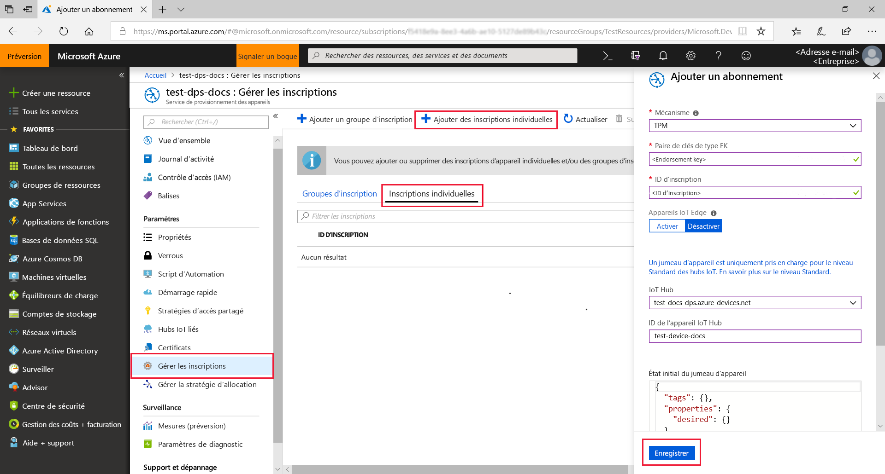
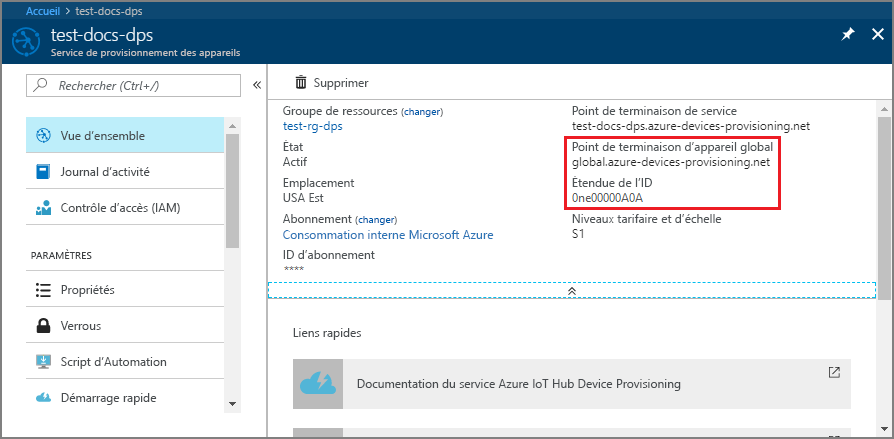
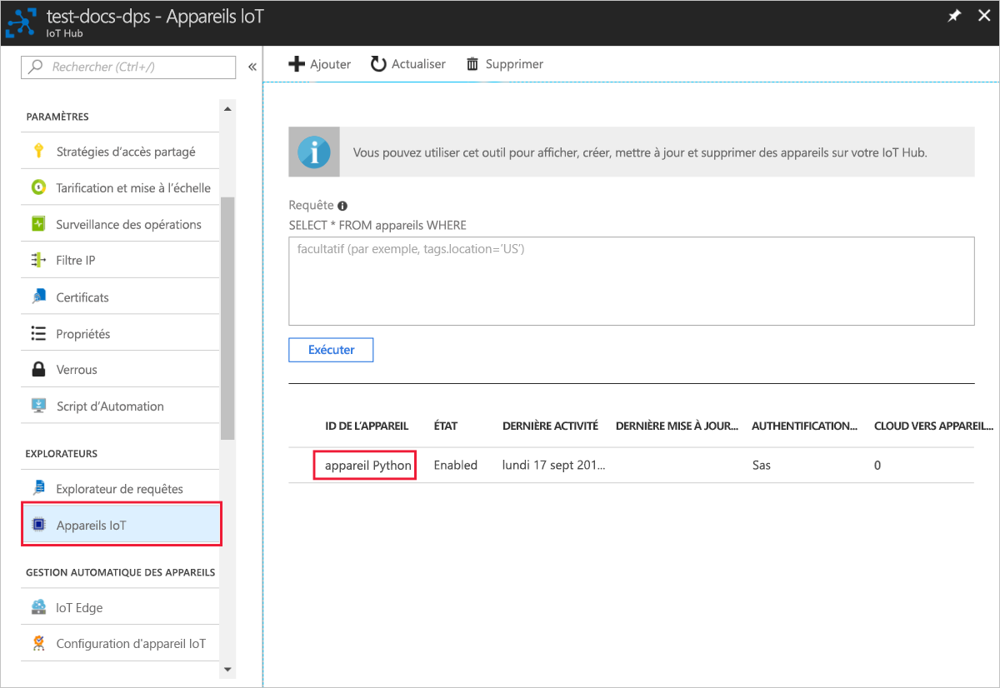

# <a name="quickstart-create-and-provision-a-simulated-tpm-device-using-python-device-sdk-for-iot-hub-device-provisioning-service"></a>Démarrage rapide - Créer et provisionner un appareil X.509 simulé auprès du service IoT Hub Device Provisioning à l’aide du kit Python device SDK.

[!INCLUDE [iot-dps-selector-quick-create-simulated-device-tpm](../../includes/iot-dps-selector-quick-create-simulated-device-tpm.md)]

Dans ce guide de démarrage rapide, vous allez créer un appareil IoT simulé sur un ordinateur Windows. L’appareil simulé comprend un simulateur TPM sous forme de module de sécurité matériel (HSM). Vous allez utiliser l’exemple de code Python de l’appareil pour connecter cet appareil simulé à votre hub IoT en utilisant une inscription individuelle auprès du service de provisionnement des appareils (DPS).

## <a name="prerequisites"></a>Prérequis

- Connaissance des concepts liés au [provisionnement](about-iot-dps.md#provisioning-process).
- Exécution des étapes décrites dans [Configurer le service IoT Hub Device Provisioning avec le portail Azure](./quick-setup-auto-provision.md).
- Compte Azure avec un abonnement actif. [Créez-en un gratuitement](https://azure.microsoft.com/free/?ref=microsoft.com&utm_source=microsoft.com&utm_medium=docs&utm_campaign=visualstudio).
- [Visual Studio 2015+](https://visualstudio.microsoft.com/vs/) avec le développement Desktop en C++ .
- [Système de génération CMake](https://cmake.org/download/).
- [Git](https://git-scm.com/download/).

> [!IMPORTANT]
> Cet article s’applique uniquement au kit SDK Python V1 déprécié. Les clients d’appareil et de service pour le service IoT Hub Device Provisioning ne sont pas encore disponibles dans la V2. L’équipe travaille actuellement sur la parité des fonctionnalités pour la V2.

[!INCLUDE [IoT Device Provisioning Service basic](../../includes/iot-dps-basic.md)]

## <a name="prepare-the-environment"></a>Préparer l’environnement 

1. Assurez-vous que vous avez installé [Visual Studio](https://visualstudio.microsoft.com/vs/) 2015 ou une version ultérieure, avec la charge de travail « développement Desktop en C++ » activée pour votre installation de Visual Studio.

1. Téléchargez et installez le [système de génération de CMake](https://cmake.org/download/).

1. Assurez-vous que l’élément `git` est installé sur votre machine et est ajouté aux variables d’environnement accessibles à la fenêtre de commande. Consultez la section relative aux [outils clients de Software Freedom Conservancy](https://git-scm.com/download/) pour accéder à la dernière version des outils `git` à installer, qui inclut **Git Bash**, l’application de ligne de commande que vous pouvez utiliser pour interagir avec votre référentiel Git local. 

1. Ouvrez une invite de commandes ou Git Bash. Clonez le référentiel GitHub pour l’exemple de code de simulation d’appareil :
    
    ```cmd/sh
    git clone --single-branch --branch v1-deprecated https://github.com/Azure/azure-iot-sdk-python.git --recursive
    ```

1. Créez un dossier dans votre copie locale de ce référentiel GitHub pour le processus de génération de CMake. 

    ```cmd/sh
    cd azure-iot-sdk-python/c
    mkdir cmake
    cd cmake
    ```

1. L’exemple de code utilise un simulateur Windows TPM. Exécutez la commande suivante pour activer l’authentification de jeton SAS. Elle génère également une solution Visual Studio pour l’appareil simulé.

    ```cmd/sh
    cmake -Duse_prov_client:BOOL=ON -Duse_tpm_simulator:BOOL=ON ..
    ```

1. Dans une invite de commandes distincte, accédez au dossier du simulateur TPM et exécutez le simulateur [TPM](/windows/device-security/tpm/trusted-platform-module-overview) pour en faire le [HSM](https://azure.microsoft.com/blog/azure-iot-supports-new-security-hardware-to-strengthen-iot-security/) de l’appareil simulé. Cliquez sur **Autoriser l’accès**. Il écoute un socket sur les ports 2321 et 2322. Ne fermez pas cette fenêtre de commande ; vous devez laisser ce simulateur s’exécuter jusqu’à la fin de ce guide de démarrage rapide. 

    ```cmd/sh
    .\azure-iot-sdk-python\c\provisioning_client\deps\utpm\tools\tpm_simulator\Simulator.exe
    ```

    


## <a name="create-a-device-enrollment-entry"></a>Créer une entrée d’inscription d’appareil

Le service Azure IoT Device Provisioning prend en charge deux types d’inscriptions :

- [Groupes d’inscription](concepts-service.md#enrollment-group) : utilisés pour inscrire plusieurs appareils connexes.
- [Inscriptions individuelles](concepts-service.md#individual-enrollment) : utilisées pour inscrire un seul appareil.

Cet article présente les inscriptions individuelles.

1. Ouvrez la solution générée dans le dossier *cmake* nommé `azure_iot_sdks.sln` générez-la dans Visual Studio.

1. Cliquez avec le bouton droit sur le projet **tpm_device_provision** et sélectionnez **Définir comme projet de démarrage**. Exécutez la solution. La fenêtre de sortie affiche la **_paire de clés de type EK_** et l’**_ID d’inscription_** nécessaires à l’inscription de l’appareil. Notez ces valeurs. 

    

1. Connectez-vous au portail Azure, sélectionnez le bouton **Toutes les ressources** dans le menu de gauche et ouvrez votre service Device Provisioning.

1. Dans le menu du service Device Provisioning, sélectionnez **Gérer les inscriptions**. Sélectionnez l’onglet **Inscriptions individuelles**, puis le bouton **Ajouter une inscription individuelle** dans la partie supérieure. 

1. Dans le volet **Ajouter une inscription**, entrez les informations suivantes :
   - Sélectionnez **TPM** comme *mécanisme* d’attestation d’identité.
   - Entrez l’*ID d’inscription* et la *paire de clés de type EK (Endorsement Key)* pour votre appareil TPM notés plus tôt.
   - Sélectionnez un hub IoT lié à votre service d’approvisionnement.
   - Si vous le souhaitez, vous pouvez fournir les informations suivantes :
       - Entrez un *ID d’appareil* unique. Veillez à éviter les données sensibles lorsque vous affectez un nom à votre appareil. Si vous choisissez de ne pas en fournir un, l’ID d’inscription est utilisé à la place pour identifier l’appareil.
       - Mettez à jour l’**état du jumeau d’appareil initial** à l’aide de la configuration initiale de votre choix pour l’appareil.
   - Cela fait, appuyez sur le bouton **Enregistrer**. 

       

   Lorsque l’inscription aboutit, *l’ID d’inscription* de votre appareil s’affiche dans la liste sous l’onglet *Inscriptions individuelles*. 


## <a name="simulate-the-device"></a>Simuler l’appareil

1. Téléchargez et installez [Python 2.x ou 3.x](https://www.python.org/downloads/). Veillez à utiliser l’installation 32 bits ou 64 bits comme requis par votre programme d’installation. Lorsque vous y êtes invité pendant l’installation, veillez à ajouter Python à votre variable d’environnement propre à la plateforme.
    - Si vous utilisez le système d’exploitation Windows, utilisez le [package redistribuable Visual C++](https://support.microsoft.com/help/2977003/the-latest-supported-visual-c-downloads) pour autoriser l’utilisation de DLL natives de Python.

1. Suivez [ces instructions](https://github.com/Azure/azure-iot-sdk-python/blob/v1-deprecated/doc/python-devbox-setup.md) pour générer les packages Python.

   > [!NOTE]
   > Si `build_client.cmd` est exécuté, assurez-vous d’utiliser l’indicateur `--use-tpm-simulator`.
   > 
   > [!NOTE]
   > Si vous utilisez `pip`, assurez-vous d’installer également le package `azure-iot-provisioning-device-client`. Notez que les packages PIP publiés utilisent le module de plateforme sécurisée réel, pas le simulateur. Pour utiliser le simulateur, vous devez compiler à partir de la source à l’aide de l’indicateur `--use-tpm-simulator`.

1. Accédez au dossier des exemples.

    ```cmd/sh
    cd azure-iot-sdk-python/provisioning_device_client/samples
    ```

1. À l’aide de votre environnement IDE Python, modifiez le script python nommé **provisioning\_device\_client\_sample.py**. Modifiez les variables *GLOBAL\_PROV\_URI* et *ID\_SCOPE* d’après les valeurs notées précédemment. Vérifiez également que *SECURITY\_DEVICE\_TYPE* est défini sur `ProvisioningSecurityDeviceType.TPM`.

    ```python
    GLOBAL_PROV_URI = "{globalServiceEndpoint}"
    ID_SCOPE = "{idScope}"
    SECURITY_DEVICE_TYPE = ProvisioningSecurityDeviceType.TPM
    PROTOCOL = ProvisioningTransportProvider.HTTP
    ```

    

1. Exécutez l’exemple. 

    ```cmd/sh
    python provisioning_device_client_sample.py
    ```

1. Notez les messages qui simulent le démarrage et la connexion de l’appareil au service d’approvisionnement d’appareil pour obtenir des informations concernant votre IoT Hub. 

    

1. En cas de réussite du provisionnement de votre appareil simulé auprès du hub IoT lié à votre service de provisionnement, l’ID d’appareil s’affiche sur le panneau **Appareils IoT** du hub.

     

    Si vous avez modifié la valeur par défaut de l’*état du jumeau d’appareil initial* dans l’entrée d’inscription de votre appareil, l’état du jumeau souhaité peut être extrait du hub et agir en conséquence. Pour en savoir plus, consultez [Comprendre et utiliser les jumeaux d’appareil IoT Hub](../iot-hub/iot-hub-devguide-device-twins.md)


## <a name="clean-up-resources"></a>Nettoyer les ressources

Si vous envisagez de manipuler et d’explorer davantage l’exemple de client d’appareil, ne nettoyez pas les ressources créées dans ce guide de démarrage rapide. Sinon, effectuez les étapes suivantes pour supprimer toutes les ressources créées par ce guide.

1. Fermez la fenêtre de sortie de l’exemple de client d’appareil sur votre machine.
1. Fermez la fenêtre du simulateur TPM sur votre machine.
1. Dans le menu de gauche du portail Azure, sélectionnez **Toutes les ressources**, puis votre service Device Provisioning. Ouvrez le panneau **Gérer les inscriptions** pour votre service, puis sélectionnez l’onglet **Inscriptions individuelles**. Cochez la case à côté de l’*ID D’INSCRIPTION* de l’appareil que vous avez inscrit dans ce guide de démarrage rapide, puis appuyez sur le bouton **Supprimer** dans la partie supérieure du volet. 
1. À partir du menu de gauche, dans le portail Azure, sélectionnez **Toutes les ressources**, puis votre hub IoT. Ouvrez le panneau **Appareils IoT** pour votre hub, cochez la case en regard de l’*ID D’APPAREIL* de l’appareil que vous avez inscrit dans ce guide de démarrage rapide, puis appuyez sur le bouton **Supprimer** dans la partie supérieure du volet.

## <a name="next-steps"></a>Étapes suivantes

Dans ce guide de démarrage rapide, vous avez créé un appareil simulé TPM sur votre machine et l’avez provisionné auprès de votre hub IoT à l’aide du service IoT Hub Device Provisioning. Pour apprendre à inscrire un appareil TPM programmatiquement, passez au guide de démarrage rapide correspondant. 

> [!div class="nextstepaction"]
> [Démarrage rapide Azure - Inscrire un appareil TPM auprès du service Azure IoT Hub Device Provisioning](quick-enroll-device-tpm-python.md)