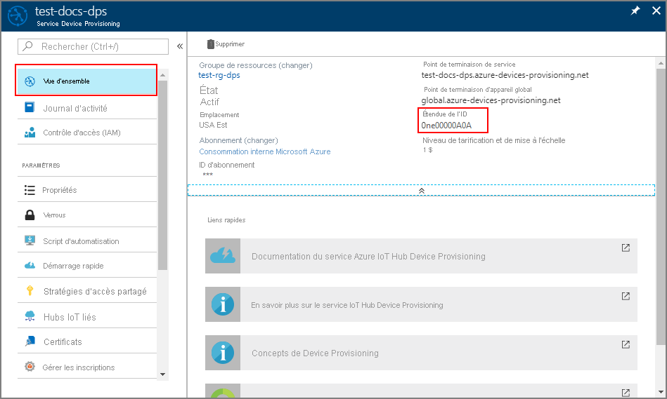
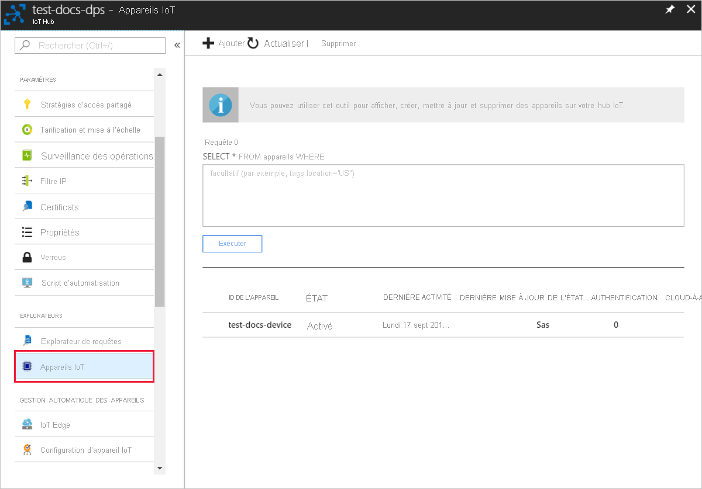
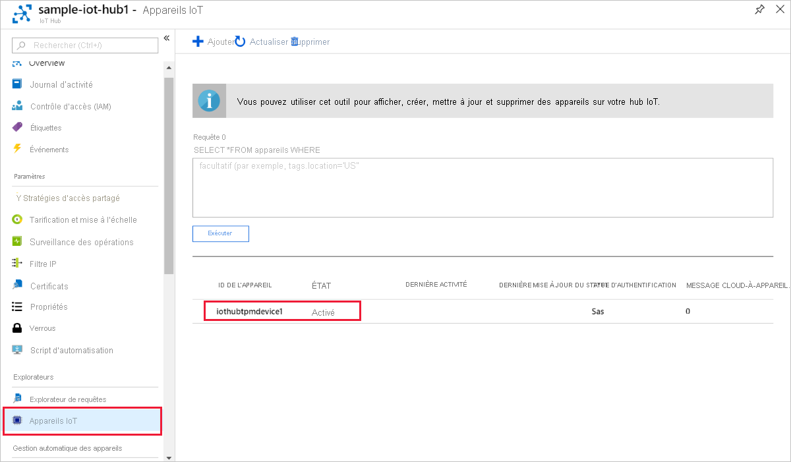
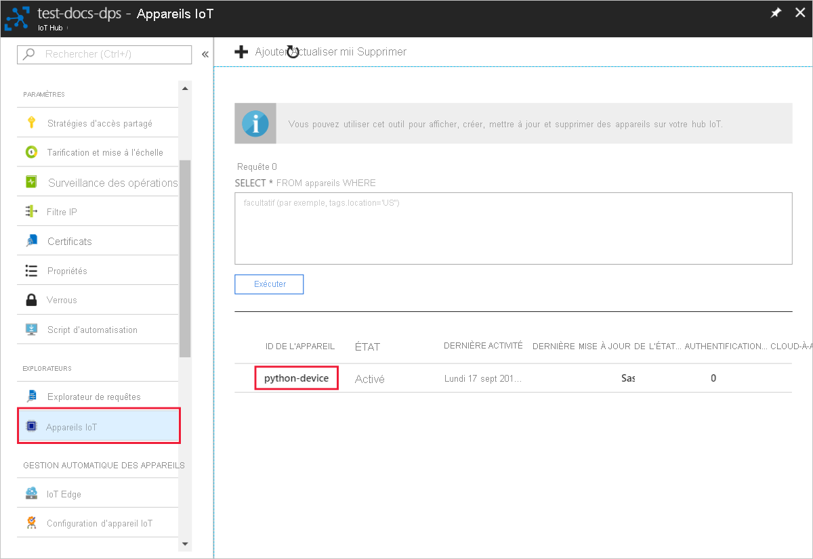
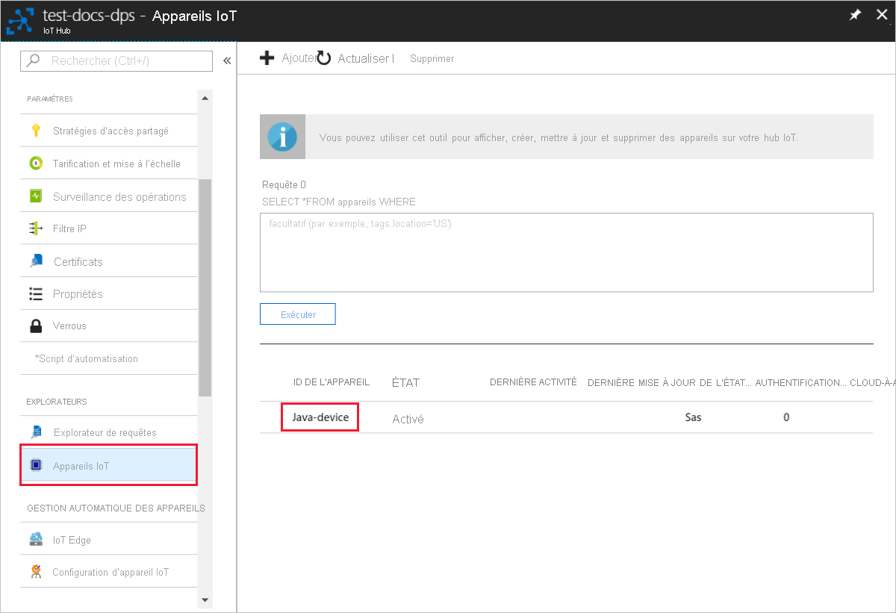

# <a name="quickstart-provision-a-simulated-tpm-device"></a>Démarrage rapide : Provisionner un appareil TPM simulé

Dans ce guide de démarrage rapide, vous allez créer un appareil simulé TPM sur votre machine Windows. Une fois que vous aurez configuré votre appareil, vous le configurerez sur votre hub IoT à l’aide du service Azure IoT Hub Device Provisioning. L’exemple de code sera ensuite utilisé pour inscrire l’appareil auprès d’une instance du service Device Provisioning.

Si vous ne connaissez pas le processus de provisionnement, passez en revue la vue d’ensemble du [provisionnement](about-iot-dps.md#provisioning-process).  Vérifiez également que vous avez suivi la procédure décrite dans [Configurer le service d’approvisionnement d’appareil IoT Hub avec le portail Azure](./quick-setup-auto-provision.md) avant de continuer.

Le service Azure IoT Device Provisioning prend en charge deux types d’inscriptions :

* Les [groupes d’inscriptions](concepts-service.md#enrollment-group) qui permettent d’inscrire plusieurs appareils associés.

* Les [inscriptions individuelles](concepts-service.md#individual-enrollment) qui permettent d’inscrire un seul appareil.

Cet article présente les inscriptions individuelles.

## <a name="prerequisites"></a>Prérequis

* Si vous n’avez pas d’abonnement Azure, créez un [compte gratuit](https://azure.microsoft.com/free/?ref=microsoft.com&utm_source=microsoft.com&utm_medium=docs&utm_campaign=visualstudio) avant de commencer.

* Effectuez les étapes décrites dans [Configurer le service IoT Hub Device Provisioning avec le portail Azure](./quick-setup-auto-provision.md).

Les prérequis suivants s’appliquent à un environnement de développement Windows. Pour Linux ou macOS, consultez la section appropriée de [Préparer votre environnement de développement](https://github.com/Azure/azure-iot-sdk-c/blob/master/doc/devbox_setup.md) dans la documentation du kit de développement logiciel (SDK).

::: zone pivot="programming-language-ansi-c"

* [Visual Studio](https://visualstudio.microsoft.com/vs/) 2019 avec la charge de travail [« Développement Desktop en C++ »](/cpp/ide/using-the-visual-studio-ide-for-cpp-desktop-development) activée. Visual Studio 2015 et Visual Studio 2017 sont également pris en charge.

::: zone-end

::: zone pivot="programming-language-csharp"

* Installez le [kit SDK .NET Core 2.1](https://dotnet.microsoft.com/download) sur votre machine Windows. Vous pouvez exécuter la commande suivante pour vérifier votre version.

    ```bash
    dotnet --info
    ```

::: zone-end

::: zone pivot="programming-language-nodejs"

* Installez [Node.js v4.0+](https://nodejs.org).

::: zone-end

::: zone pivot="programming-language-python"

* Installer [Python 2.x ou 3.x](https://www.python.org/downloads/). Veillez à utiliser l’installation 32 bits ou 64 bits comme requis par votre programme d’installation. Lorsque vous y êtes invité pendant l’installation, veillez à ajouter Python à votre variable d’environnement propre à la plateforme.

* Si vous utilisez le système d’exploitation Windows, installez le [package redistribuable Visual C++](https://support.microsoft.com/help/2977003/the-latest-supported-visual-c-downloads) pour autoriser l’utilisation de DLL natives à partir de Python.

* [Visual Studio](https://visualstudio.microsoft.com/vs/) 2019 avec la charge de travail [« Développement Desktop en C++ »](/cpp/ide/using-the-visual-studio-ide-for-cpp-desktop-development) activée. Visual Studio 2015 et Visual Studio 2017 sont également pris en charge.

* [Système de génération CMake](https://cmake.org/download/).

::: zone-end

::: zone pivot="programming-language-java"

* Installez [Java SE Development Kit 8](/azure/developer/java/fundamentals/java-support-on-azure) ou une version ultérieure sur votre machine.

* Téléchargez et installez [Maven](https://maven.apache.org/install.html).

::: zone-end

* Installez la dernière version de [Git](https://git-scm.com/download/). Vérifiez que Git est ajouté aux variables d’environnement accessibles à la fenêtre de commande. Consultez [Outils clients Git de Software Freedom Conservancy](https://git-scm.com/download/) pour accéder à la dernière version des outils `git` à installer, ce qui inclut *Git Bash*, l’application en ligne de commande que vous pouvez utiliser pour interagir avec votre dépôt Git local.

<a id="setupdevbox"></a>

## <a name="prepare-your-development-environment"></a>Préparer votre environnement de développement

::: zone pivot="programming-language-ansi-c"

Dans cette section, vous allez préparer un environnement de développement utilisé pour générer le [SDK C Azure IoT](https://github.com/Azure/azure-iot-sdk-c) et l’exemple de simulateur d’appareil [TPM](/windows/device-security/tpm/trusted-platform-module-overview).

1. Téléchargez le dernier [système de génération CMake](https://cmake.org/download/).

    >[!IMPORTANT]
    >Vérifiez que les prérequis de Visual Studio (Visual Studio et la charge de travail « Développement Desktop en C++ ») sont installés sur votre machine **avant** de commencer l’installation de `CMake`. Une fois les composants requis en place et le téléchargement effectué, installez le système de génération de CMake. Sachez également que les versions antérieures du système de génération CMake ne permettent pas de générer le fichier solution utilisé dans cet article. Veillez à utiliser la dernière version de CMake.

2. Ouvrez un navigateur web, puis accédez à la [page des versions du kit SDK C Azure IoT](https://github.com/Azure/azure-iot-sdk-c/releases/latest).

3. Sélectionnez l’onglet **Étiquettes** en haut de la page.

4. Copiez le nom d’étiquette de la version la plus récente du SDK C Azure IoT.

5. Ouvrez une invite de commandes ou l’interpréteur de commandes Git Bash. Exécutez les commandes suivantes pour cloner la dernière version du dépôt GitHub du [Azure IoT C SDK](https://github.com/Azure/azure-iot-sdk-c). (Remplacez `<release-tag>` par l’étiquette que vous avez copiée à l’étape précédente.)

    ```cmd/sh
    git clone -b <release-tag> https://github.com/Azure/azure-iot-sdk-c.git
    cd azure-iot-sdk-c
    git submodule update --init
    ```

    Cette opération peut prendre plusieurs minutes.

6. Une fois l’opération terminée, exécutez les commandes suivantes à partir du répertoire `azure-iot-sdk-c` :

    ```cmd/sh
    mkdir cmake
    cd cmake
    ```

::: zone-end

::: zone pivot="programming-language-csharp"

1. Ouvrez un environnement de ligne de commande Git CMD ou Git Bash.

2. Clonez le dépôt GitHub d’[exemples Azure IoT pour C#](https://github.com/Azure-Samples/azure-iot-samples-csharp) à l’aide de la commande suivante :

    ```cmd
    git clone https://github.com/Azure-Samples/azure-iot-samples-csharp.git
    ```

::: zone-end

::: zone pivot="programming-language-nodejs"

1. Ouvrez un environnement de ligne de commande Git CMD ou Git Bash.

2. Clonez le dépôt GitHub [azure-utpm-c](https://github.com/Azure-Samples/azure-iot-samples-csharp) à l’aide de la commande suivante :

    ```cmd/sh
    git clone https://github.com/Azure/azure-utpm-c.git --recursive
    ```

::: zone-end

::: zone pivot="programming-language-python"

1. Ouvrez un environnement de ligne de commande Git CMD ou Git Bash.
  
2. Clonez le dépôt GitHub [Python](https://github.com/Azure/azure-iot-sdk-python) à l’aide de la commande suivante :

    ```cmd/sh
    git clone --single-branch --branch v1-deprecated https://github.com/Azure/azure-iot-sdk-python.git --recursive
    ```

3. Créez un dossier dans votre copie locale de ce dépôt GitHub pour le processus de génération CMake. 

    ```cmd/sh
    cd azure-iot-sdk-python/c
    mkdir cmake
    cd cmake
    ```

4. Suivez [ces instructions](https://github.com/Azure/azure-iot-sdk-python/blob/v1-deprecated/doc/python-devbox-setup.md) pour générer les packages Python.

   > [!NOTE]
   > Si `build_client.cmd` est exécuté, assurez-vous d’utiliser l’indicateur `--use-tpm-simulator`.
   > 
   > [!NOTE]
   > Si vous utilisez `pip`, assurez-vous d’installer également le package `azure-iot-provisioning-device-client`. Notez que les packages PIP publiés utilisent le module de plateforme sécurisée réel, pas le simulateur. Pour utiliser le simulateur, vous devez compiler à partir de la source à l’aide de l’indicateur `--use-tpm-simulator`.

::: zone-end

::: zone pivot="programming-language-java"

1. Ouvrez un environnement de ligne de commande Git CMD ou Git Bash.
  
2. Clonez le dépôt GitHub [Java](https://github.com/Azure/azure-iot-sdk-java.git) à l’aide de la commande suivante :

    ```cmd/sh
    git clone https://github.com/Azure/azure-iot-sdk-java.git --recursive
    ```

::: zone-end

## <a name="build-and-run-the-tpm-device-simulator"></a>Générer et exécuter le simulateur d’appareil TPM

Dans cette section, vous allez générer et exécuter le simulateur TPM. Ce simulateur écoute un socket sur les ports 2321 et 2322. Ne fermez pas la fenêtre de commande. Vous devez laisser l’exécution de ce simulateur se poursuivre jusqu’à la fin de ce guide de démarrage rapide.

::: zone pivot="programming-language-ansi-c"

1. Exécutez la commande suivante pour générer le SDK C Azure IoT qui comprend l’exemple de code du simulateur d’appareil TMP. Une solution Visual Studio pour l’appareil simulé est générée dans le répertoire `cmake`. Cet exemple fournit un [mécanisme d’attestation](concepts-service.md#attestation-mechanism) TPM via l’authentification par jeton de signature d’accès partagé (SAP).

    ```cmd
    cmake -Duse_prov_client:BOOL=ON ..
    ```

    >[!TIP]
    >Si `cmake` ne trouve pas votre compilateur C++, vous risquez de rencontrer des erreurs de génération lors de l’exécution de la commande ci-dessus. Si cela se produit, essayez d’exécuter la commande dans [l’invite de commandes de Visual Studio](/dotnet/framework/tools/developer-command-prompt-for-vs).

2. Quand la génération aboutit, les dernières lignes de la sortie ressemblent à la sortie suivante :

    ```cmd/sh
    $ cmake -Duse_prov_client:BOOL=ON ..
    -- Building for: Visual Studio 16 2019
    -- The C compiler identification is MSVC 19.23.28107.0
    -- The CXX compiler identification is MSVC 19.23.28107.0

    ...

    -- Configuring done
    -- Generating done
    -- Build files have been written to: C:/code/azure-iot-sdk-c/cmake
    ```

3. Accédez au dossier racine du dépôt Git que vous avez cloné.

4. Exécutez le simulateur [TPM](/windows/device-security/tpm/trusted-platform-module-overview) en utilisant le chemin indiqué ci-dessous.

    ```cmd/sh
    cd ..
    .\provisioning_client\deps\utpm\tools\tpm_simulator\Simulator.exe
    ```

    Le simulateur n’affiche aucune sortie. Laissez-le poursuivre son exécution car il simule un appareil TPM.

::: zone-end

::: zone pivot="programming-language-csharp"

1. Dans le menu principal de votre service Device Provisioning, sélectionnez **Vue d’ensemble**.

2. Copiez la valeur **Étendue de l’ID**.

     

3. Dans une invite de commandes, accédez au répertoire du projet contenant l’exemple d’approvisionnement d’appareil TPM.

    ```cmd
    cd .\azure-iot-samples-csharp\provisioning\Samples\device\TpmSample
    ```

4. Tapez la commande suivante pour générer et exécuter l’exemple de provisionnement d’un appareil TPM (en remplaçant `<IDScope>` par l’étendue de l’ID de votre service de provisionnement).

    ```cmd
    dotnet run <IDScope>
    ```

    >[!NOTE]
    >Cette commande lancera le simulateur de puce TPM dans une invite de commandes distincte. Sur Windows, une alerte de sécurité Windows peut s’afficher, vous demandant si vous voulez autoriser `Simulator.exe` à communiquer sur des réseaux publics. Dans le cadre de cet exemple, vous pouvez annuler la demande.

5. La fenêtre de commande d’origine affiche la **_paire de clés de type EK (Endorsement Key)_**, l’**_ID d’inscription_** et un **_ID d’appareil_** nécessaires à l’inscription de l’appareil. Prenez note de ces valeurs. Vous les utiliserez pour créer une inscription individuelle dans votre instance du service Device Provisioning.

   > [!NOTE]
   > Ne confondez pas la fenêtre contenant la sortie de la commande avec la fenêtre contenant la sortie du simulateur TPM Vous devrez peut-être sélectionner la fenêtre de commande d’origine pour l’amener au premier plan.

::: zone-end

::: zone pivot="programming-language-nodejs"

1. Accédez au dossier racine GitHub.

2. Exécutez le simulateur [TPM](/windows/device-security/tpm/trusted-platform-module-overview) pour en faire le [HSM](https://azure.microsoft.com/blog/azure-iot-supports-new-security-hardware-to-strengthen-iot-security/) de l’appareil simulé.

    ```cmd/sh
    .\azure-utpm-c\tools\tpm_simulator\Simulator.exe
    ```

3. Créez un dossier vide appelé **registerdevice**. Dans le dossier **registerdevice**, créez un fichier _package.json_ en utilisant la commande suivante à l’invite de commandes. Veillez à répondre à toutes les questions posées par `npm` ou acceptez les paramètres par défaut, s’ils vous conviennent :

    ```cmd/sh
    npm init
    ```

4. Installez les packages précurseurs suivants :

    ```cmd/sh
    npm install node-gyp -g
    npm install ffi -g
    ```

    > [!NOTE]
    > Il existe quelques erreurs connues lors de l’installation des packages ci-dessus. Pour résoudre ces problèmes, exécutez `npm install --global --production windows-build-tools` en utilisant une invite de commandes en mode **Exécuter en tant qu’administrateur**, exécutez `SET VCTargetsPath=C:\Program Files (x86)\MSBuild\Microsoft.Cpp\v4.0\V140` après avoir remplacé le chemin par votre version installée, puis exécutez de nouveau les commandes d’installation ci-dessus.
    >

5. Installez tous les packages nécessaires en exécutant la commande suivante à partir de votre invite de commandes, dans le dossier **registerdevice** :

    ```cmd/sh
    npm install --save azure-iot-device azure-iot-device-mqtt azure-iot-security-tpm azure-iot-provisioning-device-http azure-iot-provisioning-device
    ```

    La commande installe les packages suivants :

   * un client de sécurité qui fonctionne avec TPM : `azure-iot-security-tpm`
   * un mode de transport pour connecter l’appareil au service Device Provisioning : `azure-iot-provisioning-device-http` ou `azure-iot-provisioning-device-amqp`
   * un client pour utiliser le mode de transport et le client de sécurité : `azure-iot-provisioning-device`
   * le client d’appareil : `azure-iot-device`
   * un mode de transport : `azure-iot-device-amqp`, `azure-iot-device-mqtt` ou `azure-iot-device-http`
   * le client de sécurité, déjà installé : `azure-iot-security-tpm`

     > [!NOTE]
     > Les exemples de ce guide de démarrage utilisent les transports `azure-iot-provisioning-device-http` et `azure-iot-device-mqtt`.
     >

6. Ouvrez l’éditeur de texte de votre choix.

7. Dans le dossier **registerdevice**, créez le fichier _ExtractDevice.js_.

8. Ajoutez les instructions `require` ci-dessous au début du fichier **ExtractDevice.js** :

    ```Javascript

    'use strict';
    
    var tpmSecurity = require('azure-iot-security-tpm');
    var tssJs = require("tss.js");
    
    var myTpm = new tpmSecurity.TpmSecurityClient(undefined, new tssJs.Tpm(true));
    ```

9. Ajoutez la fonction suivante pour implémenter la méthode :

    ```Javascript

    myTpm.getEndorsementKey(function(err, endorsementKey) {
      if (err) {
        console.log('The error returned from get key is: ' + err);
      } else {
        console.log('the endorsement key is: ' + endorsementKey.toString('base64'));
        myTpm.getRegistrationId((getRegistrationIdError, registrationId) => {
          if (getRegistrationIdError) {
            console.log('The error returned from get registration id is: ' + getRegistrationIdError);
          } else {
            console.log('The Registration Id is: ' + registrationId);
            process.exit();
          }
        });
      }
    });
    ```

10. Enregistrez et fermez le fichier _ExtractDevice.js_.

    ```cmd/sh
    node ExtractDevice.js
    ```

11. Exécutez l’exemple.

12. La fenêtre de sortie affiche la **_paire de clés de type EK_** et l’**_ID d’inscription_** nécessaires à l’inscription de l’appareil. Copiez ces valeurs.

::: zone-end

::: zone pivot="programming-language-python"

1. Exécutez la commande suivante pour activer l’authentification par jeton SAS (la commande génère également une solution Visual Studio pour l’appareil simulé) :

    ```cmd/sh
    cmake -Duse_prov_client:BOOL=ON -Duse_tpm_simulator:BOOL=ON ..
    ```

2. Ouvrez une deuxième invite de commandes.

3. Dans la deuxième invite de commandes, accédez au dossier du simulateur TPM.

4. Exécutez le simulateur [TPM](/windows/device-security/tpm/trusted-platform-module-overview) pour en faire le [HSM](https://azure.microsoft.com/blog/azure-iot-supports-new-security-hardware-to-strengthen-iot-security/) de l’appareil simulé.

5. Sélectionnez **Autoriser l’accès**. Le simulateur écoute un socket sur les ports 2321 et 2322. Ne fermez pas cette fenêtre de commande ; vous devez laisser ce simulateur s’exécuter jusqu’à la fin de ce guide de démarrage rapide.

  ```cmd/sh
  .\azure-iot-sdk-python\c\provisioning_client\deps\utpm\tools\tpm_simulator\Simulator.exe
  ```

  

::: zone-end

::: zone pivot="programming-language-java"

1. Exécutez le simulateur [TPM](/windows/device-security/tpm/trusted-platform-module-overview) pour en faire le [HSM](https://azure.microsoft.com/blog/azure-iot-supports-new-security-hardware-to-strengthen-iot-security/) de l’appareil simulé.

2. Sélectionnez **Autoriser l’accès**. Le simulateur écoute un socket sur les ports 2321 et 2322. Ne fermez pas cette fenêtre de commande ; vous devez laisser ce simulateur s’exécuter jusqu’à la fin de ce guide de démarrage rapide.

    ```cmd/sh
    .\azure-iot-sdk-java\provisioning\provisioning-tools\tpm-simulator\Simulator.exe
    ```

    

3. Ouvrez une deuxième invite de commandes.

4. Dans la deuxième invite de commandes, accédez au dossier racine et générez les exemples de dépendances.

    ```cmd/sh
    cd azure-iot-sdk-java
    mvn install -DskipTests=true
    ```

5. Accédez à l’exemple de dossier.

    ```cmd/sh
    cd provisioning/provisioning-samples/provisioning-tpm-sample
    ```

::: zone-end

::: zone pivot="programming-language-ansi-c, programming-language-python,programming-language-java"

<a id="simulatetpm"></a>

## <a name="read-cryptographic-keys-from-the-tpm-device"></a>Lire les clés de chiffrement à partir de l’appareil TPM

Dans cette section, vous allez générer et exécuter un exemple qui lit la paire de clés de type EK (Endorsement Key) et l’ID d’inscription du simulateur TPM que vous avez laissé en cours d’exécution, et qui écoute toujours sur les ports 2321 et 2322. Ces valeurs seront utilisées pour l’inscription d’appareil avec votre instance de service Device Provisioning.

::: zone-end

::: zone pivot="programming-language-ansi-c"

1. Lancez Visual Studio.

2. Ouvrez la solution générée dans le dossier *cmake* nommé `azure_iot_sdks.sln`.

3. Dans le menu Visual Studio, sélectionnez **Génération** > **Générer la solution** pour générer tous les projets dans la solution.

4. Dans la fenêtre *Explorateur de solutions* de Visual Studio, accédez au dossier **Provision\_Tools**. Cliquez avec le bouton droit sur le projet **tpm_device_provision** et sélectionnez **Définir comme projet de démarrage**. 

5. Dans le menu Visual Studio, sélectionnez **Déboguer** > **Exécuter sans débogage** pour exécuter la solution. L’application lit et affiche un **_ID d’inscription_** et une **_paire de clés de type EK_**. Notez ou copiez ces valeurs. Elles seront utilisées dans la prochaine section pour l’inscription de l’appareil.

::: zone-end

::: zone pivot="programming-language-python"

1. Lancez Visual Studio.

2. Ouvrez la solution générée dans le dossier *cmake* nommé `azure_iot_sdks.sln`.

3. Dans le menu Visual Studio, sélectionnez **Génération** > **Générer la solution** pour générer tous les projets dans la solution.

4. Cliquez avec le bouton droit sur le projet **tpm_device_provision** et sélectionnez **Définir comme projet de démarrage**.

5. Exécutez la solution. La fenêtre de sortie affiche la **_paire de clés de type EK_** et l’**_ID d’inscription_** nécessaires à l’inscription de l’appareil. Copiez ces valeurs.

::: zone-end

::: zone pivot="programming-language-java"

1. Connectez-vous au portail Azure, sélectionnez le bouton **Toutes les ressources** dans le menu de gauche, puis ouvrez votre service Device Provisioning. Notez votre _étendue de l’ID_ et _point de terminaison global de service d’approvisionnement_.

    

2. Modifiez `src/main/java/samples/com/microsoft/azure/sdk/iot/ProvisioningTpmSample.java` pour inclure votre _étendue de l’ID_ et _point de terminaison global de service d’approvisionnement_ notés précédemment.  

    ```java
    private static final String idScope = "[Your ID scope here]";
    private static final String globalEndpoint = "[Your Provisioning Service Global Endpoint here]";
    private static final ProvisioningDeviceClientTransportProtocol PROVISIONING_DEVICE_CLIENT_TRANSPORT_PROTOCOL = ProvisioningDeviceClientTransportProtocol.HTTPS;
    ```

3. Enregistrez le fichier .

4. Utilisez les commandes suivantes pour générer le projet, accédez au dossier cible, puis exécutez le fichier .jar créé (en remplaçant `{version}` par votre version de Java) :

    ```cmd/sh
    mvn clean install
    cd target
    java -jar ./provisioning-tpm-sample-{version}-with-deps.jar
    ```

5. Quand le programme commence à s’exécuter, il affiche la *_Paire de clés de type EK (Endorsement Key)_* et l’*_ID d’inscription_*.  Copiez ces valeurs pour la section suivante. Veillez à laisser le programme en cours d’exécution.
  
::: zone-end


<a id="portalenrollment"></a>

## <a name="create-a-device-enrollment-entry"></a>Créer une entrée d’inscription d’appareil

1. Connectez-vous au [portail Azure](https://portal.azure.com).

2. Dans le menu de gauche ou dans la page du portail, sélectionnez **Toutes les ressources**.

3. Sélectionnez votre service Device Provisioning.

4. Dans le menu **Paramètres**, sélectionnez **Gérer les inscriptions**.

5. En haut de la page, sélectionnez **+ Ajouter une inscription individuelle**.

6. Dans le volet **Ajouter une inscription**, entrez les informations suivantes :

   * Sélectionnez **TPM** comme *mécanisme* d’attestation d’identité.
   * Entrez l’*ID d’inscription* et la *paire de clés de type EK (Endorsement Key)* pour votre appareil TPM notés plus tôt.
   * Sélectionnez un hub IoT lié à votre service d’approvisionnement.
   * Si vous le souhaitez, vous pouvez fournir les informations suivantes :
       * Entrez un *ID d’appareil* unique (vous pouvez utiliser la suggestion **test-docs-device** ou fournir votre propre ID). Veillez à éviter les données sensibles lorsque vous affectez un nom à votre appareil. Si vous choisissez de ne pas en fournir un, l’ID d’inscription est utilisé à la place pour identifier l’appareil.
       * Mettez à jour l’**état du jumeau d’appareil initial** à l’aide de la configuration initiale de votre choix pour l’appareil.
   * Cela fait, appuyez sur le bouton **Enregistrer**.

        

7. Sélectionnez **Enregistrer**.

## <a name="register-the-device"></a>Inscrire l’appareil

Dans cette section, vous allez configurer un exemple de code afin d’utiliser le [protocole AMQP (Advance Message Queuing Protocol)](https://wikipedia.org/wiki/Advanced_Message_Queuing_Protocol) pour envoyer la séquence de démarrage de l’appareil à votre instance du service Device Provisioning. Grâce à cette séquence de démarrage, l’appareil est inscrit dans le hub IoT lié à l’instance du service Device Provisioning.

::: zone pivot="programming-language-ansi-c"

<a id="firstbootsequence"></a>

1. Dans le portail Azure, sélectionnez l’onglet **Vue d’ensemble** de votre service Device Provisioning.

2. Copiez la valeur **_Étendue de l’ID_**.

    
3. Dans la fenêtre *Explorateur de solutions* de Visual Studio, accédez au dossier **Provision\_Samples**. Développez l’exemple de projet nommé **prov\_dev\_client\_sample**. Développez **Fichiers sources**, puis ouvrez **prov\_dev\_client\_sample.c**.

4. Au début du fichier, vous trouverez les instructions `#define` pour chaque protocole d’appareil comme indiqué ci-dessous. Assurez-vous que seulement `SAMPLE_AMQP` ne soit pas commenté.

    Actuellement, le [protocole MQTT n’est pas pris en charge pour l’inscription individuelle TPM](https://github.com/Azure/azure-iot-sdk-c#provisioning-client-sdk).

    ```c
    //
    // The protocol you wish to use should be uncommented
    //
    //#define SAMPLE_MQTT
    //#define SAMPLE_MQTT_OVER_WEBSOCKETS
    #define SAMPLE_AMQP
    //#define SAMPLE_AMQP_OVER_WEBSOCKETS
    //#define SAMPLE_HTTP
    ```

5. Recherchez la constante `id_scope` et remplacez la valeur par la valeur **Étendue de l’ID** que vous avez copiée précédemment. 

    ```c
    static const char* id_scope = "0ne00002193";
    ```

6. Recherchez la définition de la fonction `main()` dans le même fichier. Assurez-vous que la variable `hsm_type` est définie sur `SECURE_DEVICE_TYPE_X509` au lieu de `SECURE_DEVICE_TYPE_TPM` comme indiqué ci-dessous.

    ```c
    SECURE_DEVICE_TYPE hsm_type;
    //hsm_type = SECURE_DEVICE_TYPE_TPM;
    hsm_type = SECURE_DEVICE_TYPE_X509;
    ```

7. Cliquez avec le bouton droit sur le projet **prov\_dev\_client\_sample** et sélectionnez **Définir comme projet de démarrage**.

8. Dans le menu Visual Studio, sélectionnez **Déboguer** > **Exécuter sans débogage** pour exécuter la solution. Dans l’invite pour régénérer le projet, sélectionnez **Oui** pour régénérer le projet avant de l’exécuter.

    La sortie suivante illustre un exemple d’approvisionnement d’un client d’appareil, son démarrage réussi, sa connexion à une instance de service Device Provisioning pour obtenir des informations sur le hub IoT et son inscription :

     ```cmd
    Provisioning API Version: 1.2.7

    Registering... Press enter key to interrupt.

    Provisioning Status: PROV_DEVICE_REG_STATUS_CONNECTED
    Provisioning Status: PROV_DEVICE_REG_STATUS_ASSIGNING
    Provisioning Status: PROV_DEVICE_REG_STATUS_ASSIGNING

    Registration Information received from service:
    test-docs-hub.azure-devices.net, deviceId: test-docs-cert-device
    ```

::: zone-end

::: zone pivot="programming-language-nodejs"

1. Dans le portail Azure, sélectionnez l’onglet **Vue d’ensemble** de votre service Device Provisioning.

2. Copiez la valeur **_Étendue de l’ID_**.

      

3. Ouvrez l’éditeur de texte de votre choix.

4. Dans le dossier **registerdevice**, créez le fichier _RegisterDevice.js_.

5. Ajoutez les instructions `require` suivantes au début du fichier _RegisterDevice.js_ :

    ```Javascript

    'use strict';

    var ProvisioningTransport = require('azure-iot-provisioning-device-http').Http;
    var iotHubTransport = require('azure-iot-device-mqtt').Mqtt;
    var Client = require('azure-iot-device').Client;
    var Message = require('azure-iot-device').Message;
    var tpmSecurity = require('azure-iot-security-tpm');
    var ProvisioningDeviceClient = require('azure-iot-provisioning-device').ProvisioningDeviceClient;
    ```

    > [!NOTE]
    > Le **kit de développement logiciel (SDK) Azure IoT pour Node.js** prend en charge des protocoles supplémentaires comme _AMQP_, _AMQP WS_ et _MQTT WS_.  Pour plus d’exemples, consultez les [exemples de kit de développement logiciel (SDK) du service Device Provisioning pour Node.js](https://github.com/Azure/azure-iot-sdk-node/tree/master/provisioning/device/samples).
    > 

6. Ajoutez les variables **globalDeviceEndpoint** et **idScope**, et utilisez-les pour créer une instance **ProvisioningDeviceClient**. Remplacez les valeurs **{globalDeviceEndpoint}** et **{idScope}** par les valeurs **_Global Device Endpoint_** et **_ID Scope_** de l’**Étape 1** :

    ```Javascript

    var provisioningHost = '{globalDeviceEndpoint}';
    var idScope = '{idScope}';

    var tssJs = require("tss.js");
    var securityClient = new tpmSecurity.TpmSecurityClient('', new tssJs.Tpm(true));
    // if using non-simulated device, replace the above line with following:
    //var securityClient = new tpmSecurity.TpmSecurityClient();

    var provisioningClient = ProvisioningDeviceClient.create(provisioningHost, idScope, new ProvisioningTransport(), securityClient);
    ```

7. Ajoutez la fonction suivante pour implémenter la méthode sur l’appareil :

    ```JavaScript

    provisioningClient.register(function(err, result) {
      if (err) {
        console.log("error registering device: " + err);
      } else {
        console.log('registration succeeded');
        console.log('assigned hub=' + result.registrationState.assignedHub);
        console.log('deviceId=' + result.registrationState.deviceId);
        var tpmAuthenticationProvider = tpmSecurity.TpmAuthenticationProvider.fromTpmSecurityClient(result.registrationState.deviceId, result.registrationState.assignedHub, securityClient);
        var hubClient = Client.fromAuthenticationProvider(tpmAuthenticationProvider, iotHubTransport);

        var connectCallback = function (err) {
          if (err) {
            console.error('Could not connect: ' + err.message);
          } else {
            console.log('Client connected');
            var message = new Message('Hello world');
            hubClient.sendEvent(message, printResultFor('send'));
          }
        };

        hubClient.open(connectCallback);

        function printResultFor(op) {
          return function printResult(err, res) {
            if (err) console.log(op + ' error: ' + err.toString());
            if (res) console.log(op + ' status: ' + res.constructor.name);
            process.exit(1);
          };
        }
      }
    });
    ```

8. Enregistrez et fermez le fichier _RegisterDevice.js_. 

9. Exécutez la commande suivante :

    ```cmd/sh
    node RegisterDevice.js
    ```

10. Notez les messages qui simulent le démarrage et la connexion de l’appareil au service d’approvisionnement d’appareil pour obtenir des informations concernant votre IoT Hub.

::: zone-end

::: zone pivot="programming-language-python"

1. Accédez au dossier d’exemples du dépôt Git.

    ```cmd/sh
    cd azure-iot-sdk-python/provisioning_device_client/samples
    ```

2. À l’aide de votre environnement de développement intégré (IDE) Python, modifiez le script Python nommé **provisioning\_device\_client\_sample.py** (en remplaçant `{globalServiceEndpoint}` et `{idScope}` par les valeurs que vous avez copiées précédemment). Vérifiez également que *SECURITY\_DEVICE\_TYPE* est défini sur `ProvisioningSecurityDeviceType.TPM`.

    ```python
    GLOBAL_PROV_URI = "{globalServiceEndpoint}"
    ID_SCOPE = "{idScope}"
    SECURITY_DEVICE_TYPE = ProvisioningSecurityDeviceType.TPM
    PROTOCOL = ProvisioningTransportProvider.HTTP
    ```

    

3. Exécutez l’exemple.

    ```cmd/sh
    python provisioning_device_client_sample.py
    ```

4. Notez les messages qui simulent le démarrage et la connexion de l’appareil au service d’approvisionnement d’appareil pour obtenir des informations concernant votre IoT Hub.

::: zone-end

::: zone pivot="programming-language-java"

1. Dans la fenêtre de commande exécutant l’exemple de code Java sur votre machine, appuyez sur *Entrée* pour continuer à exécuter l’application. Notez les messages qui simulent le démarrage et la connexion de l’appareil au service d’approvisionnement d’appareil pour obtenir des informations concernant votre IoT Hub.  

    

::: zone-end

## <a name="confirm-your-device-provisioning-registration"></a>Confirmer l’inscription du provisionnement de votre appareil

1. Accédez au [portail Azure](https://portal.azure.com).

2. Dans le menu de gauche ou dans la page du portail, sélectionnez **Toutes les ressources**.

3. Sélectionnez le hub IoT auquel votre appareil a été attribué.

4. Dans le menu **Explorateurs**, sélectionnez **Appareils IoT**.

5. Si votre appareil a été provisionné correctement, l’ID de l’appareil doit apparaître dans la liste, avec l’**État** défini sur *Activé*. Si vous ne voyez pas votre appareil, sélectionnez **Actualiser** en haut de la page.

    :::zone pivot="programming-language-ansi-c"

     

    :::zone-end

    :::zone pivot="programming-language-csharp"

      

    ::: zone-end

    ::: zone pivot="programming-language-nodejs"

    

    ::: zone-end

    ::: zone pivot="programming-language-python"

     

    ::: zone-end

    ::: zone pivot="programming-language-java"

     

    ::: zone-end


> [!NOTE]
> Si vous avez modifié la valeur par défaut de l’*état du jumeau d’appareil initial* dans l’entrée d’inscription de votre appareil, l’état du jumeau souhaité peut être extrait du hub et agir en conséquence. Pour en savoir plus, consultez [Comprendre et utiliser les jumeaux d’appareil IoT Hub](../iot-hub/iot-hub-devguide-device-twins.md).
>

## <a name="clean-up-resources"></a>Nettoyer les ressources

Si vous envisagez de continuer à manipuler et à explorer l’exemple de client d’appareil, ne nettoyez pas les ressources créées dans ce guide de démarrage rapide. Sinon, effectuez les étapes suivantes pour supprimer toutes les ressources créées par ce guide de démarrage rapide.

### <a name="delete-your-device-enrollment"></a>Supprimer l’inscription de votre appareil

1. Fermez la fenêtre de sortie de l’exemple de client d’appareil sur votre machine.

2. Dans le menu de gauche du portail Azure, sélectionnez **Toutes les ressources**.

3. Sélectionnez votre service Device Provisioning.

4. Dans le menu **Paramètres**, sélectionnez **Gérer les inscriptions**.

5. Sélectionnez l’onglet **Inscriptions individuelles**.

6. Cochez la case à côté de l’*ID D’INSCRIPTION* de l’appareil que vous avez inscrit dans ce guide de démarrage rapide.

7. En haut de la page, sélectionnez **Supprimer**.

### <a name="delete-your-device-registration-from-iot-hub"></a>Supprimer l’inscription de votre appareil dans IoT Hub

1. Dans le menu de gauche du portail Azure, sélectionnez **Toutes les ressources**.

2. Sélectionnez votre hub IoT.

3. Dans le menu **Explorateurs**, sélectionnez **Appareils IoT**.

4. Cochez la case à côté de l’*ID D’APPAREIL* de l’appareil que vous avez inscrit dans ce guide de démarrage rapide.

5. En haut de la page, sélectionnez **Supprimer**.

## <a name="next-steps"></a>Étapes suivantes

Dans ce guide de démarrage rapide, vous avez créé un appareil simulé TPM sur votre machine et l’avez provisionné dans votre hub IoT avec le service IoT Hub Device Provisioning. Pour apprendre à inscrire un appareil TPM programmatiquement, passez au guide de démarrage rapide correspondant.

> [!div class="nextstepaction"]
> [Démarrage rapide - Inscrire un appareil TPM auprès du service Azure IoT Hub Device Provisioning](quick-enroll-device-tpm.md)