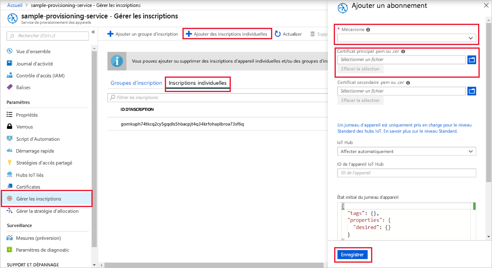
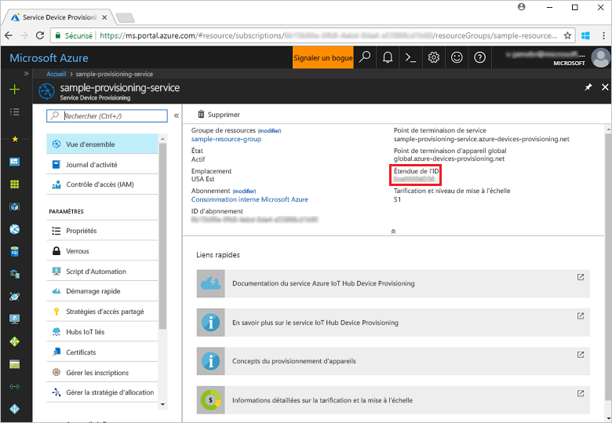
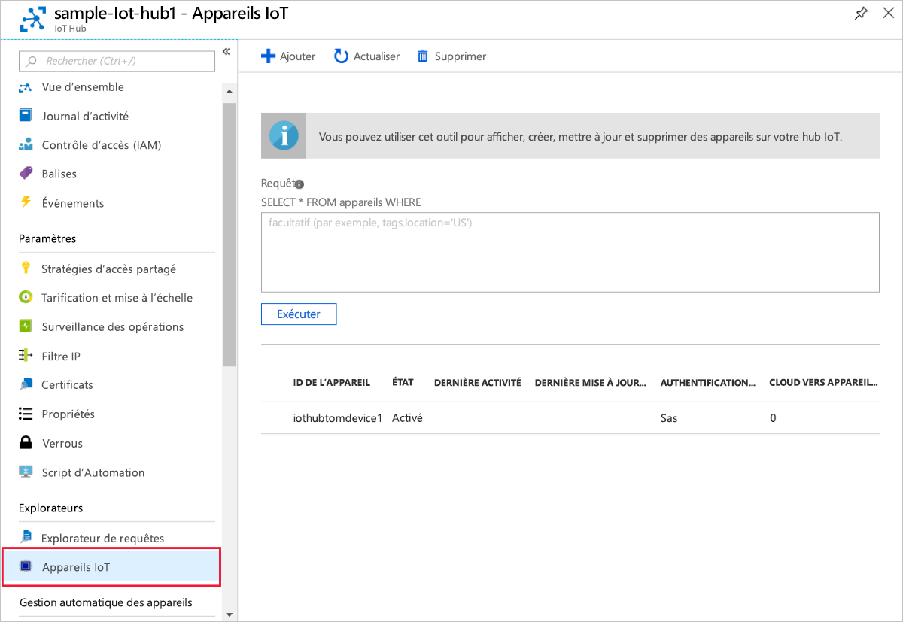

# <a name="quickstart-create-and-provision-an-x509-device-using-c-device-sdk-for-iot-hub-device-provisioning-service"></a>Démarrage rapide : Créer et provisionner un appareil X.509 auprès du service IoT Hub Device Provisioning à l’aide du SDK d’appareil C#

[!INCLUDE [iot-dps-selector-quick-create-simulated-device-x509](../../includes/iot-dps-selector-quick-create-simulated-device-x509.md)]

Ces étapes vous montrent comment utiliser le code d’appareil des [Exemples Azure IoT pour C#](https://github.com/Azure-Samples/azure-iot-samples-csharp) afin de provisionner un appareil X.509. Dans cet article, vous allez exécuter un exemple de code d’appareil sur votre machine de développement pour vous connecter à un hub IoT à l’aide du service Device Provisioning.

## <a name="prerequisites"></a>Prérequis

Si vous ne connaissez pas le processus de provisionnement automatique, veuillez consulter la vue d’ensemble de l’[approvisionnement](about-iot-dps.md#provisioning-process). Vérifiez également que vous avez suivi la procédure décrite dans [Configurer le service d’approvisionnement d’appareil IoT Hub avec le portail Azure](./quick-setup-auto-provision.md) avant de continuer.

Le service Azure IoT Device Provisioning prend en charge deux types d’inscriptions :
- [Groupes d’inscription](concepts-service.md#enrollment-group) : utilisés pour inscrire plusieurs appareils connexes.
- [Inscriptions individuelles](concepts-service.md#individual-enrollment) : utilisées pour inscrire un seul appareil.

Cet article présente les inscriptions individuelles.

[!INCLUDE [IoT Device Provisioning Service basic](../../includes/iot-dps-basic.md)]

<a id="setupdevbox"></a>
## <a name="prepare-the-development-environment"></a>Préparer l’environnement de développement 

1. Assurez-vous que l’élément `git` est installé sur votre machine et est ajouté aux variables d’environnement accessibles à la fenêtre de commande. Consultez la section relative aux [outils clients de Software Freedom Conservancy](https://git-scm.com/download/) pour accéder à la dernière version des outils `git` à installer, qui inclut **Git Bash**, l’application de ligne de commande que vous pouvez utiliser pour interagir avec votre référentiel Git local. 

1. Ouvrez une invite de commandes ou Git Bash. Clonez les échantillons Azure IoT pour le référentiel C# GitHub :
    
    ```bash
    git clone https://github.com/Azure-Samples/azure-iot-samples-csharp.git
    ```

1. Vérifiez que le [kit SDK .NET Core 3.1 ou version ultérieure](https://dotnet.microsoft.com/download) est installé sur votre machine. Vous pouvez exécuter la commande suivante pour vérifier votre version.

    ```bash
    dotnet --info
    ```

## <a name="create-a-self-signed-x509-device-certificate"></a>Créer un certificat auto-signé d’appareil X.509

Dans cette section, vous allez créer un certificat de test X.509 auto-signé en utilisant `iothubx509device1` comme nom commun de l’objet. Il est important de garder à l’esprit les points suivants :

* Les certificats auto-signés sont destinés aux tests uniquement et ne doivent pas être utilisés en production.
* La date d’expiration par défaut d’un certificat auto-signé est d’un an.
* L’ID d’appareil de l’appareil IoT sera le nom commun de l’objet dans le certificat. Veillez à utiliser un nom d’objet conforme aux [exigences relatives aux chaînes d’ID d’appareil](../iot-hub/iot-hub-devguide-identity-registry.md#device-identity-properties).

Vous allez utiliser l’exemple de code de [X509Sample](https://github.com/Azure-Samples/azure-iot-samples-csharp/tree/master/provisioning/Samples/device/X509Sample) pour créer le certificat à utiliser avec l’entrée d’inscription individuelle de l’appareil.


1. À partir d’une invite PowerShell, accédez au répertoire du projet contenant l’exemple de provisionnement d’appareil X.509.

    ```powershell
    cd .\azure-iot-samples-csharp\provisioning\Samples\device\X509Sample
    ```

2. Cet exemple de code est configuré pour utiliser des certificats X.509 stockés dans un fichier PKCS12 protégé par mot de passe (certificate.pfx). En outre, vous avez besoin d’un fichier de certificat de clé publique (certificate.cer) pour créer par la suite, dans ce guide de démarrage rapide, une inscription individuelle. Pour générer le certificat auto-signé et ses fichiers .cer et .pfx associés, exécutez la commande suivante :

    ```powershell
    PS D:\azure-iot-samples-csharp\provisioning\Samples\device\X509Sample> .\GenerateTestCertificate.ps1 iothubx509device1
    ```

3. Le script vous invite à saisir un mot de passe PFX. Notez bien ce mot de passe, car vous en aurez besoin plus tard pour exécuter l’exemple. Vous pouvez exécuter `certutil` pour copier et afficher le certificat afin de vérifier le nom de l’objet.

    ```powershell
    PS D:\azure-iot-samples-csharp\provisioning\Samples\device\X509Sample> certutil .\certificate.pfx
    Enter PFX password:
    ================ Certificate 0 ================
    ================ Begin Nesting Level 1 ================
    Element 0:
    Serial Number: 7b4a0e2af6f40eae4d91b3b7ff05a4ce
    Issuer: CN=iothubx509device1, O=TEST, C=US
     NotBefore: 2/1/2021 6:18 PM
     NotAfter: 2/1/2022 6:28 PM
    Subject: CN=iothubx509device1, O=TEST, C=US
    Signature matches Public Key
    Root Certificate: Subject matches Issuer
    Cert Hash(sha1): e3eb7b7cc1e2b601486bf8a733887a54cdab8ed6
    ----------------  End Nesting Level 1  ----------------
      Provider = Microsoft Strong Cryptographic Provider
    Signature test passed
    CertUtil: -dump command completed successfully.    
    ```

 ## <a name="create-an-individual-enrollment-entry-for-the-device"></a>Créer une entrée d’inscription individuelle pour l’appareil


1. Connectez-vous au portail Azure, sélectionnez **Toutes les ressources** dans le menu de gauche et ouvrez votre service de provisionnement.

2. Dans le menu du service Device Provisioning, sélectionnez **Gérer les inscriptions**. Sélectionnez l’onglet **Inscriptions individuelles**, puis le bouton **Ajouter une inscription individuelle** dans la partie supérieure. 

3. Dans le volet **Ajouter une inscription**, entrez les informations suivantes :
   - Sélectionnez **X.509** comme *mécanisme* d’attestation d’identité.
   - Sous *Fichier .pem ou .cer du certificat principal*, choisissez *Sélectionner un fichier* pour sélectionner le fichier de certificat **certificate.cer** créé au cours des étapes précédentes.
   - Ne renseignez pas le champ **ID de l’appareil**. Votre appareil va être approvisionné. Son ID est défini sur le nom commun (CN) dans le certificat X.509, soit **iothubx509device1**. Ce nom commun sera également le nom utilisé pour l’ID d’inscription de l’entrée d’inscription individuelle. 
   - Si vous le souhaitez, vous pouvez fournir les informations suivantes :
       - Sélectionnez un hub IoT lié à votre service d’approvisionnement.
       - Mettez à jour l’**état du jumeau d’appareil initial** à l’aide de la configuration initiale de votre choix pour l’appareil.
   - Cela fait, appuyez sur le bouton **Enregistrer**. 

     [](./media/quick-create-simulated-device-x509-csharp/device-enrollment.png#lightbox)
    
   Lorsque l’opération aboutit, l’entrée d’inscription de votre appareil X.509 apparaît en tant que **iothubx509device1** sous la colonne *ID d’inscription* de l’onglet *Inscriptions individuelles*. 


## <a name="provision-the-device"></a>Provisionner l’appareil

1. Dans le panneau **Vue d’ensemble** de votre service de provisionnement, notez la valeur **_Étendue de l’ID_** .

     


2. Tapez la commande suivante pour générer et exécuter l’exemple d’approvisionnement d’appareil X.509. Remplacez la valeur `<IDScope>` par l’étendue de l’ID de votre service d’approvisionnement. 

    Par défaut, le fichier de certificat est *./certificate.pfx* et vous invite à entrer le mot de passe .pfx.  

    ```powershell
    dotnet run -- -s <IDScope>
    ```

    Si vous souhaitez tout passer en paramètre, utilisez le format d’exemple suivant.

    ```powershell
    dotnet run -- -s 0ne00000A0A -c certificate.pfx -p 1234
    ```


3. L’appareil se connecte au service DPS et est affecté à un hub IoT. L’appareil envoie également un message de télémétrie au hub.

    ```output
    Loading the certificate...
    Found certificate: 10952E59D13A3E388F88E534444484F52CD3D9E4 CN=iothubx509device1, O=TEST, C=US; PrivateKey: True
    Using certificate 10952E59D13A3E388F88E534444484F52CD3D9E4 CN=iothubx509device1, O=TEST, C=US
    Initializing the device provisioning client...
    Initialized for registration Id iothubx509device1.
    Registering with the device provisioning service...
    Registration status: Assigned.
    Device iothubx509device2 registered to sample-iot-hub1.azure-devices.net.
    Creating X509 authentication for IoT Hub...
    Testing the provisioned device with IoT Hub...
    Sending a telemetry message...
    Finished.
    ```

4. Vérifiez que l’appareil a bien été approvisionné. En cas de réussite du provisionnement de l’appareil auprès du hub IoT lié à votre service de provisionnement, l’ID d’appareil s’affiche sur le panneau **Appareils IoT** du hub. 

     

    Si vous avez modifié la valeur par défaut de l’*état du jumeau d’appareil initial* dans l’entrée d’inscription de votre appareil, l’état du jumeau souhaité peut être extrait du hub et agir en conséquence. Pour en savoir plus, consultez [Comprendre et utiliser les jumeaux d’appareil IoT Hub](../iot-hub/iot-hub-devguide-device-twins.md)


## <a name="clean-up-resources"></a>Nettoyer les ressources

Si vous envisagez de manipuler et d’explorer davantage l’exemple de client d’appareil, ne nettoyez pas les ressources créées dans ce guide de démarrage rapide. Sinon, effectuez les étapes suivantes pour supprimer toutes les ressources créées par ce guide.

1. Fermez la fenêtre de sortie de l’exemple de client d’appareil sur votre machine.
1. Dans le menu de gauche du portail Azure, sélectionnez **Toutes les ressources**, puis votre service Device Provisioning. Dans la partie supérieure du panneau **Vue d’ensemble**, appuyez sur **Supprimer** en haut du volet.  
1. À partir du menu de gauche, dans le portail Azure, sélectionnez **Toutes les ressources**, puis votre hub IoT. Dans la partie supérieure du panneau **Vue d’ensemble**, appuyez sur **Supprimer** en haut du volet.  

## <a name="next-steps"></a>Étapes suivantes

Dans ce guide de démarrage rapide, vous avez provisionné un appareil X.509 dans votre hub IoT à l’aide du service Azure IoT Hub Device Provisioning. Pour apprendre à inscrire un appareil X.509 programmatiquement, passez au guide de démarrage rapide correspondant. 

> [!div class="nextstepaction"]
> [Démarrage rapide Azure - Inscrire des appareils X.509 auprès du service Azure IoT Hub Device Provisioning](quick-enroll-device-x509-csharp.md)
