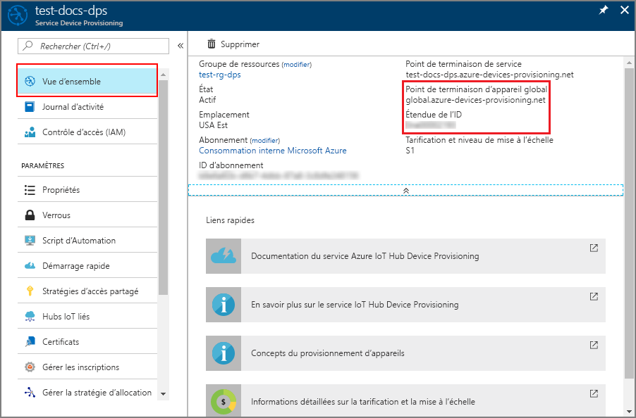
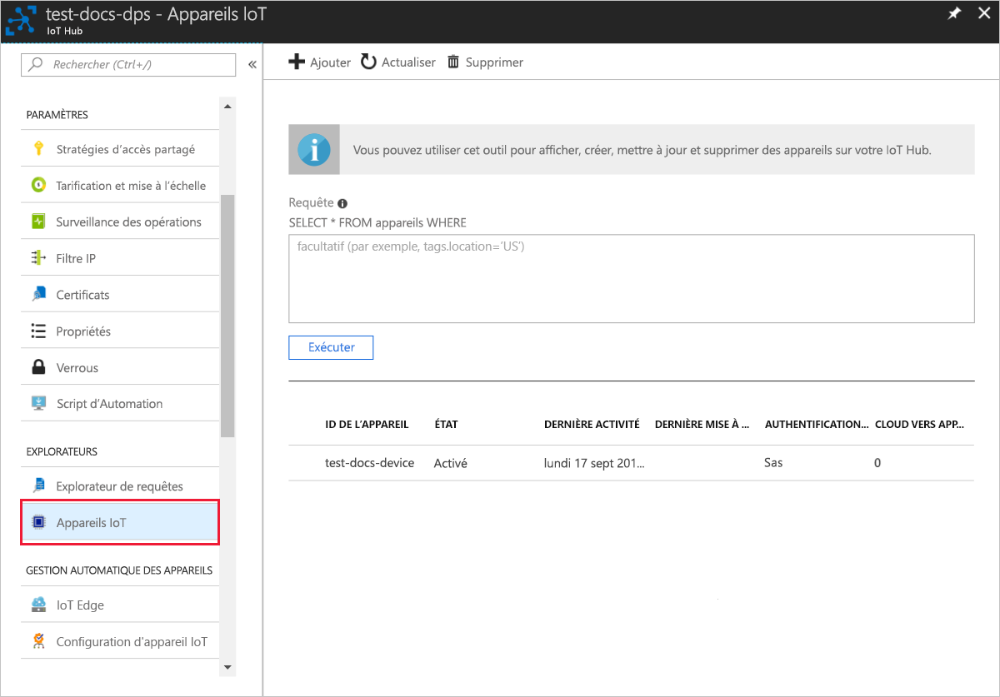

# <a name="quickstart-create-and-provision-an-x509-simulated-device-using-nodejs-device-sdk-for-iot-hub-device-provisioning-service"></a>Démarrage rapide : Créer et provisionner un appareil X.509 simulé à l’aide du Kit de développement logiciel Azure IoT device SDK pour Node.js pour le service IoT Hub Device Provisioning

[!INCLUDE [iot-dps-selector-quick-create-simulated-device-x509](../../includes/iot-dps-selector-quick-create-simulated-device-x509.md)]

Dans ce guide de démarrage rapide, vous allez créer un appareil X.509 simulé sur un ordinateur Windows. Vous allez utiliser l’exemple de code Node.js de l’appareil pour connecter cet appareil simulé à votre hub IoT en utilisant une inscription individuelle auprès du service de provisionnement des appareils (DPS).

## <a name="prerequisites"></a>Prérequis

- Examen des [concepts de provisionnement automatique](concepts-auto-provisioning.md).
- Exécution des étapes décrites dans [Configurer le service IoT Hub Device Provisioning avec le portail Azure](./quick-setup-auto-provision.md).
- Compte Azure avec un abonnement actif. [Créez-en un gratuitement](https://azure.microsoft.com/free/?ref=microsoft.com&utm_source=microsoft.com&utm_medium=docs&utm_campaign=visualstudio).
- [Node.js v4.0+](https://nodejs.org).
- [Git](https://git-scm.com/download/).
- [OpenSSL](https://www.openssl.org/).

[!INCLUDE [IoT Device Provisioning Service basic](../../includes/iot-dps-basic.md)]

## <a name="prepare-the-environment"></a>Préparer l’environnement 

1. Avant de poursuivre, effectuez les étapes décrites dans la section [Configuration du service IoT Hub Device Provisioning avec le portail Azure](./quick-setup-auto-provision.md).

2. Vérifiez que la [version 4.0 ou supérieure de Node.js](https://nodejs.org) est installée sur votre machine.

3. Assurez-vous que l’élément [Git](https://git-scm.com/download/) est installé sur votre machine et ajouté aux variables d’environnement accessibles à la fenêtre de commande. 

4. Assurez-vous que le kit de ressources [OpenSSL](https://www.openssl.org/) est installé sur votre machine et ajouté aux variables d’environnement accessibles à la fenêtre de commande. Cette bibliothèque peut être générée et installée à partir d’une source ou téléchargée et installée à partir d’un [tiers](https://wiki.openssl.org/index.php/Binaries), par exemple [celui-ci](https://sourceforge.net/projects/openssl/). 

    > [!NOTE]
    > Si vous avez déjà créé vos certificats X.509 _racines_, _intermédiaires_ et/ou _feuilles_, vous pouvez ignorer cette étape et les étapes suivantes relatives à la génération de certificat.
    >

## <a name="create-a-self-signed-x509-device-certificate-and-individual-enrollment-entry"></a>Créer un certificat d’appareil X.509 auto-signé et une entrée d’inscription individuelle

Dans cette section, vous allez utiliser un certificat X.509 auto-signé pour lequel il est important de garder à l’esprit les éléments suivants :

* Les certificats auto-signés sont destinés aux tests uniquement et ne doivent pas être utilisés en production.
* La date d’expiration par défaut d’un certificat auto-signé est d’un an.

Vous allez utiliser l’exemple de code du [Kit de développement logiciel (SDK) Azure IoT pour Node.js](https://github.com/Azure/azure-iot-sdk-node.git) pour créer le certificat à utiliser avec l’entrée d’inscription individuelle de l’appareil simulé.

Le service Azure IoT Device Provisioning prend en charge deux types d’inscriptions :

- [Groupes d’inscription](concepts-service.md#enrollment-group) : utilisés pour inscrire plusieurs appareils connexes.
- [Inscriptions individuelles](concepts-service.md#individual-enrollment) : utilisées pour inscrire un seul appareil.

Cet article présente les inscriptions individuelles.

1. Ouvrez une invite de commandes. Clonez le référentiel GitHub pour les exemples de code :
    
    ```cmd/sh
    git clone https://github.com/Azure/azure-iot-sdk-node.git --recursive
    ```

2. Accédez au script de générateur de certificats et générez le projet. 

    ```cmd/sh
    cd azure-iot-sdk-node/provisioning/tools
    npm install
    ```

3. Créez un certificat X.509 _feuille_ en exécutant le script à l’aide de votre _nom-certificat_. Le nom commun du certificat feuille devient alors [l’ID d’inscription](https://docs.microsoft.com/azure/iot-dps/concepts-device#registration-id). Veillez donc à utiliser uniquement des caractères alphanumériques minuscules et des traits d’union.

    ```cmd/sh
    node create_test_cert.js device {certificate-name}
    ```

4. Connectez-vous au [portail Azure](https://portal.azure.com), sélectionnez le bouton **Toutes les ressources** dans le menu de gauche et ouvrez votre instance de service Device Provisioning.

5. Dans le menu du service Device Provisioning, sélectionnez **Gérer les inscriptions**. Sélectionnez l’onglet **Inscriptions individuelles**, puis le bouton **Ajouter une inscription individuelle** dans la partie supérieure. 

6. Dans le volet **Ajouter une inscription**, entrez les informations suivantes :
   - Sélectionnez **X.509** comme *mécanisme* d’attestation d’identité.
   - Sous *Fichier .pem ou .cer du certificat principal*, choisissez *Sélectionner un fichier* pour sélectionner le fichier de certificat **{certificate-name}_cert.pem** créé au cours des étapes précédentes.  
   - Si vous le souhaitez, vous pouvez fournir les informations suivantes :
     - Sélectionnez un hub IoT lié à votre service d’approvisionnement.
     - Entrez un ID d’appareil unique. Veillez à éviter les données sensibles lorsque vous affectez un nom à votre appareil. 
     - Mettez à jour l’**état du jumeau d’appareil initial** à l’aide de la configuration initiale de votre choix pour l’appareil.
     - Cela fait, appuyez sur le bouton **Enregistrer**. 

     [](./media/quick-create-simulated-device-x509-node/device-enrollment.png#lightbox)

     Lorsque l’inscription aboutit, votre appareil X.509 apparaît en tant que **{nom-certificat}** dans la colonne *ID d’inscription* de l’onglet *Inscriptions individuelles*. Notez cette valeur pour une utilisation ultérieure.

## <a name="simulate-the-device"></a>Simuler l’appareil

Le [Kit de développement logiciel (SDK) Azure IoT Hub Node.js Device SDK](https://github.com/Azure/azure-iot-sdk-node) permet de simuler facilement un appareil. Pour plus d’informations, consultez l’article [Concepts de l’appareil](https://docs.microsoft.com/azure/iot-dps/concepts-device).

1. Dans le portail Azure, sélectionnez le panneau **Vue d’ensemble** du service Device Provisioning et notez les valeurs **_Point de terminaison d’appareil global_** et **_Étendue de l’ID_**.

     

2. Copiez votre _certificat_ et votre _clé_ dans le dossier d’exemples.

    ```cmd/sh
    copy .\{certificate-name}_cert.pem ..\device\samples\{certificate-name}_cert.pem
    copy .\{certificate-name}_key.pem ..\device\samples\{certificate-name}_key.pem
    ```

3. Accédez au script de test d’appareil et générez le projet. 

    ```cmd/sh
    cd ..\device\samples
    npm install
    ```

4. Modifiez le fichier **register\_x509.js**. Enregistrez le fichier après avoir apporté les modifications indiquées ci-dessous.
    - Remplacez `provisioning host` par la valeur **_Point de terminaison d’appareil global_** notée à **l’étape 1** ci-dessus.
    - Remplacez `id scope` par la valeur **_Étendue de l’ID_** notée à l’**étape 1** ci-dessus. 
    - Remplacez `registration id` par la valeur **_ID d’inscription_** notée dans la section précédente.
    - Remplacez `cert filename` et `key filename` par les fichiers que vous avez copiés à **l’étape 2** ci-dessus. 

5. Exécutez le script et vérifiez que l’appareil a été provisionné correctement.

    ```cmd/sh
    node register_x509.js
    ```   

6. Dans le portail, accédez au hub IoT lié à votre service de provisionnement et ouvrez le panneau **Appareils IoT**. En cas de réussite du provisionnement de l’appareil X.509 simulé auprès du hub, son ID d’appareil s’affiche sur le panneau **Appareils IoT**, avec un *ÉTAT* **activé**. Notez que vous devrez peut-être appuyer sur le bouton **Actualiser** dans la partie supérieure si vous avez déjà ouvert le panneau avant d’exécuter l’exemple d’application de l’appareil. 

     

    Si vous avez modifié la valeur par défaut de l’*état du jumeau d’appareil initial* dans l’entrée d’inscription de votre appareil, l’état du jumeau souhaité peut être extrait du hub et agir en conséquence. Pour en savoir plus, consultez [Comprendre et utiliser les jumeaux d’appareil IoT Hub](../iot-hub/iot-hub-devguide-device-twins.md).


## <a name="clean-up-resources"></a>Nettoyer les ressources

Si vous envisagez de manipuler et d’explorer davantage l’exemple de client d’appareil, ne nettoyez pas les ressources créées dans ce guide de démarrage rapide. Sinon, effectuez les étapes suivantes pour supprimer toutes les ressources créées par ce guide.

1. Fermez la fenêtre de sortie de l’exemple de client d’appareil sur votre machine.
2. Dans le menu de gauche du portail Azure, sélectionnez **Toutes les ressources**, puis votre service Device Provisioning. Ouvrez le panneau **Gérer les inscriptions** pour votre service, puis sélectionnez l’onglet **Inscriptions individuelles**. Cochez la case à côté de l’*ID D’INSCRIPTION* de l’appareil que vous avez inscrit dans ce guide de démarrage rapide, puis appuyez sur le bouton **Supprimer** dans la partie supérieure du volet. 
3. À partir du menu de gauche, dans le portail Azure, sélectionnez **Toutes les ressources**, puis votre hub IoT. Ouvrez le panneau **Appareils IoT** pour votre hub, cochez la case en regard de l’*ID D’APPAREIL* de l’appareil que vous avez inscrit dans ce guide de démarrage rapide, puis appuyez sur le bouton **Supprimer** dans la partie supérieure du volet.


## <a name="next-steps"></a>Étapes suivantes

Dans ce guide de démarrage rapide, vous avez créé un appareil X.509 simulé et l’avez provisionné auprès du service IoT Hub à l’aide du service Azure IoT Hub Device Provisioning sur le portail. Pour apprendre à inscrire un appareil X.509 programmatiquement, passez au guide de démarrage rapide correspondant. 

> [!div class="nextstepaction"]
> [Démarrage rapide Azure - Inscrire des appareils X.509 auprès du service Azure IoT Hub Device Provisioning](quick-enroll-device-x509-node.md)
