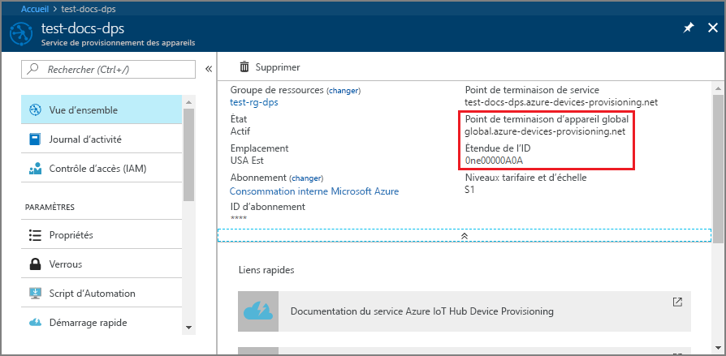
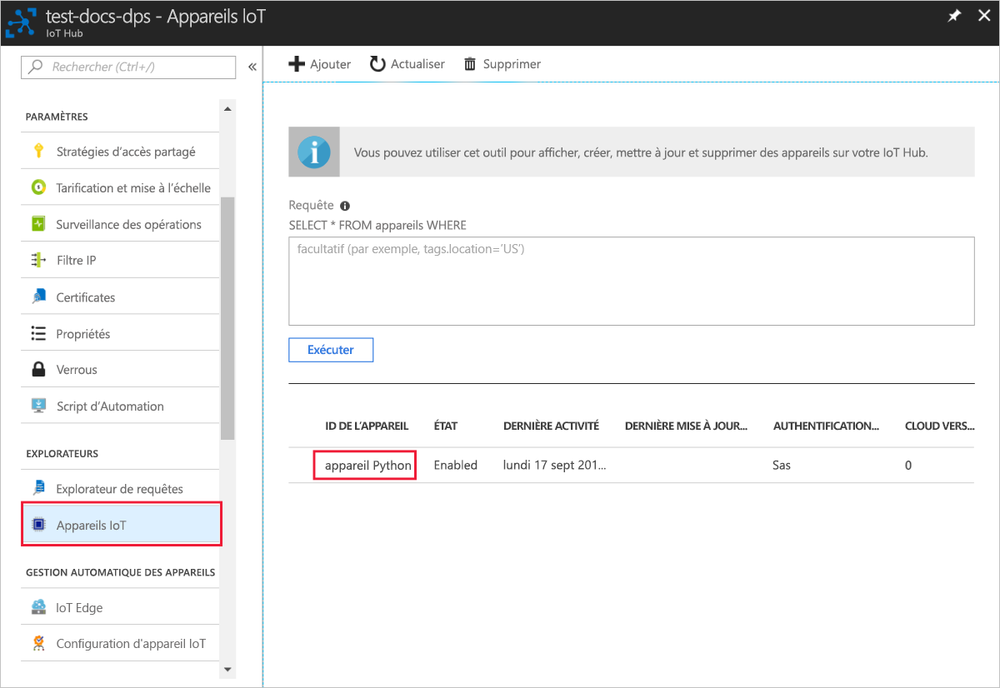

# <a name="quickstart-create-and-provision-a-simulated-x509-device-using-python-device-sdk-for-iot-hub-device-provisioning-service"></a>Démarrage rapide : Créer et approvisionner un appareil X.509 simulé auprès du service IoT Hub Device Provisioning à l’aide du Python Device SDK

[!INCLUDE [iot-dps-selector-quick-create-simulated-device-x509](../../includes/iot-dps-selector-quick-create-simulated-device-x509.md)]

Dans ce guide de démarrage rapide, vous allez créer un appareil X.509 simulé sur un ordinateur Windows. Vous allez utiliser l’exemple de code Python de l’appareil pour connecter cet appareil simulé à votre hub IoT en utilisant une inscription individuelle auprès du service de provisionnement des appareils (DPS).

## <a name="prerequisites"></a>Prérequis

- Connaissance des concepts liés au [provisionnement](about-iot-dps.md#provisioning-process).
- Exécution des étapes décrites dans [Configurer le service IoT Hub Device Provisioning avec le portail Azure](./quick-setup-auto-provision.md).
- Compte Azure avec un abonnement actif. [Créez-en un gratuitement](https://azure.microsoft.com/free/?ref=microsoft.com&utm_source=microsoft.com&utm_medium=docs&utm_campaign=visualstudio).
- [Visual Studio 2015+](https://visualstudio.microsoft.com/vs/) avec le développement Desktop en C++ .
- [Système de génération CMake](https://cmake.org/download/).
- [Git](https://git-scm.com/download/).

> [!IMPORTANT]
> Cet article s’applique uniquement au kit SDK Python V1 déprécié. Les clients d’appareil et de service pour le service IoT Hub Device Provisioning ne sont pas encore disponibles dans la V2. L’équipe travaille actuellement sur la parité des fonctionnalités pour la V2.

[!INCLUDE [IoT Device Provisioning Service basic](../../includes/iot-dps-basic.md)]

## <a name="prepare-the-environment"></a>Préparer l’environnement 

1. Assurez-vous que vous avez installé [Visual Studio](https://visualstudio.microsoft.com/vs/) 2015 ou une version ultérieure, avec la charge de travail « développement Desktop en C++ » activée pour votre installation de Visual Studio.

2. Téléchargez et installez le [système de génération de CMake](https://cmake.org/download/).

3. Assurez-vous que l’élément `git` est installé sur votre machine et est ajouté aux variables d’environnement accessibles à la fenêtre de commande. Consultez la section relative aux [outils clients de Software Freedom Conservancy](https://git-scm.com/download/) pour accéder à la dernière version des outils `git` à installer, qui inclut **Git Bash**, l’application de ligne de commande que vous pouvez utiliser pour interagir avec votre référentiel Git local. 

4. Ouvrez une invite de commandes ou Git Bash. Clonez le référentiel GitHub pour l’exemple de code de simulation d’appareil.
    
    ```cmd/sh
    git clone https://github.com/Azure/azure-iot-sdk-python.git --recursive
    ```

5. Créez un dossier dans votre copie locale de ce référentiel GitHub pour le processus de génération de CMake. 

    ```cmd/sh
    cd azure-iot-sdk-python/c
    mkdir cmake
    cd cmake
    ```

6. Exécutez la commande suivante pour créer la solution Visual Studio pour le client d’approvisionnement.

    ```cmd/sh
    cmake -Duse_prov_client:BOOL=ON ..
    ```


## <a name="create-a-self-signed-x509-device-certificate-and-individual-enrollment-entry"></a>Créer un certificat d’appareil X.509 auto-signé et une entrée d’inscription individuelle

Dans cette section, vous allez utiliser un certificat X.509 auto-signé. Il est important de garder à l’esprit les points suivants :

* Les certificats auto-signés sont destinés aux tests uniquement et ne doivent pas être utilisés en production.
* La date d’expiration par défaut d’un certificat auto-signé est d’un an.

Vous allez utiliser l’exemple de code du Kit de développement logiciel (SDK) Azure IoT pour C pour créer le certificat à utiliser avec l’entrée d’inscription individuelle de l’appareil simulé.

Le service Azure IoT Device Provisioning prend en charge deux types d’inscriptions :

- [Groupes d’inscription](concepts-service.md#enrollment-group) : utilisés pour inscrire plusieurs appareils connexes.
- [Inscriptions individuelles](concepts-service.md#individual-enrollment) : utilisées pour inscrire un seul appareil.

Cet article présente les inscriptions individuelles.

1. Ouvrez la solution générée dans le dossier *cmake* nommé `azure_iot_sdks.sln` générez-la dans Visual Studio.

2. Cliquez avec le bouton droit de la souris sur le projet **dice\_device\_enrollment** dans le dossier **Provision\_Tools**, puis sélectionnez **Définir comme projet de démarrage**. Exécutez la solution. 

3. Dans la fenêtre Sortie, entrez `i` pour l’inscription individuelle lorsque vous y êtes invité. La fenêtre Sortie affiche un certificat X.509 généré localement pour votre appareil simulé. 
    
    ```output
    Copy the first certificate to clipboard. Begin with the first occurrence of:
    
        -----BEGIN CERTIFICATE----- 
        
    End you copying after the first occurrence of:
    
        -----END CERTIFICATE-----
        
    Make sure to include both of those lines as well.
    ``` 

    
 
4. Créez un fichier nommé **_X509testcertificate.pem_** sur votre ordinateur Windows, ouvrez-le dans un éditeur de votre choix et copiez le contenu du presse-papiers dans ce fichier. Enregistrez le fichier . 

5. Connectez-vous au portail Azure, sélectionnez **Toutes les ressources** dans le menu de gauche et ouvrez votre service de provisionnement.

6. Dans le menu du service Device Provisioning, sélectionnez **Gérer les inscriptions**. Sélectionnez l’onglet **Inscriptions individuelles**, puis le bouton **Ajouter une inscription individuelle** dans la partie supérieure. 

7. Dans le volet **Ajouter une inscription**, entrez les informations suivantes :
   - Sélectionnez **X.509** comme *mécanisme* d’attestation d’identité.
   - Sous *Fichier .pem ou .cer du certificat principal*, choisissez *Sélectionner un fichier* pour sélectionner le fichier de certificat **X509testcertificate.pem** créé au cours des étapes précédentes.
   - Si vous le souhaitez, vous pouvez fournir les informations suivantes :
     - Sélectionnez un hub IoT lié à votre service d’approvisionnement.
     - Entrez un ID d’appareil unique. Veillez à éviter les données sensibles lorsque vous affectez un nom à votre appareil. 
     - Mettez à jour l’**état du jumeau d’appareil initial** à l’aide de la configuration initiale de votre choix pour l’appareil.
   - Cela fait, appuyez sur le bouton **Enregistrer**. 

     [](./media/python-quick-create-simulated-device-x509/device-enrollment.png#lightbox)

   Lorsque l’inscription aboutit, votre appareil X.509 apparaît en tant que **riot-device-cert** sous la colonne *ID d’inscription* dans l’onglet *Inscriptions individuelles*. 

## <a name="simulate-the-device"></a>Simuler l’appareil

1. Dans le menu du service Device Provisioning, sélectionnez **Vue d’ensemble**. Notez les valeurs _ID Scope_ (Étendue d’ID) et _Global Service Endpoint_ (Point de terminaison de service global).

    

2. Téléchargez et installez [Python 2.x ou 3.x](https://www.python.org/downloads/). Veillez à utiliser l’installation 32 bits ou 64 bits comme requis par votre programme d’installation. Lorsque vous y êtes invité pendant l’installation, veillez à ajouter Python à votre variable d’environnement propre à la plateforme. Si vous utilisez Python 2.x, vous devrez peut-être [installer ou mettre à niveau *pip*, le système de gestion des packages Python](https://pip.pypa.io/en/stable/installing/).
    
    > [!NOTE] 
    > Si vous utilisez Windows, vous devez également installer le [Redistributable Visual C++ pour Visual Studio 2015](https://support.microsoft.com/help/2977003/the-latest-supported-visual-c-downloads). Les packages pip ont besoin du redistribuable pour charger/exécuter les DLL C.

3. Suivez [ces instructions](https://github.com/Azure/azure-iot-sdk-python/blob/v1-deprecated/doc/python-devbox-setup.md) pour générer les packages Python.

   > [!NOTE]
   > Si vous utilisez `pip`, assurez-vous d’installer également le package `azure-iot-provisioning-device-client`.

4. Accédez au dossier des exemples.

    ```cmd/sh
    cd azure-iot-sdk-python/provisioning_device_client/samples
    ```

5. À l’aide de votre environnement IDE Python, modifiez le script python nommé **provisioning\_device\_client\_sample.py**. Modifiez les variables _GLOBAL\_PROV\_URI_ et _ID\_SCOPE_ d’après les valeurs notées précédemment.

    ```python
    GLOBAL_PROV_URI = "{globalServiceEndpoint}"
    ID_SCOPE = "{idScope}"
    SECURITY_DEVICE_TYPE = ProvisioningSecurityDeviceType.X509
    PROTOCOL = ProvisioningTransportProvider.HTTP
    ```

6. Exécutez l’exemple. 

    ```cmd/sh
    python provisioning_device_client_sample.py
    ```

7. L’application va se connecter, inscrire l’appareil et afficher un message informant de la réussite de l’inscription.

    

8. Dans le portail, accédez au IoT Hub lié à votre service d’approvisionnement, ouvrez le panneau **Device Explorer**. En cas de réussite de l’approvisionnement de l’appareil simulé X.509 sur le Hub, son ID de périphérique s’affiche sur le panneau **Device Explorer**, avec un *ÉTAT* **activé**. Notez que vous devrez peut-être appuyer sur le bouton **Actualiser** dans la partie supérieure si vous avez déjà ouvert le panneau avant d’exécuter l’exemple d’application de l’appareil. 

     

> [!NOTE]
> Si vous avez modifié la valeur par défaut de l’*état du jumeau d’appareil initial* dans l’entrée d’inscription de votre appareil, l’état du jumeau souhaité peut être extrait du hub et agir en conséquence. Pour en savoir plus, consultez [Comprendre et utiliser les jumeaux d’appareil IoT Hub](../iot-hub/iot-hub-devguide-device-twins.md).
>

## <a name="clean-up-resources"></a>Nettoyer les ressources

Si vous envisagez de manipuler et d’explorer davantage l’exemple de client d’appareil, ne nettoyez pas les ressources créées dans ce guide de démarrage rapide. Sinon, effectuez les étapes suivantes pour supprimer toutes les ressources créées par ce guide.

1. Fermez la fenêtre de sortie de l’exemple de client d’appareil sur votre machine.
2. Dans le menu de gauche du portail Azure, sélectionnez **Toutes les ressources**, puis votre service Device Provisioning. Ouvrez le panneau **Gérer les inscriptions** pour votre service, puis sélectionnez l’onglet **Inscriptions individuelles**. Cochez la case à côté de l’*ID D’INSCRIPTION* de l’appareil que vous avez inscrit dans ce guide de démarrage rapide, puis appuyez sur le bouton **Supprimer** dans la partie supérieure du volet. 
3. À partir du menu de gauche, dans le portail Azure, sélectionnez **Toutes les ressources**, puis votre hub IoT. Ouvrez le panneau **Appareils IoT** pour votre hub, cochez la case en regard de l’*ID D’APPAREIL* de l’appareil que vous avez inscrit dans ce guide de démarrage rapide, puis appuyez sur le bouton **Supprimer** dans la partie supérieure du volet.

## <a name="next-steps"></a>Étapes suivantes

Dans ce guide de démarrage rapide, vous avez créé un appareil X.509 simulé sur un ordinateur Windows et l’avez provisionné auprès de votre hub IoT à l’aide du service Azure IoT Hub Device Provisioning sur le portail. Pour apprendre à inscrire un appareil X.509 programmatiquement, passez au guide de démarrage rapide correspondant. 

> [!div class="nextstepaction"]
> [Démarrage rapide Azure - Inscrire des appareils X.509 auprès du service Azure IoT Hub Device Provisioning](quick-enroll-device-x509-python.md)
