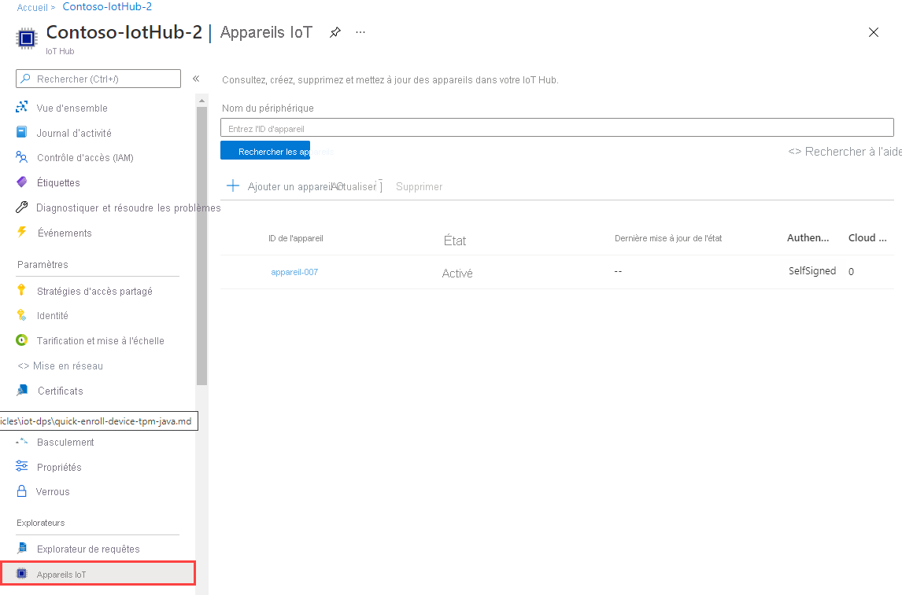

# <a name="quickstart-provision-an-x509-simulated-device-using-the-azure-iot-c-sdk"></a>Démarrage rapide : Provisionner un appareil X.509 simulé avec le SDK Azure IoT pour C

[!INCLUDE [iot-dps-selector-quick-create-simulated-device-x509](../../includes/iot-dps-selector-quick-create-simulated-device-x509.md)]

Dans ce guide de démarrage rapide, vous allez apprendre à créer et à exécuter un simulateur d’appareil X.509 sur une machine de développement Windows. Vous allez configurer cet appareil simulé à affecter à un hub IoT à l’aide d’une inscription auprès d’une instance de service Device Provisioning. Un exemple de code du [Kit de développement logiciel (SDK) Azure IoT pour C](https://github.com/Azure/azure-iot-sdk-c) est utilisé pour simuler une séquence de démarrage de l’appareil. L’appareil est reconnu en fonction de l’inscription auprès du service d’approvisionnement et affecté au hub IoT.

Si vous ne connaissez pas le processus de provisionnement automatique, veuillez consulter [Concepts de provisionnement automatique](concepts-auto-provisioning.md). Vérifiez également que vous avez suivi la procédure décrite dans [Configurer le service IoT Hub Device Provisioning avec le portail Azure](quick-setup-auto-provision.md) avant de poursuivre ce démarrage rapide. 

Le service Azure IoT Device Provisioning prend en charge deux types d’inscriptions :

* [Groupes d’inscription](concepts-service.md#enrollment-group) : utilisés pour inscrire plusieurs appareils connexes.
* [Inscriptions individuelles](concepts-service.md#individual-enrollment) : utilisées pour inscrire un seul appareil.

Cet article présente les inscriptions individuelles.

[!INCLUDE [quickstarts-free-trial-note](../../includes/quickstarts-free-trial-note.md)]

## <a name="prerequisites"></a>Prérequis

Les prérequis suivants s’appliquent à un environnement de développement Windows. Pour Linux ou macOS, consultez la section appropriée de [Préparer votre environnement de développement](https://github.com/Azure/azure-iot-sdk-c/blob/master/doc/devbox_setup.md) dans la documentation du kit de développement logiciel (SDK).

* [Visual Studio](https://visualstudio.microsoft.com/vs/) 2019 avec la charge de travail [« Développement Desktop en C++ »](https://docs.microsoft.com/cpp/?view=vs-2019#pivot=workloads) activée. Visual Studio 2015 et Visual Studio 2017 sont également pris en charge.

* Dernière version de [Git](https://git-scm.com/download/) installée.

## <a name="prepare-a-development-environment-for-the-azure-iot-c-sdk"></a>Préparer un environnement de développement pour le Kit de développement logiciel (SDK) Azure IoT pour C

Dans cette section, vous allez préparer un environnement de développement pour générer le [SDK Azure IoT C](https://github.com/Azure/azure-iot-sdk-c) qui inclut l’exemple de code pour la séquence de démarrage X.509.

1. Téléchargez le [système de génération CMake](https://cmake.org/download/).

    Il est important que les composants requis Visual Studio (Visual Studio et la charge de travail « Développement Desktop en C++ ») soient installés sur votre machine, **avant** de commencer l’installation de l’élément `CMake`. Une fois les composants requis en place et le téléchargement effectué, installez le système de génération de CMake.

2. Recherchez le nom de balise de la [version la plus récente](https://github.com/Azure/azure-iot-sdk-c/releases/latest) du kit de développement logiciel (SDK).

3. Ouvrez une invite de commandes ou l’interpréteur de commandes Git Bash. Exécutez les commandes suivantes pour cloner la dernière version du dépôt GitHub du [Azure IoT C SDK](https://github.com/Azure/azure-iot-sdk-c). Utilisez l’étiquette obtenue à l’étape précédente comme valeur pour le paramètre `-b` :

    ```cmd/sh
    git clone -b <release-tag> https://github.com/Azure/azure-iot-sdk-c.git
    cd azure-iot-sdk-c
    git submodule update --init
    ```

    Attendez-vous à ce que cette opération prenne plusieurs minutes.

4. Créez un sous-répertoire `cmake` dans le répertoire racine du référentiel Git et accédez à ce dossier. Exécutez les commandes suivantes à partir du répertoire `azure-iot-sdk-c` :

    ```cmd/sh
    mkdir cmake
    cd cmake
    ```

5. L’exemple de code utilise un certificat X.509 pour fournir l’attestation via l’authentification X.509. Exécutez la commande suivante pour générer une version du SDK propre à votre plateforme de développement qui inclut le client de provisionnement des appareils. Une solution Visual Studio pour l’appareil simulé est générée dans le répertoire `cmake`.

    ```cmd
    cmake -Duse_prov_client:BOOL=ON ..
    ```

    Si `cmake` ne trouve pas votre compilateur C++, vous obtiendrez peut-être des erreurs de build lors de l’exécution de la commande ci-dessus. Si cela se produit, essayez d’exécuter cette commande dans [l’invite de commandes de Visual Studio](https://docs.microsoft.com/dotnet/framework/tools/developer-command-prompt-for-vs).

    Une fois la génération terminée, les dernières lignes de la sortie doivent ressembler à ceci :

    ```cmd/sh
    $ cmake -Duse_prov_client:BOOL=ON ..
    -- Building for: Visual Studio 16 2019
    -- The C compiler identification is MSVC 19.23.28107.0
    -- The CXX compiler identification is MSVC 19.23.28107.0

    ...

    -- Configuring done
    -- Generating done
    -- Build files have been written to: C:/code/azure-iot-sdk-c/cmake
    ```

## <a name="create-a-self-signed-x509-device-certificate"></a>Créer un certificat auto-signé d’appareil X.509

Dans cette section, vous allez utiliser un certificat X.509 auto-signé. Il est important de garder à l’esprit les points suivants :

* Les certificats auto-signés sont destinés aux tests uniquement et ne doivent pas être utilisés en production.
* La date d’expiration par défaut d’un certificat auto-signé est d’un an.

Vous allez utiliser l’exemple de code du Kit de développement logiciel (SDK) Azure IoT pour C pour créer le certificat à utiliser avec l’entrée d’inscription individuelle de l’appareil simulé.

1. Lancez Visual Studio et ouvrez le nouveau fichier solution nommé `azure_iot_sdks.sln`. Ce fichier solution se trouve dans le dossier `cmake` que vous avez créé précédemment à la racine du référentiel Git azure-iot-sdk-c.

2. Dans le menu Visual Studio, sélectionnez **Génération** > **Générer la solution** pour générer tous les projets dans la solution.

3. Dans la fenêtre *Explorateur de solutions* de Visual Studio, accédez au dossier **Provision\_Tools**. Cliquez avec le bouton droit sur le projet**dice\_device\_enrollment** et sélectionnez **Définir comme projet de démarrage**.

4. Dans le menu Visual Studio, sélectionnez **Déboguer** > **Exécuter sans débogage** pour exécuter la solution. Dans la fenêtre Sortie, entrez **i** pour l’inscription individuelle lorsque vous y êtes invité.

    La fenêtre Sortie affiche un certificat X.509 auto-signé généré localement pour votre appareil simulé. Dans le Presse-papiers, copiez la sortie débutant par **-----BEGIN CERTIFICATE-----** et se terminant par **-----END CERTIFICATE-----** , en veillant à inclure également ces deux lignes. Vous n’avez besoin que du premier certificat dans la fenêtre Sortie.

5. Dans un éditeur de texte, enregistrez le certificat dans un nouveau fichier nommé **_X509testcert.pem_**.

## <a name="create-a-device-enrollment-entry-in-the-portal"></a>Créer une entrée d’inscription d’appareil dans le portail

1. Connectez-vous au portail Azure, sélectionnez le bouton **Toutes les ressources** dans le menu de gauche et ouvrez votre service Device Provisioning.

2. Sélectionnez l’onglet **Gérer les inscriptions**, puis sélectionnez le bouton **Ajouter une inscription individuelle** dans la partie supérieure.

3. Dans le volet **Ajouter une inscription**, entrez les informations suivantes, puis appuyez sur le bouton **Enregistrer**.

    * **Mécanisme :** Sélectionnez **X.509** comme *mécanisme* d’attestation d’identité.
    * **Fichier .pem ou .cer du certificat principal :** Choisissez **Sélectionner un fichier** pour sélectionner le fichier de certificat, X509testcert.pem, que vous avez créé précédemment.
    * **ID de l’appareil IoT Hub :** Entrez **test-docs-cert-device** pour donner un ID à l’appareil.

      [](./media/quick-create-simulated-device-x509/device-enrollment.png#lightbox)

      Lorsque l’inscription aboutit, votre appareil X.509 apparaît en tant que **riot-device-cert** sous la colonne *ID d’inscription* dans l’onglet *Inscriptions individuelles*. 

## <a name="simulate-first-boot-sequence-for-the-device"></a>Simuler la première séquence de démarrage de l’appareil

Dans cette section, mettez à jour l’exemple de code pour envoyer la séquence de démarrage de l’appareil vers votre instance de service Device Provisioning. Cette séquence de démarrage entraîne la reconnaissance et l’affectation de l’appareil à un hub IoT lié à l’instance de service Device Provisioning.

1. Dans le portail Azure, sélectionnez l’onglet **Vue d’ensemble** de votre service Device Provisioning et notez la valeur **_Étendue de l’ID_**.

     

2. Dans la fenêtre *Explorateur de solutions* de Visual Studio, accédez au dossier **Provision\_Samples**. Développez l’exemple de projet nommé **prov\_dev\_client\_sample**. Développez **Fichiers sources**, puis ouvrez **prov\_dev\_client\_sample.c**.

3. Recherchez la constante `id_scope` et remplacez la valeur par la valeur **Étendue de l’ID** que vous avez copiée précédemment. 

    ```c
    static const char* id_scope = "0ne00002193";
    ```

4. Recherchez la définition de la fonction `main()` dans le même fichier. Assurez-vous que la variable `hsm_type` est définie sur `SECURE_DEVICE_TYPE_X509` au lieu de `SECURE_DEVICE_TYPE_TPM` comme indiqué ci-dessous.

    ```c
    SECURE_DEVICE_TYPE hsm_type;
    //hsm_type = SECURE_DEVICE_TYPE_TPM;
    hsm_type = SECURE_DEVICE_TYPE_X509;
    ```

5. Cliquez avec le bouton droit sur le projet **prov\_dev\_client\_sample** et sélectionnez **Définir comme projet de démarrage**.

6. Dans le menu Visual Studio, sélectionnez **Déboguer** > **Exécuter sans débogage** pour exécuter la solution. Dans l’invite pour régénérer le projet, sélectionnez **Oui** pour régénérer le projet avant de l’exécuter.

    La sortie suivante illustre un exemple d’approvisionnement d’un client d’appareil, son démarrage réussi, sa connexion à une instance de service Device Provisioning pour obtenir des informations sur le hub IoT et son inscription :

    ```cmd
    Provisioning API Version: 1.2.7

    Registering... Press enter key to interrupt.

    Provisioning Status: PROV_DEVICE_REG_STATUS_CONNECTED
    Provisioning Status: PROV_DEVICE_REG_STATUS_ASSIGNING
    Provisioning Status: PROV_DEVICE_REG_STATUS_ASSIGNING

    Registration Information received from service:
    test-docs-hub.azure-devices.net, deviceId: test-docs-cert-device
    ```

7. Dans le portail, accédez au hub IoT lié à votre service de provisionnement, puis sélectionnez l’onglet **Appareils IoT**. En cas de réussite du provisionnement de l’appareil X.509 simulé auprès du hub, son ID d’appareil s’affiche sur le panneau **Appareils IoT**, avec un *ÉTAT* **activé**. Vous devrez peut-être appuyer sur le bouton **Actualiser** dans la partie supérieure. 

     

## <a name="clean-up-resources"></a>Nettoyer les ressources

Si vous envisagez de manipuler et d’explorer davantage l’exemple de client d’appareil, ne nettoyez pas les ressources créées dans ce guide de démarrage rapide. Sinon, effectuez les étapes suivantes pour supprimer toutes les ressources créées par ce guide.

1. Fermez la fenêtre de sortie de l’exemple de client d’appareil sur votre machine.
1. Dans le menu de gauche du portail Azure, sélectionnez **Toutes les ressources**, puis votre service Device Provisioning. Ouvrez **Gérer les inscriptions** pour votre service, puis sélectionnez l’onglet **Inscriptions individuelles**. Cochez la case à côté de l’*ID D’INSCRIPTION* de l’appareil que vous avez inscrit dans ce guide de démarrage rapide, puis appuyez sur le bouton **Supprimer** dans la partie supérieure du volet. 
1. À partir du menu de gauche, dans le portail Azure, sélectionnez **Toutes les ressources**, puis votre hub IoT. Ouvrez **Appareils IoT** pour votre hub, cochez la case en regard de l’*ID D’APPAREIL* de l’appareil que vous avez inscrit dans ce guide de démarrage rapide, puis appuyez sur le bouton **Supprimer** dans la partie supérieure du volet.

## <a name="next-steps"></a>Étapes suivantes

Dans ce guide de démarrage rapide, vous avez créé un appareil X.509 simulé sur un ordinateur Windows et l’avez provisionné dans votre hub IoT en utilisant le service Azure IoT Hub Device Provisioning sur le portail. Pour apprendre à inscrire un appareil X.509 programmatiquement, passez au guide de démarrage rapide correspondant. 

> [!div class="nextstepaction"]
> [Démarrage rapide Azure - Inscrire des appareils X.509 auprès du service Azure IoT Hub Device Provisioning](quick-enroll-device-x509-java.md)
