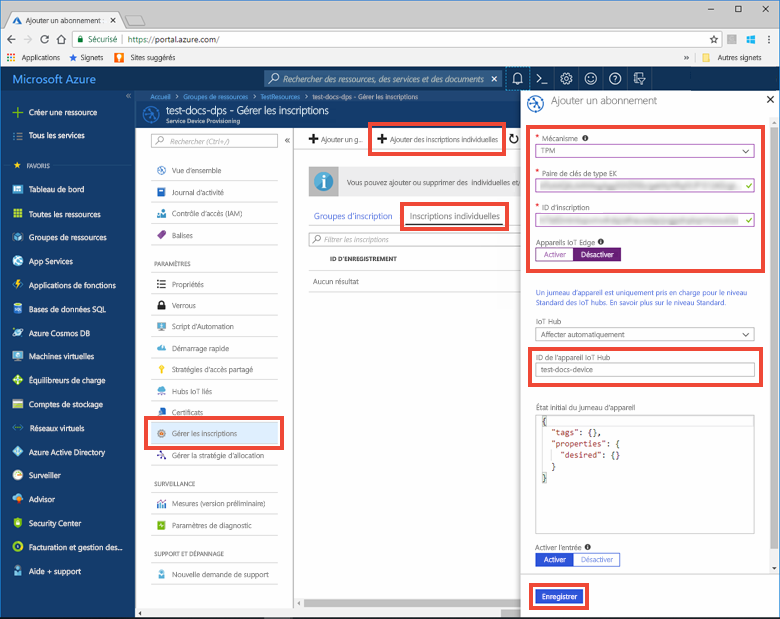
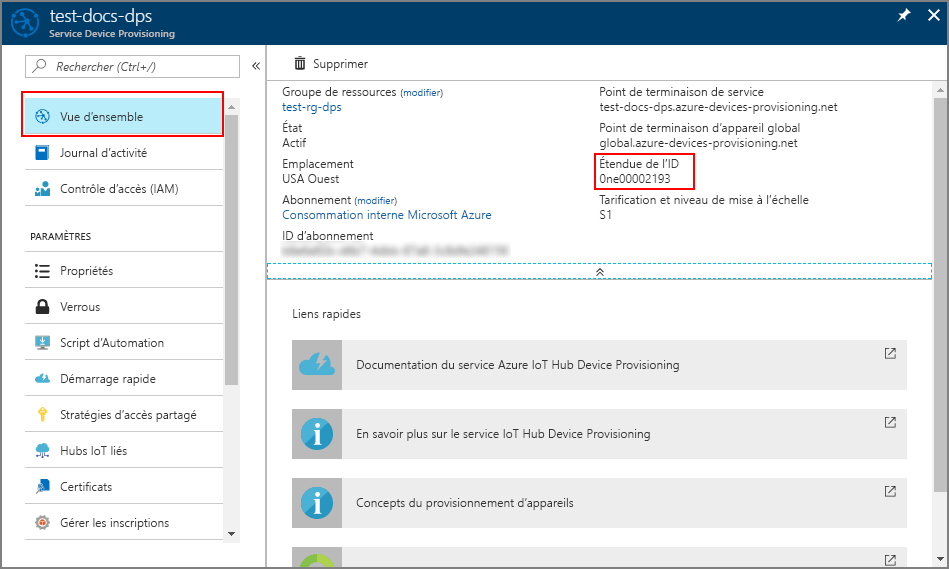
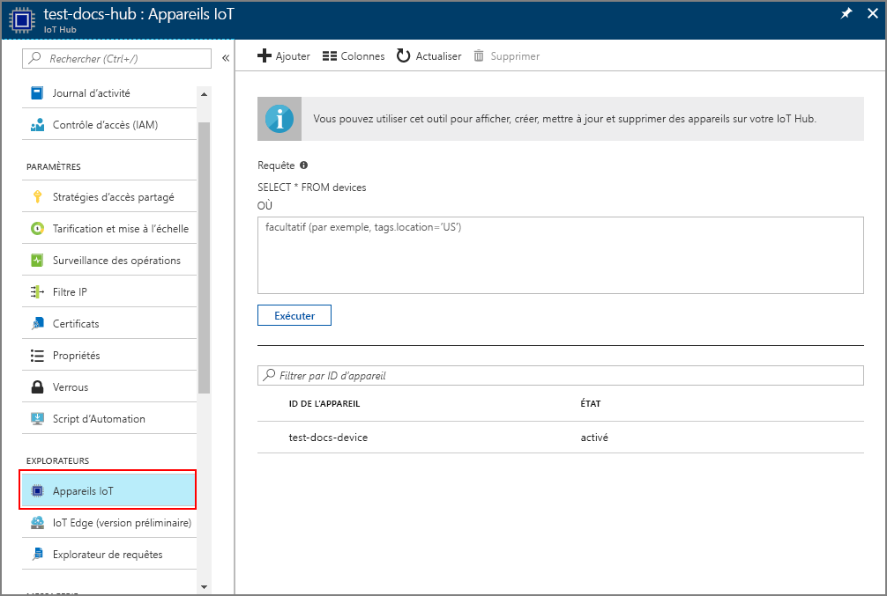

# <a name="quickstart-provision-a-simulated-tpm-device-using-the-azure-iot-c-sdk"></a>Démarrage rapide: Approvisionner un appareil TPM simulé à l’aide du kit de développement logiciel (SDK) C Azure IoT

[!INCLUDE [iot-dps-selector-quick-create-simulated-device-tpm](../../includes/iot-dps-selector-quick-create-simulated-device-tpm.md)]

Dans ce démarrage rapide, vous allez apprendre à créer et exécuter un simulateur d’appareil de module de plateforme sécurisée (TPM) sur une machine de développement Windows. Vous allez connecter cet appareil simulé à un hub IoT à l’aide d’une instance de service Device Provisioning. L’exemple de code du [kit de développement logiciel (SDK) C Azure IoT](https://github.com/Azure/azure-iot-sdk-c) sera utilisé pour inscrire l’appareil avec une instance de service Device Provisioning et simuler une séquence de démarrage de l’appareil.

Si vous ne connaissez pas le processus de provisionnement automatique, veuillez consulter la vue d’ensemble du [provisionnement](about-iot-dps.md#provisioning-process). Vérifiez également que vous avez suivi la procédure décrite dans [Configurer le service IoT Hub Device Provisioning avec le portail Azure](./quick-setup-auto-provision.md) avant de poursuivre ce démarrage rapide. 

Le service Azure IoT Device Provisioning prend en charge deux types d’inscriptions :
- [Groupes d’inscription](concepts-service.md#enrollment-group) : utilisés pour inscrire plusieurs appareils connexes.
- [Inscriptions individuelles](concepts-service.md#individual-enrollment) : utilisées pour inscrire un seul appareil.

Cet article présente les inscriptions individuelles.

[!INCLUDE [quickstarts-free-trial-note](../../includes/quickstarts-free-trial-note.md)]

## <a name="prerequisites"></a>Prérequis

Les prérequis suivants s’appliquent à un environnement de développement Windows. Pour Linux ou macOS, consultez la section appropriée de [Préparer votre environnement de développement](https://github.com/Azure/azure-iot-sdk-c/blob/master/doc/devbox_setup.md) dans la documentation du kit de développement logiciel (SDK).

* [Visual Studio](https://visualstudio.microsoft.com/vs/) 2019 avec la charge de travail [« Développement Desktop en C++ »](/cpp/ide/using-the-visual-studio-ide-for-cpp-desktop-development) activée. Visual Studio 2015 et Visual Studio 2017 sont également pris en charge.

* Dernière version de [Git](https://git-scm.com/download/) installée.

<a id="setupdevbox"></a>

## <a name="prepare-a-development-environment-for-the-azure-iot-c-sdk"></a>Préparer un environnement de développement pour le Kit de développement logiciel (SDK) Azure IoT pour C

Dans cette section, vous allez préparer un environnement de développement pour générer le [kit de développement logiciel (SDK) C Azure IoT](https://github.com/Azure/azure-iot-sdk-c) et l’exemple de simulateur d’appareil [TPM](/windows/device-security/tpm/trusted-platform-module-overview).

1. Téléchargez le [système de génération CMake](https://cmake.org/download/).

    Il est important que les composants requis Visual Studio (Visual Studio et la charge de travail « Développement Desktop en C++ ») soient installés sur votre machine, **avant** de commencer l’installation de l’élément `CMake`. Une fois les composants requis en place et le téléchargement effectué, installez le système de génération de CMake.

2. Recherchez le nom de balise de la [version la plus récente](https://github.com/Azure/azure-iot-sdk-c/releases/latest) du kit de développement logiciel (SDK).

3. Ouvrez une invite de commandes ou l’interpréteur de commandes Git Bash. Exécutez les commandes suivantes pour cloner la dernière version du dépôt GitHub du [Azure IoT C SDK](https://github.com/Azure/azure-iot-sdk-c). Utilisez l’étiquette obtenue à l’étape précédente comme valeur pour le paramètre `-b` :

    ```cmd/sh
    git clone -b <release-tag> https://github.com/Azure/azure-iot-sdk-c.git
    cd azure-iot-sdk-c
    git submodule update --init
    ```

    Attendez-vous à ce que cette opération prenne plusieurs minutes.

4. Créez un sous-répertoire `cmake` dans le répertoire racine du référentiel Git et accédez à ce dossier. Exécutez les commandes suivantes à partir du répertoire `azure-iot-sdk-c` :

    ```cmd/sh
    mkdir cmake
    cd cmake
    ```

## <a name="build-the-sdk-and-run-the-tpm-device-simulator"></a>Générer le kit de développement logiciel (SDK) et exécuter le simulateur d’appareil TPM

Dans cette section, vous allez générer le kit de développement logiciel (SDK) C Azure IoT, qui inclut l’exemple de code du simulateur d’appareil TPM. Cet exemple fournit un [mécanisme d’attestation](concepts-service.md#attestation-mechanism) TPM via l’authentification par jeton de signature d’accès partagé (SAP).

1. À partir du sous-répertoire `cmake` que vous avez créé dans le référentiel Git azure-iot-sdk-c, exécutez la commande suivante pour générer l’exemple. Une solution Visual Studio pour l’appareil simulé sera également générée par cette commande de génération.

    ```cmd/sh
    cmake -Duse_prov_client:BOOL=ON -Duse_tpm_simulator:BOOL=ON ..
    ```

    Si `cmake` ne trouve pas votre compilateur C++, vous obtiendrez peut-être des erreurs de build lors de l’exécution de la commande ci-dessus. Si cela se produit, essayez d’exécuter cette commande dans [l’invite de commandes de Visual Studio](/dotnet/framework/tools/developer-command-prompt-for-vs). 

    Une fois la génération terminée, les dernières lignes de sortie doivent ressembler à la sortie suivante :

    ```cmd/sh
    $ cmake -Duse_prov_client:BOOL=ON -Duse_tpm_simulator:BOOL=ON ..
    -- Building for: Visual Studio 15 2017
    -- Selecting Windows SDK version 10.0.16299.0 to target Windows 10.0.17134.
    -- The C compiler identification is MSVC 19.12.25835.0
    -- The CXX compiler identification is MSVC 19.12.25835.0

    ...

    -- Configuring done
    -- Generating done
    -- Build files have been written to: E:/IoT Testing/azure-iot-sdk-c/cmake
    ```

2. Accédez au dossier racine du référentiel Git que vous avez cloné, et exécutez le simulateur [TPM](/windows/device-security/tpm/trusted-platform-module-overview) à l’aide du chemin d’accès ci-dessous. Ce simulateur écoute un socket sur les ports 2321 et 2322. Ne fermez pas cette fenêtre de commande ; vous devez laisser ce simulateur s’exécuter jusqu’à la fin de ce démarrage rapide. 

   Si vous êtes dans le dossier *cmake*, exécutez les commandes suivantes :

    ```cmd/sh
    cd ..
    .\provisioning_client\deps\utpm\tools\tpm_simulator\Simulator.exe
    ```

    Vous ne verrez aucune sortie à partir du simulateur. Laissez le poursuivre l’exécution de la simulation d’un appareil TPM.

<a id="simulatetpm"></a>

## <a name="read-cryptographic-keys-from-the-tpm-device"></a>Lire les clés de chiffrement à partir de l’appareil TPM

Dans cette section, vous allez générer et exécuter un exemple qui lit la paire de clés de type EK et l’ID d’enregistrement du simulateur TPM qui continue d’être exécuté et écoute les ports 2321 et 2322. Ces valeurs seront utilisées pour l’inscription d’appareil avec votre instance de service Device Provisioning.

1. Lancez Visual Studio et ouvrez le nouveau fichier solution nommé `azure_iot_sdks.sln`. Ce fichier solution se trouve dans le dossier `cmake` que vous avez créé précédemment à la racine du référentiel Git azure-iot-sdk-c.

2. Dans le menu Visual Studio, sélectionnez **Génération** > **Générer la solution** pour générer tous les projets dans la solution.

3. Dans la fenêtre *Explorateur de solutions* de Visual Studio, accédez au dossier **Provision\_Tools**. Cliquez avec le bouton droit sur le projet **tpm_device_provision** et sélectionnez **Définir comme projet de démarrage**. 

4. Dans le menu Visual Studio, sélectionnez **Déboguer** > **Exécuter sans débogage** pour exécuter la solution. L’application lit et affiche un **_ID d’inscription_** et une **_paire de clés de type EK_**. Notez ou copiez ces valeurs. Ils seront utilisés dans la section suivante pour l’inscription d’appareil. 


<a id="portalenrollment"></a>

## <a name="create-a-device-enrollment-entry-in-the-portal"></a>Créer une entrée d’inscription d’appareil dans le portail

1. Connectez-vous au portail Azure, sélectionnez le bouton **Toutes les ressources** dans le menu de gauche et ouvrez votre service Device Provisioning.

1. Sélectionnez l’onglet **Gérer les inscriptions**, puis le bouton **Ajouter une inscription individuelle** dans la partie supérieure. 

1. Dans le volet **Ajouter une inscription**, entrez les informations suivantes :
   - Sélectionnez **TPM** comme *mécanisme* d’attestation d’identité.
   - Entrez l’*ID d’inscription* et la *paire de clés de type EK (Endorsement Key)* pour votre appareil TPM notés plus tôt.
   - Sélectionnez un hub IoT lié à votre service d’approvisionnement.
   - Si vous le souhaitez, vous pouvez fournir les informations suivantes :
       - Entrez un *ID d’appareil* unique (vous pouvez utiliser la suggestion **test-docs-device** ou fournir votre propre ID). Veillez à éviter les données sensibles lorsque vous affectez un nom à votre appareil. Si vous choisissez de ne pas en fournir un, l’ID d’inscription est utilisé à la place pour identifier l’appareil.
       - Mettez à jour l’**état du jumeau d’appareil initial** à l’aide de la configuration initiale de votre choix pour l’appareil.
   - Cela fait, appuyez sur le bouton **Enregistrer**. 

        

      Lorsque l’inscription aboutit, *l’ID d’inscription* de votre appareil s’affiche dans la liste sous l’onglet *Inscriptions individuelles*. 


<a id="firstbootsequence"></a>

## <a name="simulate-first-boot-sequence-for-the-device"></a>Simuler la première séquence de démarrage de l’appareil

Dans cette section, vous allez configurer des exemples de code pour utiliser le [protocole AMQP (Advance Message Queuing Protocol)](https://wikipedia.org/wiki/Advanced_Message_Queuing_Protocol) pour envoyer la séquence de démarrage de l’appareil à votre instance Device Provisioning. Cette séquence de démarrage entraîne la reconnaissance et l’affectation de l’appareil à un hub IoT lié à l’instance de service Device Provisioning.

1. Dans le portail Azure, sélectionnez l’onglet **Vue d’ensemble** de votre service Device Provisioning et copiez la valeur **_Étendue de l’ID_**.

     

2. Dans la fenêtre *Explorateur de solutions* de Visual Studio, accédez au dossier **Provision\_Samples**. Développez l’exemple de projet nommé **prov\_dev\_client\_sample**. Développez **Fichiers sources**, puis ouvrez **prov\_dev\_client\_sample.c**.

3. Au début du fichier, vous trouverez les instructions `#define` pour chaque protocole d’appareil comme indiqué ci-dessous. Assurez-vous que seulement `SAMPLE_AMQP` ne soit pas commenté.

    Actuellement, le [protocole MQTT n’est pas pris en charge pour l’inscription individuelle TPM](https://github.com/Azure/azure-iot-sdk-c#provisioning-client-sdk).

    ```c
    //
    // The protocol you wish to use should be uncommented
    //
    //#define SAMPLE_MQTT
    //#define SAMPLE_MQTT_OVER_WEBSOCKETS
    #define SAMPLE_AMQP
    //#define SAMPLE_AMQP_OVER_WEBSOCKETS
    //#define SAMPLE_HTTP
    ```

4. Recherchez la constante `id_scope` et remplacez la valeur par la valeur **Étendue de l’ID** que vous avez copiée précédemment. 

    ```c
    static const char* id_scope = "0ne00002193";
    ```

5. Recherchez la définition de la fonction `main()` dans le même fichier. Assurez-vous que la variable `hsm_type` est définie sur `SECURE_DEVICE_TYPE_TPM` au lieu de `SECURE_DEVICE_TYPE_X509` comme indiqué ci-dessous.

    ```c
    SECURE_DEVICE_TYPE hsm_type;
    hsm_type = SECURE_DEVICE_TYPE_TPM;
    //hsm_type = SECURE_DEVICE_TYPE_X509;
    ```

6. Cliquez avec le bouton droit sur le projet **prov\_dev\_client\_sample** et sélectionnez **Définir comme projet de démarrage**. 

7. Dans le menu Visual Studio, sélectionnez **Déboguer** > **Exécuter sans débogage** pour exécuter la solution. Dans l’invite pour régénérer le projet, sélectionnez **Oui** pour régénérer le projet avant de l’exécuter.

    La sortie suivante illustre un exemple d’approvisionnement d’un client d’appareil, son démarrage réussi, sa connexion à une instance de service Device Provisioning pour obtenir des informations sur le hub IoT et son inscription :

    ```cmd
    Provisioning API Version: 1.2.7
    Provisioning Status: PROV_DEVICE_REG_STATUS_CONNECTED

    Registering... Press enter key to interrupt.

    Provisioning Status: PROV_DEVICE_REG_STATUS_CONNECTED
    Provisioning Status: PROV_DEVICE_REG_STATUS_ASSIGNING
    Provisioning Status: PROV_DEVICE_REG_STATUS_ASSIGNING

    Registration Information received from service:
    test-docs-hub.azure-devices.net, deviceId: test-docs-device
    ```

8. Une fois l’appareil simulé provisionné auprès du hub IoT par votre service de provisionnement, l’ID de l’appareil s’affiche dans la section **Appareils IoT** du hub. 

     


## <a name="clean-up-resources"></a>Nettoyer les ressources

Si vous envisagez de manipuler et d’explorer davantage l’exemple de client d’appareil, ne nettoyez pas les ressources créées dans ce guide de démarrage rapide. Sinon, effectuez les étapes suivantes pour supprimer toutes les ressources créées par ce guide.

1. Fermez la fenêtre de sortie de l’exemple de client d’appareil sur votre machine.
2. Fermez la fenêtre du simulateur TPM sur votre machine.
3. Dans le menu de gauche du portail Azure, sélectionnez **Toutes les ressources**, puis votre service Device Provisioning. Ouvrez **Gérer les inscriptions** pour votre service, puis sélectionnez l’onglet **Inscriptions individuelles**. Cochez la case à côté de l’*ID D’INSCRIPTION* de l’appareil que vous avez inscrit dans ce guide de démarrage rapide, puis appuyez sur le bouton **Supprimer** dans la partie supérieure du volet. 
4. À partir du menu de gauche, dans le portail Azure, sélectionnez **Toutes les ressources**, puis votre hub IoT. Ouvrez **Appareils IoT** pour votre hub, cochez la case en regard de l’*ID D’APPAREIL* de l’appareil que vous avez inscrit dans ce guide de démarrage rapide, puis appuyez sur le bouton **Supprimer** dans la partie supérieure du volet.

## <a name="next-steps"></a>Étapes suivantes

Dans ce guide de démarrage rapide, vous avez créé un appareil simulé TPM sur votre machine et l’avez provisionné dans votre hub IoT avec le service IoT Hub Device Provisioning. Pour apprendre à inscrire un appareil TPM programmatiquement, passez au guide de démarrage rapide correspondant. 

> [!div class="nextstepaction"]
> [Démarrage rapide Azure - Inscrire un appareil TPM auprès du service Azure IoT Hub Device Provisioning](quick-enroll-device-tpm-java.md)