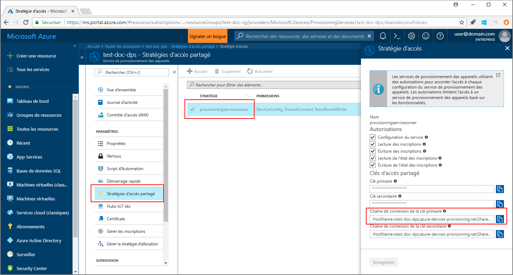
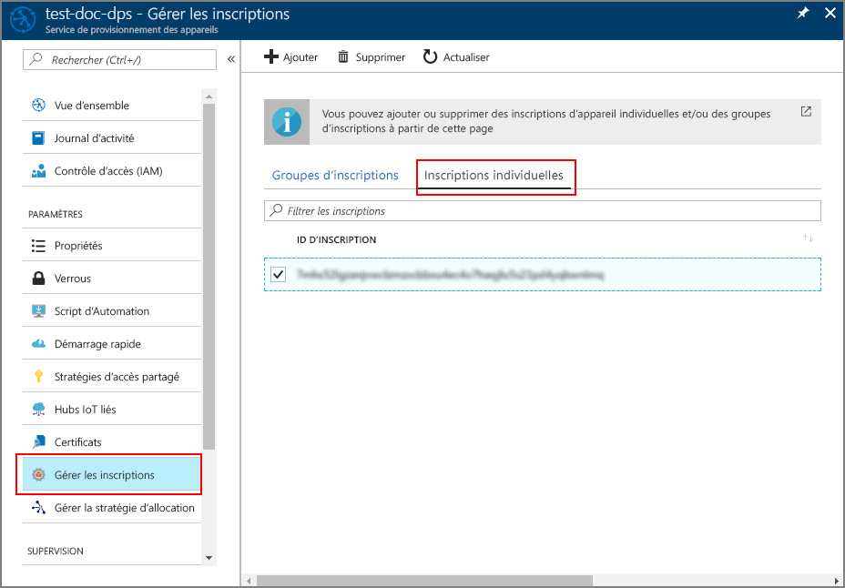

# <a name="quickstart-enroll-tpm-device-to-iot-hub-device-provisioning-service-using-java-service-sdk"></a>Démarrage rapide : Inscrire un appareil TPM auprès du service IoT Hub Device Provisioning à l’aide du kit Java Service SDK

[!INCLUDE [iot-dps-selector-quick-enroll-device-tpm](../../includes/iot-dps-selector-quick-enroll-device-tpm.md)]

Dans ce guide de démarrage rapide, vous allez créer programmatiquement une inscription individuelle pour un appareil TPM simulé dans le service Azure IoT Hub Device Provisioning en utilisant le kit Java Service SDK avec un exemple d’application Java.

## <a name="prerequisites"></a>Prérequis

- Exécution des étapes décrites dans [Configurer le service IoT Hub Device Provisioning avec le portail Azure](./quick-setup-auto-provision.md).
- Exécution des étapes décrites dans [Lire les clés de chiffrement à partir de l’appareil TPM](quick-create-simulated-device.md#simulatetpm).
- Compte Azure avec un abonnement actif. [Créez-en un gratuitement](https://azure.microsoft.com/free/?ref=microsoft.com&utm_source=microsoft.com&utm_medium=docs&utm_campaign=visualstudio).
- [Java SE Development Kit 8](/azure/developer/java/fundamentals/java-jdk-long-term-support). Ce guide de démarrage rapide installe le kit [Java Service SDK](https://azure.github.io/azure-iot-sdk-java/master/service/) ci-dessous. Il fonctionne à la fois sur Windows et Linux. Ce guide de démarrage rapide utilise Windows.
- [Maven 3](https://maven.apache.org/download.cgi).
- [Git](https://git-scm.com/download/).

<a id="setupdevbox"></a>

## <a name="prepare-the-development-environment"></a>Préparer l’environnement de développement 

1. Assurez-vous que le [Java SE Development Kit 8](/azure/developer/java/fundamentals/java-jdk-long-term-support) est bien installé sur votre ordinateur. 

2. Configurez les variables d’environnement pour votre installation Java. La variable `PATH` doit inclure le chemin d’accès complet au répertoire *jdk1.8.x\bin*. S’il s’agit de la première installation de Java sur cet ordinateur, vous devez alors créer une variable d’environnement nommée `JAVA_HOME` et la faire pointer vers le chemin complet du répertoire *jdk1.8.x*. Sur une machine Windows, ce répertoire se trouve dans le dossier *C:\\Program Files\\Java\\* . De plus, vous pouvez créer ou modifier les variables d’environnement en recherchant **Modifier les variables d’environnement du système** dans le **Panneau de configuration** de votre machine Windows. 

   Pour vérifier que Java est correctement configuré sur votre ordinateur, exécutez la commande suivante dans la fenêtre de commande :

    ```cmd\sh
    java -version
    ```

3. Téléchargez et extrayez [Maven 3](https://maven.apache.org/download.cgi) sur votre machine. 

4. Modifiez la variable d’environnement `PATH` et faites en sorte qu’elle pointe vers le sous-dossier *apache-maven-3.x.x\\bin* du dossier dans lequel Maven est extrait. Pour vérifier que Maven est correctement installé, exécutez la commande suivante dans la fenêtre de commande :

    ```cmd\sh
    mvn --version
    ```

5. Assurez-vous que l’élément [git](https://git-scm.com/download/) est installé sur votre ordinateur et qu’il est ajouté à la variable d’environnement `PATH`. 


<a id="javasample"></a>

## <a name="download-and-modify-the-java-sample-code"></a>Télécharger et modifier l’exemple de code Java

Cette section montre comment ajouter à l’exemple de code les détails de l’approvisionnement de votre appareil TPM. 

1. Ouvrez une invite de commandes. Clonez le dépôt GitHub pour l’exemple de code d’inscription de l’appareil à l’aide du kit [Java Service SDK](https://azure.github.io/azure-iot-sdk-java/master/service/) :
    
    ```cmd\sh
    git clone https://github.com/Azure/azure-iot-sdk-java.git --recursive
    ```

2. Dans le code source téléchargé, accédez au dossier d’exemples **_azure-iot-sdk-java/provisioning/provisioning-samples/service-enrollment-sample_** . Ouvrez le fichier **_/src/main/java/samples/com/microsoft/azure/sdk/iot/ServiceEnrollmentSample.java_** dans l’éditeur de votre choix, puis ajoutez les informations suivantes :

   1. Ajoutez `[Provisioning Connection String]` pour votre service d’approvisionnement. Pour cela, procédez comme suit depuis le portail :
       1. Accédez au service d’approvisionnement dans le [portail Azure](https://portal.azure.com). 
       2. Ouvrez les **Stratégies d’accès partagé**, puis sélectionnez une stratégie qui a pour autorisation *EnrollmentWrite*.
       3. Copiez la **chaîne de connexion de la clé primaire**. 

             

       4. Dans l’exemple de fichier de code **_ServiceEnrollmentSample.java_** , remplacez `[Provisioning Connection String]` par la **chaîne de connexion de clé primaire**.
    
           ```Java
           private static final String PROVISIONING_CONNECTION_STRING = "[Provisioning Connection String]";
           ```

   2. Ajoutez les détails de l’appareil TPM :
       1. Obtenez *l’ID d’inscription* et la *paire de clés de type EK du TPM* pour une simulation de l’appareil TPM. Reportez-vous pour cela aux étapes nécessaires pour accéder à la section [Simuler un appareil TPM](quick-create-simulated-device.md#simulatetpm).
       2. Utilisez **_l’ID d’inscription_** et la **_paire de clés de type EK_** provenant de la sortie de l’étape précédente, afin de remplacer `[RegistrationId]` et `[TPM Endorsement Key]` dans l’exemple de fichier de code **_ServiceEnrollmentSample.java_** :
        
           ```Java
           private static final String REGISTRATION_ID = "[RegistrationId]";
           private static final String TPM_ENDORSEMENT_KEY = "[TPM Endorsement Key]";
           ```

   3. Si vous le souhaitez, vous pouvez configurer le service d’approvisionnement via l’exemple de code :
      - Pour ajouter cette configuration à l’exemple, procédez comme suit :
        1. Accédez au hub IoT associé à votre service d’approvisionnement dans le [portail Azure](https://portal.azure.com). Ouvrez l’onglet **Vue d’ensemble** du hub, puis copiez le **nom d’hôte**. Assignez ce **nom d’hôte** au paramètre *IOTHUB_HOST_NAME*.
            ```Java
            private static final String IOTHUB_HOST_NAME = "[Host name].azure-devices.net";
            ```
        2. Attribuez un nom convivial au paramètre *DEVICE_ID*, puis maintenez *PROVISIONING_STATUS* sur la valeur par défaut *ENABLED*. 
    
      - OU, si vous choisissez de ne pas configurer votre service d’approvisionnement, veillez à ajouter un commentaire ou à supprimer les instructions suivantes dans le fichier _ServiceEnrollmentSample.java_ :
          ```Java
          // The following parameters are optional. Remove it if you don't need.
          individualEnrollment.setDeviceId(DEVICE_ID);
          individualEnrollment.setIotHubHostName(IOTHUB_HOST_NAME);
          individualEnrollment.setProvisioningStatus(PROVISIONING_STATUS);
          ```

   4. Étudiez l’exemple de code. Il crée, met à jour, interroge et supprime l’inscription d’un appareil TPM. Pour vérifier la validité de l’inscription sur le portail, commentez temporairement les lignes suivantes de code à la fin du fichier _ServiceEnrollmentSample.java_ :
    
       ```Java
       // *********************************** Delete info of individualEnrollment ************************************
       System.out.println("\nDelete the individualEnrollment...");
       provisioningServiceClient.deleteIndividualEnrollment(REGISTRATION_ID);
       ```

   5. Enregistrez le fichier _ServiceEnrollmentSample.java_.

<a id="runjavasample"></a>

## <a name="build-and-run-the-java-sample-code"></a>Générer et exécuter l’exemple de code Java

1. Ouvrez une fenêtre de commande, puis accédez au dossier **_azure-iot-sdk-java/provisioning/provisioning-samples/service-enrollment-sample_** .

2. Générez l’exemple de code à l’aide de cette commande :

    ```cmd\sh
    mvn install -DskipTests
    ```

   Cette commande télécharge le package Maven [`com.microsoft.azure.sdk.iot.provisioning.service`](https://www.mvnrepository.com/artifact/com.microsoft.azure.sdk.iot.provisioning/provisioning-service-client) sur l’ordinateur. Ce package inclut les fichiers binaires du kit [Java Service SDK](https://azure.github.io/azure-iot-sdk-java/master/service/) que l’exemple de code doit générer. 

3. Dans la fenêtre de commande, exécutez l’exemple à l’aide de ces commandes :

    ```cmd\sh
    cd target
    java -jar ./service-enrollment-sample-{version}-with-deps.jar
    ```

4. Observez la fenêtre de sortie pour savoir si l’inscription a abouti. 

5. Accédez au service d’approvisionnement dans le portail Azure. Sélectionnez **Gérer les inscriptions**, puis l’onglet **Inscriptions individuelles**. Notez que *l’ID d’inscription* de votre appareil TPM simulé est maintenant répertorié. 

      

## <a name="clean-up-resources"></a>Nettoyer les ressources
Si vous prévoyez d’explorer davantage l’exemple de service Java, ne nettoyez pas les ressources créées dans ce guide de démarrage rapide. Sinon, effectuez les étapes suivantes pour supprimer toutes les ressources créées par ce guide.

1. Fermez la fenêtre de sortie de l’exemple Java sur votre ordinateur.
1. Fermez la fenêtre du simulateur TPM que vous avez créée pour simuler l’appareil TPM.
1. Accédez au service Device Provisioning dans le portail Azure, sélectionnez **Gérer les inscriptions**, puis sélectionnez l’onglet **Inscriptions individuelles**. Cochez la case à côté de l’*ID d’inscription* correspondant à l’entrée d’inscription que vous avez créée à l’aide de ce guide de démarrage rapide, puis appuyez sur le bouton **Supprimer** dans la partie supérieure du volet.

## <a name="next-steps"></a>Étapes suivantes
Dans ce guide de démarrage rapide, vous avez inscrit un appareil TPM simulé auprès du service Device Provisioning. Pour en savoir plus sur l’approvisionnement de l’appareil en profondeur, référez-vous au didacticiel relatif à l’installation du service d’approvisionnement d’appareil dans le portail Azure. 

> [!div class="nextstepaction"]
> [Didacticiels relatifs au service d’approvisionnement d’appareil Azure IoT Hub](./tutorial-set-up-cloud.md)