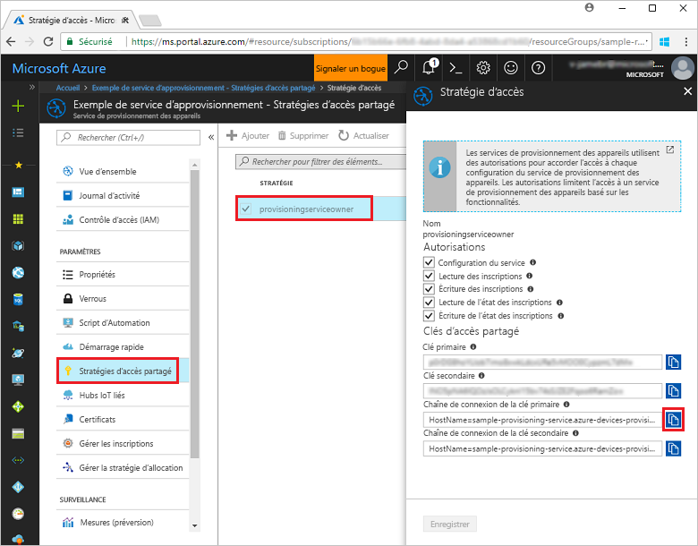

# <a name="quickstart-enroll-tpm-device-to-iot-hub-device-provisioning-service-using-nodejs-service-sdk"></a>Démarrage rapide : Inscrire un appareil TPM auprès du service IoT Hub Device Provisioning à l’aide du Node.js Service SDK

[!INCLUDE [iot-dps-selector-quick-enroll-device-tpm](../../includes/iot-dps-selector-quick-enroll-device-tpm.md)]

Dans ce guide de démarrage rapide, vous allez créer programmatiquement une inscription individuelle pour un appareil TPM auprès du service Azure IoT Hub Device Provisioning à l’aide du kit Node.js Service SDK et un exemple d’application Node.js. Vous pouvez éventuellement inscrire un appareil TPM simulé auprès du service d’approvisionnement à l’aide de cette entrée d’inscription individuelle.

## <a name="prerequisites"></a>Prérequis

- Exécution des étapes décrites dans [Configurer le service IoT Hub Device Provisioning avec le portail Azure](./quick-setup-auto-provision.md).
- Compte Azure avec un abonnement actif. [Créez-en un gratuitement](https://azure.microsoft.com/free/?ref=microsoft.com&utm_source=microsoft.com&utm_medium=docs&utm_campaign=visualstudio).
- [Node.js v4.0+](https://nodejs.org). Ce guide de démarrage rapide installe le kit [Node.js Service SDK](https://github.com/Azure/azure-iot-sdk-node) ci-dessous.
- Paire de clés de type EK (Endorsement Key) (facultatif). Suivez les étapes décrites dans [Créer et provisionner un appareil simulé](quick-create-simulated-device.md) jusqu’à ce que vous obteniez la clé. Ne créez pas une inscription individuelle à partir du portail Azure.

## <a name="create-the-individual-enrollment-sample"></a>Créer l’exemple d’inscription individuelle 

 
1. À partir d’une fenêtre de commande dans votre dossier de travail, exécutez :
  
    ```cmd\sh
    npm install azure-iot-provisioning-service
    ```  

2. À l’aide d’un éditeur de texte, créez un fichier **create_individual_enrollment.js** dans votre dossier de travail. Ajoutez le code suivant au fichier et enregistrez-le :

    ```
    'use strict';

    var provisioningServiceClient = require('azure-iot-provisioning-service').ProvisioningServiceClient;

    var serviceClient = provisioningServiceClient.fromConnectionString(process.argv[2]);
    var endorsementKey = process.argv[3];

    var enrollment = {
      registrationId: 'first',
      attestation: {
        type: 'tpm',
        tpm: {
          endorsementKey: endorsementKey
        }
      }
    };

    serviceClient.createOrUpdateIndividualEnrollment(enrollment, function(err, enrollmentResponse) {
      if (err) {
        console.log('error creating the individual enrollment: ' + err);
      } else {
        console.log("enrollment record returned: " + JSON.stringify(enrollmentResponse, null, 2));
      }
    });
    ```

## <a name="run-the-individual-enrollment-sample"></a>Exécuter l’exemple d’inscription individuelle
  
1. Pour exécuter cet exemple, vous avez besoin de la chaîne de connexion de votre service d’approvisionnement. 
    1. Connectez-vous au portail Azure, sélectionnez le bouton **Toutes les ressources** dans le menu de gauche et ouvrez votre service Device Provisioning. 
    2. Sélectionnez **Stratégies d’accès partagé**, puis la stratégie d’accès que vous voulez utiliser pour ouvrir ses propriétés. Dans la fenêtre **Stratégie d’accès**, copiez et notez la chaîne de connexion de la clé primaire. 

        


2. Vous avez également besoin de la paire de clés de type EK (Endorsement Key) pour votre appareil. Si vous avez suivi le démarrage rapide [Créer et configurer un appareil simulé](quick-create-simulated-device.md) pour créer un appareil TPM simulé, utilisez la clé créée pour cet appareil. Sinon, pour créer un exemple d’inscription individuelle, vous pouvez utiliser la paire de clés de type EK (Endorsement Key) suivante fournie avec le kit [Node.js Service SDK](https://github.com/Azure/azure-iot-sdk-node) :

    ```
    AToAAQALAAMAsgAgg3GXZ0SEs/gakMyNRqXXJP1S124GUgtk8qHaGzMUaaoABgCAAEMAEAgAAAAAAAEAxsj2gUScTk1UjuioeTlfGYZrrimExB+bScH75adUMRIi2UOMxG1kw4y+9RW/IVoMl4e620VxZad0ARX2gUqVjYO7KPVt3dyKhZS3dkcvfBisBhP1XH9B33VqHG9SHnbnQXdBUaCgKAfxome8UmBKfe+naTsE5fkvjb/do3/dD6l4sGBwFCnKRdln4XpM03zLpoHFao8zOwt8l/uP3qUIxmCYv9A7m69Ms+5/pCkTu/rK4mRDsfhZ0QLfbzVI6zQFOKF/rwsfBtFeWlWtcuJMKlXdD8TXWElTzgh7JS4qhFzreL0c1mI0GCj+Aws0usZh7dLIVPnlgZcBhgy1SSDQMQ==
    ```

3. Afin de créer une inscription individuelle pour votre appareil TPM, exécutez la commande suivante (sans oublier les guillemets autour des arguments de commande) :
 
     ```cmd\sh
     node create_individual_enrollment.js "<the connection string for your provisioning service>" "<endorsement key>"
     ```
 
3. Une fois la création terminée, la fenêtre de commande affiche les propriétés de la nouvelle inscription individuelle.

     

4. Vérifiez qu’une inscription individuelle a été créée. Dans le panneau de résumé du service Device Provisioning du portail Azure, sélectionnez **Gérer les inscriptions**. Sélectionnez l’onglet **Inscriptions individuelles** et sélectionnez la nouvelle entrée d’inscription (*premier*) pour vérifier la paire de clés de type EK (Endorsement Key) et d’autres propriétés de l’entrée.

     
 
Maintenant que vous avez créé une inscription individuelle pour un appareil TPM, si vous souhaitez inscrire un appareil simulé, vous pouvez effectuer les étapes restantes dans [Créer et configurer un appareil simulé](quick-create-simulated-device.md). Veillez à ignorer les étapes de création d’une inscription individuelle à l’aide du portail Azure dans ce guide de démarrage rapide.

## <a name="clean-up-resources"></a>Nettoyer les ressources
Si vous prévoyez d’explorer davantage les exemples de service Node.js, ne supprimez pas les ressources créées dans ce guide de démarrage rapide. Sinon, effectuez les étapes suivantes pour supprimer toutes les ressources créées par ce guide.

1. Fermez la fenêtre de sortie de l’exemple Node.js sur votre machine.
1. Si vous avez créé un appareil TPM simulé, fermez la fenêtre du simulateur TPM.
2. Accédez au service Device Provisioning dans le portail Azure, sélectionnez **Gérer les inscriptions**, puis sélectionnez l’onglet **Inscriptions individuelles**. Cochez la case à côté de l’*ID d’inscription* correspondant à l’entrée d’inscription que vous avez créée à l’aide de ce guide de démarrage rapide, puis appuyez sur le bouton **Supprimer** dans la partie supérieure du volet. 
 
## <a name="next-steps"></a>Étapes suivantes
Dans ce guide de démarrage rapide, vous avez créé programmatiquement une entrée d’inscription individuelle pour un appareil TPM, puis vous avez créé un appareil simulé TPM sur votre machine et l’avez provisionné auprès de votre hub IoT à l’aide du service Azure IoT Hub Device Provisioning. Pour en savoir plus sur l’approvisionnement de l’appareil en profondeur, référez-vous au didacticiel relatif à l’installation du service d’approvisionnement d’appareil dans le portail Azure. 
 
> [!div class="nextstepaction"]
> [Didacticiels relatifs au service d’approvisionnement d’appareil Azure IoT Hub](./tutorial-set-up-cloud.md)