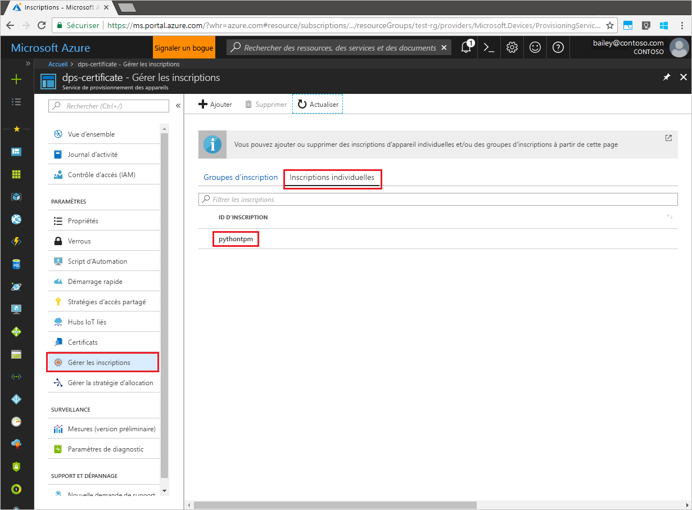

# <a name="quickstart-enroll-tpm-device-to-iot-hub-device-provisioning-service-using-python-provisioning-service-sdk"></a>Démarrage rapide : Inscrire un appareil TPM auprès du service IoT Hub Device Provisioning à l’aide du Kit de développement logiciel (SDK) du service d’approvisionnement en Python

[!INCLUDE [iot-dps-selector-quick-enroll-device-tpm](../../includes/iot-dps-selector-quick-enroll-device-tpm.md)]

Dans ce guide de démarrage rapide, vous allez créer programmatiquement une inscription individuelle pour un appareil TPM dans le service Azure IoT Hub Device Provisioning en utilisant le kit SDK du service de provisionnement Python avec un exemple d’application Python.

## <a name="prerequisites"></a>Prérequis

- Exécution des étapes décrites dans [Configurer le service IoT Hub Device Provisioning avec le portail Azure](./quick-setup-auto-provision.md).
- Compte Azure avec un abonnement actif. [Créez-en un gratuitement](https://azure.microsoft.com/free/?ref=microsoft.com&utm_source=microsoft.com&utm_medium=docs&utm_campaign=visualstudio).
- [Python 2.x ou 3.x](https://www.python.org/downloads/). Ce démarrage rapide installe le kit [SDK du service de provisionnement Python](https://github.com/Azure/azure-iot-sdk-python/tree/v1-deprecated/provisioning_service_client) ci-dessous.
- [Pip](https://pip.pypa.io/en/stable/installing/), s’il n’est pas fourni avec votre distribution de Python.
- Paire de clés de type EK (Endorsement Key). Utilisez les étapes décrites dans [Créer et provisionner un appareil simulé](quick-create-simulated-device.md) ou utilisez la clé de type EK fournie avec le kit SDK, décrite ci-dessous.

> [!IMPORTANT]
> Cet article s’applique uniquement au kit SDK Python V1 déprécié. Les clients d’appareil et de service pour le service IoT Hub Device Provisioning ne sont pas encore disponibles dans la V2. L’équipe travaille actuellement sur la parité des fonctionnalités pour la V2.

<a id="prepareenvironment"></a>

## <a name="prepare-the-environment"></a>Préparer l’environnement 

1. Téléchargez et installez [Python 2.x ou 3.x](https://www.python.org/downloads/). Veillez à utiliser l’installation 32 bits ou 64 bits comme requis par votre programme d’installation. Lorsque vous y êtes invité pendant l’installation, veillez à ajouter Python à votre variable d’environnement propre à la plateforme. 

1. Pour le kit [SDK du service de provisionnement Python](https://github.com/Azure/azure-iot-sdk-python/tree/v1-deprecated/provisioning_service_client), choisissez l’une des options suivantes :

    - Générer et compiler le **Kit de développement logiciel (SDK) Python Azure IoT**. Suivez [ces instructions](https://github.com/Azure/azure-iot-sdk-python/blob/v1-deprecated/doc/python-devbox-setup.md) pour générer les packages Python. Si vous utilisez le système d’exploitation Windows, installez également [Visual C++ Redistributable Package](https://support.microsoft.com/help/2977003/the-latest-supported-visual-c-downloads) pour autoriser l’utilisation de DLL natives de Python.

    - [Installer ou mettre à niveau *pip*, le système de gestion des packages Python](https://pip.pypa.io/en/stable/installing/) et installer le package via la commande suivante :

        ```cmd/sh
        pip install azure-iothub-provisioningserviceclient
        ```

1. Vous avez besoin de la paire de clés de type EK (Endorsement Key) de votre appareil. Si vous avez suivi le démarrage rapide [Créer et configurer un appareil simulé](quick-create-simulated-device.md) pour créer un appareil TPM simulé, utilisez la clé créée pour cet appareil. Sinon, vous pouvez utiliser la paire de clés de type EK (Endorsement Key) suivante fournie avec le Kit de développement logiciel (SDK) :

    ```
    AToAAQALAAMAsgAgg3GXZ0SEs/gakMyNRqXXJP1S124GUgtk8qHaGzMUaaoABgCAAEMAEAgAAAAAAAEAtW6MOyCu/Nih47atIIoZtlYkhLeCTiSrtRN3q6hqgOllA979No4BOcDWF90OyzJvjQknMfXS/Dx/IJIBnORgCg1YX/j4EEtO7Ase29Xd63HjvG8M94+u2XINu79rkTxeueqW7gPeRZQPnl1xYmqawYcyzJS6GKWKdoIdS+UWu6bJr58V3xwvOQI4NibXKD7htvz07jLItWTFhsWnTdZbJ7PnmfCa2vbRH/9pZIow+CcAL9mNTNNN4FdzYwapNVO+6SY/W4XU0Q+dLMCKYarqVNH5GzAWDfKT8nKzg69yQejJM8oeUWag/8odWOfbszA+iFjw3wVNrA5n8grUieRkPQ==
    ```


## <a name="modify-the-python-sample-code"></a>Modifier l’exemple de code Python

Cette section montre comment ajouter à l’exemple de code les détails de l’approvisionnement de votre appareil TPM. 

1. Dans un éditeur de texte, créez un fichier **TpmEnrollment.py**.

1. Ajoutez les variables et instructions `import` ci-dessous au début du fichier **TpmEnrollment.py**. Remplacez ensuite `dpsConnectionString` par la chaîne de connexion trouvée dans **Stratégies d’accès partagé** dans votre **Service Device Provisioning** sur le **portail Azure**. Remplacez `endorsementKey` par la valeur notée précédemment dans [Préparer l’environnement](quick-enroll-device-tpm-python.md#prepareenvironment). Pour finir, créez un ID `registrationid` unique et veillez à ce qu’il se compose uniquement de caractères alphanumériques minuscules et de traits d’union.  
   
    ```python
    from provisioningserviceclient import ProvisioningServiceClient
    from provisioningserviceclient.models import IndividualEnrollment, AttestationMechanism

    CONNECTION_STRING = "{dpsConnectionString}"

    ENDORSEMENT_KEY = "{endorsementKey}"

    REGISTRATION_ID = "{registrationid}"
    ```

1. Ajoutez la fonction et l’appel de fonction suivants pour implémenter la création de l’inscription du groupe :
   
    ```python
    def main():
        print ( "Starting individual enrollment..." )

        psc = ProvisioningServiceClient.create_from_connection_string(CONNECTION_STRING)

        att = AttestationMechanism.create_with_tpm(ENDORSEMENT_KEY)
        ie = IndividualEnrollment.create(REGISTRATION_ID, att)

        ie = psc.create_or_update(ie)
    
        print ( "Individual enrollment successful." )
    
    if __name__ == '__main__':
        main()
    ```

1. Enregistrez et fermez le fichier **TpmEnrollment.py**.
 

## <a name="run-the-sample-tpm-enrollment"></a>Exécuter l’exemple d’inscription de module TPM

1. Ouvrez une invite de commandes, puis exécutez le script.

    ```cmd/sh
    python TpmEnrollment.py
    ```

1. Observez la sortie pour vérifier si l’inscription a abouti.

1. Accédez au service d’approvisionnement dans le portail Azure. Sélectionnez **Gérer les inscriptions**. Notez que l’appareil TPM s’affiche dans l’onglet **Inscriptions individuelles**, sous le nom `registrationid` créé précédemment. 

      


## <a name="clean-up-resources"></a>Nettoyer les ressources
Si vous prévoyez d’explorer davantage l’exemple de service Java, ne nettoyez pas les ressources créées dans ce guide de démarrage rapide. Sinon, effectuez les étapes suivantes pour supprimer toutes les ressources créées par ce guide.

1. Fermez la fenêtre de sortie de l’exemple Python sur votre ordinateur.
1. Si vous avez créé un appareil TPM simulé, fermez la fenêtre du simulateur TPM.
1. Accédez au service Device Provisioning dans le portail Azure, sélectionnez **Gérer les inscriptions**, puis sélectionnez l’onglet **Inscriptions individuelles**. Cochez la case à côté de l’*ID d’inscription* correspondant à l’entrée d’inscription que vous avez créée à l’aide de ce guide de démarrage rapide, puis appuyez sur le bouton **Supprimer** dans la partie supérieure du volet.


## <a name="next-steps"></a>Étapes suivantes
Dans ce guide de démarrage rapide, vous avez créé programmatiquement une entrée d’inscription individuelle pour un appareil TPM, puis vous avez créé un appareil simulé TPM sur votre machine et l’avez provisionné auprès de votre hub IoT à l’aide du service Azure IoT Hub Device Provisioning. Pour en savoir plus sur l’approvisionnement de l’appareil en profondeur, référez-vous au didacticiel relatif à l’installation du service d’approvisionnement d’appareil dans le portail Azure.

> [!div class="nextstepaction"]
> [Didacticiels relatifs au service d’approvisionnement d’appareil Azure IoT Hub](./tutorial-set-up-cloud.md)
