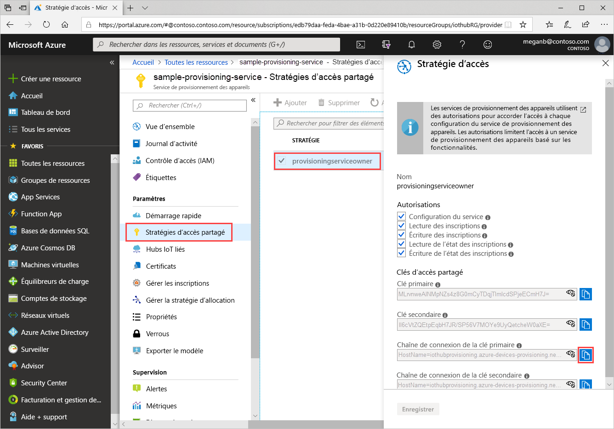
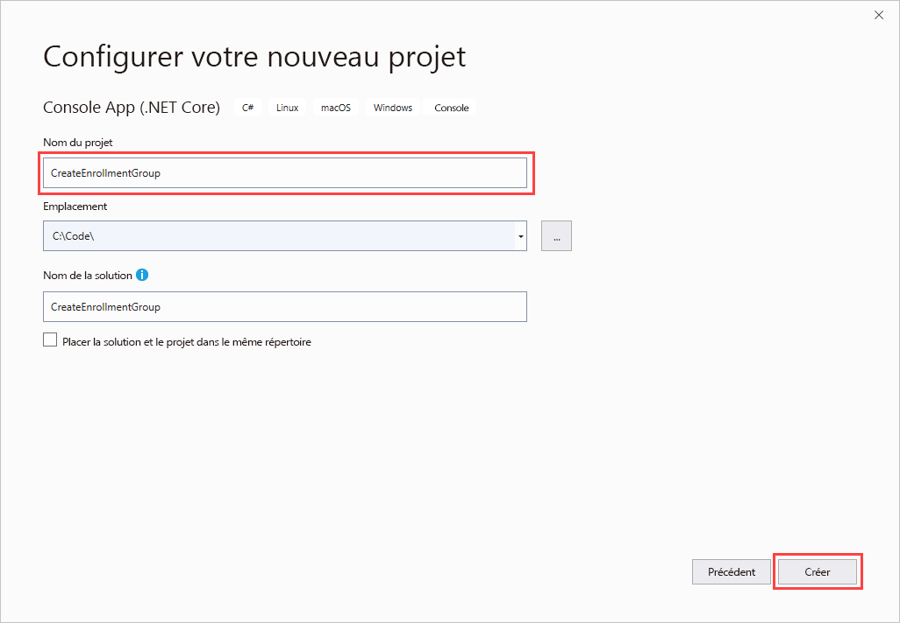
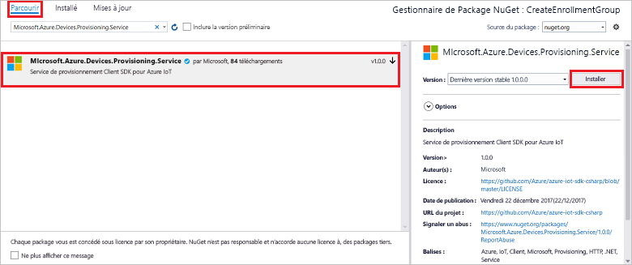
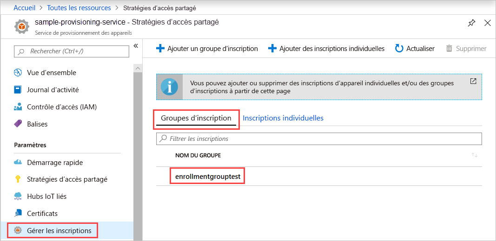

# <a name="quickstart-enroll-x509-devices-to-the-device-provisioning-service-using-c"></a>Démarrage rapide : inscrire des appareils X.509 auprès du service Device Provisioning à l’aide de C#

[!INCLUDE [iot-dps-selector-quick-enroll-device-x509](../../includes/iot-dps-selector-quick-enroll-device-x509.md)]

Ce démarrage rapide montre comment utiliser C# pour créer par programmation un [Groupe d’inscriptions](concepts-service.md#enrollment-group) qui utilise des certificats racine ou intermédiaire d’autorité de certification X.509. Le groupe d’inscription est créé avec le [SDK Microsoft Azure IoT pour .NET](https://github.com/Azure/azure-iot-sdk-csharp) et un exemple d’application C# .NET Core. Un groupe d’inscription contrôle l’accès au service d’approvisionnement pour les appareils qui partagent un certificat de signature commun dans leur chaîne de certificats. Pour en savoir plus, voir [Contrôle de l’accès des appareils au service de provisionnement avec des certificats X.509](./concepts-x509-attestation.md#controlling-device-access-to-the-provisioning-service-with-x509-certificates). Pour plus d’informations sur l’utilisation d’une infrastructure de clé publique (PKI) basée sur le certificat X.509 avec Azure IoT Hub et le service Device Provisioning, consultez [Vue d’ensemble d’un certificat d’autorité de certification X.509](../iot-hub/iot-hub-x509ca-overview.md). 

Ce guide de démarrage rapide suppose que vous avez déjà créé un hub IoT et une instance du service Device Provisioning. Si vous n’avez pas encore créé ces ressources, suivez le guide de démarrage rapide [Configurer le service IoT Hub Device Provisioning avec le portail Azure](./quick-setup-auto-provision.md) avant de continuer cet article.

Bien que les étapes de cet article fonctionnent à la fois sur des ordinateurs Windows et Linux, il utilise un ordinateur de développement Windows.

[!INCLUDE [quickstarts-free-trial-note](../../includes/quickstarts-free-trial-note.md)]

## <a name="prerequisites"></a>Conditions préalables requises

* Installez [Visual Studio 2019](https://www.visualstudio.com/vs/).
* Install [.NET Core SDK](https://www.microsoft.com/net/download/windows).
* Installez [Git](https://git-scm.com/download/).

## <a name="prepare-test-certificates"></a>Préparer les certificats de test

Pour ce démarrage rapide, vous devez disposer d’un fichier .pem ou d’un fichier .cer qui contient la partie publique d’un certificat racine ou intermédiaire d’autorité de certification X.509. Ce certificat doit être chargé vers votre service d’approvisionnement, puis vérifié par le service.

Le [SDK C Azure IoT](https://github.com/Azure/azure-iot-sdk-c) contient des outils de test qui peuvent vous aider à créer une chaîne de certificats X.509, à charger un certificat racine ou intermédiaire à partir de cette chaîne et à effectuer une preuve de possession avec le service pour vérifier le certificat.

> [!CAUTION]
> Utilisez les certificats créés avec les outils du SDK seulement pour le test de développements.
> N’utilisez pas ces certificats en production.
> Ils contiennent des mots de passe codés en dur, comme *1234*, qui expirent après 30 jours.
> Pour en savoir plus sur l’obtention de certificats appropriés pour la production, consultez [Guide pratique pour obtenir un certificat d’autorité de certification X.509](../iot-hub/iot-hub-x509ca-overview.md#how-to-get-an-x509-ca-certificate) dans la documentation Azure IoT Hub.
>

Pour utiliser ces outils de test pour générer des certificats, effectuez les étapes suivantes :

1. Recherchez le nom d’étiquette de la [version la plus récente](https://github.com/Azure/azure-iot-sdk-c/releases/latest) du SDK C Azure IoT.

2. Ouvrez une invite de commandes ou l’interpréteur de commandes Git Bash et changez pour un dossier de travail sur votre machine. Exécutez les commandes suivantes pour cloner la dernière version du dépôt GitHub du [SDK C Azure IoT](https://github.com/Azure/azure-iot-sdk-c). Utilisez l’étiquette obtenue à l’étape précédente comme valeur pour le paramètre `-b` :

    ```cmd/sh
    git clone -b <release-tag> https://github.com/Azure/azure-iot-sdk-c.git
    cd azure-iot-sdk-c
    git submodule update --init
    ```

    Attendez-vous à ce que cette opération prenne plusieurs minutes.

   Les outils de test se trouvent dans le dossier *azure-iot-sdk-c/tools/CACertificates* du référentiel que vous avez cloné.

3. Suivez les étapes dans [Gestion de certificats d’autorité de certification de test pour des exemples et tutoriels](https://github.com/Azure/azure-iot-sdk-c/blob/master/tools/CACertificates/CACertificateOverview.md).

En plus des outils du SDK C, l’[Exemple de vérification de certificat de groupe](https://github.com/Azure-Samples/azure-iot-samples-csharp/tree/master/provisioning/Samples/service/GroupCertificateVerificationSample) du *SDK Microsoft Azure IoT pour .NET* montre comment effectuer une preuve de possession en C# avec un certificat racine ou intermédiaire d’autorité de certification X.509 existant.

## <a name="get-the-connection-string-for-your-provisioning-service"></a>Obtenir la chaîne de connexion de votre service d’approvisionnement

Pour l’exemple de ce démarrage rapide, vous avez besoin de la chaîne de connexion de votre service d’approvisionnement.

1. Connectez-vous au portail Azure, sélectionnez **Toutes les ressources**, puis ouvrez votre service Device Provisioning.

1. Sélectionnez **Stratégies d’accès partagé**, puis choisissez la stratégie d’accès que vous voulez utiliser pour ouvrir ses propriétés. Dans **Stratégie d’accès**, copiez et enregistrez la chaîne de connexion de la clé principale.

    

## <a name="create-the-enrollment-group-sample"></a>Créer un exemple de groupe d’inscription 

Cette section montre comment créer une application console .NET Core qui ajoute un groupe d’inscription à votre service de provisionnement. Avec quelques modifications, vous pouvez également suivre ces étapes pour créer une application console [Windows IoT Core](https://developer.microsoft.com/en-us/windows/iot) pour ajouter le groupe d’inscription. Pour en savoir plus sur le développement avec IoT Core, consultez la [Documentation pour développeurs Windows IoT Core](/windows/iot-core/).

1. Ouvrez Visual Studio et sélectionnez **Créer un projet**. Dans **Créer un projet**, choisissez le modèle de projet **Application console (.NET Core)** pour C#, puis sélectionnez **Suivant**.

1. Nommez le projet *CreateEnrollmentGroup*, puis appuyez sur **Créer**.

    

1. Quand la solution s’ouvre dans Visual Studio, dans le volet **Explorateur de solutions**, cliquez avec le bouton droit sur le projet **CreateEnrollmentGroup**, puis sélectionnez **Gérer les packages NuGet**.

1. Dans le **Gestionnaire de package NuGet**, sélectionnez **Parcourir**, recherchez et choisissez **Microsoft.Azure.Devices.Provisioning.Service**, puis appuyez sur **Installer**.

    

   Cette étape télécharge, installe et ajoute une référence au package NuGet [Azure IoT Provisioning Service Client SDK](https://www.nuget.org/packages/Microsoft.Azure.Devices.Provisioning.Service/) et à ses dépendances.

1. Ajoutez les instructions `using` suivantes après les autres instructions `using` en haut de `Program.cs` :

   ```csharp
   using System.Security.Cryptography.X509Certificates;
   using System.Threading.Tasks;
   using Microsoft.Azure.Devices.Provisioning.Service;
   ```

1. Ajoutez les champs suivants à la classe `Program` et effectuez les modifications mentionnées.  

   ```csharp
   private static string ProvisioningConnectionString = "{ProvisioningServiceConnectionString}";
   private static string EnrollmentGroupId = "enrollmentgrouptest";
   private static string X509RootCertPath = @"{Path to a .cer or .pem file for a verified root CA or intermediate CA X.509 certificate}";
   ```

   * Remplacez la valeur de l’espace réservé `ProvisioningServiceConnectionString` par la chaîne de connexion du service de provisionnement pour lequel vous voulez créer l’inscription.

   * Remplacez la valeur de l’espace réservé `X509RootCertPath` par le chemin d’un fichier .pem ou .cer. Ce fichier représente la partie publique d’un certificat X.509 d’autorité de certification racine ou intermédiaire qui a été au préalable chargé et vérifié avec votre service de provisionnement.

   * Si vous le souhaitez, vous pouvez changer la valeur de `EnrollmentGroupId`. La chaîne peut contenir uniquement des minuscules et des traits d’union.

   > [!IMPORTANT]
   > Dans le code de production, gardez à l’esprit les considérations de sécurité suivantes :
   >
   > * Le fait de coder de manière irréversible la chaîne de connexion pour l’administrateur de service d’approvisionnement est contraire aux meilleures pratiques de sécurité. Au lieu de cela, la chaîne de connexion doit conservée de manière sécurisée, par exemple dans un fichier de configuration sécurisé ou dans le registre.
   > * Veillez à télécharger uniquement la partie publique du certificat de signature. Ne téléchargez jamais les fichiers .pfx (PKCS12) ou .pem contenant des clés privées vers le service d’approvisionnement.

1. Ajoutez la méthode suivante à la classe `Program`. Ce code crée une entrée de groupe d’inscription, puis appelle la méthode `CreateOrUpdateEnrollmentGroupAsync` sur `ProvisioningServiceClient` pour ajouter le groupe d’inscription au service de provisionnement.

   ```csharp
   public static async Task RunSample()
   {
       Console.WriteLine("Starting sample...");
 
       using (ProvisioningServiceClient provisioningServiceClient =
               ProvisioningServiceClient.CreateFromConnectionString(ProvisioningConnectionString))
       {
           #region Create a new enrollmentGroup config
           Console.WriteLine("\nCreating a new enrollmentGroup...");
           var certificate = new X509Certificate2(X509RootCertPath);
           Attestation attestation = X509Attestation.CreateFromRootCertificates(certificate);
           EnrollmentGroup enrollmentGroup =
                   new EnrollmentGroup(
                           EnrollmentGroupId,
                           attestation)
                   {
                       ProvisioningStatus = ProvisioningStatus.Enabled
                   };
           Console.WriteLine(enrollmentGroup);
           #endregion
 
           #region Create the enrollmentGroup
           Console.WriteLine("\nAdding new enrollmentGroup...");
           EnrollmentGroup enrollmentGroupResult =
               await provisioningServiceClient.CreateOrUpdateEnrollmentGroupAsync(enrollmentGroup).ConfigureAwait(false);
           Console.WriteLine("\nEnrollmentGroup created with success.");
           Console.WriteLine(enrollmentGroupResult);
           #endregion
 
       }
   }
   ```

1. Enfin, remplacez la méthode `Main` par les lignes suivantes :

   ```csharp
    static async Task Main(string[] args)
    {
        await RunSample();
        Console.WriteLine("\nHit <Enter> to exit ...");
        Console.ReadLine();
    }
   ```

1. Générez la solution.

## <a name="run-the-enrollment-group-sample"></a>Exécuter l’exemple de groupe d’inscription
  
Exécutez l’exemple dans Visual Studio pour créer le groupe d’inscription. Une fenêtre d’invite de commandes s’affiche et commence à afficher des messages de confirmation. Une fois la création terminée, la fenêtre d’invite de commandes affiche les propriétés du nouveau groupe d’inscription.

Vérifiez que le groupe d’inscription a bien été créé. Accédez au récapitulatif du service Device Provisioning et sélectionnez **Gérer les inscriptions**, puis sélectionnez **Groupes d’inscription**. Vous devez voir une nouvelle entrée d’inscription qui correspond à l’ID d’inscription que vous avez utilisé dans l’exemple.



Sélectionnez l’entrée pour vérifier l’empreinte du certificat et les autres propriétés de l’entrée.

## <a name="clean-up-resources"></a>Nettoyer les ressources

Si vous prévoyez d’explorer l’exemple de service C#, ne supprimez pas les ressources créées dans ce guide de démarrage rapide. Sinon, utilisez les étapes suivantes pour supprimer toutes les ressources créées par ce guide de démarrage rapide.

1. Fermez la fenêtre de sortie de l’exemple C# sur votre ordinateur.

1. Accédez à votre service Device Provisioning dans le portail Azure, sélectionnez **Gérer les inscriptions**, puis sélectionnez **Groupes d’inscription**. Sélectionnez l’*ID d’inscription* correspondant à l’entrée d’inscription que vous avez créée à l’aide de ce guide de démarrage rapide, puis appuyez sur **Supprimer**.

1. À partir de votre service Device Provisioning dans le portail Azure, sélectionnez **Certificats**, choisissez le certificat que vous avez chargé pour ce guide de démarrage rapide, puis appuyez sur **Supprimer** en haut de **Détails du certificat**.  

## <a name="next-steps"></a>Étapes suivantes

Dans ce guide de démarrage rapide, vous avez créé un groupe d’inscription pour un certificat X.509 d’autorité de certification racine ou intermédiaire avec le service Azure IoT Hub Device Provisioning. Pour en savoir plus sur l’approvisionnement de l’appareil en profondeur, référez-vous au didacticiel relatif à l’installation du service d’approvisionnement d’appareil dans le portail Azure.

> [!div class="nextstepaction"]
> [Didacticiels relatifs au service d’approvisionnement d’appareil Azure IoT Hub](./tutorial-set-up-cloud.md)