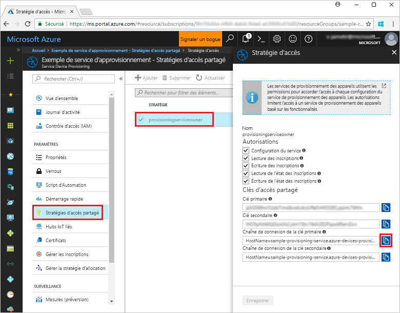
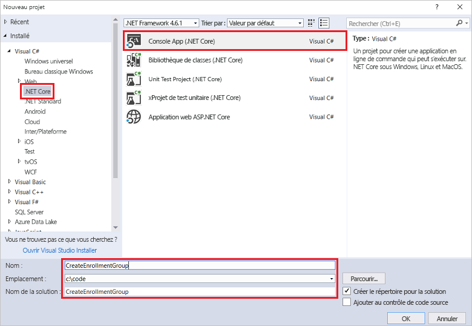
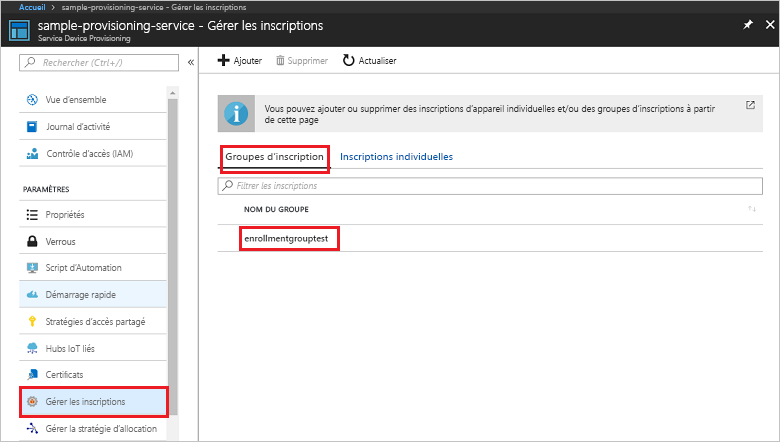

# <a name="quickstart-enroll-x509-devices-to-the-device-provisioning-service-using-c"></a>Démarrage rapide : inscrire des appareils X.509 auprès du service Device Provisioning à l’aide de C#

[!INCLUDE [iot-dps-selector-quick-enroll-device-x509](../../includes/iot-dps-selector-quick-enroll-device-x509.md)]


Ce démarrage rapide montre comment utiliser C# pour créer par programmation un [Groupe d’inscriptions](concepts-service.md#enrollment-group) qui utilise des certificats racine ou intermédiaire d’autorité de certification X.509. Le groupe d’inscriptions est créé à l’aide du [Kit de développement logiciel (SDK) Microsoft Azure IoT pour .NET](https://github.com/Azure/azure-iot-sdk-csharp) et d’un exemple d’application C# .NET Core. Un groupe d’inscription contrôle l’accès au service d’approvisionnement pour les appareils qui partagent un certificat de signature commun dans leur chaîne de certificats. Pour en savoir plus, voir [Contrôle de l’accès des appareils au service de provisionnement avec des certificats X.509](./concepts-security.md#controlling-device-access-to-the-provisioning-service-with-x509-certificates). Pour plus d’informations sur l’utilisation d’une infrastructure de clé publique (PKI) basée sur le certificat X.509 avec Azure IoT Hub et le service Device Provisioning, consultez [Vue d’ensemble d’un certificat d’autorité de certification X.509](https://docs.microsoft.com/azure/iot-hub/iot-hub-x509ca-overview). 

Ce démarrage rapide nécessite que vous ayez déjà créé un IoT Hub et une instance du service Device Provisioning. Si vous n’avez pas encore créé ces ressources, effectuez le démarrage rapide de la [Configuration du service IoT Hub Device Provisioning avec le portail Azure](./quick-setup-auto-provision.md) avant de poursuivre cet article.

Bien que les étapes de cet article fonctionnent à la fois sous Windows et Linux, cet article est développé pour une machiner de développement Windows.

[!INCLUDE [quickstarts-free-trial-note](../../includes/quickstarts-free-trial-note.md)]


## <a name="prerequisites"></a>Prérequis

* Installer [Visual Studio 2017](https://www.visualstudio.com/vs/).
* Installez le [Kit de développement logiciel (SDK) .NET Core](https://www.microsoft.com/net/download/windows).
* Installez [Git](https://git-scm.com/download/).


## <a name="prepare-test-certificates"></a>Préparer les certificats de test

Pour ce démarrage rapide, vous devez disposer d’un fichier .pem ou d’un fichier .cer qui contient la partie publique d’un certificat racine ou intermédiaire d’autorité de certification X.509. Ce certificat doit être chargé vers votre service d’approvisionnement, puis vérifié par le service. 

Le [Kit de développement logiciel (SDK) Azure IoT C](https://github.com/Azure/azure-iot-sdk-c) contient des outils de test qui peuvent vous aider à créer une chaîne de certificats X.509, à charger un certificat racine ou intermédiaire à partir de cette chaîne et à générer une preuve de possession avec le service afin de vérifier le certificat. Les certificats créés avec les outils du kit de développement logiciel (SDK) sont conçus pour être utilisés **uniquement pour le développement**. Ces certificats **ne doivent pas être utilisés dans la production**. Ils contiennent des mots de passe codés en dur (« 1234 ») qui expirent après 30 jours. Pour en savoir plus sur l’obtention de certificats appropriés pour la production, consultez [Guide pratique pour obtenir un certificat d’autorité de certification X.509](https://docs.microsoft.com/azure/iot-hub/iot-hub-x509ca-overview#how-to-get-an-x509-ca-certificate) dans la documentation Azure IoT Hub.

Pour utiliser ces outils de test pour générer des certificats, procédez comme suit : 
 
1. Ouvrez une invite de commandes ou l’interpréteur de commandes Git Bash et changez pour un dossier de travail sur votre machine. Exécutez la commande suivante pour cloner le référentiel GitHub du [Kit de développement logiciel (SDK) Azure IoT pour C](https://github.com/Azure/azure-iot-sdk-c) :
    
  ```cmd/sh
  git clone https://github.com/Azure/azure-iot-sdk-c.git --recursive
  ```

  Pour le moment, ce référentiel a une taille d’environ 220 Mo. Attendez-vous à ce que cette opération prenne plusieurs minutes.

  Les outils de test se trouvent dans le dossier *azure-iot-sdk-c/tools/CACertificates* du référentiel que vous avez cloné.    

2. Suivez les étapes dans [Gestion de certificats d’autorité de certification de test pour des exemples et tutoriels](https://github.com/Azure/azure-iot-sdk-c/blob/master/tools/CACertificates/CACertificateOverview.md). 

Outre les outils du Kit de développement logiciel (SDK) C, l’[Exemple de vérification de certificat de groupe](https://github.com/Azure/azure-iot-sdk-csharp/tree/master/provisioning/service/samples/GroupCertificateVerificationSample) dans le *Kit de développement logiciel (SDK) Microsoft Azure IoT pour .NET* montre comment effectuer une preuve de possession dans C# avec un certificat racine ou intermédiaire d’autorité de certification X.509 existant. 


## <a name="get-the-connection-string-for-your-provisioning-service"></a>Obtenir la chaîne de connexion de votre service d’approvisionnement

Pour l’exemple de ce démarrage rapide, vous avez besoin de la chaîne de connexion de votre service d’approvisionnement.
1. Connectez-vous au portail Azure, cliquez sur le bouton **Toutes les ressources** dans le menu de gauche et ouvrez votre service Device Provisioning. 
2. Cliquez sur **Stratégies d’accès partagé**, puis sur la stratégie d’accès que vous voulez utiliser pour ouvrir ses propriétés. Dans la fenêtre **Stratégie d’accès**, copiez et notez la chaîne de connexion de la clé primaire. 

    

## <a name="create-the-enrollment-group-sample"></a>Créer un exemple de groupe d’inscription 

Les étapes décrites dans cette section montrent comment créer une application console .NET Core qui ajoute un groupe d’inscription à votre service de configuration. Avec quelques modifications, vous pouvez également suivre ces étapes pour créer une application console [Windows IoT Core](https://developer.microsoft.com/en-us/windows/iot) pour ajouter le groupe d’inscription. Pour en savoir plus sur le développement avec IoT Core, consultez la [Documentation pour développeurs Windows IoT Core](https://docs.microsoft.com/windows/iot-core/).
1. Dans Visual Studio, ajoutez un projet Visual Application console .NET Core C# à une nouvelle solution en utilisant le modèle de projet **Application console (.NET Core)**. Assurez-vous que la version du .NET Framework est définie sur 4.5.1 ou supérieur. Nommez le projet **CreateEnrollmentGroup**.

    

2. Dans l’Explorateur de solutions, cliquez avec le bouton droit sur le projet **CreateEnrollmentGroup**, puis cliquez sur **Gérer les packages NuGet**.
3. Dans la fenêtre **Gestionnaire de package Nuget**, cliquez sur **Parcourir**, puis recherchez **Microsoft.Azure.Devices.Provisioning.Service**. Cliquez ensuite sur **Installer** pour installer le package **Microsoft.Azure.Devices.Provisioning.Service**, puis acceptez les conditions d’utilisation. Cette procédure télécharge, installe et ajoute une référence au package NuGet [Azure IoT Provisioning Service Client SDK](https://www.nuget.org/packages/Microsoft.Azure.Devices.Provisioning.Service/) à et ses dépendances.

    

4. Ajoutez les instructions `using` suivantes après les autres instructions `using`en haut du fichier **Program.cs** :
   
   ```csharp
   using System.Security.Cryptography.X509Certificates;
   using System.Threading.Tasks;
   using Microsoft.Azure.Devices.Provisioning.Service;
   ```
    
5. Ajoutez les champs suivants à la classe **Program** .  
   - Remplacez la valeur d’espace réservé **ProvisioningConnectionString** avec la chaîne de connexion du service d’approvisionnement pour lequel vous souhaitez créer l’inscription.
   - Remplacez la valeur d’espace réservé **X509RootCertPath** avec le chemin d’accès à un fichier .pem ou .cer qui représente la partie publique d’un certificat intermédiaire ou racine d’autorité de certification X.509 qui a été précédemment téléchargé et vérifié avec votre service d’approvisionnement.
   - Vous pouvez éventuellement modifier la valeur **EnrollmentGroupId**. La chaîne peut contenir uniquement des minuscules et des traits d’union. 

   > [!IMPORTANT]
   > Dans le code de production, gardez à l’esprit les considérations de sécurité suivantes :
   >
   > - Le fait de coder de manière irréversible la chaîne de connexion pour l’administrateur de service d’approvisionnement est contraire aux meilleures pratiques de sécurité. Au lieu de cela, la chaîne de connexion doit conservée de manière sécurisée, par exemple dans un fichier de configuration sécurisé ou dans le registre.
   > - Veillez à télécharger uniquement la partie publique du certificat de signature. Ne téléchargez jamais les fichiers .pfx (PKCS12) ou .pem contenant des clés privées vers le service d’approvisionnement.
        
   ```csharp
   private static string ProvisioningConnectionString = "{Your provisioning service connection string}";
   private static string EnrollmentGroupId = "enrollmentgrouptest";
   private static string X509RootCertPath = @"{Path to a .cer or .pem file for a verified root CA or intermediate CA X.509 certificate}";
   ```
    
6. Ajoutez la méthode suivante à la classe **Program**. Ce code crée une entrée de groupe d’inscription, puis appelle la méthode **CreateOrUpdateEnrollmentGroupAsync** sur le **ProvisioningServiceClient** pour ajouter le groupe d’inscription au service d’approvisionnement.
   
   ```csharp
   public static async Task RunSample()
   {
       Console.WriteLine("Starting sample...");
 
       using (ProvisioningServiceClient provisioningServiceClient =
               ProvisioningServiceClient.CreateFromConnectionString(ProvisioningConnectionString))
       {
           #region Create a new enrollmentGroup config
           Console.WriteLine("\nCreating a new enrollmentGroup...");
           var certificate = new X509Certificate2(X509RootCertPath);
           Attestation attestation = X509Attestation.CreateFromRootCertificates(certificate);
           EnrollmentGroup enrollmentGroup =
                   new EnrollmentGroup(
                           EnrollmentGroupId,
                           attestation)
                   {
                       ProvisioningStatus = ProvisioningStatus.Enabled
                   };
           Console.WriteLine(enrollmentGroup);
           #endregion
 
           #region Create the enrollmentGroup
           Console.WriteLine("\nAdding new enrollmentGroup...");
           EnrollmentGroup enrollmentGroupResult =
               await provisioningServiceClient.CreateOrUpdateEnrollmentGroupAsync(enrollmentGroup).ConfigureAwait(false);
           Console.WriteLine("\nEnrollmentGroup created with success.");
           Console.WriteLine(enrollmentGroupResult);
           #endregion
 
       }
   }
   ```

7. Enfin, remplacez le corps de la méthode **Main** par les lignes suivantes :
   
   ```csharp
   RunSample().GetAwaiter().GetResult();
   Console.WriteLine("\nHit <Enter> to exit ...");
   Console.ReadLine();
   ```
        
8. Générez la solution.

## <a name="run-the-enrollment-group-sample"></a>Exécuter l’exemple de groupe d’inscription
  
1. Exécutez l’exemple dans Visual Studio pour créer le groupe d’inscription.
 
2. Une fois la création terminée, la fenêtre de commande affiche les propriétés du nouveau groupe d’inscription.

    

3. Pour vérifier la création du groupe d’inscription, dans le panneau de résumé du service Device Provisioning au sein du portail Azure, sélectionnez **Gérer les inscriptions**, puis sélectionnez l’onglet **Groupes d’inscription**. Vous devez voir une nouvelle entrée d’inscription qui correspond à l’ID d’inscription que vous avez utilisé dans l’exemple. Cliquez sur l’entrée pour vérifier l’empreinte de certificat et d’autres propriétés.

    
 
## <a name="clean-up-resources"></a>Supprimer des ressources
Si vous prévoyez d’aller plus loin dans l’étude de l’exemple de service C#, ne supprimez pas les ressources créées dans ce démarrage rapide. Sinon, procédez aux étapes suivantes pour supprimer toutes les ressources créées lors de ce démarrage rapide.

1. Fermez la fenêtre de sortie de l’exemple C# sur votre ordinateur.
2. Accédez à votre service Device Provisioning dans le portail Azure, cliquez sur **Gérer les inscriptions**, puis sélectionnez l’onglet **Groupes d’inscription**. Sélectionnez *l’ID d’inscription* correspondant à l’entrée d’inscription créée à l’aide de ce démarrage rapide, puis cliquez sur le bouton **Supprimer** dans la partie supérieure du panneau.  
3. À partir du service Device Provisioning dans le portail Azure, cliquez sur **Certificats**, sur le certificat que vous avez chargé pour ce démarrage rapide, puis sur le bouton **Supprimer** en haut de la fenêtre **Détails du certificat**.  
 
## <a name="next-steps"></a>Étapes suivantes
Dans ce démarrage rapide, vous avez créé un groupe d’inscription pour un certificat X.509 d’autorité de certification racine ou intermédiaire à l’aide du service Azure IoT Hub Device Provisioning. Pour en savoir plus sur l’approvisionnement de l’appareil en profondeur, référez-vous au didacticiel relatif à l’installation du service d’approvisionnement d’appareil dans le portail Azure. 
 
> [!div class="nextstepaction"]
> [Didacticiels relatifs au service d’approvisionnement d’appareil Azure IoT Hub](./tutorial-set-up-cloud.md)
