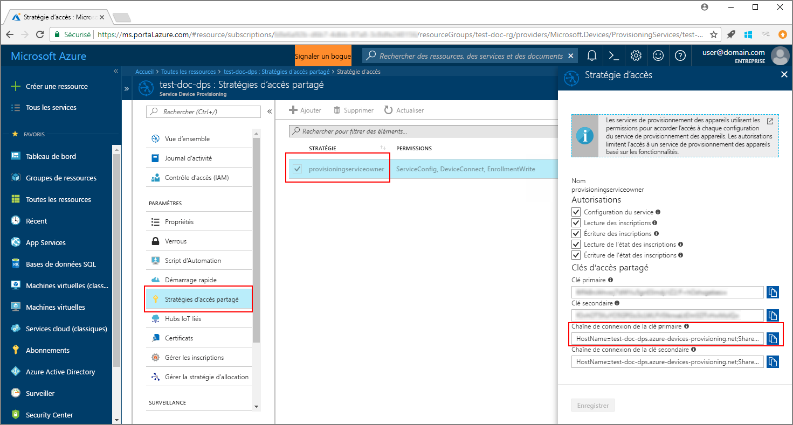
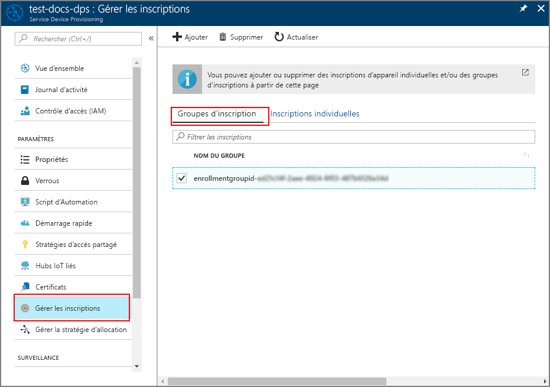

# <a name="quickstart-enroll-x509-devices-to-the-device-provisioning-service-using-java"></a>Démarrage rapide : Inscrire des appareils X.509 auprès du service Device Provisioning avec Java

[!INCLUDE [iot-dps-selector-quick-enroll-device-x509](../../includes/iot-dps-selector-quick-enroll-device-x509.md)]

Dans ce guide de démarrage rapide, vous allez utiliser Java pour inscrire programmatiquement un groupe d’appareils X.509 simulés auprès du service Azure IoT Hub Device Provisioning. Les appareils sont inscrits à une instance du service de provisionnement en créant un groupe d’inscriptions ou une inscription individuelle. Ce guide de démarrage rapide montre comment créer les deux types d’inscription à partir du kit Java Service SDK et d’un exemple d’application Java.

## <a name="prerequisites"></a>Prérequis

- Exécution des étapes décrites dans [Configurer le service IoT Hub Device Provisioning avec le portail Azure](./quick-setup-auto-provision.md).
- Compte Azure avec un abonnement actif. [Créez-en un gratuitement](https://azure.microsoft.com/free/?ref=microsoft.com&utm_source=microsoft.com&utm_medium=docs&utm_campaign=visualstudio).
- [Java SE Development Kit 8](/azure/developer/java/fundamentals/java-jdk-long-term-support). Ce guide de démarrage rapide installe le kit [Java Service SDK](https://azure.github.io/azure-iot-sdk-java/master/service/) ci-dessous. Il fonctionne à la fois sur Windows et Linux. Ce guide de démarrage rapide utilise Windows.
- [Maven 3](https://maven.apache.org/download.cgi).
- [Git](https://git-scm.com/download/).

<a id="javasample"></a>

## <a name="download-and-modify-the-java-sample-code"></a>Télécharger et modifier l’exemple de code Java

Cette section utilise un certificat X.509 auto-signé pour lequel il est important de garder à l’esprit les points suivants :

* Les certificats auto-signés sont destinés aux tests uniquement et ne doivent pas être utilisés en production.
* La date d’expiration par défaut d’un certificat auto-signé est d’un an.

Les étapes indiquées ci-dessous montrent comment ajouter les détails de l’approvisionnement de votre appareil X.509 à l’exemple de code. 

1. Ouvrez une invite de commandes. Clonez le dépôt GitHub pour l’exemple de code d’inscription d’appareil à l’aide du kit [Java Service SDK](https://azure.github.io/azure-iot-sdk-java/master/service/) :
    
    ```cmd\sh
    git clone https://github.com/Azure/azure-iot-sdk-java.git --recursive
    ```

2. Dans le code source téléchargé, accédez au dossier d’exemples **_azure-iot-sdk-java/provisioning/provisioning-samples/service-enrollment-group-sample_** . Ouvrez le fichier **_/src/main/java/samples/com/microsoft/azure/sdk/iot/ServiceEnrollmentGroupSample.java_** dans l’éditeur de votre choix, puis ajoutez les informations suivantes :

    1. Ajoutez `[Provisioning Connection String]` pour votre service d’approvisionnement. Pour cela, procédez comme suit depuis le portail :
        1. Accédez au service d’approvisionnement dans le [portail Azure](https://portal.azure.com). 
        2. Ouvrez les **Stratégies d’accès partagé**, puis sélectionnez une stratégie qui a pour autorisation *EnrollmentWrite*.
        3. Copiez la **chaîne de connexion de la clé primaire**. 

              

        4. Dans l’exemple de fichier de code **_ServiceEnrollmentGroupSample.java_** , remplacez `[Provisioning Connection String]` par la **chaîne de connexion de la clé primaire**.

            ```Java
            private static final String PROVISIONING_CONNECTION_STRING = "[Provisioning Connection String]";
            ```

    2. Ajoutez le certificat racine pour le groupe d’appareils. Si vous avez besoin d’un exemple de certificat racine, utilisez l’outil _Générateur de certificat X.509_ comme suit :
        1. Dans une fenêtre de commande, accédez au dossier **_azure-iot-sdk-java/provisioning/provisioning-tools/provisioning-x509-cert-generator_** .
        2. Compilez l’outil en exécutant la commande suivante :

            ```cmd\sh
            mvn clean install
            ```

        4. Exécutez l’outil en utilisant les commandes suivantes :

            ```cmd\sh
            cd target
            java -jar ./provisioning-x509-cert-generator-{version}-with-deps.jar
            ```

        5. Lorsque vous y êtes invité, vous pouvez également entrer un _nom commun_ pour vos certificats.
        6. L’outil génère localement un **certificat client**, la **clé privée du certificat client** et le **certificat racine**.
        7. Copiez le **certificat racine**, y compris les lignes **_---BEGIN CERTIFICATE---_** et **_---END CERTIFICATE---_** . 
        8. Attribuez la valeur du **certificat racine** au paramètre **PUBLIC_KEY_CERTIFICATE_STRING** comme indiqué ci-dessous :

            ```Java
            private static final String PUBLIC_KEY_CERTIFICATE_STRING =
            "-----BEGIN CERTIFICATE-----\n" +
            "XXXXXXXXXXXXXXXXXXXXXXXXXXXXXXXXXXXXXXXXXXXXXXXXXXXXXXXXXXXXXXXX\n" +
            "XXXXXXXXXXXXXXXXXXXXXXXXXXXXXXXXXXXXXXXXXXXXXXXXXXXXXXXXXXXXXXXX\n" +
            "XXXXXXXXXXXXXXXXXXXXXXXXXXXXXXXXXXXXXXXXXXXXXXXXXXXXXXXXXXXXXXXX\n" +
            "XXXXXXXXXXXXXXXXXXXXXXXXXXXXXXXXXXXXXXXXXXXXXXXXXXXXXXXXXXXXXXXX\n" +
            "XXXXXXXXXXXXXXXXXXXXXXXXXXXXXXXXXXXXXXXXXXXXXXXXXXXXXXXXXXXXXXXX\n" +
            "XXXXXXXXXXXXXXXXXXXXXXXXXXXXXXXXXXXXXXXXXXXXXXXXXXXXXXXXXXXXXXXX\n" +
            "XXXXXXXXXXXXXXXXXXXXXXXXXXXXXXXXXXXXXXXXXXXXXXXXXXXXXXXXXXXXXXXX\n" +
            "XXXXXXXXXXXXXXXXXXXXXXXXXXXXXXXXXXXXXXXXXXXXXXXXXXXXXXXXXXXXXXXX\n" +
            "XXXXXXXXXXXXXXXXXXXXXXXXXXXXXXXXXXXXXXXXXXXXXXXXXXXXXXXXXXXXXXXX\n" +
            "XXXXXXXXXXXXXXXXXXXXXXXXXXXXXXXXXXXXXXXXXXXXXXXXXXXXXXXXXXXXXXXX\n" +
            "-----END CERTIFICATE-----\n";
            ```

        9. Fermez la fenêtre de commande, ou saisissez **n** lorsque le *code de vérification* vous est demandé. 
 
    3. Si vous le souhaitez, vous pouvez configurer le service d’approvisionnement via l’exemple de code :
        - Pour ajouter cette configuration à l’exemple, procédez comme suit :
            1. Accédez au hub IoT associé à votre service d’approvisionnement dans le [portail Azure](https://portal.azure.com). Ouvrez l’onglet **Vue d’ensemble** du hub, puis copiez le **nom d’hôte**. Assignez ce **nom d’hôte** au paramètre *IOTHUB_HOST_NAME*.

                ```Java
                private static final String IOTHUB_HOST_NAME = "[Host name].azure-devices.net";
                ```
            2. Attribuez un nom convivial au paramètre *DEVICE_ID*, puis maintenez *PROVISIONING_STATUS* sur la valeur par défaut *ENABLED*. 

        - OU, si vous choisissez de ne pas configurer votre service d’approvisionnement, veillez à ajouter un commentaire ou à supprimer les instructions suivantes dans le fichier _ServiceEnrollmentGroupSample.java_ :

            ```Java
            enrollmentGroup.setIotHubHostName(IOTHUB_HOST_NAME);                // Optional parameter.
            enrollmentGroup.setProvisioningStatus(ProvisioningStatus.ENABLED);  // Optional parameter.
            ```

    4. Étudiez l’exemple de code. Il crée, met à jour, interroge et supprime une inscription d’un groupe d’appareils X.509. Pour vérifier la validité de l’inscription sur le portail, commentez temporairement les lignes suivantes de code à la fin du fichier _ServiceEnrollmentGroupSample.java_ :

        ```Java
        // ************************************** Delete info of enrollmentGroup ***************************************
        System.out.println("\nDelete the enrollmentGroup...");
        provisioningServiceClient.deleteEnrollmentGroup(enrollmentGroupId);
        ```

    5. Enregistrez le fichier _ServiceEnrollmentGroupSample.java_. 
 

<a id="runjavasample"></a>

## <a name="build-and-run-sample-group-enrollment"></a>Générer et exécuter un exemple d’inscription de groupe

Le service Azure IoT Device Provisioning prend en charge deux types d’inscriptions :

- [Groupes d’inscription](concepts-service.md#enrollment-group) : utilisés pour inscrire plusieurs appareils connexes.
- [Inscriptions individuelles](concepts-service.md#individual-enrollment) : utilisées pour inscrire un seul appareil.

Cette procédure utilise un groupe d’inscriptions. La section suivante utilise une inscription individuelle.

1. Ouvrez une fenêtre de commande, puis accédez au dossier **_azure-iot-sdk-java/provisioning/provisioning-samples/service-enrollment-group-sample_** .

2. Générez l’exemple de code à l’aide de cette commande :

    ```cmd\sh
    mvn install -DskipTests
    ```

   Cette commande télécharge le package Maven [`com.microsoft.azure.sdk.iot.provisioning.service`](https://mvnrepository.com/artifact/com.microsoft.azure.sdk.iot.provisioning/provisioning-service-client) sur l’ordinateur. Ce package inclut les fichiers binaires du Java Service SDK dont l’exemple de code a besoin. Si vous avez exécuté l’outil _Générateur de certificat X.509_ dans la section précédente, ce package est déjà téléchargé sur votre machine. 

3. Dans la fenêtre de commande, exécutez l’exemple à l’aide de ces commandes :

    ```cmd\sh
    cd target
    java -jar ./service-enrollment-group-sample-{version}-with-deps.jar
    ```

4. Observez la fenêtre de sortie pour savoir si l’inscription a abouti.

5. Accédez au service d’approvisionnement dans le portail Azure. Cliquez sur **Gérer les inscriptions**. Notez que le groupe d’appareils X.509 apparaît sous l’onglet **Groupes d’inscription**, avec un *NOM DE GROUPE* généré automatiquement. 

      

## <a name="modifications-to-enroll-a-single-x509-device"></a>Modifications pour inscrire un appareil X.509 unique

Pour inscrire un appareil X.509 unique, vous devez modifier l’exemple de code d’*inscription individuelle* utilisé dans [Inscrire un appareil TPM auprès du service Azure IoT Hub Device Provisioning à l’aide du Java Service SDK](quick-enroll-device-tpm-java.md#javasample) comme suit :

1. Copiez le *nom commun* de votre certificat client X.509 dans le presse-papiers. Si vous souhaitez utiliser l’outil _Générateur de certificat X.509_ comme indiqué dans la [section d’exemple de code précédente](#javasample), saisissez un _nom commun_ pour votre certificat, ou bien utilisez le **microsoftriotcore** par défaut. Utilisez ce **nom commun** comme valeur pour la variable *REGISTRATION_ID*. 

    ```Java
    // Use common name of your X.509 client certificate
    private static final String REGISTRATION_ID = "[RegistrationId]";
    ```

2. Renommez la variable *TPM_ENDORSEMENT_KEY* en *PUBLIC_KEY_CERTIFICATE_STRING*. Copiez votre certificat client ou le **Certificat Client** à partir de la sortie de l’outil _Générateur de certificat X.509_, en tant que valeur de la variable *PUBLIC_KEY_CERTIFICATE_STRING*. 

    ```Java
    // Rename the variable *TPM_ENDORSEMENT_KEY* as *PUBLIC_KEY_CERTIFICATE_STRING*
    private static final String PUBLIC_KEY_CERTIFICATE_STRING =
            "-----BEGIN CERTIFICATE-----\n" +
            "XXXXXXXXXXXXXXXXXXXXXXXXXXXXXXXXXXXXXXXXXXXXXXXXXXXXXXXXXXXXXXXX\n" +
            "XXXXXXXXXXXXXXXXXXXXXXXXXXXXXXXXXXXXXXXXXXXXXXXXXXXXXXXXXXXXXXXX\n" +
            "XXXXXXXXXXXXXXXXXXXXXXXXXXXXXXXXXXXXXXXXXXXXXXXXXXXXXXXXXXXXXXXX\n" +
            "XXXXXXXXXXXXXXXXXXXXXXXXXXXXXXXXXXXXXXXXXXXXXXXXXXXXXXXXXXXXXXXX\n" +
            "XXXXXXXXXXXXXXXXXXXXXXXXXXXXXXXXXXXXXXXXXXXXXXXXXXXXXXXXXXXXXXXX\n" +
            "XXXXXXXXXXXXXXXXXXXXXXXXXXXXXXXXXXXXXXXXXXXXXXXXXXXXXXXXXXXXXXXX\n" +
            "XXXXXXXXXXXXXXXXXXXXXXXXXXXXXXXXXXXXXXXXXXXXXXXXXXXXXXXXXXXXXXXX\n" +
            "XXXXXXXXXXXXXXXXXXXXXXXXXXXXXXXXXXXXXXXXXXXXXXXXXXXXXXXXXXXXXXXX\n" +
            "XXXXXXXXXXXXXXXXXXXXXXXXXXXXXXXXXXXXXXXXXXXXXXXXXXXXXXXXXXXXXXXX\n" +
            "XXXXXXXXXXXXXXXXXXXXXXXXXXXXXXXXXXXXXXXXXXXXXXXXXXXXXXXXXXXXXXXX\n" +
            "-----END CERTIFICATE-----\n";
    ```
3. Dans la fonction **principale**, remplacez la ligne `Attestation attestation = new TpmAttestation(TPM_ENDORSEMENT_KEY);` avec les éléments suivants pour utiliser le certificat client X.509 :
    ```Java
    Attestation attestation = X509Attestation.createFromClientCertificates(PUBLIC_KEY_CERTIFICATE_STRING);
    ```

4. Enregistrez, générez et exécutez l’exemple de fichier d’*inscription individuelle*, à l’aide des étapes indiquées dans la section [Créer et exécuter l’exemple de code pour une inscription individuelle](quick-enroll-device-tpm-java.md#runjavasample).


## <a name="clean-up-resources"></a>Nettoyer les ressources
Si vous prévoyez d’explorer davantage l’exemple de service Java, ne nettoyez pas les ressources créées dans ce guide de démarrage rapide. Sinon, effectuez les étapes suivantes pour supprimer toutes les ressources créées par ce guide.

1. Fermez la fenêtre de sortie de l’exemple Java sur votre ordinateur.
1. Fermez la fenêtre _Générateur de certificat X509_ sur votre machine.
1. Accédez à votre service Device Provisioning dans le portail Azure, puis sélectionnez **Gérer les inscriptions** et l’onglet **Groupes d’inscription**. Cochez la case à côté du *NOM DU GROUPE* des appareils X.509 que vous avez inscrits à l’aide de ce guide de démarrage rapide, puis appuyez sur le bouton **Supprimer** dans la partie supérieure du volet.  

## <a name="next-steps"></a>Étapes suivantes
Dans ce guide de démarrage rapide, vous avez inscrit un groupe simulé d’appareils X.509 auprès du service Device Provisioning. Pour en savoir plus sur l’approvisionnement de l’appareil en profondeur, référez-vous au didacticiel relatif à l’installation du service d’approvisionnement d’appareil dans le portail Azure. 

> [!div class="nextstepaction"]
> [Didacticiels relatifs au service d’approvisionnement d’appareil Azure IoT Hub](./tutorial-set-up-cloud.md)