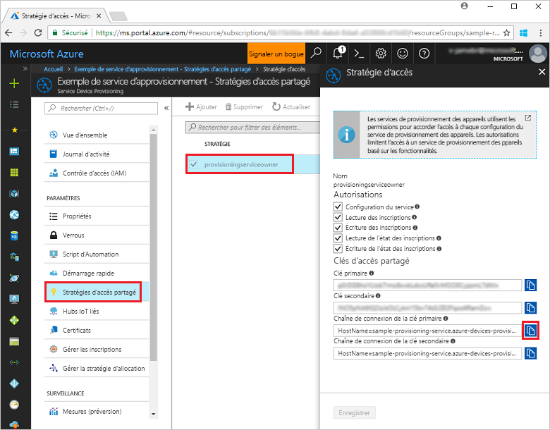
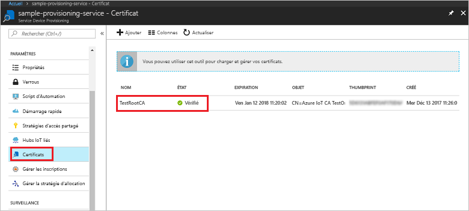
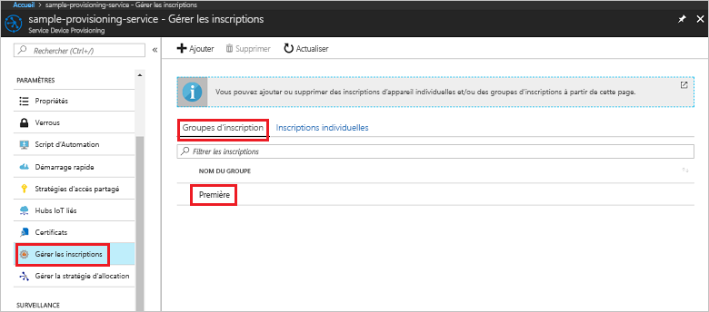

# <a name="quickstart-enroll-x509-devices-to-the-device-provisioning-service-using-nodejs"></a>Démarrage rapide : Inscrire des appareils X.509 auprès du service Device Provisioning avec Node.js

[!INCLUDE [iot-dps-selector-quick-enroll-device-x509](../../includes/iot-dps-selector-quick-enroll-device-x509.md)]

Ce démarrage rapide montre comment utiliser Node.js pour créer par programmation un [Groupe d’inscriptions](concepts-service.md#enrollment-group) qui utilise des certificats racine ou intermédiaire d’autorité de certification X.509. Le groupe d’inscriptions est créé à l’aide du [Kit de développement logiciel (SDK) IoT pour Node.js](https://github.com/Azure/azure-iot-sdk-node) et un exemple d’application Node.js. Un groupe d’inscription contrôle l’accès au service d’approvisionnement pour les appareils qui partagent un certificat de signature commun dans leur chaîne de certificats. Pour en savoir plus, voir [Contrôle de l’accès des appareils au service de provisionnement avec des certificats X.509](./concepts-security.md#controlling-device-access-to-the-provisioning-service-with-x509-certificates). Pour plus d’informations sur l’utilisation d’une infrastructure de clé publique (PKI) basée sur le certificat X.509 avec Azure IoT Hub et le service Device Provisioning, consultez [Vue d’ensemble d’un certificat d’autorité de certification X.509](https://docs.microsoft.com/azure/iot-hub/iot-hub-x509ca-overview). 

Ce démarrage rapide nécessite que vous ayez déjà créé un IoT Hub et une instance du service Device Provisioning. Si vous n’avez pas encore créé ces ressources, effectuez le démarrage rapide de la [Configuration du service IoT Hub Device Provisioning avec le portail Azure](./quick-setup-auto-provision.md) avant de poursuivre cet article.

Bien que les étapes de cet article fonctionnent à la fois sous Windows et Linux, cet article est développé pour une machiner de développement Windows.

[!INCLUDE [quickstarts-free-trial-note](../../includes/quickstarts-free-trial-note.md)]


## <a name="prerequisites"></a>Prérequis

- Installez [Node.js v4.0 ou une version ultérieure](https://nodejs.org).
- Installez [Git](https://git-scm.com/download/).


## <a name="prepare-test-certificates"></a>Préparer les certificats de test

Pour ce démarrage rapide, vous devez disposer d’un fichier .pem ou d’un fichier .cer qui contient la partie publique d’un certificat racine ou intermédiaire d’autorité de certification X.509. Ce certificat doit être chargé vers votre service d’approvisionnement, puis vérifié par le service. 

Le [Kit de développement logiciel (SDK) Azure IoT C](https://github.com/Azure/azure-iot-sdk-c) contient des outils de test qui peuvent vous aider à créer une chaîne de certificats X.509, à charger un certificat racine ou intermédiaire à partir de cette chaîne et à générer une preuve de possession avec le service afin de vérifier le certificat. Les certificats créés avec les outils du kit de développement logiciel (SDK) sont conçus pour être utilisés **uniquement pour le développement**. Ces certificats **ne doivent pas être utilisés dans la production**. Ils contiennent des mots de passe codés en dur (« 1234 ») qui expirent après 30 jours. Pour en savoir plus sur l’obtention de certificats appropriés pour la production, consultez [Guide pratique pour obtenir un certificat d’autorité de certification X.509](https://docs.microsoft.com/azure/iot-hub/iot-hub-x509ca-overview#how-to-get-an-x509-ca-certificate) dans la documentation Azure IoT Hub.

Pour utiliser ces outils de test pour générer des certificats, procédez comme suit : 
 
1. Ouvrez une invite de commandes ou l’interpréteur de commandes Git Bash et changez pour un dossier de travail sur votre machine. Exécutez la commande suivante pour cloner le référentiel GitHub du [Kit de développement logiciel (SDK) Azure IoT pour C](https://github.com/Azure/azure-iot-sdk-c) :
    
   ```cmd/sh
   git clone https://github.com/Azure/azure-iot-sdk-c.git --recursive
   ```

   Attendez-vous à ce que cette opération prenne plusieurs minutes.

   Les outils de test se trouvent dans le dossier *azure-iot-sdk-c/tools/CACertificates* du référentiel que vous avez cloné.    

2. Suivez les étapes dans [Gestion de certificats d’autorité de certification de test pour des exemples et tutoriels](https://github.com/Azure/azure-iot-sdk-c/blob/master/tools/CACertificates/CACertificateOverview.md). 


## <a name="create-the-enrollment-group-sample"></a>Créer un exemple de groupe d’inscription 

 
1. À partir d’une fenêtre de commande dans votre dossier de travail, exécutez :
  
     ```cmd\sh
     npm install azure-iot-provisioning-service
     ```  

2. À l’aide d’un éditeur de texte, créez un fichier **create_enrollment_group.js** dans votre dossier de travail. Ajoutez le code suivant au fichier et enregistrez-le :

    ```
    'use strict';
    var fs = require('fs');

    var provisioningServiceClient = require('azure-iot-provisioning-service').ProvisioningServiceClient;

    var serviceClient = provisioningServiceClient.fromConnectionString(process.argv[2]);

    var enrollment = {
      enrollmentGroupId: 'first',
      attestation: {
        type: 'x509',
        x509: {
          signingCertificates: {
            primary: {
              certificate: fs.readFileSync(process.argv[3], 'utf-8').toString()
            }
          }
        }
      },
      provisioningStatus: 'disabled'
    };

    serviceClient.createOrUpdateEnrollmentGroup(enrollment, function(err, enrollmentResponse) {
      if (err) {
        console.log('error creating the group enrollment: ' + err);
      } else {
        console.log("enrollment record returned: " + JSON.stringify(enrollmentResponse, null, 2));
        enrollmentResponse.provisioningStatus = 'enabled';
        serviceClient.createOrUpdateEnrollmentGroup(enrollmentResponse, function(err, enrollmentResponse) {
          if (err) {
            console.log('error updating the group enrollment: ' + err);
          } else {
            console.log("updated enrollment record returned: " + JSON.stringify(enrollmentResponse, null, 2));
          }
        });
      }
    });
    ```

## <a name="run-the-enrollment-group-sample"></a>Exécuter l’exemple de groupe d’inscription
 
1. Pour exécuter cet exemple, vous avez besoin de la chaîne de connexion de votre service d’approvisionnement. 
    1. Connectez-vous au portail Azure, sélectionnez le bouton **Toutes les ressources** dans le menu de gauche et ouvrez votre service Device Provisioning. 
    2. Cliquez sur **Stratégies d’accès partagé**, puis sélectionnez la stratégie d’accès que vous voulez utiliser pour ouvrir ses propriétés. Dans la fenêtre **Stratégie d’accès**, copiez et notez la chaîne de connexion de la clé primaire. 

        


3. Comme indiqué dans [Préparer les certificats de test](quick-enroll-device-x509-node.md#prepare-test-certificates), vous avez également besoin d’un fichier .pem qui contient un certificat racine ou intermédiaire d’autorité de certification X.509 qui a été au préalable chargé et vérifié avec votre service d’approvisionnement. Pour contrôler que votre certificat a bien été chargé et vérifié, accédez à la page de résumé du service Device Provisioning sur le portail Azure, puis sélectionnez **Certificats**. Recherchez le certificat que vous voulez utiliser pour l’inscription du groupe, puis validez que son état est bien *vérifié*.

     

1. Afin de créer un groupe d’inscription pour votre certificat, exécutez la commande suivante (sans oublier les guillemets autour des arguments de commande) :
 
     ```cmd\sh
     node create_enrollment_group.js "<the connection string for your provisioning service>" "<your certificate's .pem file>"
     ```
 
3. Une fois la création terminée, la fenêtre de commande affiche les propriétés du nouveau groupe d’inscription.

     

4. Vérifiez que le groupe d’inscription a bien été créé. Dans le panneau de résumé du service Device Provisioning du portail Azure, sélectionnez **Gérer les inscriptions**. Sélectionnez l’onglet **Groupes d’inscription**, puis vérifiez la présence de la nouvelle entrée d’inscription (*premier*).

     
 
## <a name="clean-up-resources"></a>Supprimer des ressources
Si vous prévoyez d’explorer davantage les exemples de service Node.js, ne supprimez pas les ressources créées dans ce guide de démarrage rapide. Sinon, effectuez les étapes suivantes pour supprimer toutes les ressources Azure créées par ce guide.
 
1. Fermez la fenêtre de sortie de l’exemple Node.js sur votre machine.
2. Accédez à votre service Device Provisioning dans le portail Azure, puis sélectionnez **Gérer les inscriptions** et l’onglet **Groupes d’inscription**. Cochez la case en regard du *NOM DU GROUPE* des appareils X.509 que vous avez inscrits à l’aide de ce guide de démarrage rapide, puis appuyez sur le bouton **Supprimer** dans la partie supérieure du volet.    
3. À partir du service Device Provisioning dans le portail Azure, sélectionnez **Certificats**, sélectionnez le certificat que vous avez chargé pour ce guide de démarrage rapide, puis appuyez sur le bouton **Supprimer** en haut de la fenêtre **Détails du certificat**.  
 
## <a name="next-steps"></a>Étapes suivantes
Dans ce guide de démarrage rapide, vous avez créé une inscription de groupe pour un certificat X.509 d’autorité de certification racine ou intermédiaire à l’aide du service Azure IoT Hub Device Provisioning. Pour en savoir plus sur l’approvisionnement de l’appareil en profondeur, référez-vous au didacticiel relatif à l’installation du service d’approvisionnement d’appareil dans le portail Azure. 
 
> [!div class="nextstepaction"]
> [Didacticiels relatifs au service d’approvisionnement d’appareil Azure IoT Hub](./tutorial-set-up-cloud.md)