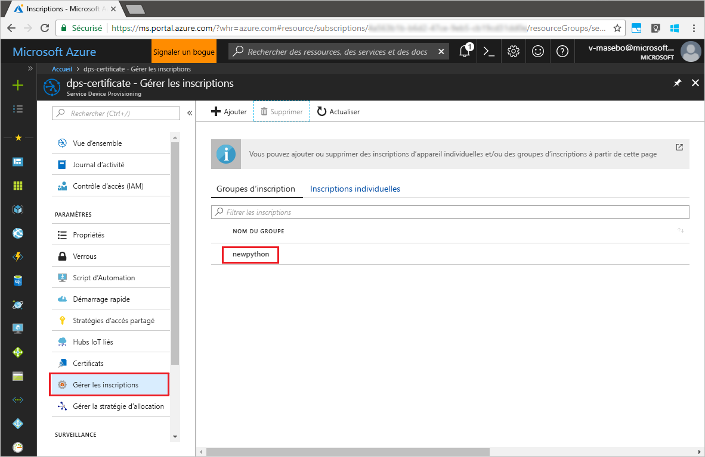

# <a name="quickstart-enroll-x509-devices-to-the-device-provisioning-service-using-python"></a>Démarrage rapide : Inscrire des appareils X.509 auprès du service Device Provisioning avec Python

[!INCLUDE [iot-dps-selector-quick-enroll-device-x509](../../includes/iot-dps-selector-quick-enroll-device-x509.md)]

Les appareils sont inscrits à une instance du service d’approvisionnement en créant un [Groupe d’inscriptions](concepts-service.md#enrollment-group), ou une [Inscription individuelle](concepts-service.md#individual-enrollment). Ce démarrage rapide montre comment utiliser Python pour créer par programmation un [Groupe d’inscriptions](concepts-service.md#enrollment-group) qui utilise des certificats racine ou intermédiaire d’autorité de certification X.509. Un groupe d’inscription contrôle l’accès au service d’approvisionnement pour les appareils qui partagent un certificat de signature commun dans leur chaîne de certificats. Le groupe d’inscriptions est créé à l’aide du [kit SDK du service de provisionnement Python V1](https://github.com/Azure/azure-iot-sdk-python/tree/v1-deprecated/provisioning_service_client) et d’un exemple d’application Python. La création d’inscriptions individuelles via le *Kit de développement logiciel (SDK) du service d’approvisionnement de Python* est encore en cours. Pour en savoir plus, voir [Contrôle de l’accès des appareils au service de provisionnement avec des certificats X.509](./concepts-security.md#controlling-device-access-to-the-provisioning-service-with-x509-certificates). Pour plus d’informations sur l’utilisation d’une infrastructure de clé publique (PKI) basée sur le certificat X.509 avec Azure IoT Hub et le service Device Provisioning, consultez [Vue d’ensemble d’un certificat d’autorité de certification X.509](https://docs.microsoft.com/azure/iot-hub/iot-hub-x509ca-overview).

> [!IMPORTANT]
> Cet article s’applique uniquement au kit SDK Python V1 déprécié. Les clients d’appareil et de service pour le service IoT Hub Device Provisioning ne sont pas encore disponibles dans la V2. L’équipe travaille actuellement sur la parité des fonctionnalités pour la V2.


Ce démarrage rapide nécessite que vous ayez déjà créé un IoT Hub et une instance du service Device Provisioning. Si vous n’avez pas encore créé ces ressources, effectuez le démarrage rapide de la [Configuration du service IoT Hub Device Provisioning avec le portail Azure](./quick-setup-auto-provision.md) avant de poursuivre cet article.

Bien que les étapes de cet article fonctionnent à la fois sous Windows et Linux, cet article est développé pour une machiner de développement Windows.

[!INCLUDE [quickstarts-free-trial-note](../../includes/quickstarts-free-trial-note.md)]

## <a name="prerequisites"></a>Conditions préalables requises

- Installer [Python 2.x ou 3.x](https://www.python.org/downloads/). Veillez à utiliser l’installation 32 bits ou 64 bits comme requis par votre programme d’installation. Lorsque vous y êtes invité pendant l’installation, veillez à ajouter Python à votre variable d’environnement propre à la plateforme.
- [Installez ou mettez à niveau *pip*, le système de gestion des packages Python](https://pip.pypa.io/en/stable/installing/).
- Installez [Git](https://git-scm.com/download/).

## <a name="prepare-test-certificates"></a>Préparer les certificats de test

Pour ce démarrage rapide, vous devez disposer d’un fichier .pem ou d’un fichier .cer qui contient la partie publique d’un certificat racine ou intermédiaire d’autorité de certification X.509. Ce certificat doit être chargé vers votre service d’approvisionnement, puis vérifié par le service. 

Le [Kit de développement logiciel (SDK) Azure IoT C](https://github.com/Azure/azure-iot-sdk-c) contient des outils de test qui peuvent vous aider à créer une chaîne de certificats X.509, à charger un certificat racine ou intermédiaire à partir de cette chaîne et à générer une preuve de possession avec le service afin de vérifier le certificat. Les certificats créés avec les outils du kit de développement logiciel (SDK) sont conçus pour être utilisés **uniquement pour le développement**. Ces certificats **ne doivent pas être utilisés dans la production**. Ils contiennent des mots de passe codés en dur (« 1234 ») qui expirent après 30 jours. Pour en savoir plus sur l’obtention de certificats appropriés pour la production, consultez [Guide pratique pour obtenir un certificat d’autorité de certification X.509](https://docs.microsoft.com/azure/iot-hub/iot-hub-x509ca-overview#how-to-get-an-x509-ca-certificate) dans la documentation Azure IoT Hub.

Pour utiliser ces outils de test pour générer des certificats, procédez comme suit :

1. Recherchez le nom d’étiquette de la [version la plus récente](https://github.com/Azure/azure-iot-sdk-c/releases/latest) du SDK C Azure IoT.

2. Ouvrez une invite de commandes ou l’interpréteur de commandes Git Bash et changez pour un dossier de travail sur votre machine. Exécutez les commandes suivantes pour cloner la dernière version du dépôt GitHub du [SDK C Azure IoT](https://github.com/Azure/azure-iot-sdk-c). Utilisez l’étiquette obtenue à l’étape précédente comme valeur pour le paramètre `-b` :

    ```cmd/sh
    git clone -b <release-tag> https://github.com/Azure/azure-iot-sdk-c.git
    cd azure-iot-sdk-c
    git submodule update --init
    ```

    Attendez-vous à ce que cette opération prenne plusieurs minutes.

   Les outils de test se trouvent dans le dossier *azure-iot-sdk-c/tools/CACertificates* du référentiel que vous avez cloné.

3. Suivez les étapes dans [Gestion de certificats d’autorité de certification de test pour des exemples et tutoriels](https://github.com/Azure/azure-iot-sdk-c/blob/master/tools/CACertificates/CACertificateOverview.md). 

## <a name="modify-the-python-sample-code"></a>Modifier l’exemple de code Python

Cette section montre comment ajouter les détails de l’approvisionnement de votre appareil X.509 à l’exemple de code. 

1. Dans un éditeur de texte, créez un fichier **EnrollmentGroup.py**.

1. Ajoutez les variables et instructions `import` ci-dessous au début du fichier **EnrollmentGroup.py**. Remplacez ensuite `dpsConnectionString` par la chaîne de connexion trouvée dans **Stratégies d’accès partagé** dans votre **Service Device Provisioning** sur le **portail Azure**. Remplacez l’espace réservé de certificat par le certificat créé précédemment dans [Préparer des certificats de test](quick-enroll-device-x509-python.md#prepare-test-certificates). Pour finir, créez un ID `registrationid` unique et veillez à ce qu’il se compose uniquement de caractères alphanumériques minuscules et de traits d’union.  
   
    ```python
    from provisioningserviceclient import ProvisioningServiceClient
    from provisioningserviceclient.models import EnrollmentGroup, AttestationMechanism

    CONNECTION_STRING = "{dpsConnectionString}"

    SIGNING_CERT = """-----BEGIN CERTIFICATE-----
    XXXXXXXXXXXXXXXXXXXXXXXXXXXXXXXXXXXXXXXXXXXXXXXXXXXXXXXXXXXXXXXX
    XXXXXXXXXXXXXXXXXXXXXXXXXXXXXXXXXXXXXXXXXXXXXXXXXXXXXXXXXXXXXXXX
    XXXXXXXXXXXXXXXXXXXXXXXXXXXXXXXXXXXXXXXXXXXXXXXXXXXXXXXXXXXXXXXX
    XXXXXXXXXXXXXXXXXXXXXXXXXXXXXXXXXXXXXXXXXXXXXXXXXXXXXXXXXXXXXXXX
    XXXXXXXXXXXXXXXXXXXXXXXXXXXXXXXXXXXXXXXXXXXXXXXXXXXXXXXXXXXXXXXX
    XXXXXXXXXXXXXXXXXXXXXXXXXXXXXXXXXXXXXXXXXXXXXXXXXXXXXXXXXXXXXXXX
    XXXXXXXXXXXXXXXXXXXXXXXXXXXXXXXXXXXXXXXXXXXXXXXXXXXXXXXXXXXXXXXX
    XXXXXXXXXXXXXXXXXXXXXXXXXXXXXXXXXXXXXXXXXXXXXXXXXXXXXXXXXXXXXXXX
    XXXXXXXXXXXXXXXXXXXXXXXXXXXXXXXXXXXXXXXXXXXXXXXXXXXXXXXXXXXXXXXX
    XXXXXXXXXXXXXXXXXXXXXXXXXXXXXXXXXXXXXXXXXXXXXXXXXXXXXXXXXXXXXXXX
    XXXXXXXXXXXXXXXXXXXXXXXXXXXXXXXXXXXXXXXXXXXXXXXXXXXXXXXXXXXXXXXX
    XXXXXXXXXXXXXXXXXXXXXXXXXXXXXXXXXXXXXXXXXXXXXXXXXXXXXXXXXXXXXXXX
    XXXXXXXXXXXXXXXXXXXXXXXXXXXXXXXXXXXXXXXXXXXXXXXXXXXXXXXXXXXXXXXX
    XXXXXXXXXXXXXXXXXXXXXXXXXXXXXXXXXXXXXXXXXXXXXXXXXXXXXXXXXXXXXXXX
    XXXXXXXXXXXXXXXXXXXXXXXXXXXXXXXXXXXXXXXXXXXXXXXXXXXXXXXX
    -----END CERTIFICATE-----"""

    GROUP_ID = "{registrationid}"
    ```

1. Ajoutez la fonction et l’appel de fonction suivants pour implémenter la création de l’inscription du groupe :
   
    ```python
    def main():
        print ( "Initiating enrollment group creation..." )

        psc = ProvisioningServiceClient.create_from_connection_string(CONNECTION_STRING)
        att = AttestationMechanism.create_with_x509_signing_certs(SIGNING_CERT)
        eg = EnrollmentGroup.create(GROUP_ID, att)

        eg = psc.create_or_update(eg)
    
        print ( "Enrollment group created." )

    if __name__ == '__main__':
        main()
    ```

1. Enregistrez et fermez le fichier **EnrollmentGroup.py**.
 

## <a name="run-the-sample-group-enrollment"></a>Exécuter l’exemple d’inscription de groupe

1. Ouvrez une invite de commandes et exécutez la commande suivante pour installer le client [azure-iot-approvisionnement-device-client](https://pypi.org/project/azure-iot-provisioning-device-client).

    ```cmd/sh
    pip install azure-iothub-provisioningserviceclient    
    ```

2. Dans l’invite de commandes, exécutez le script.

    ```cmd/sh
    python EnrollmentGroup.py
    ```

3. Observez la sortie pour vérifier si l’inscription a abouti.

4. Accédez au service d’approvisionnement dans le portail Azure. Cliquez sur **Gérer les inscriptions**. Notez que le groupe d’appareils X.509 apparaît dans l’onglet **Groupes d’inscription** sous le nom `registrationid` créé précédemment. 

      


## <a name="clean-up-resources"></a>Nettoyer les ressources
Si vous prévoyez d’explorer davantage l’exemple de service Java, ne nettoyez pas les ressources créées dans ce guide de démarrage rapide. Sinon, effectuez les étapes suivantes pour supprimer toutes les ressources créées par ce guide.

1. Fermez la fenêtre de sortie de l’exemple Java sur votre ordinateur.
1. Fermez la fenêtre _Générateur de certificat X509_ sur votre machine.
1. Accédez à votre service Device Provisioning dans le portail Azure, puis sélectionnez **Gérer les inscriptions** et l’onglet **Groupes d’inscription**. Cochez la case à côté du *NOM DU GROUPE* des appareils X.509 que vous avez inscrits à l’aide de ce guide de démarrage rapide, puis appuyez sur le bouton **Supprimer** dans la partie supérieure du volet.    


## <a name="next-steps"></a>Étapes suivantes
Dans ce guide de démarrage rapide, vous avez inscrit un groupe simulé d’appareils X.509 auprès du service Device Provisioning. Pour en savoir plus sur l’approvisionnement de l’appareil en profondeur, référez-vous au didacticiel relatif à l’installation du service d’approvisionnement d’appareil dans le portail Azure. 

> [!div class="nextstepaction"]
> [Didacticiels relatifs au service d’approvisionnement d’appareil Azure IoT Hub](./tutorial-set-up-cloud.md)
