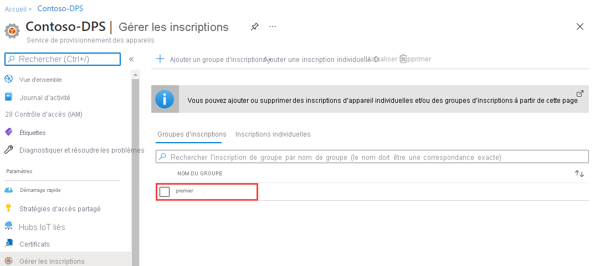

# <a name="quickstart-enroll-a-group-of-devices-to-the-device-provisioning-service-using-x509-certificate-attestation"></a>Démarrage rapide : Inscrire un groupe d’appareils auprès du service Device Provisioning à l’aide d’une attestation de certificat X.509 

:::zone pivot="programming-language-csharp,programming-language-nodejs, programming-language-python"

Ce guide de démarrage rapide vous montre comment créer par programmation un [groupe d’inscriptions](concepts-service.md#enrollment-group) qui utilise des certificats X.509 d’autorité de certification racine ou intermédiaire. Le groupe d’inscriptions est créé à l’aide du [SDK Microsoft Azure IoT](../iot-hub/iot-hub-devguide-sdks.md) et d’un exemple d’application. Un groupe d’inscription contrôle l’accès au service d’approvisionnement pour les appareils qui partagent un certificat de signature commun dans leur chaîne de certificats. Pour en savoir plus, voir [Contrôle de l’accès des appareils au service de provisionnement avec des certificats X.509](./concepts-x509-attestation.md#controlling-device-access-to-the-provisioning-service-with-x509-certificates). Pour plus d’informations sur l’utilisation d’une infrastructure de clé publique (PKI) basée sur le certificat X.509 avec Azure IoT Hub et le service Device Provisioning, consultez [Vue d’ensemble d’un certificat d’autorité de certification X.509](../iot-hub/iot-hub-x509ca-overview.md).

:::zone-end

:::zone pivot="programming-language-java"

Ce guide de démarrage rapide vous montre comment créer par programmation une inscription individuelle et un [groupe d’inscriptions](concepts-service.md#enrollment-group) qui utilise des certificats X.509 d’autorité de certification racine ou intermédiaire. Le groupe d’inscriptions est créé à l’aide du [SDK Microsoft Azure IoT](../iot-hub/iot-hub-devguide-sdks.md) et d’un exemple d’application. Un groupe d’inscription contrôle l’accès au service d’approvisionnement pour les appareils qui partagent un certificat de signature commun dans leur chaîne de certificats. Pour en savoir plus, voir [Contrôle de l’accès des appareils au service de provisionnement avec des certificats X.509](./concepts-x509-attestation.md#controlling-device-access-to-the-provisioning-service-with-x509-certificates). Pour plus d’informations sur l’utilisation d’une infrastructure de clé publique (PKI) basée sur le certificat X.509 avec Azure IoT Hub et le service Device Provisioning, consultez [Vue d’ensemble d’un certificat d’autorité de certification X.509](../iot-hub/iot-hub-x509ca-overview.md).

:::zone-end

## <a name="prerequisites"></a>Prérequis

* Si vous n’avez pas d’abonnement Azure, créez un [compte gratuit](https://azure.microsoft.com/free/?ref=microsoft.com&utm_source=microsoft.com&utm_medium=docs&utm_campaign=visualstudio) avant de commencer.

* Effectuez les étapes décrites dans [Configurer le service IoT Hub Device Provisioning avec le portail Azure](./quick-setup-auto-provision.md).

:::zone pivot="programming-language-csharp"

* Installez [Visual Studio 2019](https://www.visualstudio.com/vs/).

* Installez le [kit SDK .NET Core 3.1 ou une version ultérieure](https://dotnet.microsoft.com/download) sur votre machine Windows. Vous pouvez exécuter la commande suivante pour vérifier votre version.

    ```bash
    dotnet --info
    ```

:::zone-end

:::zone pivot="programming-language-nodejs"

* Installez [Node.js v4.0 ou une version ultérieure](https://nodejs.org) sur votre machine.

:::zone-end

:::zone pivot="programming-language-python"

* Installez [Python 2.x ou 3.x](https://www.python.org/downloads/) et ajoutez Python des variables d’environnement spécifiques à votre plateforme.

    > [!IMPORTANT]
    > Cet article s’applique uniquement au kit SDK Python V1 déprécié. Les clients d’appareil et de service pour le service IoT Hub Device Provisioning ne sont pas encore disponibles dans la V2. L’équipe travaille actuellement sur la parité des fonctionnalités pour la V2.

* Installez [Pip](https://pip.pypa.io/en/stable/installing/), s’il n’est pas déjà inclus dans votre distribution Python.

:::zone-end

:::zone pivot="programming-language-java"

* [Java SE Development Kit 8](/azure/developer/java/fundamentals/java-support-on-azure). Ce guide de démarrage rapide installe le kit [Java Service SDK](https://azure.github.io/azure-iot-sdk-java/master/service/) ci-dessous. Il fonctionne à la fois sur Windows et Linux. Ce guide de démarrage rapide utilise Windows.

* [Maven 3](https://maven.apache.org/download.cgi).

:::zone-end

* Installez la dernière version de [Git](https://git-scm.com/download/). Vérifiez que Git est ajouté aux variables d’environnement accessibles à la fenêtre de commande. Consultez [Outils clients Git de Software Freedom Conservancy](https://git-scm.com/download/) pour accéder à la dernière version des outils `git` à installer, ce qui inclut *Git Bash*, l’application en ligne de commande que vous pouvez utiliser pour interagir avec votre dépôt Git local.

>[!NOTE]
>Bien que les étapes de cet article fonctionnent à la fois sur des ordinateurs Windows et Linux, il utilise un ordinateur de développement Windows.

## <a name="prepare-test-certificates"></a>Préparer les certificats de test

Pour ce guide de démarrage rapide, vous devez disposer d’un fichier  *.pem* ou d’un fichier  *.cer* qui contient la partie publique d’un certificat X.509 d’autorité de certification racine ou intermédiaire. Ce certificat doit être chargé vers votre service d’approvisionnement, puis vérifié par le service.

:::zone pivot="programming-language-csharp,programming-language-nodejs, programming-language-python"

### <a name="clone-the-azure-iot-c-sdk"></a>Cloner le SDK C Azure IoT

Le [SDK C Azure IoT](https://github.com/Azure/azure-iot-sdk-c) contient des outils de test qui peuvent vous aider à créer une chaîne de certificats X.509, à charger un certificat racine ou intermédiaire à partir de cette chaîne et à effectuer une preuve de possession avec le service pour vérifier le certificat.

Si vous avez déjà cloné la dernière version du dépôt GitHub [SDK C Azure IoT](https://github.com/Azure/azure-iot-sdk-c), passez à la [section suivante](#create-the-test-certificate).

1. Ouvrez un navigateur web, puis accédez à la [page des versions du kit SDK C Azure IoT](https://github.com/Azure/azure-iot-sdk-c/releases/latest).

2. Copiez le nom d’étiquette de la version la plus récente du SDK C Azure IoT.

3. Ouvrez une invite de commandes ou l’interpréteur de commandes Git Bash. Exécutez les commandes suivantes pour cloner la dernière version du dépôt GitHub du [Azure IoT C SDK](https://github.com/Azure/azure-iot-sdk-c). (Remplacez `<release-tag>` par l’étiquette que vous avez copiée à l’étape précédente.)

    ```cmd/sh
    git clone -b <release-tag> https://github.com/Azure/azure-iot-sdk-c.git
    cd azure-iot-sdk-c
    git submodule update --init
    ```

    Cette opération peut prendre plusieurs minutes.

4. Les outils de test doivent maintenant se trouver dans le dossier *azure-iot-sdk-c/tools/CACertificates* du dépôt que vous avez cloné.

:::zone-end

:::zone pivot="programming-language-java"

<a id="javasample"></a>

### <a name="clone-the-azure-iot-java-sdk"></a>Cloner le SDK Java Azure IoT

Le [SDK Java Azure IoT](https://github.com/Azure/azure-iot-sdk-java) contient des outils de test qui peuvent vous aider à créer une chaîne de certificats X.509, à charger un certificat racine ou intermédiaire à partir de cette chaîne et à effectuer une preuve de possession avec le service pour vérifier le certificat.

1. Ouvrez une invite de commandes.

2. Clonez le dépôt GitHub pour l’exemple de code d’inscription d’appareil à l’aide du kit [Java Service SDK](https://azure.github.io/azure-iot-sdk-java/master/service/) :

    ```cmd\sh
    git clone https://github.com/Azure/azure-iot-sdk-java.git --recursive
    ```

:::zone-end

### <a name="create-the-test-certificate"></a>Créer le certificat de test

Pour créer le certificat de test :

:::zone pivot="programming-language-csharp,programming-language-nodejs, programming-language-python"

Pour créer le certificat, effectuez les étapes mentionnées dans [Gestion de certificats d’autorité de certification de test pour des exemples et tutoriels](https://github.com/Azure/azure-iot-sdk-c/blob/master/tools/CACertificates/CACertificateOverview.md).

>[!TIP]
>En plus des outils du SDK C, l’[Exemple de vérification de certificat de groupe](https://github.com/Azure-Samples/azure-iot-samples-csharp/tree/master/provisioning/Samples/service/GroupCertificateVerificationSample) du *SDK Microsoft Azure IoT pour .NET* montre comment effectuer une preuve de possession en C# avec un certificat racine ou intermédiaire d’autorité de certification X.509 existant.

:::zone-end

:::zone pivot="programming-language-java"

1. Dans une fenêtre de commande, accédez au dossier *_azure-iot-sdk-java/provisioning/provisioning-tools/provisioning-x509-cert-generator_*.

2. Pour générer l’outil, exécutez la commande suivante :

    ```cmd\sh
    mvn clean install
    ```

3. Pour exécuter l’outil, utilisez les commandes suivantes :

    ```cmd\sh
    cd target
    java -jar ./provisioning-x509-cert-generator-{version}-with-deps.jar
    ```

4. Lorsque vous y êtes invité, vous pouvez également entrer un _nom commun_ pour vos certificats.

5. L’outil génère localement un *certificat client*, la *clé privée du certificat client* et le *certificat racine*. Copiez le *certificat racine*, car vous en aurez besoin pour modifier l’exemple de code.

6. Fermez la fenêtre de commande, ou saisissez **n** lorsque le *code de vérification* vous est demandé.

:::zone-end

### <a name="add-and-verify-your-test-certificate"></a>Ajouter et vérifier votre certificat de test

Pour ajouter votre certificat au service Device Provisioning et le vérifier :

1. Une fois que vous avez créé les certificats, connectez-vous au [portail Azure](https://portal.azure.com).

2. Dans le menu de gauche ou dans la page du portail, sélectionnez **Toutes les ressources**.

3. Sélectionnez votre service Device Provisioning.

4. Dans le menu **Paramètres**, sélectionnez *Certificats*.

5. Dans le menu du haut, sélectionnez **+ Ajouter**.

6. Tapez un nom de certificat, puis chargez le fichier  *.pem* que vous avez créé dans la section précédente.

7. Sélectionnez **Définir l’état du certificat sur Vérifié lors du chargement**.

8. Sélectionnez **Enregistrer**.

:::image type="content" source="./media/quick-enroll-device-x509/add-certificate.png" alt-text="Ajouter un certificat à vérifier.":::

## <a name="get-the-connection-string-for-your-provisioning-service"></a>Obtenir la chaîne de connexion de votre service d’approvisionnement

Pour l’exemple de ce guide de démarrage rapide, vous devez copier la chaîne de connexion de votre service de provisionnement.

1. Connectez-vous au [portail Azure](https://portal.azure.com).

2. Dans le menu de gauche ou dans la page du portail, sélectionnez **Toutes les ressources**.

3. Sélectionnez votre service Device Provisioning.

4. Dans le menu **Paramètres**, sélectionnez **Stratégies d’accès partagées**.

5. Sélectionnez la stratégie d’accès que vous souhaitez utiliser.

6. Dans le panneau **Stratégie d’accès**, copiez et enregistrez la chaîne de connexion de la clé primaire.

    

## <a name="create-the-enrollment-group-sample"></a>Créer un exemple de groupe d’inscription

:::zone pivot="programming-language-csharp"

Cette section vous montre comment créer une application console .NET Core qui ajoute un groupe d’inscriptions à votre service de provisionnement.

>[!TIP]
>Vous pouvez, avec quelques modifications, effectuer ces étapes pour créer une application console [Windows IoT Core](https://developer.microsoft.com/en-us/windows/iot) qui ajoute un groupe d’inscriptions. Pour en savoir plus sur le développement avec IoT Core, consultez la [Documentation pour développeurs Windows IoT Core](/windows/iot-core/).

1. Ouvrez Visual Studio et sélectionnez **Créer un projet**.

2. Dans le panneau **Créer un projet**, sélectionnez **Application console*.

3. Sélectionnez **Suivant**.

4. Pour **Nom du projet**, tapez *CreateEnrollmentGroup*.

5. Sélectionnez **Suivant**. Conservez le **Framework cible** par défaut.

6. Sélectionnez **Create** (Créer).

7. Quand la solution s’ouvre, dans le volet **Explorateur de solutions**, cliquez avec le bouton droit sur le projet **CreateEnrollmentGroup**, puis sélectionnez **Gérer les packages NuGet**.

8. Dans le **Gestionnaire de package NuGet**, sélectionnez **Parcourir**.

9. Tapez et sélectionnez *Microsoft.Azure.Devices.Provisioning.Service*.

10. Sélectionnez **Installer**.

    

    Cette étape télécharge, installe et ajoute une référence au package NuGet [Azure IoT Provisioning Service Client SDK](https://www.nuget.org/packages/Microsoft.Azure.Devices.Provisioning.Service/) et à ses dépendances.

11. Ajoutez les instructions `using` suivantes après les autres instructions `using` en haut de `Program.cs` :

    ```csharp
    using System.Security.Cryptography.X509Certificates;
    using System.Threading.Tasks;
    using Microsoft.Azure.Devices.Provisioning.Service;
    ```

12. Ajoutez les champs suivants à la classe `Program` et effectuez les modifications mentionnées.  

    ```csharp
    private static string ProvisioningConnectionString = "{ProvisioningServiceConnectionString}";
    private static string EnrollmentGroupId = "enrollmentgrouptest";
    private static string X509RootCertPath = @"{Path to a .cer or .pem file for a verified root CA or intermediate CA X.509 certificate}";
    ```

13. Remplacez la valeur d’espace réservé `ProvisioningServiceConnectionString` par la chaîne de connexion du service de provisionnement que vous avez copiée dans la section précédente.

14. Remplacez la valeur de l’espace réservé `X509RootCertPath` par le chemin d’un fichier .pem ou .cer. Ce fichier représente la partie publique d’un certificat X.509 d’autorité de certification racine ou intermédiaire qui a été au préalable chargé et vérifié avec votre service de provisionnement.

15. Si vous le souhaitez, vous pouvez changer la valeur de `EnrollmentGroupId`. La chaîne peut contenir uniquement des minuscules et des traits d’union.

    > [!IMPORTANT]
    > Dans le code de production, gardez à l’esprit les considérations de sécurité suivantes :
    >
    > * Le fait de coder de manière irréversible la chaîne de connexion pour l’administrateur de service d’approvisionnement est contraire aux meilleures pratiques de sécurité. Au lieu de cela, la chaîne de connexion doit conservée de manière sécurisée, par exemple dans un fichier de configuration sécurisé ou dans le registre.
    > * Veillez à télécharger uniquement la partie publique du certificat de signature. Ne téléchargez jamais les fichiers .pfx (PKCS12) ou .pem contenant des clés privées vers le service d’approvisionnement.

16. Ajoutez la méthode suivante à la classe `Program`. Ce code crée une entrée de groupe d’inscription, puis appelle la méthode `CreateOrUpdateEnrollmentGroupAsync` sur `ProvisioningServiceClient` pour ajouter le groupe d’inscription au service de provisionnement.

    ```csharp
    public static async Task RunSample()
    {
        Console.WriteLine("Starting sample...");
    
        using (ProvisioningServiceClient provisioningServiceClient =
                ProvisioningServiceClient.CreateFromConnectionString(ProvisioningConnectionString))
        {
            #region Create a new enrollmentGroup config
            Console.WriteLine("\nCreating a new enrollmentGroup...");
            var certificate = new X509Certificate2(X509RootCertPath);
            Attestation attestation = X509Attestation.CreateFromRootCertificates(certificate);
            EnrollmentGroup enrollmentGroup =
                    new EnrollmentGroup(
                            EnrollmentGroupId,
                            attestation)
                    {
                        ProvisioningStatus = ProvisioningStatus.Enabled
                    };
            Console.WriteLine(enrollmentGroup);
            #endregion
    
            #region Create the enrollmentGroup
            Console.WriteLine("\nAdding new enrollmentGroup...");
            EnrollmentGroup enrollmentGroupResult =
                await provisioningServiceClient.CreateOrUpdateEnrollmentGroupAsync(enrollmentGroup).ConfigureAwait(false);
            Console.WriteLine("\nEnrollmentGroup created with success.");
            Console.WriteLine(enrollmentGroupResult);
            #endregion
    
        }
    }
    ```

17. Enfin, remplacez la méthode `Main` par les lignes suivantes :

    ```csharp
    static async Task Main(string[] args)
    {
        await RunSample();
        Console.WriteLine("\nHit <Enter> to exit ...");
        Console.ReadLine();
    }
    ```

18. Générez la solution.

:::zone-end

:::zone pivot="programming-language-nodejs"

Cette section vous montre comment créer un script node.js qui ajoute un groupe d’inscriptions à votre service de provisionnement.

1. À partir d’une fenêtre de commande dans votre dossier de travail, exécutez :

     ```cmd\sh
     npm install azure-iot-provisioning-service
     ```  

2. À l’aide d’un éditeur de texte, créez un fichier **create_enrollment_group.js** dans votre dossier de travail. Ajoutez le code suivant au fichier et enregistrez-le :

    ```javascript
        'use strict';
        var fs = require('fs');
    
        var provisioningServiceClient = require('azure-iot-provisioning-service').ProvisioningServiceClient;
    
        var serviceClient = provisioningServiceClient.fromConnectionString(process.argv[2]);
    
        var enrollment = {
          enrollmentGroupId: 'first',
          attestation: {
            type: 'x509',
            x509: {
              signingCertificates: {
                primary: {
                  certificate: fs.readFileSync(process.argv[3], 'utf-8').toString()
                }
              }
            }
          },
          provisioningStatus: 'disabled'
        };
    
        serviceClient.createOrUpdateEnrollmentGroup(enrollment, function(err, enrollmentResponse) {
          if (err) {
            console.log('error creating the group enrollment: ' + err);
          } else {
            console.log("enrollment record returned: " + JSON.stringify(enrollmentResponse, null, 2));
            enrollmentResponse.provisioningStatus = 'enabled';
            serviceClient.createOrUpdateEnrollmentGroup(enrollmentResponse, function(err, enrollmentResponse) {
              if (err) {
                console.log('error updating the group enrollment: ' + err);
              } else {
                console.log("updated enrollment record returned: " + JSON.stringify(enrollmentResponse, null, 2));
              }
            });
          }
        });
    ```

:::zone-end

:::zone pivot="programming-language-python"

Cette section vous montre comment créer un script Python qui ajoute un groupe d’inscriptions à votre service de provisionnement.

1. Dans un éditeur de texte, créez un fichier *EnrollmentGroup.py*.

2. Copiez le code Python suivant dans le fichier (en remplaçant `{dpsConnectionString}` par la chaîne de connexion copiée précédemment, l’espace réservé du certificat par le certificat créé dans [Préparer les certificats de test](#prepare-test-certificates), et `{registrationid}` par un `registrationid` unique composé exclusivement de caractères alphanumériques en minuscules et de traits d’union) :

    ```python
    from provisioningserviceclient import ProvisioningServiceClient
    from provisioningserviceclient.models import EnrollmentGroup, AttestationMechanism
    
    CONNECTION_STRING = "{dpsConnectionString}"
    
    SIGNING_CERT = """-----BEGIN CERTIFICATE-----
    XXXXXXXXXXXXXXXXXXXXXXXXXXXXXXXXXXXXXXXXXXXXXXXXXXXXXXXXXXXXXXXX
    XXXXXXXXXXXXXXXXXXXXXXXXXXXXXXXXXXXXXXXXXXXXXXXXXXXXXXXXXXXXXXXX
    XXXXXXXXXXXXXXXXXXXXXXXXXXXXXXXXXXXXXXXXXXXXXXXXXXXXXXXXXXXXXXXX
    XXXXXXXXXXXXXXXXXXXXXXXXXXXXXXXXXXXXXXXXXXXXXXXXXXXXXXXXXXXXXXXX
    XXXXXXXXXXXXXXXXXXXXXXXXXXXXXXXXXXXXXXXXXXXXXXXXXXXXXXXXXXXXXXXX
    XXXXXXXXXXXXXXXXXXXXXXXXXXXXXXXXXXXXXXXXXXXXXXXXXXXXXXXXXXXXXXXX
    XXXXXXXXXXXXXXXXXXXXXXXXXXXXXXXXXXXXXXXXXXXXXXXXXXXXXXXXXXXXXXXX
    XXXXXXXXXXXXXXXXXXXXXXXXXXXXXXXXXXXXXXXXXXXXXXXXXXXXXXXXXXXXXXXX
    XXXXXXXXXXXXXXXXXXXXXXXXXXXXXXXXXXXXXXXXXXXXXXXXXXXXXXXXXXXXXXXX
    XXXXXXXXXXXXXXXXXXXXXXXXXXXXXXXXXXXXXXXXXXXXXXXXXXXXXXXXXXXXXXXX
    XXXXXXXXXXXXXXXXXXXXXXXXXXXXXXXXXXXXXXXXXXXXXXXXXXXXXXXXXXXXXXXX
    XXXXXXXXXXXXXXXXXXXXXXXXXXXXXXXXXXXXXXXXXXXXXXXXXXXXXXXXXXXXXXXX
    XXXXXXXXXXXXXXXXXXXXXXXXXXXXXXXXXXXXXXXXXXXXXXXXXXXXXXXXXXXXXXXX
    XXXXXXXXXXXXXXXXXXXXXXXXXXXXXXXXXXXXXXXXXXXXXXXXXXXXXXXXXXXXXXXX
    XXXXXXXXXXXXXXXXXXXXXXXXXXXXXXXXXXXXXXXXXXXXXXXXXXXXXXXX
    -----END CERTIFICATE-----"""
    
    GROUP_ID = "{registrationid}"

    def main():
        print ( "Initiating enrollment group creation..." )

        psc = ProvisioningServiceClient.create_from_connection_string(CONNECTION_STRING)
        att = AttestationMechanism.create_with_x509_signing_certs(SIGNING_CERT)
        eg = EnrollmentGroup.create(GROUP_ID, att)

        eg = psc.create_or_update(eg)
    
        print ( "Enrollment group created." )

    if __name__ == '__main__':
        main()
    ```

3. Enregistrez et fermez le fichier **EnrollmentGroup.py**.

:::zone-end

:::zone pivot="programming-language-java"

<a id="runjavasample"></a>

1. Dans le SDK Java Azure IoT, accédez à l’exemple de dossier *_azure-iot-sdk-java/provisioning/provisioning-samples/service-enrollment-group-sample_*.

2. Ouvrez le fichier *_/src/main/java/samples/com/microsoft/azure/sdk/iot/ServiceEnrollmentGroupSample.java_* dans l’éditeur de votre choix.

3. Remplacez `[Provisioning Connection String]` par la chaîne de connexion que vous avez copiée dans [Obtenir la chaîne de connexion de votre service de provisionnement](#get-the-connection-string-for-your-provisioning-service).

4. Remplacez la valeur `PUBLIC_KEY_CERTIFICATE_STRING` par la valeur du *certificat racine** que vous avez généré dans la section précédente. Veillez à remplacer la totalité de l’exemple de valeur, ce qui inclut les ligne **_-----BEGIN CERTIFICATE-----_** et **_-----END CERTIFICATE-----_**.

5. Pour configurer votre service de provisionnement à partir de l’exemple de code, passez à l’étape suivante. Si vous ne voulez pas le configurer, veillez à mettre les instructions suivantes en commentaire ou à les supprimer dans le fichier _ServiceEnrollmentGroupSample.java_ :

    ```Java
    enrollmentGroup.setIotHubHostName(IOTHUB_HOST_NAME);                // Optional parameter.
    enrollmentGroup.setProvisioningStatus(ProvisioningStatus.ENABLED);  // Optional parameter.
    ```

6. Cette étape vous montre comment configurer votre service de provisionnement dans l’exemple de code.

    1. Accédez au [portail Azure](https://portal.azure.com).

    2. Dans le menu de gauche ou dans la page du portail, sélectionnez **Toutes les ressources**.

    3. Sélectionnez votre service Device Provisioning.

    4. Dans le panneau **Vue d’ensemble**, copiez le nom d’hôte du *Point de terminaison de service*.  Dans l’exemple de code source, remplacez `[Host name]` par le nom d’hôte copié.

        ```Java
        private static final String IOTHUB_HOST_NAME = "[Host name].azure-devices.net";
        ```

7. Étudiez l’exemple de code. Il crée, met à jour, interroge et supprime une inscription d’un groupe d’appareils X.509. Pour vérifier la validité de l’inscription sur le portail, commentez temporairement les lignes suivantes de code à la fin du fichier _ServiceEnrollmentGroupSample.java_ :

    ```Java
    // ************************************** Delete info of enrollmentGroup ***************************************
    System.out.println("\nDelete the enrollmentGroup...");
    provisioningServiceClient.deleteEnrollmentGroup(enrollmentGroupId);
    ```

8. Enregistrez le fichier _ServiceEnrollmentGroupSample.java_.

:::zone-end

## <a name="run-the-enrollment-group-sample"></a>Exécuter l’exemple de groupe d’inscription

:::zone pivot="programming-language-csharp"

1. Exécutez l’exemple dans Visual Studio pour créer le groupe d’inscription. Une fenêtre de commande s’ouvre et affiche des messages de confirmation.

2. Une fois la création réussie, la fenêtre de commande affiche les propriétés du nouveau groupe d’inscriptions.

:::zone-end

:::zone pivot="programming-language-nodejs"

1. Ouvrez une invite de commandes, puis la commande suivante (en mettant les arguments de commande entre guillemets, en remplaçant `<connection string>` par la chaîne de connexion que vous avez copiée dans la section précédente et en remplaçant `<certificate .pem file>` par le chemin de votre fichier `.pem`) :

    ```cmd\sh
    node create_enrollment_group.js "<connection string>" "<certificate .pem file>"
    ```

2. Une fois la création réussie, la fenêtre de commande affiche les propriétés du nouveau groupe d’inscriptions.

:::zone-end

:::zone pivot="programming-language-python"

1. Ouvrez une invite de commandes en mode Administrateur, puis exécutez la commande suivante pour installer le client [azure-iot-provisioning-device-client](https://pypi.org/project/azure-iot-provisioning-device-client).

    ```cmd/sh
    pip install azure-iothub-provisioningserviceclient    
    ```

2. À l’invite de commandes, utilisez le script suivant :

    ```cmd/sh
    python EnrollmentGroup.py
    ```

3. Une fois la création réussie, la fenêtre de commande affiche les propriétés du nouveau groupe d’inscriptions.

:::zone-end

:::zone pivot="programming-language-java"

1. Ouvrez une fenêtre de commande en mode Administrateur, puis accédez au dossier *_azure-iot-sdk-java/provisioning/provisioning-samples/service-enrollment-group-sample_*.

2. À l’invite de commandes, utilisez la commande suivante :

    ```cmd\sh
    mvn install -DskipTests
    ```

    Cette commande télécharge le package Maven [`com.microsoft.azure.sdk.iot.provisioning.service`](https://mvnrepository.com/artifact/com.microsoft.azure.sdk.iot.provisioning/provisioning-service-client) sur l’ordinateur. Ce package inclut les fichiers binaires du Java Service SDK dont l’exemple de code a besoin. Si vous avez exécuté l’outil _Générateur de certificat X.509_ dans la section précédente, ce package est déjà téléchargé sur votre machine.

3. À l’invite de commandes, utilisez le script suivant :

    ```cmd\sh
    cd target
    java -jar ./service-enrollment-group-sample-{version}-with-deps.jar
    ```

4. Une fois la création réussie, la fenêtre de commande affiche les propriétés du nouveau groupe d’inscriptions.

:::zone-end

Pour vérifier que le groupe d’inscriptions a bien été créé :

1. Dans le portail Azure, sélectionnez votre service Device Provisioning.

2. Dans le menu **Paramètres**, sélectionnez **Gérer les inscriptions**.

3. Sélectionnez **Groupes d’inscriptions**. Vous devez voir une nouvelle entrée d’inscription qui correspond à l’ID d’inscription que vous avez utilisé dans l’exemple.

:::zone pivot="programming-language-csharp"

:::image type="content" source="./media/quick-enroll-device-x509/verify-enrollment-csharp.png" alt-text="Vérifiez l’inscription du groupe C# dans le portail.":::

:::zone-end

:::zone pivot="programming-language-nodejs"



:::zone-end

:::zone pivot="programming-language-python"

:::image type="content" source="./media/quick-enroll-device-x509/verify-enrollment-python.png" alt-text="Vérifiez l’inscription du groupe Python dans le portail.":::

:::zone-end

:::zone pivot="programming-language-java"

:::image type="content" source="./media/quick-enroll-device-x509/verify-enrollment-java.png" alt-text="Vérifiez l’inscription du groupe Java dans le portail.":::

:::zone-end

:::zone pivot="programming-language-java"

## <a name="modifications-to-enroll-a-single-x509-device"></a>Modifications pour inscrire un appareil X.509 unique

Pour inscrire un appareil X.509 unique, vous devez modifier l’exemple de code d’*inscription individuelle* utilisé dans [Inscrire un appareil TPM auprès du service Azure IoT Hub Device Provisioning à l’aide du Java Service SDK](quick-enroll-device-tpm.md) comme suit :

1. Copiez le *nom commun* de votre certificat client X.509 dans le presse-papiers. Si vous souhaitez utiliser l’outil _Générateur de certificat X.509_ comme indiqué dans la [section d’exemple de code précédente](#javasample), saisissez un _nom commun_ pour votre certificat, ou bien utilisez le **microsoftriotcore** par défaut. Utilisez ce **nom commun** comme valeur pour la variable *REGISTRATION_ID*.

    ```Java
    // Use common name of your X.509 client certificate
    private static final String REGISTRATION_ID = "[RegistrationId]";
    ```

2. Renommez la variable *TPM_ENDORSEMENT_KEY* en *PUBLIC_KEY_CERTIFICATE_STRING*. Copiez votre certificat client ou le **Certificat Client** à partir de la sortie de l’outil _Générateur de certificat X.509_, en tant que valeur de la variable *PUBLIC_KEY_CERTIFICATE_STRING*.

    ```Java
    // Rename the variable *TPM_ENDORSEMENT_KEY* as *PUBLIC_KEY_CERTIFICATE_STRING*
    private static final String PUBLIC_KEY_CERTIFICATE_STRING =
            "-----BEGIN CERTIFICATE-----\n" +
            "XXXXXXXXXXXXXXXXXXXXXXXXXXXXXXXXXXXXXXXXXXXXXXXXXXXXXXXXXXXXXXXX\n" +
            "XXXXXXXXXXXXXXXXXXXXXXXXXXXXXXXXXXXXXXXXXXXXXXXXXXXXXXXXXXXXXXXX\n" +
            "XXXXXXXXXXXXXXXXXXXXXXXXXXXXXXXXXXXXXXXXXXXXXXXXXXXXXXXXXXXXXXXX\n" +
            "XXXXXXXXXXXXXXXXXXXXXXXXXXXXXXXXXXXXXXXXXXXXXXXXXXXXXXXXXXXXXXXX\n" +
            "XXXXXXXXXXXXXXXXXXXXXXXXXXXXXXXXXXXXXXXXXXXXXXXXXXXXXXXXXXXXXXXX\n" +
            "XXXXXXXXXXXXXXXXXXXXXXXXXXXXXXXXXXXXXXXXXXXXXXXXXXXXXXXXXXXXXXXX\n" +
            "XXXXXXXXXXXXXXXXXXXXXXXXXXXXXXXXXXXXXXXXXXXXXXXXXXXXXXXXXXXXXXXX\n" +
            "XXXXXXXXXXXXXXXXXXXXXXXXXXXXXXXXXXXXXXXXXXXXXXXXXXXXXXXXXXXXXXXX\n" +
            "XXXXXXXXXXXXXXXXXXXXXXXXXXXXXXXXXXXXXXXXXXXXXXXXXXXXXXXXXXXXXXXX\n" +
            "XXXXXXXXXXXXXXXXXXXXXXXXXXXXXXXXXXXXXXXXXXXXXXXXXXXXXXXXXXXXXXXX\n" +
            "-----END CERTIFICATE-----\n";
    ```

3. Dans la fonction **principale**, remplacez la ligne `Attestation attestation = new TpmAttestation(TPM_ENDORSEMENT_KEY);` avec les éléments suivants pour utiliser le certificat client X.509 :

    ```Java
    Attestation attestation = X509Attestation.createFromClientCertificates(PUBLIC_KEY_CERTIFICATE_STRING);
    ```

4. Enregistrez, générez et exécutez l’exemple de fichier d’*inscription individuelle*, en effectuant des étapes indiquées dans la section [Créer l’exemple d’inscription individuelle](quick-enroll-device-tpm.md).

:::zone-end

## <a name="clean-up-resources"></a>Nettoyer les ressources

Si vous envisagez d’explorer les [tutoriels relatifs au service Azure IoT Hub Device Provisioning](./tutorial-set-up-cloud.md), ne nettoyez pas les ressources créées dans ce guide de démarrage rapide. Sinon, utilisez les étapes suivantes pour supprimer toutes les ressources créées par ce guide de démarrage rapide.

1. Fermez la fenêtre de sortie de l’exemple sur votre ordinateur.

2. Dans le menu de gauche du portail Azure, sélectionnez **Toutes les ressources**.

3. Sélectionnez votre service Device Provisioning.

4. Dans le menu **Paramètres**, sélectionnez **Gérer les inscriptions**.

5. Sélectionnez l’onglet **Groupes d’inscriptions**.

6. Cochez la case à côté de l’*ID D’INSCRIPTION* de l’appareil que vous avez inscrit dans ce guide de démarrage rapide.

7. En haut de la page, sélectionnez **Supprimer**.

8. À partir du service Device Provisioning dans le portail Azure, sélectionnez **Certificats**.

9. Sélectionnez le certificat que vous avez chargé pour ce guide de démarrage rapide.

10. En haut du volet **Détails du certificat**, sélectionnez **Supprimer**.  

## <a name="next-steps"></a>Étapes suivantes

Dans ce guide de démarrage rapide, vous avez créé un groupe d’inscription pour un certificat X.509 d’autorité de certification racine ou intermédiaire avec le service Azure IoT Hub Device Provisioning. Pour en savoir plus sur l’approvisionnement de l’appareil en profondeur, référez-vous au didacticiel relatif à l’installation du service d’approvisionnement d’appareil dans le portail Azure.

> [!div class="nextstepaction"]
> [Didacticiels relatifs au service d’approvisionnement d’appareil Azure IoT Hub](./tutorial-set-up-cloud.md)

:::zone pivot="programming-language-nodejs"

> [!div class="nextstepaction"]
>[Exemple de provisionnement d’appareil Node.js](https://github.com/Azure/azure-iot-sdk-node/tree/master/provisioning/device/samples).

:::zone-end