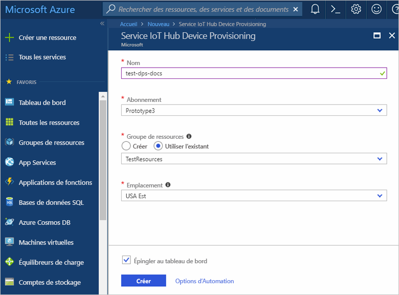
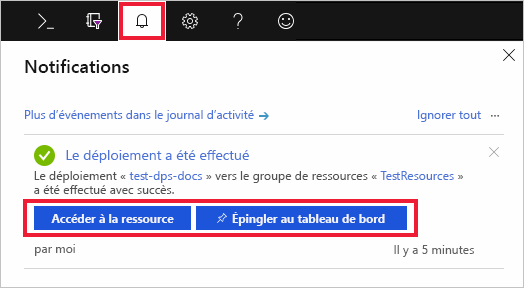
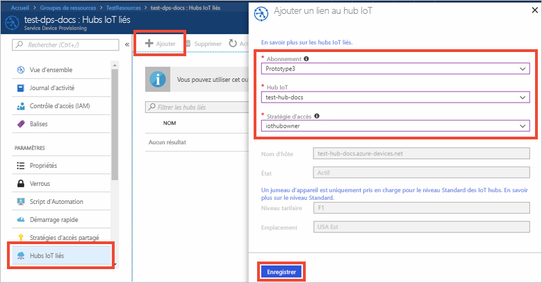

# Démarrage rapide : Configurer le service d’approvisionnement d’appareil IoT Hub avec le portail Azure

Le service IoT Hub Device Provisioning peut s’utiliser avec IoT Hub pour effectuer un provisionnement sans contact juste-à-temps sur le hub IoT souhaité, sans intervention humaine. Les clients peuvent ainsi provisionner des millions d’appareils IoT de façon sécurisée et scalable. Le service Azure IoT Hub Device Provisioning prend en charge les appareils IoT avec les authentifications par TPM, clé symétrique et certificat X.509. Pour plus d’informations, consultez [Vue d’ensemble du service IoT Hub Device Provisioning](./about-iot-dps.md)

Ce guide de démarrage rapide vous montre comment configurer le service IoT Hub Device Provisioning dans le portail Azure pour provisionner vos appareils selon ces étapes :
> [!div class="checklist"]
> * Utiliser le portail Azure pour créer un hub IoT
> * Utiliser le portail Azure pour créer un service IoT Hub Device Provisioning et obtenir l’étendue de l’ID
> * Lier le hub IoT au service Device Provisioning

Si vous n’avez pas d’abonnement Azure, créez un [compte gratuit](https://azure.microsoft.com/free/?WT.mc_id=A261C142F) avant de commencer.

## Créer un hub IoT

[!INCLUDE [iot-hub-include-create-hub](../../includes/iot-hub-include-create-hub.md)]

## Créer un service IoT Hub Device Provisioning

1. Resélectionnez le bouton **Créer une ressource**.

2. *Recherchez dans la Place de marché* le **service Device Provisioning**. Sélectionnez le **service IoT Hub Device Provisioning** et appuyez sur le bouton **Créer**. 

3. Fournissez les informations suivantes pour votre nouvelle instance de service Device Provisioning et appuyez sur **Créer**.

    * **Nom :** Donnez un nom unique à votre nouvelle instance de service Device Provisioning. Si le nom saisi est disponible, une coche verte s’affiche.
    * **Abonnement :** Choisissez l’abonnement que vous voulez utiliser pour créer cette instance de service Device Provisioning.
    * **Groupe de ressources :** Ce champ vous permet de créer un groupe de ressources ou de sélectionner un groupe déjà existant pour contenir la nouvelle instance. Choisissez le même groupe de ressources qui contient l’IoT Hub que vous avez créé ci-dessus, par exemple, **TestResources**. En plaçant toutes les ressources associées dans un même groupe, vous pouvez les gérer toutes ensemble. Par exemple, si vous supprimez le groupe de ressources, vous supprimez également toutes les ressources contenues dans ce groupe. Pour plus d’informations, consultez [Gérer des groupes de ressources Azure Resource Manager](../azure-resource-manager/management/manage-resource-groups-portal.md).
    * **Emplacement :** Sélectionnez l’emplacement le plus proche de vos appareils.

        

4. Sélectionnez le bouton de notification pour superviser la création de l’instance de ressource. Une fois le service déployé, sélectionnez **Épingler au tableau de bord**, puis **Accéder à la ressource**.

    

## Lier le hub IoT et votre service Device Provisioning

Dans cette section, vous allez ajouter une configuration à l’instance de service Device Provisioning. Cette configuration définit l’IoT Hub pour lequel les périphériques seront configurés.

1. Sélectionnez le bouton **Toutes les ressources** dans le menu de gauche du portail Azure. Sélectionnez l’instance de service d’approvisionnement des appareils que vous avez créée dans la section précédente. 

    Si votre menu est configuré avec le mode **Menu volant** au lieu du mode **Ancré** dans les paramètres du portail, vous devrez cliquer sur les 3 lignes situées en haut à gauche pour ouvrir le menu du portail sur la gauche.  

2. Dans le menu du service Device Provisioning, sélectionnez **Hubs IoT liés**. Appuyez sur le bouton **+ Ajouter** dans la partie supérieure. 

3. Sur la page **Add link to IoT hub** (Ajouter un lien à IoT Hub), fournissez les informations suivantes pour lier votre nouvelle instance de service Device Provisioning à un IoT Hub. Appuyez ensuite sur **Enregistrer**. 

    * **Abonnement :** Sélectionnez l’abonnement contenant le hub IoT que vous voulez lier à votre nouvelle instance de service Device Provisioning.
    * **Hub IoT :** Sélectionnez le hub IoT à lier à votre nouvelle instance de service Device Provisioning.
    * **Stratégie d’accès :** Sélectionnez **iothubowner** comme informations d’identification pour établir le lien avec le hub IoT.  

        

3. Désormais le hub sélectionné devrait s’afficher sous le panneau **Hubs IoT liés**. Vous devrez peut-être appuyer sur **Actualiser** pour qu’il apparaisse.

## Nettoyer les ressources

Les autres démarrages rapides de cette collection reposent sur ce démarrage rapide. Si vous souhaitez continuer à utiliser d’autres démarrages rapides ou les didacticiels, ne nettoyez pas les ressources créées dans ce démarrage rapide. Sinon, procédez comme suit pour supprimer toutes les ressources créées au cours de ce démarrage rapide dans le portail Azure.

1. Dans le menu de gauche du portail Azure, sélectionnez **Toutes les ressources**, puis votre service Device Provisioning. En haut du volet de détails de l’appareil, sélectionnez **Supprimer**.  
2. À partir du menu de gauche, dans le portail Azure, sélectionnez **Toutes les ressources**, puis votre hub IoT. En haut du volet de détails du hub, sélectionnez **Supprimer**.  

## Étapes suivantes

Dans ce guide de démarrage rapide, vous avez déployé un hub IoT et une instance de service Device Provisioning, puis vous avez lié ces deux ressources. Pour savoir comment utiliser cette configuration pour provisionner un appareil simulé, passez au guide de démarrage rapide relatif à la création d’un appareil simulé.

> [!div class="nextstepaction"]
> [Démarrage rapide pour créer un appareil simulé](./quick-create-simulated-device-symm-key.md)
