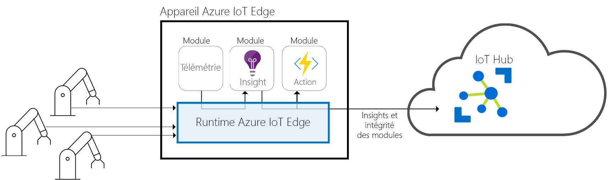
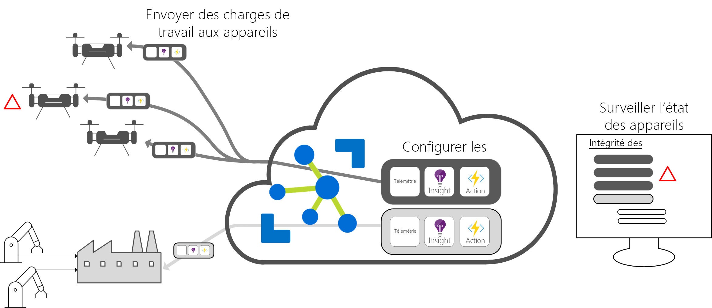

# Qu’est-ce qu’Azure IoT Edge

[!INCLUDE [iot-edge-version-all-supported](../../includes/iot-edge-version-all-supported.md)]

Azure IoT Edge déplace l’analytique et la logique métier personnalisée du cloud vers les appareils, afin que votre organisation puisse se concentrer sur les perspectives commerciales plutôt que sur la gestion des données. Effectuez un scale-out de votre solution IoT en plaçant votre logique métier dans des conteneurs standard. Vous pouvez alors déployer ces conteneurs sur n’importe lequel de vos appareils et tout superviser à partir du cloud.

L’analytique apporte de la valeur métier dans les solutions IoT, mais toutes les analyses ne doivent pas se trouver sur le cloud. Si vous voulez répondre aux situations d’urgence aussi rapidement que possible, vous pouvez exécuter des charges de travail de détection d’anomalie en périphérie. Si vous voulez réduire les coûts de bande passante et éviter de transférer des téraoctets de données brutes, vous pouvez nettoyer et agréger les données localement, puis envoyer uniquement les insights au cloud pour analyse.

Azure IoT Edge est constitué de trois composants :

* Les **modules IoT Edge** sont des conteneurs qui exécutent les services Azure, les services tiers ou votre propre code. Ils sont déployés sur des appareils IoT Edge et s’exécutent localement sur ces appareils.
* Le **runtime IoT Edge** s’exécute sur chaque appareil IoT Edge et gère les modules déployés sur chaque appareil.
* Une **interface basée sur le cloud** permet de superviser et de gérer des appareils IoT Edge à distance.

>[!NOTE]
>Azure IoT Edge est disponible dans les niveaux gratuit et standard d’IoT Hub. Le niveau gratuit est destiné aux tests et à l’évaluation uniquement. Pour plus d’informations sur les niveaux De base et Standard d’IoT Hub, consultez [Mettre à l’échelle votre solution IoT Hub](../iot-hub/iot-hub-scaling.md).

## Modules IoT Edge

Les modules IoT Edge sont des unités d’exécution, implémentées en tant que conteneurs compatibles Docker, qui exécutent votre logique métier en périphérie. Plusieurs modules peuvent être configurés pour communiquer entre eux, créant ainsi un pipeline de traitement des données. Vous pouvez développer des modules personnalisés ou créer des packages de certains services Azure dans des modules qui fournissent des analyses en mode hors connexion et en périphérie.

### Intelligence artificielle en périphérie

Azure IoT Edge vous permet de déployer des traitements d’événements complexes, du machine learning, de la reconnaissance d’images et autres systèmes IA de haut vol sans enregistrement en interne. Les services Azure comme Azure Functions, Azure Stream Analytics et Azure Machine Learning peuvent tous être exécutés en local par le biais d’Azure IoT Edge. Vous n’êtes cependant pas limité aux services Azure. Toute personne est en mesure de créer des modules IA et de les mettre à la disposition de la communauté à des fins d’utilisation par le biais de la Place de marché Azure.

### Apportez votre propre code

Azure IoT Edge prend également en charge le déploiement de votre propre code sur vos périphériques. Azure IoT Edge fonctionne sur le même modèle de programmation que les autres services Azure IoT. Vous pouvez exécuter le même code sur un appareil ou dans le cloud. Azure IoT Edge prend en charge Linux et Windows, vous pouvez donc coder sur la plateforme de votre choix. Il prend en charge Java, .NET Core 2.0, Node.js, C et Python. Vos développeurs peuvent ainsi coder dans un langage qu’ils connaissent déjà et utiliser la logique métier existante.

## Runtime IoT Edge

Le runtime Azure IoT Edge active les logiques cloud et personnalisées sur les périphériques IoT Edge. Le runtime se trouve sur l'appareil IoT Edge et effectue des opérations de gestion et de communication. Le runtime effectue plusieurs fonctions :

* Il installe et met à jour des charges de travail sur l'appareil.
* Il tient à jour les normes de sécurité Azure IoT Edge sur l’appareil.
* Il garantit que les modules IoT Edge sont toujours en cours d’exécution.
* Il envoie des rapports d’intégrité du module dans le cloud pour la surveillance à distance.
* Il gère la communication entre les appareils de nœud terminal en aval et un appareil IoT Edge, entre les modules sur un appareil IoT Edge, ainsi qu'entre un appareil IoT Edge et le cloud.

Les choix liés à l’utilisation d’un appareil Azure IoT Edge vous incombent. Le runtime est souvent utilisé pour déployer l’IA (intelligence artificielle) sur des appareils de passerelle qui agrègent des données et les traitent à partir d’autres appareils locaux, mais ce modèle de déploiement n’est qu’une option.

Le runtime Azure IoT Edge s'exécute sur un grand nombre d'appareils IoT, ce qui permet de l'utiliser de différentes façons. Il prend en charge les systèmes d’exploitation Linux et Windows ainsi que des détails matériels abstraits. Utilisez un appareil plus petit qu’un Raspberry Pi 3 si vous ne traitez pas de grands volumes de données, ou utilisez un serveur industriel pour exécuter des charges de travail consommant beaucoup de ressources.

## L’interface cloud IoT Edge

Il est difficile de gérer le cycle de vie des logiciels pour des millions d'appareils IoT qui sont souvent de marques et de modèles différents, ou dispersées géographiquement. Les charges de travail sont créées et configurées pour un type particulier d’appareil, déployées sur tous vos appareils et supervisées pour intercepter tous les appareils présentant un dysfonctionnement. Ces activités ne peuvent pas être effectuées sur chaque appareil : elles doivent être appliquées à grande échelle.

Azure IoT Edge s’intègre parfaitement avec les accélérateurs de solution Azure IoT pour fournir un plan de contrôle pour les besoins de votre solution. Les services cloud vous permettent de :

* Créer et configurer une charge de travail à exécuter sur un type d’appareil spécifique.
* Envoyer une charge de travail à un ensemble d’appareils.
* Analyser les charges de travail en cours d’exécution sur des périphériques dans le champ.

## Étapes suivantes

Essayez ces concepts en déployant votre premier module IoT Edge sur un appareil :

<!-- 1.1 -->
:::moniker range="iotedge-2018-06"

* [Déployer des modules sur un appareil IoT Edge Linux](quickstart-linux.md)
* [Déployer des modules sur un appareil IoT Edge Windows](quickstart.md)

:::moniker-end

<!-- 1.2 -->
:::moniker range=">=iotedge-2020-11"

[Déployer des modules sur un appareil IoT Edge](quickstart-linux.md)

:::moniker-end
