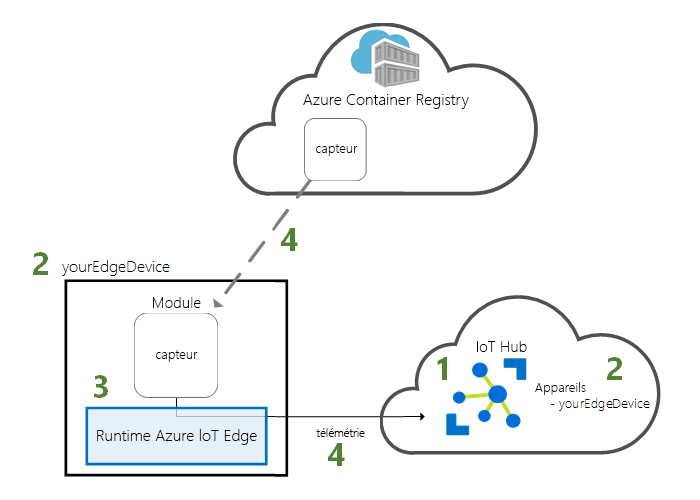
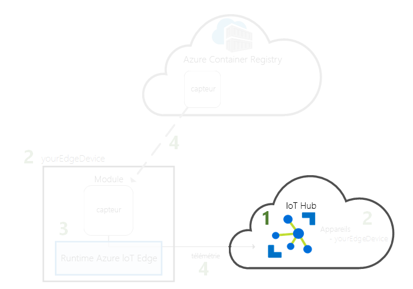
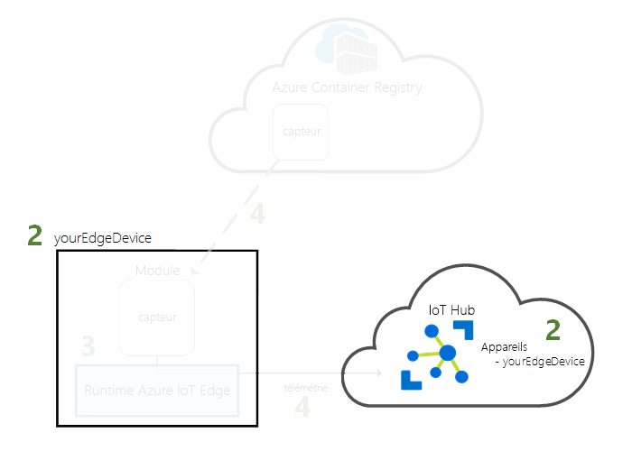
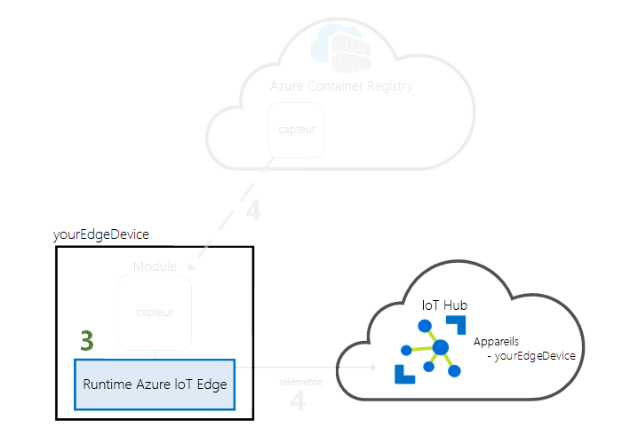
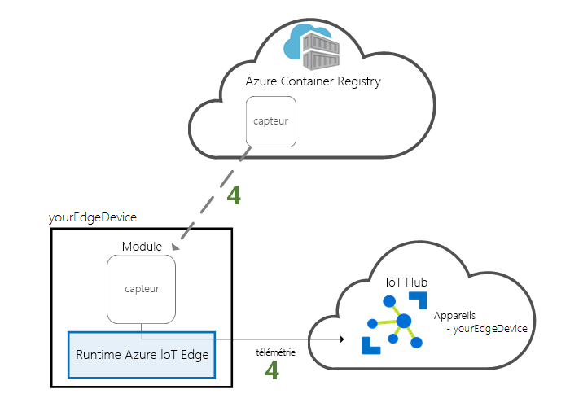

# <a name="quickstart-deploy-your-first-iot-edge-module-to-a-virtual-linux-device"></a>Démarrage rapide : Déployer votre premier module IoT Edge sur un appareil virtuel Linux

[!INCLUDE [iot-edge-version-201806-or-202011](../../includes/iot-edge-version-201806-or-202011.md)]

Testez Azure IoT Edge dans ce guide de démarrage rapide en déployant du code conteneurisé sur un appareil IoT Edge Linux virtuel. IoT Edge vous permet de gérer à distance du code sur vos appareils afin que vous puissiez envoyer plus de charges de travail à la périphérie. Pour ce démarrage rapide, nous vous recommandons d’utiliser une machine virtuelle Azure pour votre appareil IoT Edge, ce qui vous permet de créer rapidement une machine de test, puis de la supprimer une fois que vous avez terminé.

Dans ce guide de démarrage rapide, vous apprenez à :

* Créez un IoT Hub.
* Inscrivez un appareil IoT Edge dans votre IoT Hub.
* Installez et démarrez le runtime IoT Edge sur un appareil virtuel.
* Déployez à distance un module vers un appareil IoT Edge.



Ce guide de démarrage rapide vous explique comment créer une machine virtuelle Linux configurée pour être un appareil IoT Edge. Ensuite, vous déployez un module depuis le portail Azure vers votre appareil. Le module utilisé dans ce guide de démarrage rapide est un capteur simulé qui génère des données de pression, d’humidité et de température. Les autres tutoriels Azure IoT Edge s’appuient sur le travail que vous effectuez ici en déployant des modules supplémentaires qui analysent les données simulées des insights métier.

Si vous n’avez pas d’abonnement Azure actif, créez un [compte gratuit](https://azure.microsoft.com/free) avant de commencer.

## <a name="prerequisites"></a>Prérequis

Préparez votre environnement pour l’interface Azure CLI.

[!INCLUDE [azure-cli-prepare-your-environment-no-header.md](../../includes/azure-cli-prepare-your-environment-no-header.md)]

Ressources cloud :

* Un groupe de ressources permettant de gérer toutes les ressources que vous utilisez lors de ce démarrage rapide. Nous utilisons l’exemple de nom de groupe de ressources **IoTEdgeResources** tout au long de ce guide de démarrage rapide et des tutoriels suivants.

   ```azurecli-interactive
   az group create --name IoTEdgeResources --location westus2
   ```

## <a name="create-an-iot-hub"></a>Créer un hub IoT

Commencez le guide de démarrage rapide en créant un hub IoT avec Azure CLI.



Le niveau gratuit d'IoT Hub fonctionne pour ce démarrage rapide. Si vous avez utilisé IoT Hub par le passé et que vous avez créé un hub, vous pouvez utiliser ce hub IoT.

Le code suivant crée un hub gratuit **F1** dans le groupe de ressources **IoTEdgeResources**. Remplacez `{hub_name}` par un nom unique pour votre hub IoT. La création d’un hub IoT peut prendre plusieurs minutes.

   ```azurecli-interactive
   az iot hub create --resource-group IoTEdgeResources --name {hub_name} --sku F1 --partition-count 2
   ```

   Si vous obtenez une erreur parce qu’un hub gratuit existe déjà dans votre abonnement, remplacez la référence SKU par **S1**. Chaque abonnement peut avoir uniquement un IoT hub gratuit. Si vous recevez une erreur indiquant que le nom du hub IoT n’est pas disponible, cela signifie que quelqu’un d’autre a déjà un hub portant ce nom. Essayez avec un autre nom.

## <a name="register-an-iot-edge-device"></a>Enregistrer un appareil IoT Edge

Inscrivez l’appareil IoT Edge avec votre IoT Hub récemment créé.



Créez une identité d’appareil pour votre appareil IoT Edge afin qu’il puisse communiquer avec votre IoT Hub. L’identité d’appareil se trouve dans le cloud, et une chaîne unique de connexion d’appareil vous permet d’associer un appareil physique à une identité d’appareil.

Étant donné que le comportement et la gestion des appareils IoT Edge peuvent être différents de ceux des appareils IoT standard, déclarez cette identité en indiquant qu’elle est destinée à un appareil IoT Edge avec l’indicateur `--edge-enabled`.

1. Dans Azure Cloud Shell, entrez la commande suivante pour créer un appareil nommé **myEdgeDevice** dans votre hub.

   ```azurecli-interactive
   az iot hub device-identity create --device-id myEdgeDevice --edge-enabled --hub-name {hub_name}
   ```

   Si vous recevez une erreur relative aux clés de stratégie iothubowner, vérifiez que votre instance de Cloud Shell exécute la dernière version de l’extension azure-iot.

2. Affichez la chaîne de connexion pour votre appareil, qui lie votre appareil physique à l’aide de son identité dans IoT Hub. Elle contient le nom de votre hub IoT, le nom de votre appareil, puis une clé partagée qui authentifie les connexions entre les deux. Nous ferons référence à cette chaîne de connexion dans la section suivante quand vous configurerez votre appareil IoT Edge.

   ```azurecli-interactive
   az iot hub device-identity connection-string show --device-id myEdgeDevice --hub-name {hub_name}
   ```

   

## <a name="configure-your-iot-edge-device"></a>Configurer votre appareil IoT Edge

Créez une machine virtuelle avec le runtime Azure IoT Edge.



Le runtime IoT Edge est déployé sur tous les appareils IoT Edge. Il comprend trois composants. Le *démon de sécurité IoT Edge* démarre chaque fois qu’un appareil IoT Edge démarre et amorce l’appareil en démarrant l’agent IoT Edge. *L’agent IoT Edge* facilite le déploiement et la surveillance des modules sur l’appareil IoT Edge, notamment le hub IoT Edge. Le *hub IoT Edge* gère les communications entre les modules sur l’appareil IoT Edge et entre l’appareil et IoT Hub.

Pendant la configuration du runtime, vous fournissez une chaîne de connexion d’appareil. Il s’agit de la chaîne que vous avez récupérée à partir d’Azure CLI. Cette chaîne associe votre appareil physique à l’identité d’appareil IoT Edge dans Azure.

### <a name="deploy-the-iot-edge-device"></a>Déployer l’appareil IoT Edge

Cette section utilise un modèle Azure Resource Manager pour créer une machine virtuelle et y installer le runtime IoT Edge. Si vous souhaitez utiliser votre propre appareil Linux à la place, vous pouvez suivre les étapes d’installation indiquées dans [Installer le runtime Azure IoT Edge](how-to-install-iot-edge.md), puis revenir à ce guide de démarrage rapide.

<!-- 1.1 -->
:::moniker range="iotedge-2018-06"

Utilisez la commande CLI suivante pour créer votre appareil IoT Edge en fonction du modèle [iotedge-vm-deploy](https://github.com/Azure/iotedge-vm-deploy) prégénéré.

* Si vous utilisez Bash ou Cloud Shell, copiez la commande suivante dans un éditeur de texte, remplacez le texte d’espace réservé par vos informations, puis collez la commande dans votre fenêtre Bash ou Cloud Shell :

   ```azurecli-interactive
   az deployment group create \
   --resource-group IoTEdgeResources \
   --template-uri "https://aka.ms/iotedge-vm-deploy" \
   --parameters dnsLabelPrefix='<REPLACE_WITH_VM_NAME>' \
   --parameters adminUsername='azureUser' \
   --parameters deviceConnectionString=$(az iot hub device-identity connection-string show --device-id myEdgeDevice --hub-name <REPLACE_WITH_HUB_NAME> -o tsv) \
   --parameters authenticationType='password' \
   --parameters adminPasswordOrKey="<REPLACE_WITH_PASSWORD>"
   ```

* Si vous utilisez PowerShell, copiez la commande suivante dans votre fenêtre PowerShell, puis remplacez le texte des espaces réservés par vos propres informations :

   ```azurecli
   az deployment group create `
   --resource-group IoTEdgeResources `
   --template-uri "https://aka.ms/iotedge-vm-deploy" `
   --parameters dnsLabelPrefix='<REPLACE_WITH_VM_NAME>' `
   --parameters adminUsername='azureUser' `
   --parameters deviceConnectionString=$(az iot hub device-identity connection-string show --device-id myEdgeDevice --hub-name <REPLACE_WITH_HUB_NAME> -o tsv) `
   --parameters authenticationType='password' `
   --parameters adminPasswordOrKey="<REPLACE_WITH_PASSWORD>"
   ```

:::moniker-end
<!-- end 1.1 -->

<!-- 1.2 -->
:::moniker range=">=iotedge-2020-11"

Utilisez la commande CLI suivante pour créer votre appareil IoT Edge en fonction du modèle [iotedge-vm-deploy](https://github.com/Azure/iotedge-vm-deploy/tree/1.2.0-rc4) prégénéré.

* Si vous utilisez Bash ou Cloud Shell, copiez la commande suivante dans un éditeur de texte, remplacez le texte d’espace réservé par vos informations, puis collez la commande dans votre fenêtre Bash ou Cloud Shell :

   ```azurecli-interactive
   az deployment group create \
   --resource-group IoTEdgeResources \
   --template-uri "https://raw.githubusercontent.com/Azure/iotedge-vm-deploy/1.2.0-rc4/edgeDeploy.json" \
   --parameters dnsLabelPrefix='<REPLACE_WITH_VM_NAME>' \
   --parameters adminUsername='azureUser' \
   --parameters deviceConnectionString=$(az iot hub device-identity connection-string show --device-id myEdgeDevice --hub-name <REPLACE_WITH_HUB_NAME> -o tsv) \
   --parameters authenticationType='password' \
   --parameters adminPasswordOrKey="<REPLACE_WITH_PASSWORD>"
   ```

* Si vous utilisez PowerShell, copiez la commande suivante dans votre fenêtre PowerShell, puis remplacez le texte des espaces réservés par vos propres informations :

   ```azurecli
   az deployment group create `
   --resource-group IoTEdgeResources `
   --template-uri "https://raw.githubusercontent.com/Azure/iotedge-vm-deploy/1.2.0-rc4/edgeDeploy.json" `
   --parameters dnsLabelPrefix='<REPLACE_WITH_VM_NAME>' `
   --parameters adminUsername='azureUser' `
   --parameters deviceConnectionString=$(az iot hub device-identity connection-string show --device-id myEdgeDevice --hub-name <REPLACE_WITH_HUB_NAME> -o tsv) `
   --parameters authenticationType='password' `
   --parameters adminPasswordOrKey="<REPLACE_WITH_PASSWORD>"
   ```
:::moniker-end
<!-- end 1.2 -->

Ce modèle prend les paramètres suivants :

| Paramètre | Description |
| --------- | ----------- |
| **resource-group** | Groupe de ressources dans lequel les ressources seront créées. Utilisez le nom **IoTEdgeResources** par défaut que nous avons utilisé dans cet article ou fournissez le nom d’un groupe de ressources existant dans votre abonnement. |
| **template-uri** | Pointeur vers le modèle Resource Manager que nous utilisons. |
| **dnsLabelPrefix** | Chaîne qui sera utilisée pour créer le nom d’hôte de la machine virtuelle. Remplacez le texte de l’espace réservé par le nom de votre machine virtuelle. |
| **adminUsername** | Nom d’utilisateur du compte administrateur de la machine virtuelle. Utilisez l’exemple **azureUser** ou indiquez un nouveau nom d’utilisateur. |
| **deviceConnectionString** | Chaîne de connexion de l’identité d’appareil dans IoT Hub, qui est utilisée pour configurer le runtime IoT Edge sur la machine virtuelle. La commande CLI dans ce paramètre récupère la chaîne de connexion pour vous. Remplacez le texte de l’espace réservé par le nom de votre hub IoT. |
| **authenticationType** | Méthode d’authentification pour le compte administrateur. Ce guide de démarrage rapide utilise l’authentification par mot de passe (**password**), mais vous pouvez également définir ce paramètre sur **sshPublicKey**. |
| **adminPasswordOrKey** | Mot de passe ou valeur de la clé SSH pour le compte administrateur. Remplacez le texte de l’espace réservé par un mot de passe sécurisé. Votre mot de passe doit comporter au moins 12 caractères, choisis dans trois des quatre catégories suivantes : caractères minuscules, caractères majuscules, chiffres et caractères spéciaux. |

Une fois le déploiement terminé, vous devez recevoir dans l’interface CLI une sortie au format JSON qui contient les informations SSH pour la connexion à la machine virtuelle. Copiez la valeur de l’entrée **public SSH** de la section **outputs** :

   

### <a name="view-the-iot-edge-runtime-status"></a>Afficher l’état du runtime IoT Edge

Les autres commandes de ce guide sont exécutées sur votre appareil IoT Edge lui-même, afin que vous puissiez voir ce qui s’y passe concrètement. Si vous utilisez une machine virtuelle, connectez-vous maintenant à celle-ci à l’aide du nom d’utilisateur administrateur que vous avez configuré et du nom DNS qui a été généré par la commande de déploiement. Vous pouvez également trouver le nom DNS dans la page Vue d’ensemble de la machine virtuelle dans le portail Azure. Utilisez la commande suivante pour vous connecter à votre machine virtuelle. Remplacez `{admin username}` et `{DNS name}` par vos propres valeurs.

   ```console
   ssh {admin username}@{DNS name}
   ```

Une fois connecté à votre machine virtuelle, vérifiez que le runtime a été correctement installé et configuré sur votre appareil IoT Edge.

<!--1.1 -->
:::moniker range="iotedge-2018-06"

1. Vérifiez que le démon de sécurité IoT Edge s’exécute en tant que service système.

   ```bash
   sudo systemctl status iotedge
   ```

   

   >[!TIP]
   >Vous avez besoin de privilèges élevés pour exécuter les commandes `iotedge`. Une fois que vous vous déconnectez de votre machine et que vous vous reconnectez pour la première fois après avoir installé le runtime IoT Edge, vos autorisations sont automatiquement mises à jour. Dans l’intervalle, ajoutez `sudo` devant les commandes.

2. Si vous avez besoin de résoudre les problèmes du service, récupérez les journaux d’activité de ce dernier.

   ```bash
   journalctl -u iotedge
   ```

3. Affichez tous les modules s’exécutant sur votre appareil IoT Edge. Comme le service vient de démarrer pour la première fois, vous devez uniquement voir le module **edgeAgent** en cours d’exécution. Le module edgeAgent s’exécute par défaut et vous aide à installer et démarrer tous les modules supplémentaires que vous déployez sur votre appareil.

   ```bash
   sudo iotedge list
   ```

   
:::moniker-end
<!-- end 1.1 -->

<!-- 1.2 -->
:::moniker range=">=iotedge-2020-11"

1. Vérifiez qu’IoT Edge est en cours d’exécution. La commande suivante doit retourner l’état **OK** si IoT Edge est en cours d’exécution, ou fournir des erreurs de service.

   ```bash
   sudo iotedge system status
   ```

   >[!TIP]
   >Vous avez besoin de privilèges élevés pour exécuter les commandes `iotedge`. Une fois que vous vous déconnectez de votre machine et que vous vous reconnectez pour la première fois après avoir installé le runtime IoT Edge, vos autorisations sont automatiquement mises à jour. Dans l’intervalle, ajoutez `sudo` devant les commandes.

2. Si vous avez besoin de résoudre les problèmes du service, récupérez les journaux d’activité de ce dernier.

   ```bash
   sudo iotedge system logs
   ```

3. Affichez tous les modules s’exécutant sur votre appareil IoT Edge. Comme le service vient de démarrer pour la première fois, vous devez uniquement voir le module **edgeAgent** en cours d’exécution. Le module edgeAgent s’exécute par défaut et vous aide à installer et démarrer tous les modules supplémentaires que vous déployez sur votre appareil.

   ```bash
   sudo iotedge list
   ```

:::moniker-end
<!-- end 1.2 -->

Votre appareil IoT Edge est maintenant configuré. Il est prêt à exécuter les modules déployés dans le cloud.

## <a name="deploy-a-module"></a>Déployer un module

Gérez votre appareil Azure IoT Edge depuis le cloud pour déployer un module qui transmettra des données de télémétrie à IoT Hub.



[!INCLUDE [iot-edge-deploy-module](../../includes/iot-edge-deploy-module.md)]

<!-- 1.2 -->
:::moniker range=">=iotedge-2020-11"

Étant donné qu’IoT Edge version 1.2 est en préversion publique, il existe une étape supplémentaire pour mettre à jour les modules du runtime vers leurs préversions publiques.

1. Sélectionnez à nouveau **Définir des modules** dans la page Détails de l’appareil.

1. Sélectionnez **Paramètres du runtime**.

1. Mettez à jour le champ **Image** pour les modules IoT Edge Hub et IOT Edge Agent afin d’utiliser l’étiquette de version 1.2.0-RC4. Par exemple :

   * `mcr.microsoft.com/azureiotedge-hub:1.2.0-rc4`
   * `mcr.microsoft.com/azureiotedge-agent:1.2.0-rc4`

1. Le module de capteur de température simulé doit toujours être listé dans la section Modules. Vous n’avez pas besoin d’apporter des modifications à ce module pour la préversion publique.

1. Sélectionnez **Revoir + créer**.

1. Sélectionnez **Create** (Créer).

1. Sur la page Détails de l’appareil, vous pouvez sélectionner **$edgeAgent** ou **$edgeHub** pour voir les détails du module reflétant la préversion publique de l’image.

:::moniker-end
<!-- end 1.2 -->

## <a name="view-generated-data"></a>Afficher les données générées

Dans ce guide de démarrage rapide, vous avez créé un nouveau périphérique IoT Edge et installé le runtime IoT Edge. Puis vous avez utilisé le portail Azure pour déployer un module IoT Edge afin de l’exécuter sur l’appareil sans avoir à apporter des modifications à l’appareil lui-même.

Dans ce cas, le module que vous avez envoyé (push) génère des exemples de données d’environnement que vous pouvez utiliser pour les tests ultérieurement. Le capteur simulé surveille à la fois une machine et l’environnement de la machine. Par exemple, ce capteur peut être installé dans une salle de serveurs, dans une usine ou sur une éolienne. Le message inclut la température et l’humidité ambiantes, la température et la pression de la machine ainsi qu’un horodatage. Les tutoriels IoT Edge se servent des données créées par ce module comme données de test pour l’analytique.

Rouvrez l’invite de commandes sur votre appareil IoT Edge ou utilisez la connexion SSH à partir d’Azure CLI. Confirmez que le module déployé à partir du cloud est en cours d’exécution sur votre appareil IoT Edge :

   ```bash
   sudo iotedge list
   ```

<!-- 1.1 -->
:::moniker range="iotedge-2018-06"
   
:::moniker-end

<!-- 1.2 -->
:::moniker range=">=iotedge-2020-11"
   
:::moniker-end

Consultez les messages envoyés par le module de capteur de température :

   ```bash
   sudo iotedge logs SimulatedTemperatureSensor -f
   ```

   >[!TIP]
   >Les commandes IoT Edge respectent la casse quand vous référencez les noms de module.

   

Vous pouvez également regarder les messages arriver sur votre hub IoT avec l’[extension Azure IoT Hub pour Visual Studio Code](https://marketplace.visualstudio.com/items?itemName=vsciot-vscode.azure-iot-toolkit).

## <a name="clean-up-resources"></a>Nettoyer les ressources

Si vous souhaitez poursuivre les didacticiels IoT Edge, vous pouvez utiliser l’appareil que vous avez inscrit et configuré dans ce démarrage rapide. Sinon, vous pouvez supprimer les ressources Azure que vous avez créées dans cet article pour éviter les frais.

Si vous avez créé votre machine virtuelle et un IoT Hub dans un nouveau groupe de ressources, vous pouvez supprimer ce groupe et toutes les ressources associées. Vérifiez le contenu du groupe de ressources pour être certain que vous ne voulez rien en conserver. Si vous ne voulez pas supprimer tout le groupe, vous pouvez supprimer des ressources individuelles.

> [!IMPORTANT]
> La suppression d’un groupe de ressources est irréversible.

Supprimez le groupe **IoTEdgeResources**. La suppression d’un groupe de ressources peut prendre plusieurs minutes.

```azurecli-interactive
az group delete --name IoTEdgeResources --yes
```

Vous pouvez vérifier que le groupe de ressources est supprimé en consultant la liste des groupes de ressources.

```azurecli-interactive
az group list
```

## <a name="next-steps"></a>Étapes suivantes

Dans ce guide de démarrage rapide, vous avez créé un appareil IoT Edge et utilisé l’interface cloud Azure IoT Edge pour déployer du code sur l’appareil. Vous possédez désormais un appareil de test générant des données brutes sur son environnement.

L’étape suivante consiste à configurer votre environnement de développement local afin de pouvoir commencer à créer des modules IoT Edge qui exécutent votre logique métier.

> [!div class="nextstepaction"]
> [Commencer à développer des modules IoT Edge pour des appareils Linux](tutorial-develop-for-linux.md)
