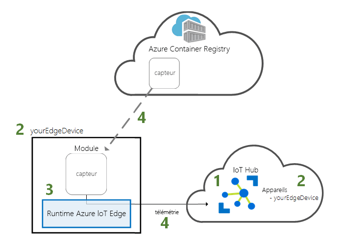
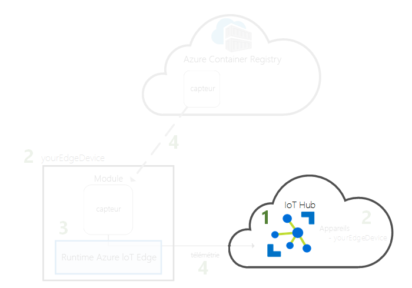
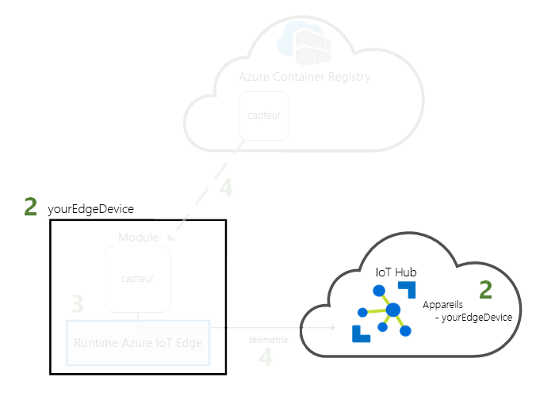
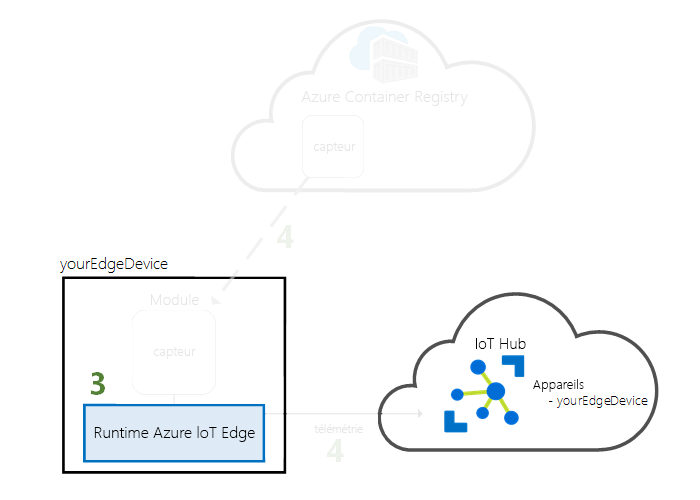
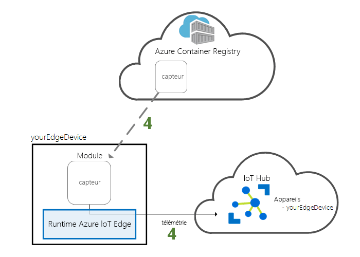

# <a name="quickstart-deploy-your-first-iot-edge-module-to-a-virtual-windows-device"></a>Démarrage rapide : Déployer votre premier module IoT Edge sur un appareil virtuel Windows

Essayez Azure IoT Edge dans ce guide de démarrage rapide en déployant du code conteneurisé sur un appareil IoT Edge Windows virtuel. IoT Edge vous permet de gérer à distance du code sur vos appareils afin que vous puissiez envoyer plus de charges de travail à la périphérie. Pour ce démarrage rapide, nous vous recommandons d’utiliser une machine virtuelle Azure pour votre appareil IoT Edge. L’utilisation d’une machine virtuelle vous permet de créer rapidement une machine de test, d’installer les prérequis, puis de la supprimer une fois que vous avez terminé.

Dans ce guide de démarrage rapide, vous apprenez à :

> [!div class="checklist"]
>
> * Créez un hub IoT.
> * Inscrivez un appareil IoT Edge dans votre IoT Hub.
> * Installez et démarrez le runtime IoT Edge sur votre appareil virtuel.
> * Déployez à distance un module sur un appareil IoT Edge et envoyez les données de télémétrie à IoT Hub.



Ce guide de démarrage rapide vous explique comment créer une machine virtuelle Windows et la configurer en tant qu’appareil IoT Edge. Ensuite, vous déployez un module depuis le portail Azure vers votre appareil. Le module utilisé dans ce guide de démarrage rapide est un capteur simulé qui génère des données de pression, d’humidité et de température. Les autres tutoriels Azure IoT Edge s’appuient sur le travail que vous effectuez ici en déployant des modules supplémentaires qui analysent les données simulées des insights métier.

Si vous n’avez pas d’abonnement Azure actif, créez un [compte gratuit](https://azure.microsoft.com/free) avant de commencer.

[!INCLUDE [cloud-shell-try-it.md](../../includes/cloud-shell-try-it.md)]

Vous utilisez Azure CLI pour effectuer la plupart des étapes de ce guide de démarrage rapide. Azure IoT a une extension pour activer des fonctionnalités supplémentaires.

Ajoutez l’extension Azure IoT à l’instance de Cloud Shell.

   ```azurecli-interactive
   az extension add --name azure-iot
   ```

[!INCLUDE [iot-hub-cli-version-info](../../includes/iot-hub-cli-version-info.md)]

## <a name="prerequisites"></a>Prérequis

Ressources cloud :

* Un groupe de ressources permettant de gérer toutes les ressources que vous utilisez lors de ce démarrage rapide.

   ```azurecli-interactive
   az group create --name IoTEdgeResources --location westus2
   ```

Appareil IoT Edge :

* Une machine virtuelle Windows faisant office d’appareil IoT Edge. Vous pouvez créer cette machine virtuelle à l’aide de la commande suivante, en remplaçant `{password}` par un mot de passe sécurisé :

  ```azurecli-interactive
  az vm create --resource-group IoTEdgeResources --name EdgeVM --image MicrosoftWindowsDesktop:Windows-10:rs5-pro:latest --admin-username azureuser --admin-password {password} --size Standard_DS1_v2
  ```

  Quelques minutes peuvent être nécessaires pour créer et démarrer la nouvelle machine virtuelle.

  Une fois votre machine virtuelle démarrée, vous pouvez télécharger un fichier RDP à utiliser lors de la connexion à votre machine virtuelle :

  1. Accédez à votre nouvelle machine virtuelle Windows sur le portail Azure.
  1. Sélectionnez **Connecter**.
  1. Sous l’onglet **RDP**, sélectionnez **Télécharger le fichier RDP**.

  Ouvrez ce fichier avec une connexion Bureau à distance pour vous connecter à votre machine virtuelle Windows avec le nom et le mot de passe d’administrateur que vous avez spécifiés avec la commande `az vm create`.

> [!NOTE]
> Votre machine virtuelle Windows démarre avec Windows version 1809 (Build 17763), qui est la dernière [Build prise en charge à long terme de Windows](https://docs.microsoft.com/windows/release-information/). Par défaut, Windows recherche automatiquement les mises à jour toutes les 22 heures. Après vérification de votre machine virtuelle, Windows envoie (push) une mise à jour de version incompatible avec IoT Edge pour Windows, qui empêche toute utilisation ultérieure des fonctionnalités d’IoT Edge pour Windows. Nous vous recommandons de limiter l’utilisation de votre machine virtuelle à au maximum 22 heures, ou de [suspendre temporairement les mises à jour Windows](https://support.microsoft.com/help/4028233/windows-10-manage-updates).
>
> Ce démarrage rapide utilise une machine virtuelle Windows par souci de simplicité. Pour plus d’informations sur les systèmes d’exploitation Windows généralement disponibles pour les scénarios de production, consultez [Systèmes pris en charge par Azure IoT Edge](support.md).
>
> Si vous êtes prêt à configurer votre propre appareil Windows pour IoT Edge, notamment des appareils exécutant IoT Core, suivez les étapes décrites dans [Installer le runtime Azure IoT Edge sur Windows](how-to-install-iot-edge-windows.md).

## <a name="create-an-iot-hub"></a>Créer un hub IoT

Commencez le guide de démarrage rapide en créant un hub IoT avec Azure CLI.



Le niveau gratuit d'IoT Hub fonctionne pour ce démarrage rapide. Si vous avez utilisé IoT Hub par le passé et que vous avez créé un hub, vous pouvez utiliser ce hub IoT.

Le code suivant crée un hub **F1** gratuit dans le groupe de ressources `IoTEdgeResources`. Remplacez `{hub_name}` par un nom unique pour votre hub IoT. La création d’un hub IoT peut prendre plusieurs minutes.

   ```azurecli-interactive
   az iot hub create --resource-group IoTEdgeResources --name {hub_name} --sku F1 --partition-count 2
   ```

   Si vous obtenez une erreur parce qu’un hub gratuit existe déjà dans votre abonnement, remplacez la référence SKU par **S1**. Si vous recevez une erreur indiquant que le nom du hub IoT n’est pas disponible, cela signifie que quelqu’un d’autre a déjà un hub portant ce nom. Essayez avec un autre nom.

## <a name="register-an-iot-edge-device"></a>Enregistrer un appareil IoT Edge

Inscrivez l’appareil IoT Edge avec votre IoT Hub récemment créé.


Créez une identité d’appareil pour votre appareil simulé afin qu’il puisse communiquer avec votre IoT Hub. L’identité d’appareil se trouve dans le cloud, et une chaîne unique de connexion d’appareil vous permet d’associer un appareil physique à une identité d’appareil.

Étant donné que le comportement et la gestion des appareils IoT Edge peuvent être différents de ceux des appareils IoT standard, déclarez cette identité en indiquant qu’elle est destinée à un appareil IoT Edge avec l’indicateur `--edge-enabled`.

1. Dans Azure Cloud Shell, entrez la commande suivante pour créer un appareil nommé **myEdgeDevice** dans votre hub.

   ```azurecli-interactive
   az iot hub device-identity create --device-id myEdgeDevice --edge-enabled --hub-name {hub_name}
   ```

   Si vous recevez une erreur relative aux clés de stratégie iothubowner, vérifiez que votre instance de Cloud Shell exécute la dernière version de l’extension azure-iot.

2. Affichez la chaîne de connexion pour votre appareil, qui lie votre appareil physique à l’aide de son identité dans IoT Hub. Elle contient le nom de votre hub IoT, le nom de votre appareil, puis une clé partagée qui authentifie les connexions entre les deux.

   ```azurecli-interactive
   az iot hub device-identity connection-string show --device-id myEdgeDevice --hub-name {hub_name}
   ```

3. Copiez la valeur de la clé `connectionString` à partir de la sortie JSON et enregistrez-la. Cette valeur est la chaîne de connexion de l’appareil. Vous l’utiliserez pour configurer le runtime IoT Edge dans la section suivante.

   

## <a name="install-and-start-the-iot-edge-runtime"></a>Installer et démarrer le runtime IoT Edge

Installer le runtime Azure IoT Edge sur votre appareil IoT Edge et configurez-le avec une chaîne de connexion d’appareil.


Le runtime IoT Edge est déployé sur tous les appareils IoT Edge. Il comprend trois composants. Le *démon de sécurité IoT Edge* démarre chaque fois qu’un appareil IoT Edge démarre et amorce l’appareil en démarrant l’agent IoT Edge. L’*agent IoT Edge* gère le déploiement et la surveillance des modules sur l’appareil IoT Edge, notamment le hub IoT Edge. Le *hub IoT Edge* traite les communications entre les modules sur l’appareil IoT Edge et celles entre l’appareil et IoT Hub.

Le script d’installation inclut également un moteur de conteneur appelé Moby qui gère les images conteneur sur votre appareil IoT Edge.

Pendant l’installation du runtime, vous êtes invité à une chaîne de connexion d’appareil. Utilisez la chaîne que vous avez récupérée à partir de Azure CLI. Cette chaîne associe votre appareil physique à l’identité d’appareil IoT Edge dans Azure.

### <a name="connect-to-your-iot-edge-device"></a>Se connecter à votre appareil IoT Edge

Les étapes décrites dans cette section s’effectuant toutes sur votre appareil IoT Edge, vous avez tout intérêt à vous connecter à la machine virtuelle maintenant via une session Bureau à distance.

### <a name="install-and-configure-the-iot-edge-service"></a>Installer et configurer le service IoT Edge

Utilisez PowerShell pour télécharger et installer le runtime IoT Edge. Utilisez la chaîne de connexion d’appareil que vous avez récupérée à partir d’IoT Hub pour configurer votre appareil.

1. Si vous ne l’avez pas encore fait, suivez les étapes de la rubrique [Inscrire un nouvel appareil Azure IoT Edge](how-to-register-device.md) pour inscrire votre appareil et récupérer la chaîne de connexion d’appareil.

2. Sur la machine virtuelle, exécutez PowerShell en tant qu’administrateur.

   >[!NOTE]
   >Utilisez une session AMD64 de PowerShell pour installer IoT Edge, pas PowerShell (x86). Si vous ne savez pas quel type de session vous utilisez, exécutez la commande suivante :
   >
   >```powershell
   >(Get-Process -Id $PID).StartInfo.EnvironmentVariables["PROCESSOR_ARCHITECTURE"]
   >```

3. La commande **Deploy-IoTEdge** vérifie que votre ordinateur Windows a une version prise en charge, active la fonctionnalité des conteneurs, télécharge le runtime Moby, puis télécharge le runtime IoT Edge.

   ```powershell
   . {Invoke-WebRequest -useb aka.ms/iotedge-win} | Invoke-Expression; `
   Deploy-IoTEdge -ContainerOs Windows
   ```

4. Votre ordinateur peut redémarrer automatiquement. Si la commande Deploy-IoTEdge vous invite à redémarrer, faites-le maintenant.

5. Exécutez à nouveau PowerShell en tant qu’administrateur.

6. La commande **Initialize-IoTEdge** configure le runtime IoT Edge sur votre ordinateur. Par défaut, la commande est une commande d’approvisionnement manuel avec des conteneurs Windows.

   ```powershell
   . {Invoke-WebRequest -useb aka.ms/iotedge-win} | Invoke-Expression; `
   Initialize-IoTEdge -ContainerOs Windows
   ```

7. Lorsque **DeviceConnectionString** vous est demandé, fournissez la chaîne copiée dans la section précédente. N’incluez pas les guillemets autour de la chaîne de connexion.

### <a name="view-the-iot-edge-runtime-status"></a>Afficher l’état du runtime IoT Edge

Vérifiez que le runtime a été correctement installé et configuré. Plusieurs minutes peuvent s’écouler avant que l’installation aboutisse et que le module de l’agent IoT Edge démarre.

1. Vérifiez l’état du service IoT Edge.

   ```powershell
   Get-Service iotedge
   ```

2. Si vous avez besoin de résoudre les problèmes du service, récupérez les journaux d’activité de ce dernier.

   ```powershell
   . {Invoke-WebRequest -useb aka.ms/iotedge-win} | Invoke-Expression; Get-IoTEdgeLog
   ```

3. Affichez tous les modules s’exécutant sur votre appareil IoT Edge. Comme le service vient de démarrer pour la première fois, vous devez uniquement voir le module **edgeAgent** en cours d’exécution. Le module edgeAgent s’exécute par défaut et vous aide à installer et démarrer tous les modules supplémentaires que vous déployez sur votre appareil.

    ```powershell
    iotedge list
    ```

   

Votre appareil IoT Edge est maintenant configuré. Il est prêt à exécuter les modules déployés dans le cloud.

## <a name="deploy-a-module"></a>Déployer un module

Gérez votre appareil Azure IoT Edge depuis le cloud pour déployer un module qui transmet des données de télémétrie à IoT Hub.



[!INCLUDE [iot-edge-deploy-module](../../includes/iot-edge-deploy-module.md)]

## <a name="view-generated-data"></a>Afficher les données générées

Dans ce guide de démarrage rapide, vous avez créé un nouveau périphérique IoT Edge et installé le runtime IoT Edge. Puis vous avez utilisé le portail Azure pour déployer un module IoT Edge afin de l’exécuter sur l’appareil sans avoir à apporter des modifications à l’appareil lui-même.

Dans ce cas, le module que vous avez envoyé (push) génère des exemples de données d’environnement que vous pouvez utiliser pour les tests ultérieurement. Le capteur simulé surveille à la fois une machine et l’environnement de la machine. Par exemple, ce capteur peut être installé dans une salle de serveurs, dans une usine ou sur une éolienne. Le message inclut la température et l’humidité ambiantes, la température et la pression de la machine ainsi qu’un horodatage. Les tutoriels IoT Edge se servent des données créées par ce module comme données de test pour l’analytique.

Vérifiez que le module déployé à partir du cloud est en cours d’exécution sur votre appareil IoT Edge.

```powershell
iotedge list
```

   

Consultez les messages envoyés du module de capteur de température vers le cloud.

```powershell
iotedge logs SimulatedTemperatureSensor -f
```

   >[!TIP]
   >Les commandes IoT Edge respectent la casse quand vous référencez les noms de module.

   

Vous pouvez également regarder les messages arriver sur votre hub IoT avec l’[extension Azure IoT Hub pour Visual Studio Code](https://marketplace.visualstudio.com/items?itemName=vsciot-vscode.azure-iot-toolkit).

## <a name="clean-up-resources"></a>Nettoyer les ressources

Si vous souhaitez poursuivre les didacticiels IoT Edge, vous pouvez utiliser l’appareil que vous avez inscrit et configuré dans ce démarrage rapide. Sinon, vous pouvez supprimer les ressources Azure que vous avez créées dans cet article pour éviter les frais.

Si vous avez créé votre machine virtuelle et un IoT Hub dans un nouveau groupe de ressources, vous pouvez supprimer ce groupe et toutes les ressources associées. Vérifiez le contenu du groupe de ressources pour être certain que vous ne voulez rien en conserver. Si vous ne voulez pas supprimer tout le groupe, vous pouvez supprimer des ressources individuelles.

> [!IMPORTANT]
> La suppression d’un groupe de ressources est irréversible.

Supprimez le groupe **IoTEdgeResources**. La suppression d’un groupe de ressources peut prendre plusieurs minutes.

```azurecli-interactive
az group delete --name IoTEdgeResources
```

Vous pouvez vérifier que le groupe de ressources est supprimé en consultant la liste des groupes de ressources.

```azurecli-interactive
az group list
```

## <a name="next-steps"></a>Étapes suivantes

Dans ce guide de démarrage rapide, vous avez créé un appareil IoT Edge et utilisé l’interface cloud Azure IoT Edge pour déployer du code sur l’appareil. Vous possédez désormais un appareil de test générant des données brutes sur son environnement.

L’étape suivante consiste à configurer votre environnement de développement local afin de pouvoir commencer à créer des modules IoT Edge qui exécutent votre logique métier.

> [!div class="nextstepaction"]
> [Commencer à développer des modules IoT Edge pour les appareils Windows](tutorial-develop-for-windows.md)
