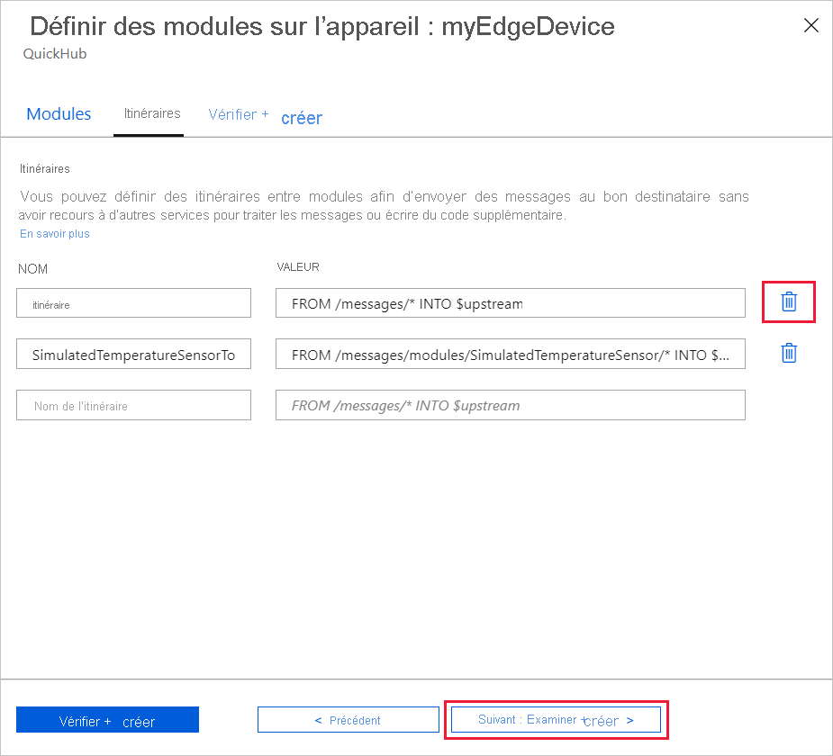
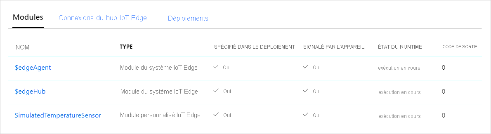
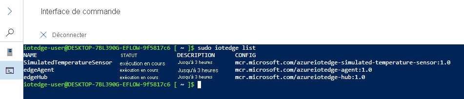

# <a name="quickstart-deploy-your-first-iot-edge-module-to-a-windows-device"></a>Démarrage rapide : Déployer votre premier module IoT Edge sur un appareil Windows

[!INCLUDE [iot-edge-version-201806](../../includes/iot-edge-version-201806.md)]

Essayez Azure IoT Edge dans ce guide de démarrage rapide en déployant du code conteneurisé sur un appareil IoT Edge Linux sur Windows. IoT Edge vous permet de gérer à distance du code sur vos appareils afin que vous puissiez envoyer plus de charges de travail à la périphérie. Pour ce guide de démarrage rapide, nous vous recommandons d’utiliser votre propre appareil pour voir combien il est facile d’utiliser Azure IoT Edge pour Linux sur Windows.

Dans ce guide de démarrage rapide, vous apprenez à :

* Créez un hub IoT.
* Inscrivez un appareil IoT Edge dans votre IoT Hub.
* Installer et démarrer le runtime IoT Edge pour Linux sur Windows sur votre appareil.
* Déployer à distance un module sur un appareil IoT Edge et envoyer des données de télémétrie.


Ce guide de démarrage rapide vous guide tout au long de la configuration de votre appareil Azure IoT Edge pour Linux sur Windows. Ensuite, vous déploierez un module du portail Azure sur votre appareil. Le module que vous utiliserez est un capteur simulé qui génère des données de pression, d’humidité et de température. D’autres tutoriels Azure IoT Edge s’appuient sur le travail que vous effectuez ici en déployant des modules qui analysent les données simulées pour obtenir des insights métier.

Si vous n’avez pas d’abonnement Azure actif, créez un [compte gratuit](https://azure.microsoft.com/free) avant de commencer.

## <a name="prerequisites"></a>Prérequis

Préparez votre environnement pour l’interface Azure CLI.

[!INCLUDE [azure-cli-prepare-your-environment-no-header.md](../../includes/azure-cli-prepare-your-environment-no-header.md)]

Créez un groupe de ressources cloud permettant de gérer toutes les ressources que vous utilisez dans le cadre de ce guide de démarrage rapide.

   ```azurecli-interactive
   az group create --name IoTEdgeResources --location westus2
   ```

Assurez-vous que votre appareil IoT Edge répond à la configuration requise suivante :

* Éditions
  * Windows 10 version 1809 ou ultérieure ; build 17763 ou ultérieure
    * Professional, Enterprise, IoT Enterprise
  * Windows Server 2019 build 17763 ou version ultérieure

* Configuration matérielle requise
  * Mémoire disponible minimale : 1 Go
  * Espace disque disponible minimal : 10 Go

>[!NOTE]
>Ce démarrage rapide utilise PowerShell pour créer un déploiement d’IoT Edge pour Linux sur Windows. Vous pouvez également utiliser Windows Admin Center. Si vous souhaitez utiliser Windows Admin Center pour créer votre déploiement, suivez les étapes décrites dans le guide pratique sur [l’installation et l’approvisionnement d’Azure IoT Edge pour Linux sur un appareil Windows](how-to-install-iot-edge-on-windows.md?tabs=windowsadmincenter).

## <a name="create-an-iot-hub"></a>Créer un hub IoT

Commencez en créant un hub IoT avec Azure CLI.


Le niveau gratuit d’Azure IoT Hub fonctionne pour ce guide de démarrage rapide. Si vous avez utilisé IoT Hub par le passé et que vous avez créé un hub, vous pouvez utiliser ce hub IoT.

Le code suivant crée un hub **F1** gratuit dans le groupe de ressources `IoTEdgeResources`. Remplacez `{hub_name}` par un nom unique pour votre hub IoT. La création de votre hub IoT peut prendre plusieurs minutes.

```azurecli-interactive
az iot hub create --resource-group IoTEdgeResources --name {hub_name} --sku F1 --partition-count 2
```

Si vous obtenez une erreur parce que vous disposez déjà d’un hub gratuit dans votre abonnement, remplacez la référence SKU par `S1`. Si vous recevez une erreur indiquant que le nom du hub IoT n’est pas disponible, cela signifie que quelqu’un d’autre a déjà un hub portant ce nom. Essayez avec un autre nom.

## <a name="register-an-iot-edge-device"></a>Enregistrer un appareil IoT Edge

Inscrivez l’appareil IoT Edge avec votre IoT Hub récemment créé.


Créez une identité d’appareil pour votre appareil simulé afin qu’il puisse communiquer avec votre IoT Hub. L’identité d’appareil se trouve dans le cloud, et une chaîne unique de connexion d’appareil vous permet d’associer un appareil physique à une identité d’appareil.

Les appareils IoT Edge se comportent et peuvent être gérés différemment des appareils IoT classiques. Utilisez l’indicateur `--edge-enabled` pour déclarer que cette identité est destinée à un appareil IoT Edge.

1. Dans Azure Cloud Shell, entrez la commande suivante pour créer un appareil nommé **myEdgeDevice** dans votre hub.

     ```azurecli-interactive
     az iot hub device-identity create --device-id myEdgeDevice --edge-enabled --hub-name {hub_name}
     ```

     Si vous recevez une erreur relative aux clés de stratégie `iothubowner`, vérifiez que Cloud Shell exécute la dernière version de l’extension Azure IoT.

1. Affichez la chaîne de connexion pour votre appareil, qui lie votre appareil physique à l’aide de son identité dans IoT Hub. Elle contient le nom de votre hub IoT, le nom de votre appareil et une clé partagée qui authentifie les connexions entre les deux.

     ```azurecli-interactive
     az iot hub device-identity connection-string show --device-id myEdgeDevice --hub-name {hub_name}
     ```

1. Copiez la valeur de la clé `connectionString` à partir de la sortie JSON et enregistrez-la. Cette valeur est la chaîne de connexion de l’appareil. Vous l’utiliserez pour configurer le runtime IoT Edge dans la section suivante.

     

## <a name="install-and-start-the-iot-edge-runtime"></a>Installer et démarrer le runtime IoT Edge

Installez IoT Edge pour Linux sur Windows sur votre appareil, et configurez-le avec la chaîne de connexion d’appareil.


Exécutez les commandes PowerShell suivantes sur l’appareil cible sur lequel vous souhaitez déployer Azure IoT Edge pour Linux sur Windows. Pour déployer sur un appareil cible distant à l’aide de PowerShell, utilisez [PowerShell distant](/powershell/module/microsoft.powershell.core/about/about_remote) pour établir une connexion à un appareil distant et exécuter ces commandes à distance sur cet appareil.

1. Dans une session PowerShell avec élévation de privilèges, exécutez chacune des commandes suivantes pour télécharger IoT Edge pour Linux sur Windows.

   ```powershell
   $msiPath = $([io.Path]::Combine($env:TEMP, 'AzureIoTEdge.msi'))
   $ProgressPreference = 'SilentlyContinue'
   Invoke-WebRequest "https://aka.ms/AzEflowMSI" -OutFile $msiPath
   ```

1. Installez IoT Edge pour Linux sur Windows sur votre appareil.

   ```powershell
   Start-Process -Wait msiexec -ArgumentList "/i","$([io.Path]::Combine($env:TEMP, 'AzureIoTEdge.msi'))","/qn"
   ```

1. Définissez la stratégie d’exécution sur l’appareil cible sur `AllSigned` si ce n’est pas déjà fait. Vous pouvez vérifier la stratégie d’exécution actuelle dans une invite PowerShell avec élévation de privilèges à l’aide de :

   ```powershell
   Get-ExecutionPolicy -List
   ```

   Si la stratégie d’exécution de `local machine` n’est pas `AllSigned`, vous pouvez la définir à l’aide de :

   ```powershell
   Set-ExecutionPolicy -ExecutionPolicy AllSigned -Force
   ```

1. Créer le déploiement d’IoT Edge pour Linux sur Windows.

   ```powershell
   Deploy-Eflow
   ```

1. Entrez « Y » pour accepter les termes du contrat de licence.

1. Entrez « O » ou « R » pour activer ou désactiver les **données de diagnostic facultatives** à votre convenance. Voici l’illustration d’un déploiement réussi.

   

1. Approvisionnez votre appareil à l’aide de la chaîne de connexion de l’appareil que vous avez récupérée dans la section précédente. Remplacez le texte de l’espace réservé par votre propre valeur.

   ```powershell
   Provision-EflowVm -provisioningType ManualConnectionString -devConnString "<CONNECTION_STRING_HERE>"
   ```

Votre appareil IoT Edge est maintenant configuré. Il est prêt à exécuter les modules déployés dans le cloud.

## <a name="deploy-a-module"></a>Déployer un module

Gérez votre appareil Azure IoT Edge depuis le cloud pour déployer un module qui transmet des données de télémétrie à IoT Hub.


<!--
[!INCLUDE [iot-edge-deploy-module](../../includes/iot-edge-deploy-module.md)]

Include content included below to support versioned steps in Linux quickstart. Can update include file once Windows quickstart supports v1.2
-->

Le déploiement de code sur vos appareils IoT Edge à partir du cloud constitue l’une des fonctionnalités clés d’Azure IoT Edge. Les *modules IoT Edge* sont des packages exécutables implémentés en tant que conteneurs. Dans cette section, vous allez déployer un module prédéfini à partir de la [section Modules IoT Edge de la Place de Marché Azure](https://azuremarketplace.microsoft.com/marketplace/apps/category/internet-of-things?page=1&subcategories=iot-edge-modules) directement à partir d’Azure IoT Hub.

Le module que vous déployez dans cette section simule un capteur et envoie les données générées. Ce module s’avère être un extrait de code utile quand vous prenez en main IoT Edge, car vous pouvez utiliser les données simulées à des fins de développement et de test. Si vous souhaitez voir exactement ce que fait ce module, vous pouvez afficher le [code source du capteur de température simulé](https://github.com/Azure/iotedge/blob/027a509549a248647ed41ca7fe1dc508771c8123/edge-modules/SimulatedTemperatureSensor/src/Program.cs).

Effectuez les étapes suivantes pour déployer votre premier module à partir de la Place de Marché Azure.

1. Connectez-vous au [portail Azure](https://portal.azure.com) et accédez à votre hub IoT.

1. Dans le menu de gauche, sous **Gestion automatique des appareils**, sélectionnez **IoT Edge**.

1. Sélectionnez l’ID de l’appareil cible dans la liste des appareils.

1. Dans la barre supérieure, sélectionnez **Définir des modules**.

   

1. Sous **Modules IoT Edge**, ouvrez le menu déroulant **Ajouter**, puis sélectionnez **Module de la Place de marché**.

   

1. Sous **Place de marché de module IoT Edge**, recherchez et sélectionnez le module `Simulated Temperature Sensor`.

   Le module est ajouté à la section Modules IoT Edge avec l’état souhaité **en cours d’exécution**.

1. Sélectionnez **Suivant : Routes** pour passer à l’étape suivante de l’Assistant.

   

1. Sous l’onglet **Routes**, supprimez la route par défaut **route**, puis sélectionnez **Suivant : Vérifier + créer** pour passer à l’étape suivante de l’Assistant.

   >[!Note]
   >Les routes sont construites à l’aide de paires nom/valeur. Vous devez voir deux routes sur cette page. La route par défaut **route** envoie tous les messages à IoT Hub (on emploie le terme `$upstream`). Une deuxième route appelée **SimulatedTemperatureSensorToIoTHub** a été créée automatiquement quand vous avez ajouté le module à partir de la Place de Marché Azure. Cette route envoie tous les messages du module de température simulé à IoT Hub. Vous pouvez supprimer la route par défaut, car elle est redondante dans ce cas.

   

1. Passez en revue le fichier JSON, puis sélectionnez **Créer**. Le fichier JSON définit tous les modules que vous déployez sur votre appareil IoT Edge. Vous voyez le module **SimulatedTemperatureSensor** ainsi que les deux modules runtime **edgeAgent** et **edgeHub**.

   >[!Note]
   >Lorsque vous envoyez un nouveau déploiement vers un appareil IoT Edge, rien n’est envoyé en mode push à votre appareil. Au lieu de cela, l’appareil interroge régulièrement IoT Hub pour connaître les nouvelles instructions. Si l’appareil détecte un manifeste de déploiement mis à jour, il utilise les informations sur le nouveau déploiement pour extraire les images de module à partir du cloud, puis commence à exécuter localement les modules. Ce processus peut prendre plusieurs minutes.

1. Une fois que vous avez créé les détails de déploiement du module, l’Assistant vous renvoie à la page de détails de l’appareil. Visualisez l’état du déploiement sous l’onglet **Modules**.

   Vous devez voir trois modules : **$edgeAgent**, **$edgeHub** et **SimulatedTemperatureSensor**. Si la valeur **Oui** apparaît dans la colonne **SPÉCIFIÉ DANS LE DÉPLOIEMENT** mais pas dans la colonne **SIGNALÉ PAR L’APPAREIL** pour un ou plusieurs modules, cela signifie que votre appareil IoT Edge est encore en train de les démarrer. Attendez quelques minutes, puis actualisez la page.

   

## <a name="view-the-generated-data"></a>Afficher les données générées

Dans ce guide de démarrage rapide, vous avez créé un nouveau périphérique IoT Edge et installé le runtime IoT Edge. Puis vous avez utilisé le portail Azure pour déployer un module IoT Edge afin de l’exécuter sur l’appareil sans avoir à apporter des modifications à l’appareil lui-même.

Le module que vous avez envoyé (push) génère des exemples de données d’environnement que vous pouvez utiliser pour les tests ultérieurement. Le capteur simulé surveille à la fois une machine et l’environnement de la machine. Par exemple, ce capteur peut être installé dans une salle de serveurs, dans une usine ou sur une éolienne. Les messages qu’il envoie incluent la température et l’humidité ambiantes, la température et la pression de la machine ainsi qu’un horodatage. Les tutoriels IoT Edge se servent des données créées par ce module comme données de test pour l’analytique.

1. Connectez-vous à votre IoT Edge pour Linux sur machine virtuelle Windows en utilisant la commande suivante dans votre session PowerShell :

   ```powershell
   Connect-EflowVm
   ```

   >[!NOTE]
   >Le seul compte autorisé à accéder via SSH à la machine virtuelle est celui de l’utilisateur qui l’a créée.

1. Une fois connecté, vous pouvez vérifier la liste des modules IoT Edge en cours d’exécution à l’aide de la commande Linux suivante :

   ```bash
   sudo iotedge list
   ```

   

1. Consultez les messages envoyés du module de capteur de température vers le cloud à l’aide de la commande Linux suivante :

   ```bash
   sudo iotedge logs SimulatedTemperatureSensor -f
   ```

   >[!IMPORTANT]
   >Les commandes IoT Edge sont sensibles à la casse quand elles font référence à des noms de module.

   

Vous pouvez également utiliser l’[extension Azure IoT Hub pour Visual Studio Code](https://marketplace.visualstudio.com/items?itemName=vsciot-vscode.azure-iot-toolkit) pour voir les messages arriver sur votre hub IoT.

## <a name="clean-up-resources"></a>Nettoyer les ressources

Si vous souhaitez poursuivre avec les tutoriels IoT Edge, ignorez cette étape. Vous pouvez utiliser l’appareil que vous avez inscrit et configuré dans le cadre de ce guide de démarrage rapide. Sinon, vous pouvez supprimer les ressources Azure que vous avez créées dans cet article pour éviter les frais.

Si vous avez créé votre machine virtuelle et un IoT Hub dans un nouveau groupe de ressources, vous pouvez supprimer ce groupe et toutes les ressources associées. Si vous ne voulez pas supprimer tout le groupe, vous pouvez supprimer des ressources individuelles.

> [!IMPORTANT]
> Vérifiez le contenu du groupe de ressources pour être certain que vous ne voulez rien en conserver. La suppression d’un groupe de ressources est irréversible.

Utilisez la commande suivante pour supprimer le groupe **IoTEdgeResources**. La suppression peut prendre quelques minutes.

```azurecli-interactive
az group delete --name IoTEdgeResources
```

Vous pouvez vérifier que le groupe de ressources est supprimé en consultant la liste des groupes de ressources à l’aide de cette commande.

```azurecli-interactive
az group list
```

### <a name="remove-azure-iot-edge-for-linux-on-windows"></a>Supprimer Azure IoT Edge pour Linux sur Windows

Utilisez l’extension du tableau de bord dans Windows Admin Center pour désinstaller Azure IoT Edge pour Linux sur Windows.

1. Connectez-vous à l’appareil IoT Edge dans Windows Admin Center. L’extension de l’outil de tableau de bord Azure est chargée.

1. Sélectionner **Désinstaller**. Une fois Azure IoT Edge supprimé, Windows Admin Center supprime l’entrée de la connexion de l’appareil Azure IoT Edge dans la **page d’accueil**.

>[!Note]
>Une autre manière de supprimer Azure IoT Edge de votre système Windows consiste à sélectionner **Démarrer** > **Paramètres** > **Applications** > **Azure IoT Edge LTS** > **Désinstaller** sur votre appareil IoT Edge. Cette opération supprime Azure IoT Edge de votre appareil IoT Edge, mais conserve la connexion dans Windows Admin Center. Pour terminer la suppression, désinstallez également Windows Admin Center à partir du menu **Paramètres**.

## <a name="next-steps"></a>Étapes suivantes

Dans ce guide de démarrage rapide, vous avez créé un appareil IoT Edge et utilisé l’interface cloud Azure IoT Edge pour déployer du code sur l’appareil. Vous avez désormais un appareil de test générant des données brutes sur son environnement.

Vous allez maintenant configurer votre environnement de développement local pour pouvoir commencer à créer des modules IoT Edge qui exécutent votre logique métier.

> [!div class="nextstepaction"]
> [Commencer à développer des modules IoT Edge](tutorial-develop-for-linux.md)
