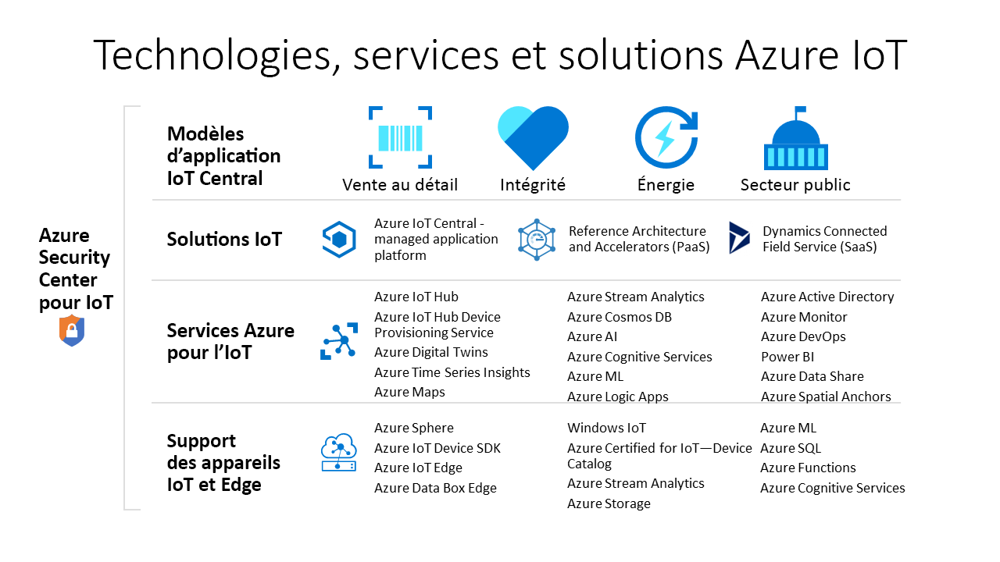

# Technologies et services Azure disponibles pour créer des solutions IoT

Les technologies et services Azure IoT offrent diverses options pour créer un large éventail de solutions IoT qui vous aideront à mener la transformation numérique de votre organisation. Vous pouvez par exemple :

- Utiliser [Azure IoT Central](https://apps.azureiotcentral.com), une plateforme d’applications IoT managées, pour créer et déployer une solution IoT d’entreprise sécurisée. IoT Central propose un ensemble de modèles d’application métier, notamment pour les secteurs de la santé et de la vente au détail, qui accélèrent le processus de développement de votre solution.
- Étendre la base de code open source d’un [accélérateur de solution](https://www.azureiotsolutions.com) Azure IoT pour implémenter un scénario IoT courant, par exemple, la surveillance à distance ou la maintenance prédictive.
- Utiliser les services de la plateforme Azure IoT comme [Azure IoT Hub](../iot-hub/about-iot-hub.md) et les kits [Azure IoT device SDK](../iot-hub/iot-hub-devguide-sdks.md) pour créer une solution IoT personnalisée à partir de zéro.

## Azure IoT Central

La [plateforme d’applications IoT Central](https://apps.azureiotcentral.com) réduit la charge de travail et les coûts associés au développement, à la gestion et à la maintenance des solutions IoT d’entreprise. L’interface utilisateur web personnalisable d’IoT Central vous permet de superviser les conditions des appareils, de créer des règles et de gérer des millions d’appareils et leurs données tout au long de leur cycle de vie. La surface d’API dans IoT Central fournit un accès programmatique pour configurer votre solution IoT et interagir avec elle.

Azure IoT Central est une plateforme d’applications complètement managée que vous pouvez utiliser pour créer des solutions IoT personnalisées. IoT Central se sert de modèles d’application pour créer des solutions. Il existe des modèles conçus pour les solutions générales et d’autres pour des secteurs d’activité spécifiques (par exemple, l’énergie, la santé, le secteur public et la distribution). Avec les modèles d’application IoT Central, vous pouvez déployer une application IoT Central en quelques minutes seulement, puis la personnaliser en configurant les thèmes, tableaux de bord et vues.

Choisissez des appareils dans le [catalogue d’appareils Azure Certified pour IoT](https://catalog.azureiotsolutions.com) pour les connecter rapidement à votre solution. Utilisez l’interface utilisateur web IoT Central pour superviser et gérer vos appareils afin d’en garantir l’intégrité et la connexion. Utilisez des connecteurs et des API pour intégrer votre application IoT Central à d’autres applications métier.

Étant une plateforme d’applications complètement managée, IoT Central a un modèle tarifaire simple et prévisible.

## Accélérateurs de solution Azure IoT

Les [accélérateurs de solution Azure IoT](https://www.azureiotsolutions.com) sont un ensemble de solutions d’entreprise personnalisables. Vous pouvez déployer en l’état les solutions fournies, ou créer une solution IoT personnalisée à l’aide du code source Java ou .NET open source.

Les accélérateurs de solution Azure IoT offrent un niveau élevé de contrôle sur votre solution IoT. Les accélérateurs de solution incluent des solutions prédéfinies pour les scénarios d’IoT courants que vous pouvez déployer dans votre abonnement Azure en quelques minutes. Il s’agit entre autres des scénarios suivants :

  - Surveillance à distance
  - Fabrique connectée
  - Maintenance prédictive
  - Simulation d’appareil

La base de code open source de tous les accélérateurs de solution est disponible sur GitHub. Téléchargez le code pour personnaliser un accélérateur de solution selon vos besoins en IoT.

Les accélérateurs de solution s’appuient sur des services Azure comme Azure IoT Hub et le Stockage Azure que vous devez gérer dans votre abonnement Azure.

## Solutions personnalisées

Pour créer une solution IoT à partir de zéro ou étendre une solution créée à l’aide d’IoT Central ou d’un accélérateur de solution, utilisez une ou plusieurs des technologies et services Azure IoT suivants :

### Appareils

Développez vos appareils IoT à l’aide de l’un des [starter kits Azure IoT](https://catalog.azureiotsolutions.com/kits) ou choisissez un appareil à utiliser dans le [catalogue d’appareils Azure Certified pour IoT](https://catalog.azureiotsolutions.com). Implémentez votre code incorporé à l’aide des kits [device SDK](../iot-hub/iot-hub-devguide-sdks.md) open source. Les kits device SDK prennent en charge de nombreux systèmes d’exploitation, comme Linux, Windows et les systèmes d’exploitation en temps réel. Il existe des SDK pour différents langages de programmation, tels que [C](https://github.com/Azure/azure-iot-sdk-c), [Node.js](https://github.com/Azure/azure-iot-sdk-node), [Java](https://github.com/Azure/azure-iot-sdk-java), [.NET](https://github.com/Azure/azure-iot-sdk-csharp) et [Python](https://github.com/Azure/azure-iot-sdk-python).

Vous pouvez simplifier encore davantage la création du code incorporé pour vos appareils en utilisant le service [IoT Plug-and-Play (préversion)](../iot-pnp/overview-iot-plug-and-play.md). Avec IoT Plug-and-Play, les développeurs de solutions peuvent intégrer des appareils avec leurs solutions sans avoir à écrire du code incorporé. Au cœur d’IoT Plug-and-Play est un schéma de _modèle de capacité d’appareil_ qui décrit les capacités de l’appareil. Utilisez le modèle de capacité d’appareil pour générer votre code d’appareil incorporé et configurer une solution cloud telle qu’une application IoT Central.

[Azure IoT Edge](../iot-edge/about-iot-edge.md) vous permet de décharger des parties de la charge de travail IoT de vos services cloud Azure vers vos appareils. IoT Edge contribue à réduire la latence dans votre solution et le volume de données échangées entre vos appareils, et il prend en charge les scénarios hors connexion. Vous pouvez gérer les appareils IoT Edge à partir d’IoT Central et de certains accélérateurs de solution.

[Azure Sphere](https://docs.microsoft.com/azure-sphere/product-overview/what-is-azure-sphere) est une plateforme d’applications générales sécurisée qui présente des fonctionnalités de sécurité et de communication intégrées pour les appareils connectés à Internet. Elle comprend une unité de microcontrôleur, un système d'exploitation Linux personnalisé et un service de sécurité cloud qui garantit une sécurité continue et renouvelable.

### Connectivité au cloud

Le service [Azure IoT Hub](../iot-hub/about-iot-hub.md) assure des communications bidirectionnelles fiables et sécurisées entre des millions d’appareils IoT et une solution cloud. Le [service IoT Hub Device Provisioning](../iot-dps/about-iot-dps.md) est un service d’assistance pour IoT Hub. Il permet le provisionnement juste-à-temps des appareils sur le hub IoT approprié, sans aucune intervention humaine. Grâce à ces fonctionnalités, les clients peuvent provisionner des millions d’appareils de manière sécurisée et évolutive.

IoT Hub est un composant essentiel des accélérateurs de solution qui vous aide à remplir certaines exigences de l’implémentation de solutions IoT :

* Connectivité et gestion de haut volume d’appareils.
* Ingestion de télémétrie de haut volume.
* Commande et contrôle des appareils.
* Application de la sécurité des appareils.

### Rapprocher le monde numérique et le monde physique

[Azure Digital Twins](../digital-twins/about-digital-twins.md) est un service IoT qui vous permet de modéliser un environnement physique. Il se sert d’un graphique d’intelligence spatiale pour modéliser les relations entre les personnes, les espaces et les appareils. En mettant en corrélation les données entre le monde numérique et le monde physique, vous pouvez créer des solutions en fonction du contexte.

IoT Central utilise des jumeaux numériques pour synchroniser les appareils et les données dans le monde réel avec les modèles numériques avec lesquels les utilisateurs supervisent et gèrent ces appareils connectés.

### Données et analyse

Les appareils IoT génèrent souvent de grandes quantités de données de série chronologique, telles que les valeurs de température des capteurs. [Azure Time Series Insights](../time-series-insights/time-series-insights-overview.md) peut se connecter à un hub IoT, lire le flux de données de télémétrie transmis par vos appareils et stocker ces données ; il vous permet aussi d’interroger et de visualiser les données collectées.

[Azure Maps](/azure/azure-maps) est une collection de services géospatiaux qui utilisent des données cartographiques pour fournir un contexte géographique précis à des applications web et mobiles. Vous pouvez utiliser une API REST, un contrôle JavaScript web ou un kit Android SDK pour créer vos applications.

## Étapes suivantes

Pour une expérience pratique, essayez l’un de ces guides de démarrage rapide :

- [Créer une application Azure IoT Central](../iot-central/core/quick-deploy-iot-central.md)
- [Send telemetry from a device to an IoT hub (Envoyer des données de télémétrie d’un appareil à un IoT Hub)](../iot-hub/quickstart-send-telemetry-cli.md)
- [Essayer une solution de supervision informatique à distance](../iot-accelerators/quickstart-remote-monitoring-deploy.md)
