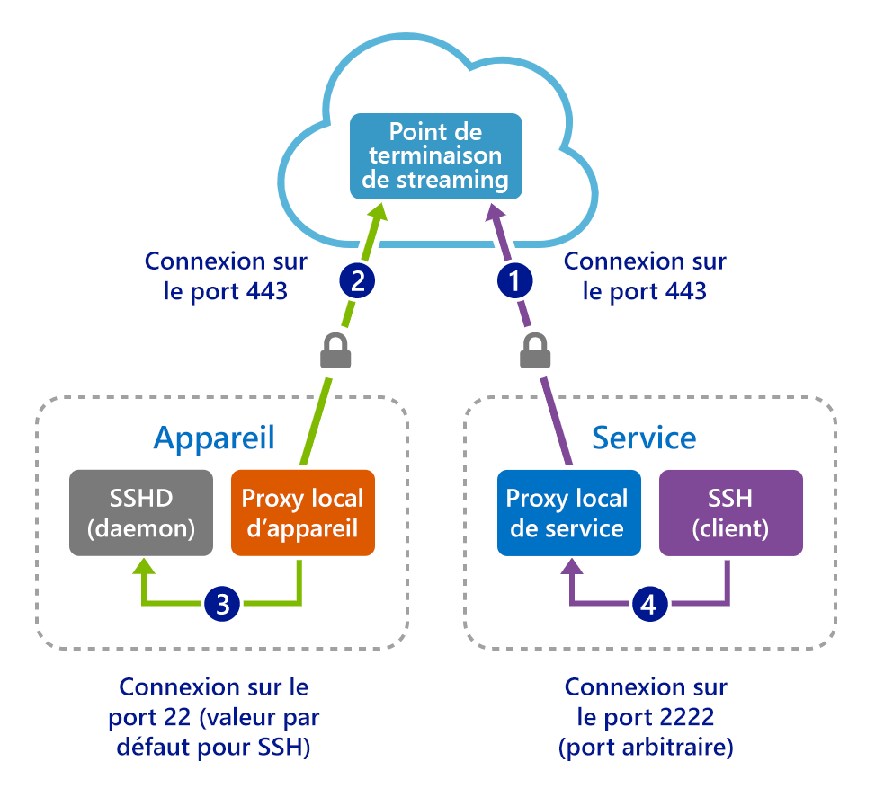

# <a name="quickstart-enable-ssh-and-rdp-over-an-iot-hub-device-stream-by-using-a-c-proxy-application-preview"></a>Démarrage rapide : Activer SSH et RDP sur un flux d’appareil IoT Hub à l’aide d’une application de proxy C (préversion)

[!INCLUDE [iot-hub-quickstarts-4-selector](../../includes/iot-hub-quickstarts-4-selector.md)]

Azure IoT Hub prend actuellement en charge les flux d’appareil en tant que [fonctionnalité d’évaluation](https://azure.microsoft.com/support/legal/preview-supplemental-terms/).

Les [flux d’appareil IoT Hub](./iot-hub-device-streams-overview.md) permettent aux applications de service et d’appareil de communiquer de manière sécurisée à travers des pare-feux. Pour obtenir une vue d’ensemble de la configuration, consultez [la page Exemple de proxy local](./iot-hub-device-streams-overview.md#local-proxy-sample-for-ssh-or-rdp).

Ce guide de démarrage rapide décrit la configuration du tunneling du trafic Secure Shell (SSH) (qui utilise le port 22) par le biais de flux d’appareil. La configuration pour le trafic du protocole RDP (Remote Desktop Protocol) est similaire et nécessite une simple modification. Étant donné que les flux d’appareil ne dépendent pas des applications et des protocoles, vous pouvez modifier ce démarrage rapide pour prendre en charge d’autres types de trafic d’application.

## <a name="how-it-works"></a>Fonctionnement

La figure suivante illustre la manière dont les programmes de proxy locaux d’appareil et de service active une connectivité de bout en bout entre le client SSH et les processus de démon SSH. Dans la préversion publique, le SDK C prend uniquement en charge les flux d’appareil côté appareil. Ainsi, le présent guide de démarrage rapide aborde uniquement les instructions permettant d’exécuter l’application de proxy locale de l’appareil. Pour générer et exécuter l’application côté service d’accompagnement, suivez les instructions données dans l’un des guides de démarrage rapide suivants :

* [SSH/RDP sur des flux d'appareil IoT Hub à l'aide d'une application proxy C#](./quickstart-device-streams-proxy-csharp.md)
* [SSH/RDP sur des flux d'appareil IoT Hub à l'aide d'une application proxy NodeJS](./quickstart-device-streams-proxy-nodejs.md)



1. Le proxy local de service se connecte au hub IoT et lance un flux d’appareil sur l’appareil cible.

2. Le proxy local d’appareil termine la négociation du lancement du flux et établit un tunnel de streaming de bout en bout par le biais du point de terminaison de streaming du hub IoT côté service.

3. Le proxy local d’appareil se connecte au démon SSH qui écoute le port 22 sur l’appareil. Ce paramètre est configurable, comme décrit dans la section « Exécuter l’application proxy locale de l’appareil ».

4. Le proxy local de service attend de nouvelles connexions SSH de la part d’un utilisateur en écoutant un port désigné, le port 2222 ici. Ce paramètre est configurable, comme décrit dans la section « Exécuter l’application proxy locale de l’appareil ». Quand l’utilisateur se connecte par le biais d’un client SSH, le tunnel permet au trafic d’application SSH d’être transféré entre les programmes client et serveur SSH.

> [!NOTE]
> Le trafic SSH envoyé sur un flux d’appareil est traité par tunnel par le biais d’un point de terminaison de streaming du hub IoT, plutôt que directement entre le service et l’appareil. Pour plus d’informations, consultez les [avantages de l’utilisation des flux d’appareil Iot Hub](iot-hub-device-streams-overview.md#benefits). De plus, la figure illustre le démon SSH en cours d’exécution sur le même appareil (ou ordinateur) que le proxy local de l’appareil. Dans ce guide de démarrage rapide, le fait de fournir l’adresse IP du démon SSH permet au proxy local de l’appareil et au démon de s’exécuter également sur des ordinateurs différents.

[!INCLUDE [cloud-shell-try-it.md](../../includes/cloud-shell-try-it.md)]

Si vous n’avez pas d’abonnement Azure, créez un [compte gratuit](https://azure.microsoft.com/free/?WT.mc_id=A261C142F) avant de commencer.

## <a name="prerequisites"></a>Prérequis

* Pour le moment, la préversion des flux d’appareil est uniquement prise en charge pour les hubs IoT créés dans les régions suivantes :

  * USA Centre
  * EUAP USA Centre
  * Europe Nord
  * Asie Sud-Est

* Installez [Visual Studio 2019](https://www.visualstudio.com/vs/) avec la charge de travail [Développement Desktop en C++](https://www.visualstudio.com/vs/support/selecting-workloads-visual-studio-2017/) activée.
* Installez la dernière version de [Git](https://git-scm.com/download/).

* Exécutez la commande suivante afin d’ajouter l’extension Azure IoT pour Azure CLI à votre instance Cloud Shell. L’extension IoT ajoute des commandes IoT Hub, IoT Edge et IoT Device Provisioning Service (DPS) à Azure CLI.

   ```azurecli-interactive
   az extension add --name azure-iot
   ```

[!INCLUDE [iot-hub-cli-version-info](../../includes/iot-hub-cli-version-info.md)]

## <a name="prepare-the-development-environment"></a>Préparer l’environnement de développement

Pour ce guide de démarrage rapide, vous utilisez [Azure IoT device SDK for C](iot-hub-device-sdk-c-intro.md). Vous préparez un environnement de développement pour cloner et générer le [SDK C Azure IoT](https://github.com/Azure/azure-iot-sdk-c) à partir de GitHub. Le SDK sur GitHub comprend l’exemple de code utilisé dans ce guide de démarrage rapide.

1. Téléchargez le [système de génération CMake](https://cmake.org/download/).

    Important : les composants requis pour Visual Studio (Visual Studio et la charge de travail *Développement Desktop en C++* ) sont installés sur votre machine *avant* de commencer l’installation de CMake. Une fois les prérequis en place et le téléchargement vérifié, vous pouvez installer le système de génération CMake.

1. Ouvrez une invite de commandes ou l’interpréteur de commandes Git Bash. Exécutez les commandes suivantes pour cloner le dépôt GitHub du [SDK Azure IoT pour C](https://github.com/Azure/azure-iot-sdk-c) :

    ```cmd/sh
    git clone -b public-preview https://github.com/Azure/azure-iot-sdk-c.git
    cd azure-iot-sdk-c
    git submodule update --init
    ```

    Cette opération doit prendre quelques minutes.

1. Créez un sous-répertoire *cmake* dans le répertoire racine du dépôt Git et accédez à ce dossier. Exécutez les commandes suivantes à partir du répertoire *azure-iot-sdk-c* :

    ```cmd/sh
    mkdir cmake
    cd cmake
    ```

1. Exécutez les commandes suivantes à partir du répertoire *cmake* pour générer une version du SDK propre à votre plateforme cliente de développement.

   * Dans Linux :

      ```bash
      cmake ..
      make -j
      ```

   * Dans Windows, exécutez les commandes suivantes à l’invite de commandes développeur pour Visual Studio 2015 ou 2017. Une solution Visual Studio pour l’appareil simulé est générée dans le répertoire *cmake*.

      ```cmd
      rem For VS2015
      cmake .. -G "Visual Studio 14 2015"

      rem Or for VS2017
      cmake .. -G "Visual Studio 15 2017"

      rem Or for VS2019
      cmake .. -G "Visual Studio 16 2019"

      rem Then build the project
      cmake --build . -- /m /p:Configuration=Release
      ```

## <a name="create-an-iot-hub"></a>Créer un hub IoT

[!INCLUDE [iot-hub-include-create-hub](../../includes/iot-hub-include-create-hub.md)]

## <a name="register-a-device"></a>Inscrire un appareil

Un appareil doit être inscrit dans votre hub IoT pour pouvoir se connecter. Dans cette section, vous utilisez Azure Cloud Shell avec l’[extension IoT](https://docs.microsoft.com/cli/azure/ext/azure-iot/iot?view=azure-cli-latest) pour inscrire un appareil simulé.

1. Pour créer l’identité d’appareil, exécutez la commande suivante dans Cloud Shell :

   > [!NOTE]
   > * Remplacez l’espace réservé *YourIoTHubName* par le nom que vous avez choisi pour votre hub IoT.
   > * Pour le nom de l’appareil que vous êtes en train d’inscrire, nous vous recommandons d’utiliser *MyDevice* comme indiqué. Si vous choisissez un autre nom pour votre appareil, utilisez-le pour l’ensemble de cet article et mettez à jour le nom de l’appareil dans les exemples d’application avant de les exécuter.

    ```azurecli-interactive
    az iot hub device-identity create --hub-name {YourIoTHubName} --device-id MyDevice
    ```

1. Pour obtenir la *chaîne de connexion d’appareil* pour celui que vous venez d’inscrire, exécutez les commandes suivantes dans Cloud Shell :

   > [!NOTE]
   > Remplacez l’espace réservé *YourIoTHubName* par le nom que vous avez choisi pour votre hub IoT.

    ```azurecli-interactive
    az iot hub device-identity show-connection-string --hub-name {YourIoTHubName} --device-id MyDevice --output table
    ```

    Notez la chaîne de connexion d’appareil retournée ; vous en aurez besoin plus loin dans ce guide de démarrage rapide. Cela ressemble à l’exemple suivant :

   `HostName={YourIoTHubName}.azure-devices.net;DeviceId=MyDevice;SharedAccessKey={YourSharedAccessKey}`

## <a name="ssh-to-a-device-via-device-streams"></a>Liaison SSH à un appareil par le biais de flux d’appareil

Dans cette section, vous allez établir un flux de bout en bout pour tunneler le trafic SSH.

### <a name="run-the-device-local-proxy-application"></a>Exécuter l’application proxy locale de l’appareil

1. Modifiez le fichier source **iothub_client_c2d_streaming_proxy_sample.c** dans le dossier `iothub_client/samples/iothub_client_c2d_streaming_proxy_sample` et indiquez la chaîne de connexion de votre appareil, le nom d’hôte/l’adresse IP cible ainsi que le port SSH 22 :

   ```C
   /* Paste in your device connection string  */
   static const char* connectionString = "{DeviceConnectionString}";
   static const char* localHost = "{IP/Host of your target machine}"; // Address of the local server to connect to.
   static const size_t localPort = 22; // Port of the local server to connect to.
   ```

1. Compilez l’exemple :

   ```bash
   # In Linux
   # Go to the sample's folder cmake/iothub_client/samples/iothub_client_c2d_streaming_proxy_sample
   make -j
   ```

   ```cmd
   rem In Windows
   rem Go to cmake at root of repository
   cmake --build . -- /m /p:Configuration=Release
   ```

1. Exécutez le programme compilé sur l’appareil :

   ```bash
   # In Linux
   # Go to the sample's folder cmake/iothub_client/samples/iothub_client_c2d_streaming_proxy_sample
   ./iothub_client_c2d_streaming_proxy_sample
   ```

   ```cmd
   rem In Windows
   rem Go to the sample's release folder cmake\iothub_client\samples\iothub_client_c2d_streaming_proxy_sample\Release
   iothub_client_c2d_streaming_proxy_sample.exe
   ```

### <a name="run-the-service-local-proxy-application"></a>Exécuter l’application proxy locale du service

Comme indiqué dans la section « Fonctionnement », l’établissement d’un flux de bout en bout pour tunneliser le trafic SSH nécessite un proxy local à chaque extrémité (côté service et côté appareil). Dans la préversion publique, le SDK C IoT Hub prend uniquement en charge les flux d’appareil côté appareil. Pour générer et exécuter le proxy local de service, suivez les instructions de l’un des guides de démarrage rapide suivants :

   * [SSH/RDP sur des flux d'appareil IoT Hub à l'aide d'une application proxy C#](./quickstart-device-streams-proxy-csharp.md)
   * [SSH/RDP sur des flux d’appareil IoT Hub à l’aide d’une application de proxy Node.js](./quickstart-device-streams-proxy-nodejs.md)

### <a name="establish-an-ssh-session"></a>Établir une session SSH

Dès lors que les proxys locaux d’appareil et de service sont tous deux en cours d’exécution, utilisez votre programme client SSH et connectez-vous au proxy local de service sur le port 2222 (au lieu du démon SSH directement).

```cmd/sh
ssh {username}@localhost -p 2222
```

À ce stade, la fenêtre de connexion SSH vous invite à entrer vos informations d’identification.

L’image suivante montre la sortie de console sur le proxy local de l’appareil qui se connecte au démon SSH à l’adresse `IP_address:22` :


L’image suivante montre la sortie de console du programme client SSH. Le client SSH communique avec le démon SSH en se connectant au port 22 qu’écoute le proxy local de service :


## <a name="clean-up-resources"></a>Nettoyer les ressources

[!INCLUDE [iot-hub-quickstarts-clean-up-resources](../../includes/iot-hub-quickstarts-clean-up-resources-device-streams.md)]

## <a name="next-steps"></a>Étapes suivantes

Dans ce guide de démarrage rapide, vous avez configuré un hub IoT, inscrit un appareil, déployé un programme de proxy local d’appareil et de service pour établir un flux d’appareil par le biais d’IoT Hub, puis vous avez utilisé les proxys pour traiter par tunnel le trafic SSH.

Pour en savoir plus sur les flux d’appareil, consultez :

> [!div class="nextstepaction"]
> [Vue d’ensemble des flux d’appareil](./iot-hub-device-streams-overview.md)
