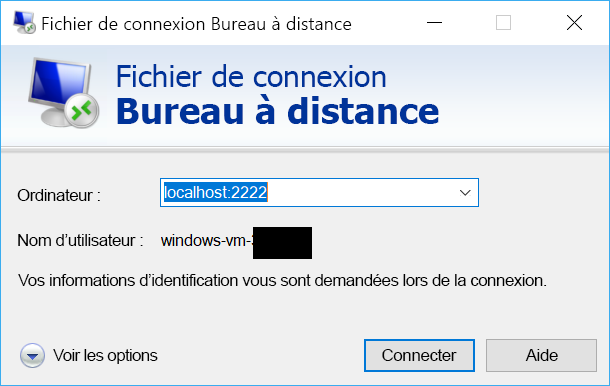

# <a name="quickstart-sshrdp-over-iot-hub-device-streams-using-c-proxy-applications-preview"></a>Démarrage rapide : SSH/RDP sur des flux d’appareil IoT Hub à l’aide d’applications proxy C# (préversion)

[!INCLUDE [iot-hub-quickstarts-4-selector](../../includes/iot-hub-quickstarts-4-selector.md)]

Microsoft Azure IoT Hub prend actuellement en charge les flux d’appareil en tant que [fonctionnalité d’évaluation](https://azure.microsoft.com/support/legal/preview-supplemental-terms/).

Les [flux d’appareil IoT Hub](./iot-hub-device-streams-overview.md) permettent aux applications de service et d’appareil de communiquer de manière sécurisée à travers des pare-feux. Ce guide de démarrage rapide implique deux programmes C# qui permettent d’envoyer le trafic d’applications clientes/serveur (SSH et RDP, par exemple) sur un flux d’appareil établi par le biais d’IoT Hub. Cliquez [ici](./iot-hub-device-streams-overview.md#local-proxy-sample-for-ssh-or-rdp) pour obtenir une vue d’ensemble de la configuration.

Tout d’abord, nous décrivons la configuration pour SSH (qui utilise le port 22). Nous décrivons ensuite comment modifier le port de la configuration pour RDP. Étant donné que les flux d’appareil ne dépendent pas des applications et des protocoles, vous pouvez modifier ce même exemple pour prendre en charge d’autres types de trafic d’application. Il suffit généralement pour cela de remplacer le port de communication par celui utilisé par l’application souhaitée.

## <a name="how-it-works"></a>Fonctionnement

La figure ci-dessous illustre la manière dont la configuration des programmes de proxys locaux d’appareil (et de service) de cet exemple active une connectivité de bout en bout entre le client SSH et le démon SSH. Ici, nous partons du principe que le démon est en cours d’exécution sur le même appareil que le proxy local d’appareil.


1. Le proxy local de service se connecte au hub IoT et lance un flux d’appareil sur l’appareil cible à l’aide de son ID d’appareil.

2. Le proxy local d’appareil termine la négociation du lancement du flux et établit un tunnel de streaming de bout en bout par le biais du point de terminaison de streaming IoT Hub côté service.

3. Le proxy local d’appareil se connecte au démon SSH (SSHD) qui écoute sur le port 22 de l’appareil (ce port est configurable, comme décrit [ci-dessous](#run-the-device-local-proxy)).

4. Le proxy local de service attend de nouvelles connexions SSH de l’utilisateur en écoutant un port désigné, dans cet exemple, le port 2222 (celui-ci est également configurable, comme décrit [ci-dessous](#run-the-service-local-proxy)). Quand l’utilisateur se connecte par le biais d’un client SSH, le tunnel permet au trafic d’application d’être échangé entre les programmes client et serveur SSH.

> [!NOTE]
> Le trafic SSH envoyé sur le flux est traité par tunnel par le biais d’un point de terminaison de streaming IoT Hub, plutôt que directement entre le service et l’appareil. Ce processus offre [ces avantages](./iot-hub-device-streams-overview.md#benefits).

[!INCLUDE [cloud-shell-try-it.md](../../includes/cloud-shell-try-it.md)]

Si vous n’avez pas d’abonnement Azure, créez un [compte gratuit](https://azure.microsoft.com/free/?WT.mc_id=A261C142F) avant de commencer.

## <a name="prerequisites"></a>Prérequis

Pour le moment, la préversion des flux d’appareil est uniquement prise en charge pour les hubs IoT créés dans les régions suivantes :

  - **USA Centre**
  - **EUAP USA Centre**

Les deux exemples d’applications que vous exécutez dans ce guide de démarrage rapide sont écrits à l’aide de C#. Votre machine de développement doit disposer du Kit SDK .NET Core 2.1.0 ou version ultérieure.

Vous pouvez télécharger le Kit SDK .NET Core pour plusieurs plateformes sur [.NET](https://www.microsoft.com/net/download/all).

Vous pouvez vérifier la version actuelle de C# sur votre machine de développement à l’aide de la commande suivante :

```
dotnet --version
```

Exécutez la commande suivante afin d’ajouter l’extension Microsoft Azure IoT pour Azure CLI à votre instance Cloud Shell. L’extension IoT ajoute des commandes IoT Hub, IoT Edge et IoT Device Provisioning Service (DPS) à Azure CLI.

```azurecli-interactive
az extension add --name azure-cli-iot-ext
```

Téléchargez l’exemple de projet C# à partir de https://github.com/Azure-Samples/azure-iot-samples-csharp/archive/master.zip et extrayez l’archive ZIP.

## <a name="create-an-iot-hub"></a>Créer un hub IoT

[!INCLUDE [iot-hub-include-create-hub](../../includes/iot-hub-include-create-hub-device-streams.md)]

## <a name="register-a-device"></a>Inscrire un appareil

Un appareil doit être inscrit dans votre hub IoT pour pouvoir se connecter. Dans ce démarrage rapide, vous utilisez Azure Cloud Shell pour inscrire un appareil simulé.

1. Exécutez les commandes suivantes dans Azure Cloud Shell pour créer l’identité d’appareil.

   **YourIoTHubName** : Remplacez l’espace réservé ci-dessous par le nom que vous avez choisi pour votre hub IoT.

   **MyDevice** : il s’agit du nom donné à l’appareil inscrit. Utilisez MyDevice comme indiqué. Si vous choisissez un autre nom pour votre appareil, vous devez également utiliser ce nom pour l’ensemble de cet article et mettre à jour le nom de l’appareil dans les exemples d’application avant de les exécuter.

    ```azurecli-interactive
    az iot hub device-identity create --hub-name YourIoTHubName --device-id MyDevice
    ```

2. Exécutez les commandes suivantes dans Azure Cloud Shell pour obtenir la _chaîne de connexion_ à l’appareil que vous venez d’inscrire :

   **YourIoTHubName** : Remplacez l’espace réservé ci-dessous par le nom que vous avez choisi pour votre hub IoT.

    ```azurecli-interactive
    az iot hub device-identity show-connection-string --hub-name YourIoTHubName --device-id MyDevice --output table
    ```

    Notez la chaîne de connexion de l’appareil, qui ressemble à l’exemple suivant :

   `HostName={YourIoTHubName}.azure-devices.net;DeviceId=MyDevice;SharedAccessKey={YourSharedAccessKey}`

    Vous utiliserez cette valeur plus loin dans ce démarrage rapide.

3. Vous avez également besoin de la _chaîne de connexion du service_ de votre hub IoT pour permettre à l’application côté service de se connecter à votre hub IoT et d’établir un flux d’appareil. La commande suivante récupère cette valeur de votre hub IoT :

   **YourIoTHubName** : Remplacez l’espace réservé ci-dessous par le nom que vous avez choisi pour votre hub IoT.

    ```azurecli-interactive
    az iot hub show-connection-string --policy-name service --name YourIoTHubName
    ```

    Notez la valeur retournée, qui ressemble à ceci :

   `"HostName={YourIoTHubName}.azure-devices.net;SharedAccessKeyName=service;SharedAccessKey={YourSharedAccessKey}"`
    

## <a name="ssh-to-a-device-via-device-streams"></a>Liaison SSH à un appareil par le biais de flux d’appareil

### <a name="run-the-device-local-proxy"></a>Exécuter le proxy local d’appareil

Accédez à `device-streams-proxy/device` dans votre dossier de projet décompressé. Vous aurez besoin des informations suivantes :

| Nom de l’argument | Valeur de l’argument |
|----------------|-----------------|
| `deviceConnectionString` | Chaîne de connexion d’appareil que vous avez créée précédemment. |
| `targetServiceHostName` | Adresse IP sur laquelle le serveur SSH écoute (`localhost` s’il s’agit de la même adresse IP que celle où s’exécute le proxy local d’appareil). |
| `targetServicePort` | Port utilisé par votre protocole d’application (par défaut, il s’agit du port 22 pour SSH).  |

Compilez et exécutez le code comme suit :

```
cd ./iot-hub/Quickstarts/device-streams-proxy/device/

# Build the application
dotnet build

# Run the application
# In Linux/MacOS
dotnet run $deviceConnectionString localhost 22

# In Windows
dotnet run %deviceConnectionString% localhost 22
```

### <a name="run-the-service-local-proxy"></a>Exécuter le proxy local de service

Accédez à `device-streams-proxy/service` dans votre dossier de projet décompressé. Vous aurez besoin des informations suivantes :

| Nom du paramètre | Valeur du paramètre |
|----------------|-----------------|
| `iotHubConnectionString` | Chaîne de connexion de service de votre hub IoT. |
| `deviceId` | Identificateur de l’appareil que vous avez créé précédemment. |
| `localPortNumber` | Port local où votre client SSH se connecte. Nous utilisons le port 2222 dans cet exemple, mais vous pouvez utiliser d’autres nombres arbitraires. |

Compilez et exécutez le code comme suit :

```
cd ./iot-hub/Quickstarts/device-streams-proxy/service/

# Build the application
dotnet build

# Run the application
# In Linux/MacOS
dotnet run $serviceConnectionString MyDevice 2222

# In Windows
dotnet run %serviceConnectionString% MyDevice 2222
```

### <a name="run-ssh-client"></a>Exécuter le client SSH

Utilisez à présent votre programme client SSH pour vous connecter au proxy local de service sur le port 2222 (au lieu du démon SSH directement). 

```
ssh <username>@localhost -p 2222
```

À ce stade, l’invite de connexion SSH s’affiche pour vous permettre d’entrer vos informations d’identification.

Sortie de console côté service (le proxy local de service écoute le port 2222) :


Sortie de console sur le proxy local de l’appareil qui se connecte au démon SSH à l’adresse `IP_address:22` :


Sortie de console du programme client SSH (le client SSH communique avec le démon SSH en se connectant au port 22 où le proxy local du service est à l’écoute) :


## <a name="rdp-to-a-device-via-device-streams"></a>Liaison RDP à un appareil par le biais de flux d’appareil

La configuration pour le protocole RDP est très similaire à celle du protocole SSH (décrite plus haut). Nous avons en gros besoin d’utiliser l’adresse IP de destination RDP et le port 3389, ainsi qu’un client RDP (au lieu d’un client SSH).

### <a name="run-the-device-local-proxy-rdp"></a>Exécuter le proxy local d’appareil (RDP)

Accédez à `device-streams-proxy/device` dans votre dossier de projet décompressé. Vous aurez besoin des informations suivantes :

| Nom de l’argument | Valeur de l’argument |
|----------------|-----------------|
| `DeviceConnectionString` | Chaîne de connexion d’appareil que vous avez créée précédemment. |
| `targetServiceHostName` | Nom d’hôte ou adresse IP où le serveur RDP s’exécute (`localhost` s’il s’agit de la même adresse IP que celle où s’exécute le proxy local d’appareil). |
| `targetServicePort` | Port utilisé par votre protocole d’application (par défaut, il s’agit du port 3389 pour RDP).  |

Compilez et exécutez le code comme suit :

```
cd ./iot-hub/Quickstarts/device-streams-proxy/device

# Run the application
# In Linux/MacOS
dotnet run $DeviceConnectionString localhost 3389

# In Windows
dotnet run %DeviceConnectionString% localhost 3389
```

### <a name="run-the-service-local-proxy-rdp"></a>Exécuter le proxy local de service (RDP)

Accédez à `device-streams-proxy/service` dans votre dossier de projet décompressé. Vous aurez besoin des informations suivantes :

| Nom du paramètre | Valeur du paramètre |
|----------------|-----------------|
| `iotHubConnectionString` | Chaîne de connexion de service de votre hub IoT. |
| `deviceId` | Identificateur de l’appareil que vous avez créé précédemment. |
| `localPortNumber` | Port local où votre client SSH se connecte. Nous utilisons le port 2222 dans cet exemple, mais vous pouvez utiliser d’autres nombres arbitraires. |

Compilez et exécutez le code comme suit :

```
cd ./iot-hub/Quickstarts/device-streams-proxy/service/

# Build the application
dotnet build

# Run the application
# In Linux/MacOS
dotnet run $serviceConnectionString MyDevice 2222

# In Windows
dotnet run %serviceConnectionString% MyDevice 2222
```

### <a name="run-rdp-client"></a>Exécuter le client RDP

Utilisez à présent votre programme client RDP pour vous connecter au proxy local de service sur le port 2222 (il s’agissait d’un port arbitraire disponible que vous avez choisi précédemment).



## <a name="clean-up-resources"></a>Supprimer des ressources

[!INCLUDE [iot-hub-quickstarts-clean-up-resources](../../includes/iot-hub-quickstarts-clean-up-resources-device-streams.md)]

## <a name="next-steps"></a>Étapes suivantes

Dans ce guide de démarrage rapide, vous avez configuré un hub IoT, inscrit un appareil, déployé un programme proxy local d’appareil (et de service) pour établir un flux d’appareil par le biais d’IoT Hub, puis vous avez utilisé les proxys pour traiter par tunnel le trafic SSH ou RDP. Le même paradigme peut prendre en charge d’autres protocoles client/serveur (où le serveur s’exécute sur l’appareil, par exemple, un démon SSH).

Utilisez les liens ci-dessous pour en savoir plus sur les flux d’appareil :

> [!div class="nextstepaction"]
> [Vue d’ensemble des flux d’appareil](./iot-hub-device-streams-overview.md)
