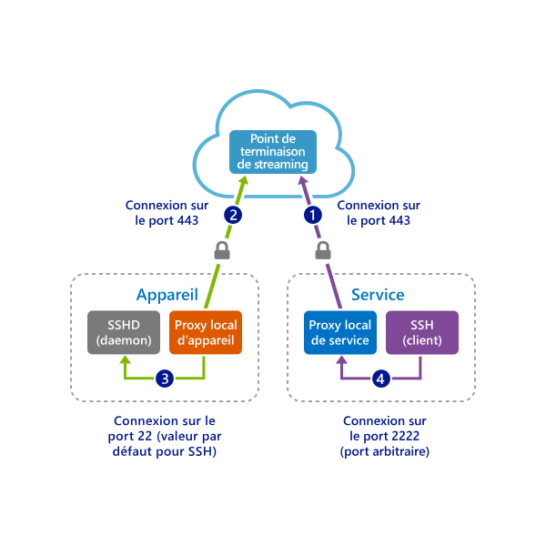
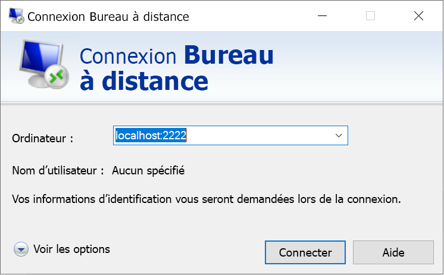

# <a name="quickstart-enable-ssh-and-rdp-over-an-iot-hub-device-stream-by-using-a-c-proxy-application-preview"></a>Démarrage rapide : Activer SSH et RDP sur un flux d’appareil IoT Hub à l’aide d’une application de proxy C# (préversion)

[!INCLUDE [iot-hub-quickstarts-4-selector](../../includes/iot-hub-quickstarts-4-selector.md)]

Microsoft Azure IoT Hub prend actuellement en charge les flux d’appareil en tant que [fonctionnalité d’évaluation](https://azure.microsoft.com/support/legal/preview-supplemental-terms/).

Les [flux d’appareil IoT Hub](iot-hub-device-streams-overview.md) permettent aux applications de service et d’appareil de communiquer de manière sécurisée à travers des pare-feux. Le présent guide de démarrage rapide implique deux applications C# qui permettent l’envoi du trafic d’application client-serveur (comme Secure Shell [SSH] et Remote Desktop Protocol [RDP] sur un flux d’appareil établi par le biais d’un hub IoT. Pour obtenir une vue d’ensemble de la configuration, consultez [Exemple d’application de proxy locale pour SSH ou RDP](iot-hub-device-streams-overview.md#local-proxy-sample-for-ssh-or-rdp).

Cet article décrit tout d’abord la configuration pour SSH (à l’aide du port 22), puis la manière de modifier le port pour RDP. Étant donné que les flux d’appareil ne dépendent pas des applications et des protocoles, vous pouvez modifier ce même exemple pour prendre en charge d’autres types de trafic d’application. Cette modification implique généralement de remplacer uniquement le port de communication par celui utilisé par l’application souhaitée.

## <a name="how-it-works"></a>Fonctionnement

La figure suivante illustre la manière dont les applications de proxy locales d’appareil et de service de cet exemple activent une connectivité de bout en bout entre le client SSH et les processus de démon SSH. Ici, nous partons du principe que le démon s’exécute sur le même appareil que l’application de proxy locale d’appareil.



1. L’application de proxy locale de service se connecte au hub IoT et lance un flux d’appareil sur l’appareil cible.

1. L’application de proxy locale d’appareil termine la négociation du lancement du flux et établit un tunnel de streaming de bout en bout par le biais du point de terminaison de streaming du hub IoT côté service.

1. L’application de proxy locale d’appareil se connecte au démon SSH qui écoute le port 22 sur l’appareil. Ce paramètre est configurable, comme décrit dans la section « Exécuter l’application proxy locale de l’appareil ».

1. L’application de proxy locale de service attend de nouvelles connexions SSH de la part d’un utilisateur en écoutant un port désigné, le port 2222 ici. Ce paramètre est configurable, comme décrit dans la section « Exécuter l’application proxy locale du service ». Quand l’utilisateur se connecte par le biais du client SSH, le tunnel permet au trafic d’application SSH d’être transféré entre le client SSH et l’application serveur.

> [!NOTE]
> Le trafic SSH envoyé sur un flux d’appareil est traité par tunnel par le biais d’un point de terminaison de streaming du hub IoT, plutôt que directement entre le service et l’appareil. Pour plus d’informations, consultez les [avantages de l’utilisation des flux d’appareil Iot Hub](iot-hub-device-streams-overview.md#benefits).

[!INCLUDE [cloud-shell-try-it.md](../../includes/cloud-shell-try-it.md)]

Si vous n’avez pas d’abonnement Azure, créez un [compte gratuit](https://azure.microsoft.com/free/?WT.mc_id=A261C142F) avant de commencer.

## <a name="prerequisites"></a>Prérequis

* Pour le moment, la préversion des flux d’appareil est uniquement prise en charge pour les hubs IoT créés dans les régions suivantes :

  * USA Centre
  * EUAP USA Centre
  * Asie Sud-Est
  * Europe Nord

* Les deux exemples d’applications que vous exécutez dans ce guide de démarrage rapide sont écrits en C#. Votre machine de développement doit disposer du SDK .NET Core 2.1.0 ou version ultérieure.

  Vous pouvez télécharger le [Kit SDK .NET Core pour plusieurs plateformes sur .NET](https://www.microsoft.com/net/download/all).

* Vérifiez la version actuelle de C# sur votre machine de développement à l’aide de la commande suivante :

    ```
    dotnet --version
    ```

* Exécutez la commande suivante afin d’ajouter l’extension Azure IoT pour Azure CLI à votre instance Cloud Shell. L’extension IoT ajoute des commandes IoT Hub, IoT Edge et IoT Device Provisioning Service (DPS) à Azure CLI.

   ```azurecli-interactive
   az extension add --name azure-cli-iot-ext
   ```

* [Téléchargez les exemples C# Azure IoT](https://github.com/Azure-Samples/azure-iot-samples-csharp/archive/master.zip) et extrayez l’archive ZIP.

* Un compte d’utilisateur valide et des informations d’identification sur l’appareil (Windows ou Linux) utilisé pour authentifier l’utilisateur.

## <a name="create-an-iot-hub"></a>Créer un hub IoT

[!INCLUDE [iot-hub-include-create-hub](../../includes/iot-hub-include-create-hub.md)]

## <a name="register-a-device"></a>Inscrire un appareil

Un appareil doit être inscrit dans votre hub IoT pour pouvoir se connecter. Dans ce guide de démarrage rapide, vous utilisez Azure Cloud Shell pour inscrire un appareil simulé.

1. Pour créer l’identité d’appareil, exécutez la commande suivante dans Cloud Shell :

   > [!NOTE]
   > * Remplacez l’espace réservé *YourIoTHubName* par le nom que vous avez choisi pour votre hub IoT.
   > * Pour le nom de l’appareil que vous êtes en train d’inscrire, nous vous recommandons d’utiliser *MyDevice* comme indiqué. Si vous choisissez un autre nom pour votre appareil, utilisez-le pour l’ensemble de cet article et mettez à jour le nom de l’appareil dans les exemples d’application avant de les exécuter.

    ```azurecli-interactive
    az iot hub device-identity create --hub-name {YourIoTHubName} --device-id MyDevice
    ```

1. Pour obtenir la *chaîne de connexion d’appareil* pour celui que vous venez d’inscrire, exécutez les commandes suivantes dans Cloud Shell :

   > [!NOTE]
   > Remplacez l’espace réservé *YourIoTHubName* par le nom que vous avez choisi pour votre hub IoT.

    ```azurecli-interactive
    az iot hub device-identity show-connection-string --hub-name {YourIoTHubName} --device-id MyDevice --output table
    ```

    Notez la chaîne de connexion d’appareil retournée ; vous en aurez besoin plus loin dans ce guide de démarrage rapide. Cela ressemble à l’exemple suivant :

   `HostName={YourIoTHubName}.azure-devices.net;DeviceId=MyDevice;SharedAccessKey={YourSharedAccessKey}`

1. Pour vous connecter à votre hub IoT afin d’établir un flux d’appareil, vous avez également besoin de la *chaîne de connexion du service* de votre hub IoT pour activer l’application côté service. La commande suivante récupère cette valeur de votre hub IoT :

   > [!NOTE]
   > Remplacez l’espace réservé *YourIoTHubName* par le nom que vous avez choisi pour votre hub IoT.

    ```azurecli-interactive
    az iot hub show-connection-string --policy-name service --name {YourIoTHubName} --output table
    ```

    Notez la chaîne de connexion de service retournée ; vous en aurez besoin plus loin dans ce guide de démarrage rapide. Cela ressemble à l’exemple suivant :

   `"HostName={YourIoTHubName}.azure-devices.net;SharedAccessKeyName=service;SharedAccessKey={YourSharedAccessKey}"`

## <a name="ssh-to-a-device-via-device-streams"></a>Liaison SSH à un appareil par le biais de flux d’appareil

Dans cette section, vous allez établir un flux de bout en bout pour tunneler le trafic SSH.

### <a name="run-the-device-local-proxy-application"></a>Exécuter l’application proxy locale de l’appareil

Dans une fenêtre de terminal locale, accédez au répertoire `device-streams-proxy/device` dans votre dossier de projet décompressé. Gardez à portée de main les informations suivantes :

| Nom de l’argument | Valeur de l’argument |
|----------------|-----------------|
| `DeviceConnectionString` | Chaîne de connexion d’appareil que vous avez créée précédemment. |
| `targetServiceHostName` | Adresse IP où le serveur SSH écoute. Cette adresse serait `localhost` s’il s’agissait de la même adresse IP que celle où l’application de proxy locale d’appareil est en cours d’exécution. |
| `targetServicePort` | Port utilisé par votre protocole d’application (par défaut, il s’agit du port 22 pour SSH).  |

Compilez et exécutez le code avec les commandes suivantes :

```
cd ./iot-hub/Quickstarts/device-streams-proxy/device/

# Build the application
dotnet build

# Run the application
# In Linux or macOS
dotnet run ${DeviceConnectionString} localhost 22

# In Windows
dotnet run {DeviceConnectionString} localhost 22
```

### <a name="run-the-service-local-proxy-application"></a>Exécuter l’application proxy locale du service

Dans une autre fenêtre de terminal locale, accédez à `iot-hub/quickstarts/device-streams-proxy/service` dans votre dossier de projet décompressé. Gardez à portée de main les informations suivantes :

| Nom du paramètre | Valeur du paramètre |
|----------------|-----------------|
| `ServiceConnectionString` | Chaîne de connexion de service de votre hub IoT. |
| `MyDevice` | Identificateur de l’appareil que vous avez créé précédemment. |
| `localPortNumber` | Port local auquel votre client SSH se connecte. Nous utilisons le port 2222 dans cet exemple, mais vous pouvez utiliser d’autres numéros arbitraires. |

Compilez et exécutez le code avec les commandes suivantes :

```
cd ./iot-hub/Quickstarts/device-streams-proxy/service/

# Build the application
dotnet build

# Run the application
# In Linux or macOS
dotnet run ${ServiceConnectionString} MyDevice 2222

# In Windows
dotnet run {ServiceConnectionString} MyDevice 2222
```

### <a name="run-the-ssh-client"></a>Exécuter le client SSH

Utilisez à présent votre application cliente SSH pour vous connecter à l’application de proxy locale de service sur le port 2222 (au lieu du démon SSH directement).

```
ssh {username}@localhost -p 2222
```

À ce stade, la fenêtre de connexion SSH vous invite à entrer vos informations d’identification.

Sortie de console côté service (l’application de proxy locale de service écoute le port 2222) :


Sortie de console sur l’application de proxy locale d’appareil qui se connecte au démon SSH à l’adresse *IP_address:22* :


Sortie de console de l’application cliente SSH. Le client SSH communique avec le démon SSH en se connectant au port 22 qu’écoute l’application de proxy locale de service :


## <a name="rdp-to-a-device-via-device-streams"></a>Liaison RDP à un appareil par le biais de flux d’appareil

La configuration pour le protocole RDP est similaire à celle du protocole SSH (décrite plus haut). Vous utilisez l’adresse IP de destination RDP et le port 3389, ainsi que le client RDP (au lieu du client SSH).

### <a name="run-the-device-local-proxy-application-rdp"></a>Exécuter l’application de proxy locale d’appareil (RDP)

Dans une fenêtre de terminal locale, accédez au répertoire `device-streams-proxy/device` dans votre dossier de projet décompressé. Gardez à portée de main les informations suivantes :

| Nom de l’argument | Valeur de l’argument |
|----------------|-----------------|
| `DeviceConnectionString` | Chaîne de connexion d’appareil que vous avez créée précédemment. |
| `targetServiceHostName` | Nom d’hôte ou adresse IP où s’exécute le serveur RDP. Cette adresse serait `localhost` s’il s’agissait de la même adresse IP que celle où l’application de proxy locale d’appareil est en cours d’exécution. |
| `targetServicePort` | Port utilisé par votre protocole d’application (par défaut, il s’agit du port 3389 pour RDP).  |

Compilez et exécutez le code avec les commandes suivantes :

```
cd ./iot-hub/Quickstarts/device-streams-proxy/device

# Run the application
# In Linux or macOS
dotnet run ${DeviceConnectionString} localhost 3389

# In Windows
dotnet run {DeviceConnectionString} localhost 3389
```

### <a name="run-the-service-local-proxy-application-rdp"></a>Exécuter l’application de proxy locale de service (RDP)

Dans une autre fenêtre de terminal locale, accédez à `device-streams-proxy/service` dans votre dossier de projet décompressé. Gardez à portée de main les informations suivantes :

| Nom du paramètre | Valeur du paramètre |
|----------------|-----------------|
| `ServiceConnectionString` | Chaîne de connexion de service de votre hub IoT. |
| `MyDevice` | Identificateur de l’appareil que vous avez créé précédemment. |
| `localPortNumber` | Port local auquel votre client SSH se connecte. Nous utilisons le port 2222 dans cet exemple, mais vous pouvez utiliser d’autres nombres arbitraires. |

Compilez et exécutez le code avec les commandes suivantes :

```
cd ./iot-hub/Quickstarts/device-streams-proxy/service/

# Build the application
dotnet build

# Run the application
# In Linux or macOS
dotnet run ${ServiceConnectionString} MyDevice 2222

# In Windows
dotnet run {ServiceConnectionString} MyDevice 2222
```

### <a name="run-rdp-client"></a>Exécuter le client RDP

Utilisez maintenant votre application cliente RDP poru vous connecter à l’application de proxy locale de service sur le port 2222 (port arbitraire disponible que vous avez choisi précédemment).



## <a name="clean-up-resources"></a>Nettoyer les ressources

[!INCLUDE [iot-hub-quickstarts-clean-up-resources](../../includes/iot-hub-quickstarts-clean-up-resources-device-streams.md)]

## <a name="next-steps"></a>Étapes suivantes

Dans ce guide de démarrage rapide, vous avez configuré un hub IoT, inscrit un appareil, déployé des applications de proxy locales d’appareil et de service pour établir un flux d’appareil par le biais du hub IoT, puis vous avez utilisé les applications de proxy pour traiter par tunnel le trafic SSH ou RDP. Le même paradigme peut prendre en charge d’autres protocoles client-serveur où le serveur s’exécute sur l’appareil (par exemple, le démon SSH).

Pour en savoir plus sur les flux d’appareil, consultez :

> [!div class="nextstepaction"]
> [Vue d’ensemble des flux d’appareil](./iot-hub-device-streams-overview.md)
