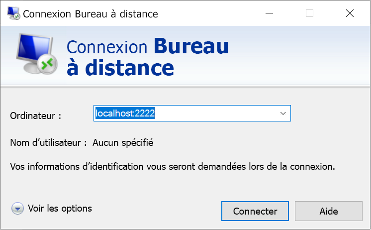

# <a name="quickstart-enable-ssh-and-rdp-over-an-iot-hub-device-stream-by-using-a-nodejs-proxy-application-preview"></a>Démarrage rapide : Activer SSH et RDP sur un flux d’appareil IoT Hub à l’aide d’une application de proxy Node.js (préversion)

[!INCLUDE [iot-hub-quickstarts-4-selector](../../includes/iot-hub-quickstarts-4-selector.md)]

Dans ce guide de démarrage rapide, vous activez le trafic SSH (Secure Shell) et RDP (Remote Desktop Protocol) à envoyer à l’appareil par le biais d’un flux d’appareil. Les flux d’appareil Azure IoT Hub permettent aux applications de service et d’appareil de communiquer de manière sécurisée à travers des pare-feux. Ce guide de démarrage rapide décrit l’exécution d’une application de proxy Node.js qui s’exécute côté service. Dans la préversion publique, le SDK Node.js prend uniquement en charge des flux d’appareil côté service. Ainsi, le présent guide de démarrage rapide aborde uniquement les instructions permettant d’exécuter l’application de proxy locale de service.

## <a name="prerequisites"></a>Prérequis

* Avoir suivi le guide de démarrage rapide [Activer SSH et RDP sur des flux d’appareil IoT Hub à l’aide d’une application de proxy C](./quickstart-device-streams-proxy-c.md) ou [Activer SSH et RDP sur des flux d’appareil IoT Hub à l’aide d’une application de proxy C#](./quickstart-device-streams-proxy-csharp.md).

* Compte Azure avec un abonnement actif. [Créez-en un gratuitement](https://azure.microsoft.com/free/?ref=microsoft.com&utm_source=microsoft.com&utm_medium=docs&utm_campaign=visualstudio).

* [Node.js 10+](https://nodejs.org).

    Vous pouvez vérifier la version actuelle de Node.js sur votre machine de développement en utilisant la commande suivante :

    ```cmd/sh
    node --version
    ```

* [Un exemple de projet Node.js](https://github.com/Azure-Samples/azure-iot-samples-node/archive/streams-preview.zip).

[!INCLUDE [azure-cli-prepare-your-environment.md](../../includes/azure-cli-prepare-your-environment-no-header.md)]

Microsoft Azure IoT Hub prend actuellement en charge les flux d’appareil en tant que [fonctionnalité d’évaluation](https://azure.microsoft.com/support/legal/preview-supplemental-terms/).

> [!IMPORTANT]
> Pour le moment, la préversion des flux d’appareil est uniquement prise en charge pour les hubs IoT créés dans les régions suivantes :
>
> * USA Centre
> * EUAP USA Centre
> * Europe Nord
> * Asie Sud-Est

### <a name="add-azure-iot-extension"></a>Ajouter une extension Azure IoT

Ajoutez l’extension Azure IoT pour Azure CLI à votre instance Cloud Shell en exécutant la commande suivante. L’extension IoT ajoute des commandes spécifiques à IoT Hub, à IoT Edge et au service IoT Hub Device Provisioning (DPS) à Azure CLI.

```azurecli-interactive
az extension add --name azure-iot
```

[!INCLUDE [iot-hub-cli-version-info](../../includes/iot-hub-cli-version-info.md)]

## <a name="create-an-iot-hub"></a>Créer un hub IoT

Si vous avez terminé le précédent [Démarrage rapide : Envoyer des données de télémétrie d’un appareil à un hub IoT](quickstart-send-telemetry-node.md), vous pouvez ignorer cette étape.

[!INCLUDE [iot-hub-include-create-hub](../../includes/iot-hub-include-create-hub.md)]

## <a name="register-a-device"></a>Inscrire un appareil

Si vous avez terminé [Démarrage rapide : Envoyer des données de télémétrie d’un appareil à un hub IoT](quickstart-send-telemetry-node.md), vous pouvez ignorer cette étape.

Un appareil doit être inscrit dans votre hub IoT pour pouvoir se connecter. Dans cette section, vous utilisez Azure Cloud Shell pour inscrire un appareil simulé.

1. Pour créer l’identité d’appareil, exécutez la commande suivante dans Cloud Shell :

   > [!NOTE]
   > * Remplacez l’espace réservé *YourIoTHubName* par le nom que vous avez choisi pour votre hub IoT.
   > * Pour le nom de l’appareil que vous êtes en train d’inscrire, nous vous recommandons d’utiliser *MyDevice* comme indiqué. Si vous choisissez un autre nom pour votre appareil, utilisez-le pour l’ensemble de cet article et mettez à jour le nom de l’appareil dans les exemples d’application avant de les exécuter.

    ```azurecli-interactive
    az iot hub device-identity create --hub-name {YourIoTHubName} --device-id MyDevice
    ```

1. Pour activer l’application back-end afin de vous connecter à votre hub IoT et récupérer les messages, vous avez également besoin d’une *chaîne de connexion de service*. La commande suivante récupère la chaîne de votre hub IoT :

   > [!NOTE]
   > Remplacez l’espace réservé *YourIoTHubName* par le nom que vous avez choisi pour votre hub IoT.

    ```azurecli-interactive
    az iot hub connection-string show --policy-name service --hub-name {YourIoTHubName} --output table
    ```

   Notez la chaîne de connexion de service retournée ; vous en aurez besoin plus loin dans ce guide de démarrage rapide. Cela ressemble à l’exemple suivant :

   `"HostName={YourIoTHubName}.azure-devices.net;SharedAccessKeyName=service;SharedAccessKey={YourSharedAccessKey}"`

## <a name="ssh-to-a-device-via-device-streams"></a>Liaison SSH à un appareil par le biais de flux d’appareil

Dans cette section, vous allez établir un flux de bout en bout pour tunneler le trafic SSH.

### <a name="run-the-device-local-proxy-application"></a>Exécuter l’application proxy locale de l’appareil

Comme mentionné précédemment, le SDK Node.js IoT Hub prend uniquement en charge des flux d’appareil côté service. Pour l’application locale d’appareil, utilisez une application de proxy d’appareil disponible dans un des guides de démarrage rapide suivants :

   * [Activer SSH et RDP sur des flux d’appareil IoT Hub à l’aide d’une application de proxy C](./quickstart-device-streams-proxy-c.md)
   * [Activer SSH et RDP sur des flux d’appareil IoT Hub à l’aide d’une application de proxy C#](./quickstart-device-streams-proxy-csharp.md) 

Avant de passer à l’étape suivante, vérifiez que l’application de proxy locale d’appareil est en cours d’exécution. Pour obtenir une vue d’ensemble de la configuration, consultez [lExemple de proxy local](./iot-hub-device-streams-overview.md#local-proxy-sample-for-ssh-or-rdp).

### <a name="run-the-service-local-proxy-application"></a>Exécuter l’application proxy locale du service

Cet article décrit la configuration pour SSH (à l’aide du port 22), puis la manière de modifier la configuration pour RDP (qui utilise le port 3389). Étant donné que les flux d’appareil ne dépendent pas des applications et des protocoles, vous pouvez modifier ce même exemple pour prendre en charge d’autres types de trafic d’application client-serveur, généralement en modifiant le port de communication.

Avec l’application de proxy locale d’appareil en cours d’exécution, exécutez l’application de proxy locale de service écrite en Node.js en effectuant les étapes suivantes dans une fenêtre de terminal locale :

1. Pour les variables d’environnement, fournissez les informations d’identification de votre service, l’ID de l’appareil cible sur lequel s’exécute le démon SSH et le numéro de port du proxy en cours d’exécution sur l’appareil.

   ```
   # In Linux
   export IOTHUB_CONNECTION_STRING="{ServiceConnectionString}"
   export STREAMING_TARGET_DEVICE="MyDevice"
   export PROXY_PORT=2222

   # In Windows
   SET IOTHUB_CONNECTION_STRING={ServiceConnectionString}
   SET STREAMING_TARGET_DEVICE=MyDevice
   SET PROXY_PORT=2222
   ```

   Modifiez l’espace réservé ServiceConnectionString pour qu’il corresponde à votre chaîne de connexion de service, et **MyDevice** pour qu’il corresponde à votre ID d’appareil si vous lui avez donné un nom différent.

1. Accédez au répertoire `Quickstarts/device-streams-service` de votre dossier de projet décompressé. Utilisez le code suivant pour exécuter l’application de proxy locale de service :

   ```
   cd azure-iot-samples-node-streams-preview/iot-hub/Quickstarts/device-streams-service

   # Install the preview service SDK, and other dependencies
   npm install azure-iothub@streams-preview
   npm install

   # Run the service-local proxy application
   node proxy.js
   ```

### <a name="ssh-to-your-device-via-device-streams"></a>Établir une liaison SSH à votre appareil par le biais de flux d’appareil

Sur Linux, exécutez SSH en utilisant `ssh $USER@localhost -p 2222` sur un terminal. Sur Windows, utilisez le client SSH de votre choix (par exemple, PuTTY).

Sortie de console au niveau local du service une fois la session SSH établie (l’application de proxy locale de service écoute le port 2222) :


Sortie de console de l’application cliente SSH (le client SSH communique avec le démon SSH en se connectant au port 22, qu’écoute l’application de proxy locale de service) :


### <a name="rdp-to-your-device-via-device-streams"></a>Établir une liaison RDP à votre appareil par le biais de flux d’appareil

Utilisez maintenant votre application cliente RDP pour vous connecter au proxy de service sur le port 2222, un port arbitraire que vous avez choisi préalablement.

> [!NOTE]
> Vérifiez que votre proxy d’appareil est correctement configuré pour RDP avec le port RDP 3389.



## <a name="clean-up-resources"></a>Nettoyer les ressources

[!INCLUDE [iot-hub-quickstarts-clean-up-resources](../../includes/iot-hub-quickstarts-clean-up-resources-device-streams.md)]

## <a name="next-steps"></a>Étapes suivantes

Dans ce guide de démarrage rapide, vous avez configuré un hub IoT, inscrit un appareil et déployé une application de proxy de service pour autoriser le trafic RDP et SSH sur un appareil IoT. Le trafic RDP et SSH est traité par tunnel par le biais d’un flux d’appareil via le hub IoT. Ainsi, la nécessité d’une connectivité directe à l’appareil est supprimée.

Pour en savoir plus sur les flux d’appareil, consultez :

> [!div class="nextstepaction"]
> [Vue d’ensemble des flux d’appareil](./iot-hub-device-streams-overview.md)
