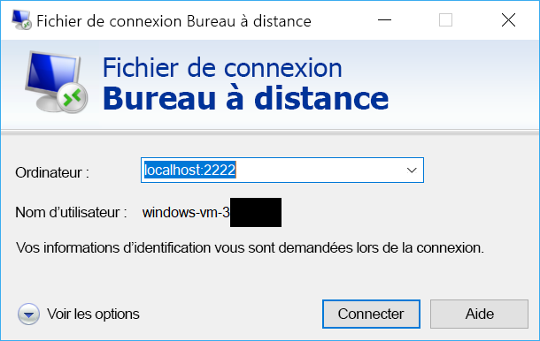

# <a name="quickstart-sshrdp-over-iot-hub-device-streams-using-nodejs-proxy-application-preview"></a>Démarrage rapide : SSH/RDP sur des flux d’appareil IoT Hub à l’aide d’une application proxy Node.js (préversion)

[!INCLUDE [iot-hub-quickstarts-4-selector](../../includes/iot-hub-quickstarts-4-selector.md)]

Les [flux d’appareil IoT Hub](./iot-hub-device-streams-overview.md) permettent aux applications de service et d’appareil de communiquer de manière sécurisée à travers des pare-feux. Ce guide de démarrage rapide décrit l’exécution d’une application proxy Node.js côté service pour permettre d’envoyer du trafic SSH et RDP à un appareil par le biais d’un flux d’appareil. Consultez [cette page](./iot-hub-device-streams-overview.md#local-proxy-sample-for-ssh-or-rdp) pour obtenir une vue d’ensemble de la configuration. Dans la préversion publique, le SDK Node.js prend uniquement en charge des flux d’appareil côté service. Par conséquent, le présent guide de démarrage rapide couvre uniquement les instructions permettant d’exécuter le proxy côté service. Il est préférable d’exécuter un proxy côté appareil complémentaire, disponible dans les guides de [démarrage rapide C](./quickstart-device-streams-proxy-c.md) ou de [démarrage rapide C#](./quickstart-device-streams-proxy-csharp.md).

Tout d’abord, nous décrivons la configuration pour SSH (qui utilise le port `22`). Nous décrivons ensuite comment modifier la configuration pour RDP (qui utilise le port 3389). Étant donné que les flux d’appareil ne dépendent pas des applications et des protocoles, vous pouvez modifier ce même exemple (généralement en modifiant les ports de communication) pour prendre en charge d’autres types de trafic d’application.

Le code illustre le lancement et l’utilisation d’un flux d’appareil. Vous pouvez le réutiliser pour d’autres types de trafic d’application (autres que RDP et SSH).

[!INCLUDE [cloud-shell-try-it.md](../../includes/cloud-shell-try-it.md)]

Si vous n’avez pas d’abonnement Azure, créez un [compte gratuit](https://azure.microsoft.com/free/?WT.mc_id=A261C142F) avant de commencer.


## <a name="prerequisites"></a>Prérequis

Pour exécuter l’application côté service dans le cadre du présent guide de démarrage rapide, vous avez besoin de Node.js version 4.x.x ou ultérieure sur votre ordinateur de développement.

Vous pouvez télécharger Node.js pour plusieurs plateformes sur [nodejs.org](https://nodejs.org).

Vous pouvez vérifier la version actuelle de Node.js sur votre machine de développement à l’aide de la commande suivante :

```
node --version
```

Si ce n’est déjà fait, téléchargez l’exemple de projet Node.js à partir de https://github.com/Azure-Samples/azure-iot-samples-node/archive/streams-preview.zip et extrayez l’archive ZIP.


## <a name="create-an-iot-hub"></a>Créer un hub IoT

Si vous avez terminé le précédent [Démarrage rapide : Envoyer des données de télémétrie d’un appareil à un hub IoT](quickstart-send-telemetry-node.md), vous pouvez ignorer cette étape.

[!INCLUDE [iot-hub-include-create-hub](../../includes/iot-hub-include-create-hub-device-streams.md)]


## <a name="register-a-device"></a>Inscrire un appareil

Si vous avez terminé le précédent [Démarrage rapide : Envoyer des données de télémétrie d’un appareil à un hub IoT](quickstart-send-telemetry-node.md), vous pouvez ignorer cette étape.

Un appareil doit être inscrit dans votre hub IoT pour pouvoir se connecter. Dans ce démarrage rapide, vous utilisez Azure Cloud Shell pour inscrire un appareil simulé.

1. Exécutez les commandes suivantes dans Azure Cloud Shell pour ajouter l’extension CLI IoT Hub et créer l’identité d’appareil. 

   **YourIoTHubName** : Remplacez l’espace réservé ci-dessous par le nom que vous avez choisi pour votre hub IoT.

   **MyDevice** : il s’agit du nom donné à l’appareil inscrit. Utilisez MyDevice comme indiqué. Si vous choisissez un autre nom pour votre appareil, vous devez également utiliser ce nom pour l’ensemble de cet article et mettre à jour le nom de l’appareil dans les exemples d’application avant de les exécuter.

    ```azurecli-interactive
    az extension add --name azure-cli-iot-ext
    az iot hub device-identity create --hub-name YourIoTHubName --device-id MyDevice
    ```

2. Vous avez également besoin d’une _chaîne de connexion de service_ pour activer l’application back-end afin de vous connecter à votre IoT Hub et récupérer les messages. La commande suivante récupère la chaîne de connexion de service correspondant à votre hub IoT :

    **YourIoTHubName** : Remplacez l’espace réservé ci-dessous par le nom que vous avez choisi pour votre hub IoT.

    ```azurecli-interactive
    az iot hub show-connection-string --policy-name service --hub-name YourIoTHubName
    ```

    Notez la valeur retournée, qui ressemble à ceci :

   `"HostName={YourIoTHubName}.azure-devices.net;SharedAccessKeyName=service;SharedAccessKey={YourSharedAccessKey}"`


## <a name="ssh-to-a-device-via-device-streams"></a>Liaison SSH à un appareil par le biais de flux d’appareil

### <a name="run-the-device-side-proxy"></a>Exécuter le proxy côté appareil

Comme mentionné précédemment, le SDK Node.js IoT Hub prend uniquement en charge des flux d’appareil côté service. Pour l’application côté serveur, utilisez les programmes de proxy d’appareil complémentaires, disponibles dans les guides de [démarrage rapide C](./quickstart-device-streams-proxy-c.md) ou de [démarrage rapide C#](./quickstart-device-streams-proxy-csharp.md). Vérifiez que le proxy côté appareil est en cours d’exécution avant de passer à l’étape suivante.


### <a name="run-the-service-side-proxy"></a>Exécuter le proxy côté service

Si le proxy côté appareil est en cours d’exécution, suivez les étapes ci-dessous pour exécuter le proxy côté service écrit dans Node.js :

- Fournissez les informations d’identification de votre service, l’ID de l’appareil cible sur lequel s’exécute le démon SSH et le numéro de port du proxy en cours d’exécution sur l’appareil sous forme de variables d’environnement.
```
  # In Linux
  export IOTHUB_CONNECTION_STRING="<provide_your_service_connection_string>"
  export STREAMING_TARGET_DEVICE="MyDevice"
  export PROXY_PORT=2222

  # In Windows
  SET IOTHUB_CONNECTION_STRING=<provide_your_service_connection_string>
  SET STREAMING_TARGET_DEVICE=MyDevice
  SET PROXY_PORT=2222
```
Remplacez `MyDevice` par l’ID d’appareil que vous avez choisi pour votre appareil.

- Accédez à `Quickstarts/device-streams-service` dans votre dossier de projet décompressé et exécutez le proxy local de service.
```
  cd azure-iot-samples-node-streams-preview/iot-hub/Quickstarts/device-streams-service

  # Install the preview service SDK, and other dependencies
  npm install azure-iothub@streams-preview
  npm install

  # Run the service-local proxy application
  node proxy.js
```

### <a name="ssh-to-your-device-via-device-streams"></a>Établir une liaison SSH à votre appareil par le biais de flux d’appareil
Sur Linux, exécutez SSH en utilisant `ssh $USER@localhost -p 2222` sur un terminal. Sur Windows, utilisez le client SSH de votre choix (par exemple, PuTTY).

Sortie de console côté service une fois la session SSH établie (le proxy local de service écoute le port 2222) : 


Sortie de console du programme client SSH (le client SSH communique avec le démon SSH en se connectant au port <code>22</code> où le proxy local du service est à l’écoute) : 


### <a name="rdp-to-your-device-via-device-streams"></a>Établir une liaison RDP à votre appareil par le biais de flux d’appareil

Utilisez à présent votre programme client RDP pour vous connecter au proxy de service sur le port 2222 (il s’agissait d’un port arbitraire disponible que vous avez choisi précédemment).

> [!NOTE]
> Vérifiez que votre proxy d’appareil est correctement configuré pour RDP avec le port RDP 3389.




## <a name="clean-up-resources"></a>Supprimer des ressources

[!INCLUDE [iot-hub-quickstarts-clean-up-resources](../../includes/iot-hub-quickstarts-clean-up-resources-device-streams.md)]

## <a name="next-steps"></a>Étapes suivantes

Dans ce guide de démarrage rapide, vous avez configuré un hub IoT, inscrit un appareil et déployé un programme de proxy de service pour autoriser le trafic RDP et SSH vers un appareil IoT. Le trafic RDP et SSH est traité par tunnel par le biais d’un flux d’appareil via IoT Hub. Ainsi, la nécessité d’une connectivité directe à l’appareil est supprimée.

Utilisez les liens ci-dessous pour en savoir plus sur les flux d’appareil :

> [!div class="nextstepaction"]
> [Vue d’ensemble des flux d’appareil](./iot-hub-device-streams-overview.md)
