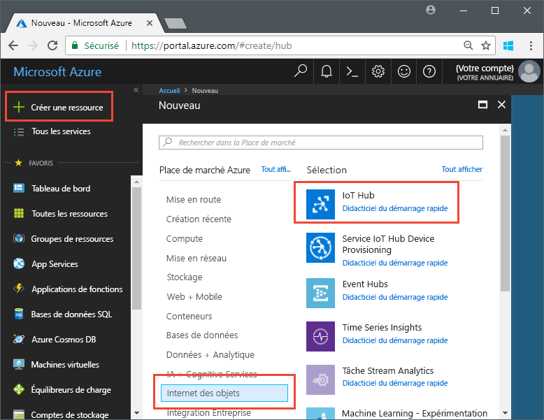
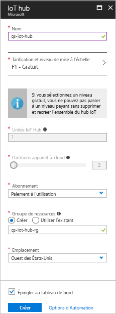

# <a name="send-telemetry-from-a-device-to-an-iot-hub-swift"></a>Envoyer des données de télémétrie depuis un appareil à un hub IoT (Swift)

IoT Hub est un service Azure qui vous permet de traiter de gros volumes de données de télémétrie envoyées par vos appareils IoT dans le cloud à des fins de stockage ou de traitement. Dans cet article, vous envoyez des données de télémétrie depuis une application d’appareil simulé à IoT Hub. Vous pouvez afficher les données à partir d’une application principale. 

Cet article utilise une application Swift prédéfinie pour envoyer des données de télémétrie, et un utilitaire CLI pour lire ces données de télémétrie provenant d’IoT Hub. 

[!INCLUDE [cloud-shell-try-it.md](../../includes/cloud-shell-try-it.md)]

Si vous n’avez pas d’abonnement Azure, créez un [compte gratuit](https://azure.microsoft.com/free/?WT.mc_id=A261C142F) avant de commencer.

## <a name="prerequisites"></a>Prérequis


- Télécharger l’exemple de code depuis [Exemples Azure](https://github.com/Azure-Samples/azure-iot-samples-ios/archive/master.zip) 
- La dernière version de [XCode](https://developer.apple.com/xcode/), exécutant la dernière version du Kit de développement logiciel (SDK) iOS. Ce démarrage rapide a été testé avec XCode 9.3 et iOS 11.3.
- La dernière version de [CocoaPods](https://guides.cocoapods.org/using/getting-started.html).
- L’utilitaire CLI iothub-explorer, qui lit les données de télémétrie provenant d’IoT Hub. Commencez par installer [Node.js](https://nodejs.org) v4.x.x ou une version ultérieure, puis exécutez la commande suivante : 

   ```sh
   sudo npm install -g iothub-explorer
   ```

## <a name="create-an-iot-hub"></a>Créer un hub IoT

La première étape consiste à utiliser le portail Azure pour créer un hub IoT dans votre abonnement. Le hub IoT vous permet de traiter de gros volumes de données de télémétrie dans le cloud en provenance de nombreux appareils. Ensuite, le hub active un ou plusieurs services principaux en cours d’exécution dans le cloud pour lire et traiter ces données de télémétrie.

1. Connectez-vous au [Portail Azure](http://portal.azure.com).

1. Sélectionnez **Créer une ressource** > **Internet des objets** > **IoT Hub**. 

   

1. Pour créer votre hub IoT, utilisez les valeurs du tableau suivant :

    | Paramètre | Valeur |
    | ------- | ----- |
    | NOM | Nom unique de votre hub |
    | Tarification et niveau de mise à l’échelle | F1 Gratuit |
    | Unités IoT Hub | 1 |
    | Partitions appareil-à-cloud | 2 partitions |
    | Abonnement | Votre abonnement Azure. |
    | Groupe de ressources | Créer. Entrez le nom de votre groupe de ressources. |
    | Lieu | L’emplacement le plus proche de vous. |
    | Épingler au tableau de bord | OUI |

1. Cliquez sur **Créer**.  

   

1. Notez le nom de votre hub IoT et de votre groupe de ressources. Vous utiliserez ces valeurs plus loin dans ce démarrage rapide.

## <a name="register-a-device"></a>Inscrire un appareil

Un appareil doit être inscrit dans votre hub IoT pour pouvoir se connecter. Dans ce démarrage rapide, vous utilisez Azure CLI pour inscrire un appareil simulé.

1. Ajoutez l’extension CLI d’IoT Hub et créez l’identité de l’appareil. Remplacez `{YourIoTHubName}` par le nom de votre hub IoT :

   ```azurecli-interactive
   az extension add --name azure-cli-iot-ext
   az iot hub device-identity create --hub-name {YourIoTHubName} --device-id myiOSdevice
   ```

1. Exécutez la commande suivante pour obtenir la _chaîne de connexion_ à l’appareil que vous venez d’inscrire :

   ```azurecli-interactive
   az iot hub device-identity show-connection-string --hub-name {YourIoTHubName} --device-id myiOSdevice --output table
   ```

   Notez la chaîne de connexion à l’appareil, du type `Hostname=...=`. Vous utiliserez cette valeur plus loin dans cet article.

1. Vous avez également besoin d’une _chaîne de connexion de service_ pour que les applications principales puissent se connecter à votre hub IoT et récupérer des messages appareil-à-cloud. La commande suivante récupère la chaîne de connexion de service correspondant à votre hub IoT :

   ```azurecli-interactive
   az iot hub show-connection-string --hub-name {YourIoTHubName} --output table
   ```

   Notez la chaîne de connexion de service, du type `Hostname=...=`. Vous utiliserez cette valeur plus loin dans cet article.

## <a name="send-simulated-telemetry"></a>Envoyer des données de télémétrie simulée

L’exemple d’application s’exécute sur un appareil iOS, qui se connecte à un point de terminaison spécifique de l’appareil sur votre hub IoT et envoie les données de télémétrie simulée (température et humidité). 

### <a name="install-cocoapods"></a>Installer les CocoaPods

Les CocoaPods gèrent les dépendances des projets iOS qui utilisent des bibliothèques tierces.

Dans une fenêtre de terminal, accédez au dossier Azure-IoT-Samples-iOS que vous avez téléchargé dans les conditions préalables. Ensuite, accédez à l’exemple de projet :

```sh
cd quickstart/sample-device
```

Assurez-vous que XCode est fermé, puis exécutez la commande suivante pour installer les CocoaPods déclarés dans le fichier **podfile** :

```sh
pod install
```

Outre l’installation des pods nécessaires à votre projet, la commande d’installation crée également un fichier d’espace de travail XCode qui est déjà configuré pour utiliser les blocs pour les dépendances. 

### <a name="run-the-sample-application"></a>Exécuter l’exemple d’application 

1. Ouvrez l’exemple d’espace de travail dans XCode.

   ```sh
   open "MQTT Client Sample.xcworkspace"
   ```

2. Développez le projet **MQTT Client Sample**, puis le dossier du même nom.  
3. Ouvrez **ViewController.swift** pour le modifier dans XCode. 
4. Recherchez la variable **connectionString** et mettez à jour sa valeur en fonction de la chaîne de connexion d’appareil que vous avez notée précédemment.
5. Enregistrez vos modifications. 
6. Exécutez le projet dans l’émulateur d’appareil avec le bouton **Build and run (Générer et exécuter)** ou la combinaison de touches **commande + r**. 

   

7. Lorsque l’émulateur s’ouvre, sélectionnez **Démarrer** dans l’exemple d’application.

La capture d’écran suivante présente quelques exemples de sortie lorsque l’application envoie des données de télémétrie simulée à votre hub IoT :

   

## <a name="read-the-telemetry-from-your-hub"></a>Lire les données de télémétrie envoyées par votre hub

L’exemple d’application que vous avez exécutée sur l’émulateur XCode affiche les données concernant les messages envoyés par l’appareil. Vous pouvez également voir les données à votre hub IoT, au fur et à mesure de leur réception. L’utilitaire CLI `iothub-explorer` se connecte au point de terminaison **Événements** du service sur votre IoT Hub. 

Ouvrez une nouvelle fenêtre de terminal. Exécutez la commande suivante en remplaçant {la chaîne de connexion de service de votre hub} par la chaîne de connexion de service que vous avez récupérée au début de cet article :

```sh
iothub-explorer monitor-events myiOSdevice --login "{your hub service connection string}"
```

La capture d’écran suivante affiche le type de données de télémétrie que vous voyez dans votre fenêtre de terminal :


Si vous obtenez une erreur lorsque vous exécutez la commande iothub-explorer, vérifiez que vous utilisez la *chaîne de connexion de service* de votre hub IoT, et non la *chaîne de connexion d’appareil* de votre appareil IoT. Les deux chaînes de connexion commencent par **Hostname={nom_hub_iot}**, mais la chaîne de connexion de service contient la propriété **SharedAccessKeyName** tandis que la chaîne de connexion d’appareil contient la propriété **DeviceID**. 

## <a name="clean-up-resources"></a>Supprimer des ressources

Si vous envisagez de continuer le test d’IoT Hub avec d’autres articles, conservez votre groupe de ressources ainsi que votre hub IoT, et réutilisez-les.

Si vous n’avez plus besoin du hub IoT, supprimez-le ainsi que le groupe de ressources dans le portail. Pour ce faire, sélectionnez le groupe de ressources qui contient votre hub IoT, puis cliquez sur **Supprimer**.

## <a name="next-steps"></a>Étapes suivantes

Dans cet article, vous avez configuré un hub IoT, inscrit un appareil, envoyé des données de télémétrie simulée au hub à partir d’un appareil iOS et lu ces données de télémétrie provenant du hub. 

Pour en savoir plus sur le fonctionnement des appareils iOS avec IoT Hub, consultez [Send cloud-to-device messages with iOS (Swift) (Envoyer des messages cloud-à-appareil avec iOS (Swift))](iot-hub-ios-swift-c2d.md).

<!-- Links -->
[lnk-process-d2c-tutorial]: iot-hub-csharp-csharp-process-d2c.md
[lnk-device-management]: iot-hub-node-node-device-management-get-started.md
[lnk-iot-edge]: ../iot-edge/tutorial-simulate-device-linux.md
[lnk-connect-device]: https://azure.microsoft.com/develop/iot/
