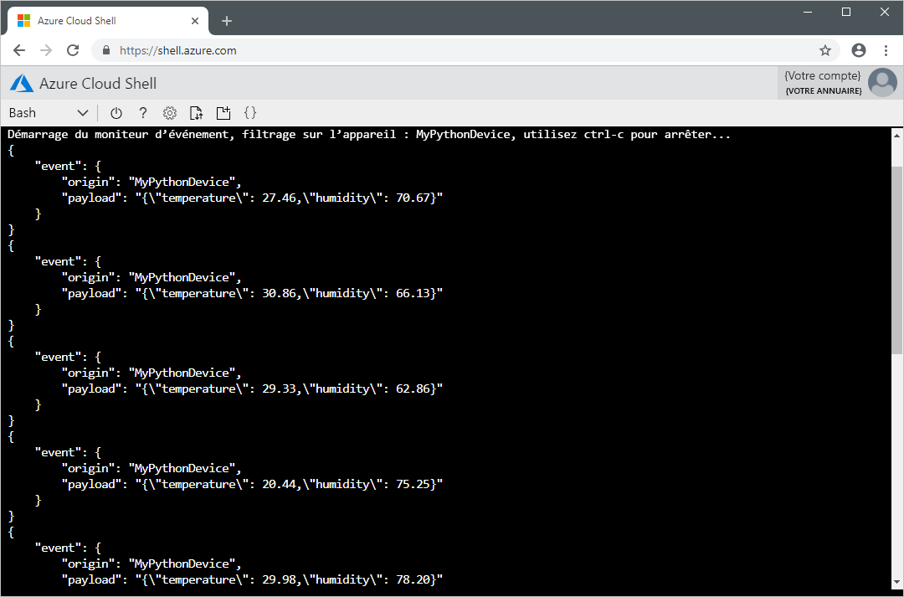

# <a name="quickstart-send-telemetry-from-a-device-to-an-iot-hub-and-read-it-with-a-back-end-application-python"></a>Démarrage rapide : Envoyer des données de télémétrie d’un appareil à un hub IoT et les lire avec une application back-end (Python)

[!INCLUDE [iot-hub-quickstarts-1-selector](../../includes/iot-hub-quickstarts-1-selector.md)]

IoT Hub est un service Azure qui vous permet de traiter de gros volumes de données de télémétrie envoyées par vos appareils IoT dans le cloud à des fins de stockage ou de traitement. Dans ce guide de démarrage rapide, vous envoyez des données de télémétrie à partir d’une application d’appareil simulé, via IoT Hub, à une application back-end pour traitement.

Ce démarrage rapide utilise une application Python prédéfinie pour envoyer des données de télémétrie, et un utilitaire CLI pour lire ces données de télémétrie provenant du concentrateur. Avant d’exécuter ces deux applications, vous créez un IoT Hub et inscrivez un appareil auprès du concentrateur.

Si vous n’avez pas d’abonnement Azure, créez un [compte gratuit](https://azure.microsoft.com/free/?WT.mc_id=A261C142F) avant de commencer.

## <a name="prerequisites"></a>Conditions préalables requises

Exécutez la commande suivante afin d’ajouter l’extension Microsoft Azure IoT pour Azure CLI à votre instance Cloud Shell. L’extension IoT ajoute des commandes IoT Hub, IoT Edge et IoT Device Provisioning Service (DPS) à Azure CLI.

```azurecli-interactive
az extension add --name azure-cli-iot-ext
```

Téléchargez l’exemple de projet Python à partir de https://github.com/Azure-Samples/azure-iot-samples-python/archive/master.zip et extrayez l’archive ZIP.

[Python version 3.7 ou ultérieure](https://www.python.org/downloads/) doit être installé sur votre machine de développement. Pour les autres versions de Python prises en charge, consultez les [fonctionnalités des appareils Azure IoT](https://github.com/Azure/azure-iot-sdk-python/tree/master/azure-iot-device#azure-iot-device-features) dans la documentation du SDK.

Assurez-vous que le port 8883 est ouvert dans votre pare-feu. L’exemple d’appareil de ce guide de démarrage rapide utilise le protocole MQTT, lequel communique sur le port 8883. Ce port peut être bloqué dans certains environnements réseau professionnels et scolaires. Pour plus d’informations sur les façons de contourner ce problème, consultez [Connexion à IoT Hub (MQTT)](iot-hub-mqtt-support.md#connecting-to-iot-hub).

## <a name="create-an-iot-hub"></a>Créer un hub IoT

[!INCLUDE [iot-hub-include-create-hub](../../includes/iot-hub-include-create-hub.md)]

## <a name="register-a-device"></a>Inscrire un appareil

Un appareil doit être inscrit dans votre hub IoT pour pouvoir se connecter. Dans ce démarrage rapide, vous utilisez Azure Cloud Shell pour inscrire un appareil simulé.

1. Exécutez les commandes suivantes dans Azure Cloud Shell pour créer l’identité d’appareil.

    **YourIoTHubName** : Remplacez l’espace réservé ci-dessous par le nom que vous avez choisi pour votre hub IoT.

    **MyPythonDevice** : il s’agit du nom de l’appareil que vous inscrivez. Il est recommandé d’utiliser **MyPythonDevice** comme indiqué. Si vous choisissez un autre nom pour votre appareil, vous devrez utiliser ce nom tout au long de cet article et mettre à jour le nom de l'appareil dans les exemples d'application avant de les exécuter.

    ```azurecli-interactive
    az iot hub device-identity create --hub-name {YourIoTHubName} --device-id MyPythonDevice
    ```

1. Exécutez la commande suivante dans Azure Cloud Shell pour obtenir la _chaîne de connexion d’appareil_ que vous venez d’inscrire :

    **YourIoTHubName** : Remplacez l’espace réservé ci-dessous par le nom que vous avez choisi pour votre hub IoT.

    ```azurecli-interactive
    az iot hub device-identity show-connection-string --hub-name {YourIoTHubName} --device-id MyPythonDevice --output table
    ```

    Notez la chaîne de connexion à l’appareil, qui ressemble à ce qui suit :

   `HostName={YourIoTHubName}.azure-devices.net;DeviceId=MyPythonDevice;SharedAccessKey={YourSharedAccessKey}`

    Vous utiliserez cette valeur plus loin dans ce guide de démarrage rapide.

## <a name="send-simulated-telemetry"></a>Envoyer des données de télémétrie simulée

L’application d’appareil simulé se connecte à un point de terminaison spécifique de l’appareil sur votre IoT Hub et envoie les données de télémétrie simulée (température et humidité).

1. Dans une fenêtre de terminal local, accédez au dossier racine de l’exemple de projet Python. Ensuite, accédez au dossier **iot-hub\Quickstarts\simulated-device**.

1. Utilisez un éditeur de texte pour ouvrir le fichier **SimulatedDevice.py**.

    Remplacez la valeur de la variable `CONNECTION_STRING` par la chaîne de connexion d’appareil que vous avez notée précédemment. Enregistrez ensuite les changements apportés à **SimulatedDevice.py**.

1. Dans la fenêtre de terminal local, exécutez les commandes suivantes pour installer les bibliothèques requises pour l’application d’appareil simulé :

    ```cmd/sh
    pip install azure-iot-device
    ```

1. Dans la fenêtre de terminal local, exécutez les commandes suivantes pour démarrer l’application d’appareil simulé :

    ```cmd/sh
    python SimulatedDevice.py
    ```

    La capture d’écran suivante présente la sortie lorsque l’application d’appareil simulé envoie des données de télémétrie à votre IoT Hub :

    


## <a name="read-the-telemetry-from-your-hub"></a>Lire les données de télémétrie envoyées par votre hub

L’extension CLI IoT Hub peut se connecter au point de terminaison **Événements** côté service sur votre IoT Hub. L’extension reçoit les messages appareil-à-cloud envoyés à partir de votre appareil simulé. Une application back-end IoT Hub s’exécute généralement dans le cloud pour recevoir et traiter les messages appareil-à-cloud.

Exécutez les commandes suivantes dans Azure Cloud Shell, en remplaçant `YourIoTHubName` par le nom de votre hub IoT :

```azurecli-interactive
az iot hub monitor-events --hub-name {YourIoTHubName} --device-id MyPythonDevice 
```

La capture d’écran suivante présente la sortie lorsque l’extension reçoit les données de télémétrie envoyées par l’appareil simulé au hub :



## <a name="clean-up-resources"></a>Nettoyer les ressources

[!INCLUDE [iot-hub-quickstarts-clean-up-resources](../../includes/iot-hub-quickstarts-clean-up-resources.md)]

## <a name="next-steps"></a>Étapes suivantes

Dans ce guide de démarrage rapide, vous avez configuré un hub IoT, inscrit un appareil, envoyé des données de télémétrie simulée au hub à l’aide d’une application Python et lu les données de télémétrie à partir du hub à l’aide d’une application back-end simple.

Pour savoir comment contrôler votre appareil simulé à partir d’une application back-end, passez au démarrage rapide suivant.

> [!div class="nextstepaction"]
> [Démarrage rapide : Contrôler un appareil connecté à un hub IoT](quickstart-control-device-python.md)
