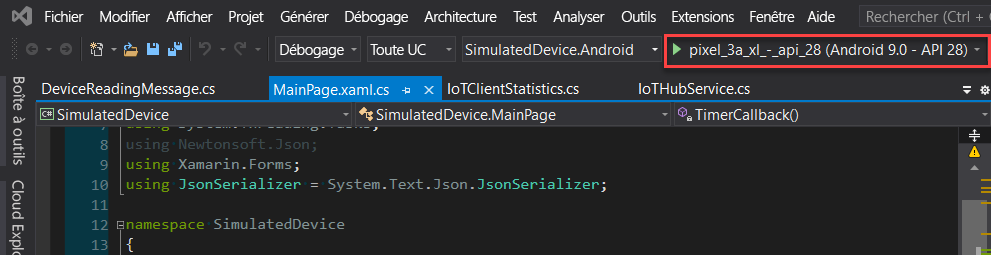
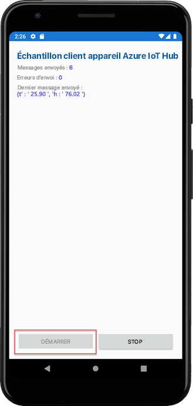
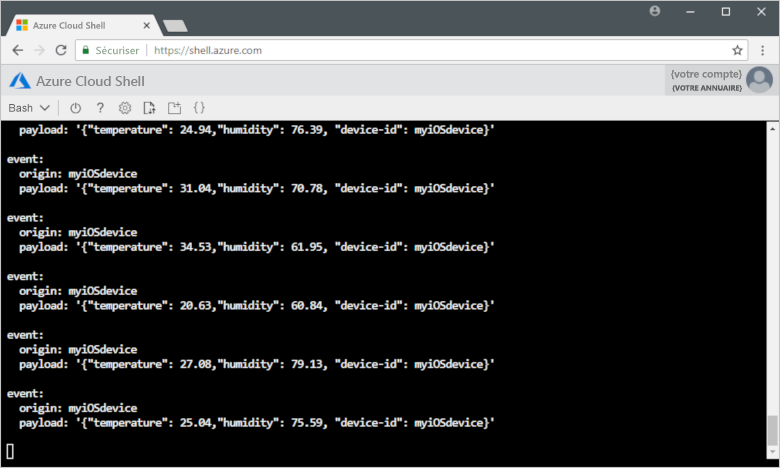

# <a name="quickstart-send-telemetry-from-a-device-to-an-iot-hub-xamarinforms"></a>Démarrage rapide : Envoyer des données de télémétrie d’un appareil à un IoT Hub (Xamarin.Forms)

[!INCLUDE [iot-hub-quickstarts-1-selector](../../includes/iot-hub-quickstarts-1-selector.md)]

IoT Hub est un service Azure qui vous permet de traiter de gros volumes de données de télémétrie envoyées par vos appareils IoT dans le cloud à des fins de stockage ou de traitement. Dans cet article, vous envoyez des données de télémétrie depuis une application d’appareil simulé à IoT Hub. Vous pouvez afficher les données à partir d’une application principale.

Cet article utilise une application Xamarin.Forms prédéfinie pour envoyer des données de télémétrie, et un utilitaire CLI pour lire ces données de télémétrie provenant d’IoT Hub.

[!INCLUDE [cloud-shell-try-it.md](../../includes/cloud-shell-try-it.md)]

Si vous n’avez pas d’abonnement Azure, créez un [compte gratuit](https://azure.microsoft.com/free/?WT.mc_id=A261C142F) avant de commencer.


## <a name="prerequisites"></a>Prérequis

- Télécharger l’exemple de code depuis [Exemples Azure](https://github.com/Azure-Samples/azure-iot-samples-xamarin/archive/master.zip)

- La dernière version de [Visual Studio 2019](https://visualstudio.microsoft.com/) ou [Visual Studio pour Mac](https://visualstudio.microsoft.com/) avec les outils Xamarin.Forms installés. Ce guide de démarrage rapide a été testé avec Visual Studio 16.6.0.

- Vérifiez que le port 8883 est ouvert dans votre pare-feu. L’exemple d’appareil de ce guide de démarrage rapide utilise le protocole MQTT, lequel communique sur le port 8883. Ce port peut être bloqué dans certains environnements réseau professionnels et scolaires. Pour plus d'informations sur les différentes façons de contourner ce problème, consultez [Se connecter à IoT Hub (MQTT)](iot-hub-mqtt-support.md#connecting-to-iot-hub).

- Exécutez la commande suivante afin d’ajouter l’extension Microsoft Azure IoT pour Azure CLI à votre instance Cloud Shell. L’extension IoT ajoute des commandes IoT Hub, IoT Edge et du service IoT Hub Device Provisioning (DPS) à Azure CLI.

   ```azurecli-interactive
   az extension add --name azure-iot
   ```

   [!INCLUDE [iot-hub-cli-version-info](../../includes/iot-hub-cli-version-info.md)]

## <a name="create-an-iot-hub"></a>Créer un hub IoT

[!INCLUDE [iot-hub-include-create-hub](../../includes/iot-hub-include-create-hub.md)]

## <a name="register-a-device"></a>Inscrire un appareil

Un appareil doit être inscrit dans votre hub IoT pour pouvoir se connecter. Dans ce démarrage rapide, vous utilisez Azure Cloud Shell pour inscrire un appareil simulé.

1. Exécutez les commandes suivantes dans Azure Cloud Shell pour créer l’identité d’appareil.

   **YourIoTHubName** : Remplacez l’espace réservé ci-dessous par le nom que vous avez choisi pour votre hub IoT.

   **myXamarinDevice** : il s’agit du nom de l’appareil que vous inscrivez. Il est recommandé d’utiliser **myXamarinDevice** comme indiqué. Si vous choisissez un autre nom pour votre appareil, vous devrez utiliser ce nom tout au long de cet article et mettre à jour le nom de l'appareil dans les exemples d'application avant de les exécuter.

   ```azurecli-interactive
   az iot hub device-identity create --hub-name {YourIoTHubName} --device-id myXamarinDevice
   ```

1. Exécutez la commande suivante dans Azure Cloud Shell pour obtenir la _chaîne de connexion d’appareil_ pour celui que vous venez d’inscrire :

   **YourIoTHubName** : Remplacez l’espace réservé ci-dessous par le nom que vous avez choisi pour votre hub IoT.

   ```azurecli-interactive
   az iot hub device-identity show-connection-string --hub-name {YourIoTHubName} --device-id myXamarinDevice --output table
   ```

   Notez la chaîne de connexion à l’appareil, qui ressemble à ce qui suit :

   `HostName={YourIoTHubName}.azure-devices.net;DeviceId=myXamarinDevice;SharedAccessKey={YourSharedAccessKey}`

    Vous utiliserez cette valeur plus loin dans ce guide de démarrage rapide.

## <a name="send-simulated-telemetry"></a>Envoyer des données de télémétrie simulée

L’exemple d’application s’exécute sur Windows - via une application UWP-, sur un simulateur ou appareil iOS et sur un simulateur ou appareil Android, qui se connecte à un point de terminaison spécifique de l’appareil sur votre hub IoT et envoie les données de télémétrie simulée (température et humidité). 

1. Ouvrez l’exemple d’espace de travail dans Visual Studio ou Visual Studio pour Mac.
2. Développez le projet **SimulatedDevice**.  
3. Ouvrez **IoTHubService.cs** pour le modifier dans Visual Studio. 
4. Recherchez la variable **_iotHubConnectionString** et mettez à jour sa valeur en fonction de la chaîne de connexion d’appareil que vous avez notée précédemment.
5. Enregistrez vos modifications. 
6. Exécutez le projet dans l’émulateur d’appareil ou un appareil réel avec le bouton **Générer et exécuter** ou le raccourci clavier **F5** sur Windows ou **Commande + r** sur Mac. 

   

7. Lorsque l’émulateur s’ouvre, sélectionnez **Démarrer** dans l’exemple d’application.

La capture d’écran suivante présente quelques exemples de sortie lorsque l’application envoie des données de télémétrie simulée à votre hub IoT : 

## <a name="read-the-telemetry-from-your-hub"></a>Lire les données de télémétrie envoyées par votre hub

L’exemple d’application que vous avez exécutée sur l’émulateur XCode affiche les données concernant les messages envoyés par l’appareil. Vous pouvez également voir les données à votre hub IoT, au fur et à mesure de leur réception. L’extension CLI IoT Hub peut se connecter au point de terminaison **Événements** côté service sur votre IoT Hub. L’extension reçoit les messages appareil-à-cloud envoyés à partir de votre appareil simulé. Une application back-end IoT Hub s’exécute généralement dans le cloud pour recevoir et traiter les messages appareil-à-cloud.

Exécutez les commandes suivantes dans Azure Cloud Shell, en remplaçant `YourIoTHubName` par le nom de votre hub IoT :

```azurecli-interactive
az iot hub monitor-events --device-id myXamarinDevice --hub-name {YourIoTHubName}
```

La capture d’écran suivante présente la sortie lorsque l’extension reçoit les données de télémétrie envoyées par l’appareil simulé au hub :

La capture d’écran suivante affiche le type de données de télémétrie que vous voyez dans votre fenêtre de terminal local : 

## <a name="clean-up-resources"></a>Nettoyer les ressources

[!INCLUDE [iot-hub-quickstarts-clean-up-resources](../../includes/iot-hub-quickstarts-clean-up-resources.md)]

## <a name="next-steps"></a>Étapes suivantes

Dans ce guide de démarrage rapide, vous avez configuré un hub IoT, inscrit un appareil, envoyé des données de télémétrie simulée au hub à partir d’une application Xamarin.Forms et lu les données de télémétrie à partir du hub. 

Pour savoir comment contrôler votre appareil simulé à partir d’une application back-end, passez au démarrage rapide suivant.

> [!div class="nextstepaction"]
> [Démarrage rapide : Contrôler un appareil connecté à un hub IoT](quickstart-control-device-node.md)
