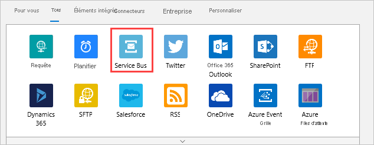
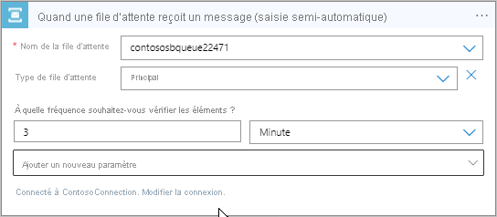
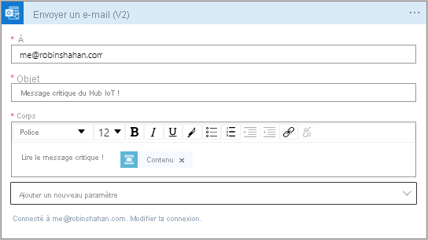
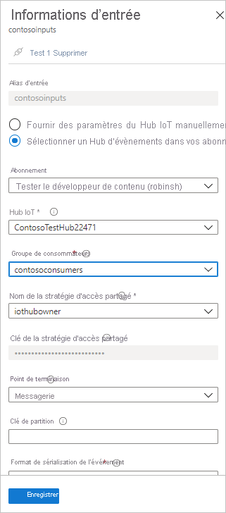

# <a name="tutorial-part-2---view-the-routed-messages"></a>Tutoriel : Partie 2 : Visualiser les messages routés

[!INCLUDE [iot-hub-include-routing-intro](../../includes/iot-hub-include-routing-intro.md)]

[!INCLUDE [updated-for-az](../../includes/updated-for-az.md)]

## <a name="rules-for-routing-the-messages"></a>Règles de routage des messages

Voici les règles de routage des messages. Elles ont été définies dans la 1re partie de ce tutoriel. Vous les voyez à l’œuvre dans cette deuxième partie.

|Valeur |Résultats|
|------|------|
|level="storage" |Écrire dans Stockage Azure.|
|level="critical" |Écrire dans une file d’attente Service Bus. Une application logique extrait le message de la file d’attente et utilise Office 365 pour envoyer le message par e-mail.|
|default |Afficher ces données à l’aide de Power BI.|

Vous créez maintenant les ressources vers lesquelles les messages seront routés, vous exécutez une application pour envoyer des messages au hub et vous voyez le routage en action.

## <a name="create-a-logic-app"></a>Créer une application logique  

La file d’attente Service Bus doit être utilisée pour recevoir des messages indiqués comme étant critiques. Configurez une application logique pour surveiller la file d’attente Service Bus et envoyer un e-mail lors de l’ajout d’un message à la file d’attente.

1. Dans le [portail Azure](https://portal.azure.com), sélectionnez **+ Créer une ressource**. Tapez **application logique** dans la zone de recherche, puis cliquez sur Entrée. Dans les résultats de la recherche affichés, sélectionnez Application logique, puis sélectionnez **Créer** pour passer au volet **Créer une application logique**. Renseignez les champs.

   **Name** : ce champ indique le nom de l'application logique. Ce didacticiel utilise **ContosoLogicApp**.

   **Abonnement**: Sélectionnez votre abonnement Azure.

   **Groupe de ressources** : Sélectionnez **Utiliser existant**, puis sélectionnez votre groupe de ressources. Ce didacticiel utilise **ContosoResources**.

   **Emplacement** : utilisez votre emplacement. Ce didacticiel utilise **USA Ouest**.

   **Log Analytics** : cette option doit être désactivée.

   

   Sélectionnez **Create** (Créer). Le déploiement de l’application peut prendre quelques minutes.

2. Accédez maintenant à l’application logique. La méthode la plus simple pour accéder à l’application logique consiste à sélectionner **Groupe de ressources**, à sélectionner votre groupe de ressources (ce tutoriel utilise**ContosoResources**), puis à sélectionner l’application logique dans la liste des ressources. 

    La page Concepteur d’applications logiques apparaît (vous devrez peut-être faire défiler vers la droite pour voir la page entière). Dans la page Concepteur d’applications logiques, faites défiler jusqu’à voir la vignette indiquant **Application logique vide +** et sélectionnez-la. L’onglet par défaut est « Pour vous ». Si ce volet est vide, sélectionnez **Tous** pour voir tous les connecteurs et les déclencheurs disponibles.

3. Sélectionnez **Service Bus** dans la liste des connecteurs.

   

4. Une liste de déclencheurs s’affiche. Sélectionnez **Quand une file d’attente reçoit un message (saisie semi-automatique) / Service Bus**.

   

5. Dans l’écran suivant, indiquez le nom de connexion. Ce didacticiel utilise **ContosoConnection**.

   

   Sélectionnez l’espace de noms Service Bus. Ce didacticiel utilise **ContosoSBNamespace**. Lorsque vous sélectionnez l’espace de noms, le portail interroge l’espace de noms Service Bus pour récupérer les clés. Sélectionnez **RootManageSharedAccessKey**, puis **Créer**.

   

6. Dans l’écran suivant, sélectionnez le nom de la file d’attente (ce didacticiel utilise **contososbqueue**) dans la liste déroulante. Vous pouvez utiliser les valeurs par défaut pour les autres champs.

   

7. Définissez maintenant l’action pour envoyer un e-mail quand un message est reçu dans la file d’attente. Dans le Concepteur d’applications logiques, sélectionnez **+ Nouvelle étape** pour ajouter une étape, puis sélectionnez **Tous** pour voir toutes les options disponibles. Dans le volet **Choisir une action**, recherchez et sélectionnez **Office 365 Outlook**. Dans l’écran Actions, sélectionnez **Envoyer un e-mail/Office 365 Outlook**.  

   

8. Connectez-vous à votre compte professionnel ou scolaire pour configurer la connexion. En cas de dépassement du délai d’expiration, réessayez. Spécifiez les adresses e-mail des destinataires. Indiquez également l’objet et tapez le message que vous souhaitez que le destinataire voit dans le corps de l’e-mail. Pour tester si tout fonctionne bien, indiquez votre propre adresse e-mail dans le champ des destinataires.

   Sélectionnez **Ajouter du contenu dynamique** pour afficher le contenu du message que vous pouvez inclure. Sélectionnez **Contenu** pour que le message soit inclus dans l’e-mail.

   

9. Sélectionnez **Enregistrer**. Puis, fermez le Concepteur d’applications logiques.

## <a name="set-up-azure-stream-analytics"></a>Configurer Azure Stream Analytics

Pour afficher les données dans une visualisation Power BI, commencez par configurer un travail Stream Analytics pour récupérer les données. N’oubliez pas que seuls les messages pour lesquels la propriété **level** est définie sur **normal** sont envoyés au point de terminaison par défaut et seront récupérés par le travail Stream Analytics pour la visualisation Power BI.

### <a name="create-the-stream-analytics-job"></a>Créer la tâche Stream Analytics

1. Dans le [portail Azure](https://portal.azure.com), sélectionnez **Créer une ressource** > **Internet des objets** > **Tâche Stream Analytics**.

2. Saisissez les informations ci-après concernant le travail.

   **Nom du travail** : Nom du travail. Le nom doit être globalement unique. Ce didacticiel utilise **contosoJob**.

   **Abonnement**: Abonnement Azure que vous utilisez pour le tutoriel.

   **Groupe de ressources** : utilisez le même groupe de ressources que celui de votre hub IoT. Ce didacticiel utilise **ContosoResources**.

   **Emplacement** : utilisez le même emplacement que celui utilisé dans le script de configuration. Ce didacticiel utilise **USA Ouest**.

   

3. Sélectionnez **Créer** pour créer le travail. Le déploiement peut prendre quelques minutes.

    Pour revenir à la tâche, sélectionnez **Groupes de ressources**. Ce didacticiel utilise **ContosoResources**. Sélectionnez le groupe de ressources, puis sélectionnez la tâche Stream Analytics dans la liste des ressources.

### <a name="add-an-input-to-the-stream-analytics-job"></a>Ajouter une entrée à la tâche Stream Analytics

1. Sous **Topologie de la tâche**, sélectionnez **Entrées**.

2. Dans le volet **Entrées**, sélectionnez **Ajouter une entrée de flux** et sélectionnez IoT Hub. Dans l’écran qui s’affiche, renseignez les champs suivants :

   **Alias d’entrée** : Ce didacticiel utilise **contosoinputs**.

   **Sélectionner un hub IoT dans vos abonnements** : Sélectionnez cette case d’option.

   **Abonnement**: Sélectionnez l’abonnement Azure que vous utilisez pour ce tutoriel.

   **Hub IoT** : Sélectionnez le hub IoT. Ce didacticiel utilise **ContosoTestHub**.

   **Point de terminaison** : sélectionnez **Messagerie**. (Si vous sélectionnez Surveillance des opérations, vous obtenez les données de télémétrie sur l’IoT Hub, plutôt que les données que vous envoyez.) 

   **Nom de la stratégie d'accès partagé** : Sélectionnez **service**. Le portail renseigne la clé de la stratégie d’accès partagé pour vous.

   **Groupe de consommateurs** : Sélectionnez le groupe de consommateurs configuré dans la 1re partie de ce tutoriel. Ce didacticiel utilise **contosoconsumers**.
   
   Pour les autres champs, acceptez les valeurs par défaut. 

   

3. Sélectionnez **Enregistrer**.

### <a name="add-an-output-to-the-stream-analytics-job"></a>Ajouter une sortie à la tâche Stream Analytics

1. Sous **Topologie de la tâche**, sélectionnez **Sorties**.

2. Dans le volet **Sorties**, sélectionnez **Ajouter**, puis **Power BI**. Dans l’écran qui s’affiche, renseignez les champs suivants :

   **Alias de sortie** : alias unique de la sortie. Ce didacticiel utilise **contosooutputs**. 

   **Nom du jeu de données** : nom du jeu de données à utiliser dans Power BI. Ce didacticiel utilise **contosodataset**. 

   **Nom de la table** : nom de la table à utiliser dans Power BI. Ce didacticiel utilise **contosotable**.

   Acceptez les valeurs par défaut pour les autres champs.

3. Sélectionnez **Autoriser** et connectez-vous à votre compte Power BI. (Plusieurs tentatives peuvent s’avérer nécessaires.)

   

4. Sélectionnez **Enregistrer**.

### <a name="configure-the-query-of-the-stream-analytics-job"></a>Configurer la requête de la tâche Stream Analytics

1. Sous **Topologie de la tâche**, sélectionnez **Requête**.

2. Remplacez `[YourInputAlias]` par l’alias d’entrée du travail. Ce didacticiel utilise **contosoinputs**.

3. Remplacez `[YourOutputAlias]` par l’alias de sortie du travail. Ce didacticiel utilise **contosooutputs**.

   

4. Sélectionnez **Enregistrer**.

5. Fermez le volet Requête. Vous revenez à la vue des ressources dans le groupe de ressources. Sélectionnez la tâche Stream Analytics. Ce tutoriel l’appelle **contosoJob**.

### <a name="run-the-stream-analytics-job"></a>Exécuter la tâche Stream Analytics

Dans la tâche Stream Analytics, sélectionnez **Démarrer** > **Maintenant** > **Démarrer**. Une fois la tâche lancée, l’état correspondant passe de **Arrêté** à **Exécution**.

Pour configurer le rapport Power BI, vous avez besoin de données ; vous allez donc configurer Power BI après la création de l’appareil et l’exécution de l’application de simulation de l’appareil.

## <a name="run-simulated-device-app"></a>Exécuter l’application d’appareil simulé

Dans la 1re partie de ce tutoriel, vous avez configuré un appareil pour simuler l’utilisation d’un appareil IoT. Dans cette section, vous téléchargez l’application console .NET. Elle simule l’appareil qui envoie des messages appareil-à-cloud à un hub IoT (en supposant que vous n’ayez pas déjà téléchargé l’application et les ressources dans la 1re partie).

Cette application envoie des messages pour chacune des différentes méthodes de routage des messages. Le téléchargement contient aussi un dossier où se trouvent le modèle et le fichier de paramètres complets Azure Resource Manager ainsi que les scripts Azure CLI et PowerShell.

Si vous n’avez pas téléchargé les fichiers depuis le dépôt au cours de la 1re partie de ce tutoriel, faites-le maintenant à partir de la [simulation d’appareil IoT](https://github.com/Azure-Samples/azure-iot-samples-csharp/archive/master.zip). La sélection de ce lien télécharge un dépôt contenant plusieurs applications. La solution que vous recherchez se trouve à l’emplacement iot-hub/Tutorials/Routing/IoT_SimulatedDevice.sln. 

Double-cliquez sur le fichier de solution (IoT_SimulatedDevice.sln) pour ouvrir le code dans Visual Studio, puis ouvrez Program.cs. Remplacez `{your hub name}` par le nom d’hôte IoT Hub. Le format du nom d’hôte IoT Hub est **{iot-hub-name}.azure-devices.net**. Pour ce didacticiel, le nom d’hôte IoT Hub est **ContosoTestHub.azure-devices.net**. Ensuite, remplacez `{your device key}` par la clé de l’appareil enregistrée précédemment lorsque vous avez configuré l’appareil simulé. 

   ```csharp
        static string s_myDeviceId = "Contoso-Test-Device";
        static string s_iotHubUri = "ContosoTestHub.azure-devices.net";
        // This is the primary key for the device. This is in the portal. 
        // Find your IoT hub in the portal > IoT devices > select your device > copy the key. 
        static string s_deviceKey = "{your device key}";
   ```

## <a name="run-and-test"></a>Exécuter et tester

Exécutez l’application console. Patientez quelques minutes. Vous pouvez voir les messages envoyés sur l’écran de la console de l’application.

L’application envoie un nouveau message appareil-à-cloud à l’IoT Hub toutes les secondes. Le message contient un objet sérialisé JSON avec l’ID d’appareil, la température, l’humidité et le niveau du message, qui est défini par défaut sur `normal`. Un niveau de `critical` ou `storage` est attribué de façon aléatoire, ce qui permet au message d’être acheminé vers le compte de stockage ou la file d’attente Service Bus (qui déclenche votre application logique pour envoyer un e-mail). Les mesures par défaut (`normal`) seront affichées dans le rapport BI que vous configurerez après.

À ce stade, si tout est configuré correctement, vous devez voir les résultats suivants :

1. Vous commencez à recevoir des e-mails sur les messages critiques.

   

   Ce résultat signifie que les affirmations suivantes sont vraies. 

   * Que le routage vers la file d’attente Service Bus fonctionne correctement.
   * Que l’application logique qui récupère le message dans la file d’attente Service Bus fonctionne correctement.
   * Que le connecteur de l’application logique pour Outlook fonctionne correctement. 

2. Dans le [portail Azure](https://portal.azure.com), sélectionnez **Groupes de ressources**, puis votre groupe de ressources. Ce didacticiel utilise **ContosoResources**. 

    Sélectionnez le compte de stockage, sélectionnez **Conteneurs**, puis sélectionnez le conteneur. Ce didacticiel utilise **contosoresults**. Vous devez voir un dossier, et vous pouvez explorer les répertoires jusqu’à voir un ou plusieurs fichiers. Ouvrez l’un de ces fichiers ; ils contiennent les entrées acheminées vers le compte de stockage. 

   

Ce résultat signifie que l’affirmation suivante est vraie.

   * Que le routage vers le compte de stockage fonctionne correctement.

À présent, l’application étant en cours d’exécution, configurez la visualisation Power BI pour voir les messages provenant du routage par défaut.

## <a name="set-up-the-power-bi-visualizations"></a>Configurer les visualisations Power BI

1. Connectez-vous à votre compte [Power BI](https://powerbi.microsoft.com/).

2. Accédez **Espace de travail** et sélectionnez l’espace de travail que vous avez défini lors de la création de la sortie du travail Stream Analytics. Ce didacticiel utilise **My Workspace**. 

3. Sélectionnez **Jeux de données**. Si vous n’avez pas de jeux de données, attendez quelques minutes et revérifiez.

   Vous devez voir apparaître le jeu de données répertorié que vous avez indiqué lors de la création de la sortie du travail Stream Analytics. Ce didacticiel utilise **contosodataset**. (5 à 10 minutes peuvent être nécessaires pour que le jeu de données s’affiche la première fois.)

4. Sous **ACTIONS**, sélectionnez la première icône pour créer un rapport.

   

5. Créez un graphique en courbes pour afficher la température en temps réel et au fil du temps.

   * Sur la page de création de rapports, ajoutez un graphique en courbes en sélectionnant l’icône de graphiques en courbes.

     

   * Sur le volet **Champs**, développez la table que vous avez indiquée lors de la création de la sortie du travail Stream Analytics. Ce didacticiel utilise **contosotable**.

   * Faites glisser **EventEnqueuedUtcTime** vers **Axe** dans le volet **Visualisations**.

   * Faites glisser **Température** vers **Valeurs**.

   Un graphique en courbes est créé. L’axe des abscisses affiche la date et l’heure du fuseau horaire UTC. Quant à l’axe des ordonnées, il affiche la température fournie par le capteur.

6. Créez un autre graphique en courbes pour afficher l’humidité en temps réel, au fil du temps. Pour configurer le deuxième graphique, suivez le même processus que pour le premier en plaçant **EventEnqueuedUtcTime** sur l’axe X (**Axe**) et **humidité** sur l’axe Y (**Valeurs**).

   

7. Sélectionnez **Enregistrer** pour enregistrer le rapport. Entrez un nom de rapport, si vous y êtes invité.

Vous devez être en mesure de voir les données sur les deux graphiques. Ce résultat signifie que les affirmations suivantes sont vraies :

   * Que le routage vers le point de terminaison par défaut fonctionne correctement.
   * Que le travail Azure Stream Analytics est correctement diffusé en continu.
   * Que la visualisation Power BI est correctement configurée.

Vous pouvez actualiser les graphiques pour afficher les données les plus récentes en sélectionnant le bouton Actualiser en haut de la fenêtre Power BI. 

## <a name="clean-up-resources"></a>Nettoyer les ressources 

Si vous souhaitez supprimer toutes les ressources Azure que vous avez créées au cours des deux parties de ce tutoriel, supprimez le groupe de ressources. Cette opération supprime toutes les ressources contenues dans le groupe. Dans ce cas, l’IoT Hub, l’espace de noms et la file d’attente Service Bus, l’application logique, le compte de stockage et le groupe de ressources lui-même sont supprimés. Vous pouvez également supprimer les ressources Power BI et effacer les e-mails envoyés durant le tutoriel.

### <a name="clean-up-resources-in-the-power-bi-visualization"></a>Supprimer des ressources dans la visualisation Power BI

Connectez-vous à votre compte [Power BI](https://powerbi.microsoft.com/). Accédez à votre espace de travail. Ce didacticiel utilise **My Workspace**. Pour supprimer la visualisation Power BI, accédez à Jeux de données, puis sélectionnez l’icône de corbeille pour supprimer le jeu de données. Ce didacticiel utilise **contosodataset**. Lorsque vous supprimez le jeu de données, le rapport est également supprimé.

### <a name="use-the-azure-cli-to-clean-up-resources"></a>Utiliser Azure CLI pour nettoyer des ressources

Pour supprimer le groupe de ressources, utilisez la commande [az group delete](https://docs.microsoft.com/cli/azure/group?view=azure-cli-latest#az-group-delete). `$resourceGroup` a été défini sur **ContosoResources** au début de ce tutoriel.

```azurecli-interactive
az group delete --name $resourceGroup
```

### <a name="use-powershell-to-clean-up-resources"></a>Utiliser PowerShell pour nettoyer les ressources

Pour supprimer le groupe de ressources, utilisez la commande [Remove-AzResourceGroup](https://docs.microsoft.com/powershell/module/az.resources/remove-azresourcegroup). `$resourceGroup` a été défini sur **ContosoResources** au début de ce tutoriel.

```azurepowershell-interactive
Remove-AzResourceGroup -Name $resourceGroup
```

### <a name="clean-up-test-emails"></a>Nettoyer les e-mails de test

Vous pouvez également supprimer les e-mails de votre boîte de réception, qui ont été générés via l’application logique durant l’exécution de l’application d’appareil.

## <a name="next-steps"></a>Étapes suivantes

Dans ce tutoriel en deux parties, vous avez appris à utiliser le routage des messages pour router des messages IoT Hub vers différentes destinations en effectuant les tâches suivantes.  

**Partie I : Créer des ressources, configurer le routage des messages**
> [!div class="checklist"]
> * Créez les ressources : un hub IoT, un compte de stockage, une file d’attente Service Bus et un appareil simulé.
> * Configurez les points de terminaison et les routes des messages dans IoT Hub pour le compte de stockage et la file d’attente Service Bus.

**Partie II : Envoyer les messages au hub, visualiser les résultats routés**
> [!div class="checklist"]
> * Créer une application logique qui est déclenchée et qui envoie un e-mail lors de l’ajout d’un message à la file d’attente Service Bus.
> * Télécharger et exécuter une application qui simule l’envoi de messages par un appareil IoT au Hub pour les différentes options de routage.
> * Créer une visualisation Power BI pour les données envoyées au point de terminaison par défaut.
> * Afficher les résultats...
> * ... dans la file d’attente Service Bus et les e-mails.
> * ... dans le compte de stockage.
> * ... dans la visualisation Power BI.

Passez au didacticiel suivant pour découvrir comment gérer l’état d’un appareil IoT. 

> [!div class="nextstepaction"]
> [Configurer et utiliser des métriques et des diagnostics avec un hub IoT](tutorial-use-metrics-and-diags.md)
