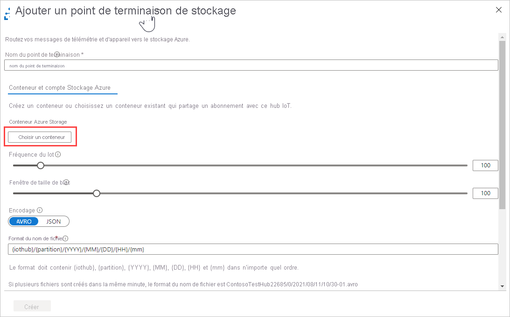
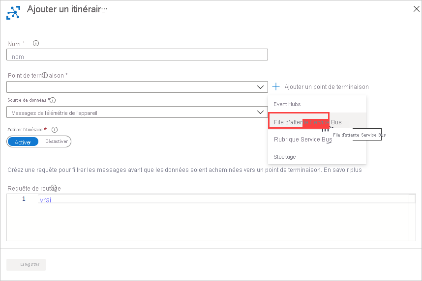

# <a name="tutorial-use-the-azure-cli-and-azure-portal-to-configure-iot-hub-message-routing"></a>Tutoriel : Utiliser Azure CLI et le portail Azure pour configurer le routage des messages IoT Hub

[!INCLUDE [iot-hub-include-routing-intro](../../includes/iot-hub-include-routing-intro.md)]

[!INCLUDE [iot-hub-include-routing-create-resources](../../includes/iot-hub-include-routing-create-resources.md)]

## <a name="use-the-azure-cli-to-create-the-base-resources"></a>Utiliser Azure CLI pour créer les ressources de base

Ce tutoriel utilise Azure CLI pour créer les ressources de base, puis utilise le [portail Azure](https://portal.azure.com) pour montrer comment configurer le routage des messages et l’appareil virtuel pour les tests.

Copiez le script ci-dessous et collez-le dans Cloud Shell, puis appuyez sur Entrée. Le script est alors exécuté ligne par ligne. Ceci crée les ressources de base utilisées dans ce tutoriel, dont le compte de stockage, le hub IoT, l’espace de noms Service Bus et la file d’attente Service Bus.

Plusieurs noms de ressources doivent être globalement uniques, comme le nom du hub IoT et le nom du compte de stockage. Pour faciliter le nommage, une valeur alphanumérique aléatoire appelée *randomValue* est ajoutée à ces noms de ressources. La valeur randomValue est générée une fois au début du script, puis ajoutée aux noms de ressources tout au long du script en fonction des besoins. Si vous ne souhaitez pas que cette valeur soit aléatoire, vous pouvez la définir sur une chaîne vide ou sur une valeur spécifique.

> [!TIP]
> Une remarque à propos du débogage : ce script utilise le symbole de continuation (la barre oblique inverse `\`) pour rendre le script plus lisible. Si vous rencontrez des problèmes durant l’exécution du script, vérifiez que votre session Cloud Shell exécute `bash`, et qu’il n’existe aucun espace après les barres obliques inverses.
>

```azurecli-interactive
# This retrieves the subscription id of the account 
#   in which you're logged in.
# This field is used to set up the routing queries.
subscriptionID=$(az account show --query id)

# Concatenate this number onto the resources that have to be globally unique.
# You can set this to "" or to a specific value if you don't want it to be random.
# This retrieves a random value.
randomValue=$RANDOM

# Set the values for the resource names that 
#   don't have to be globally unique.
location=westus
resourceGroup=ContosoResources
iotHubConsumerGroup=ContosoConsumers
containerName=contosoresults

# Create the resource group to be used
#   for all the resources for this tutorial.
az group create --name $resourceGroup \
    --location $location

# The IoT hub name must be globally unique, 
#   so add a random value to the end.
iotHubName=ContosoTestHub$randomValue 
echo "IoT hub name = " $iotHubName

# Create the IoT hub.
az iot hub create --name $iotHubName \
    --resource-group $resourceGroup \
    --sku S1 --location $location

# Add a consumer group to the IoT hub for the 'events' endpoint.
az iot hub consumer-group create --hub-name $iotHubName \
    --name $iotHubConsumerGroup

# The storage account name must be globally unique, 
#   so add a random value to the end.
storageAccountName=contosostorage$randomValue
echo "Storage account name = " $storageAccountName

# Create the storage account to be used as a routing destination.
az storage account create --name $storageAccountName \
    --resource-group $resourceGroup \
    --location $location \
    --sku Standard_LRS

# Get the primary storage account key. 
#    You need this to create the container.
storageAccountKey=$(az storage account keys list \
    --resource-group $resourceGroup \
    --account-name $storageAccountName \
    --query "[0].value" | tr -d '"') 

# See the value of the storage account key.
echo "storage account key = " $storageAccountKey

# Create the container in the storage account. 
az storage container create --name $containerName \
    --account-name $storageAccountName \
    --account-key $storageAccountKey \
    --public-access off

# The Service Bus namespace must be globally unique, 
#   so add a random value to the end.
sbNamespace=ContosoSBNamespace$randomValue
echo "Service Bus namespace = " $sbNamespace

# Create the Service Bus namespace.
az servicebus namespace create --resource-group $resourceGroup \
    --name $sbNamespace \
    --location $location

# The Service Bus queue name must be globally unique, 
#   so add a random value to the end.
sbQueueName=ContosoSBQueue$randomValue
echo "Service Bus queue name = " $sbQueueName

# Create the Service Bus queue to be used as a routing destination.
az servicebus queue create --name $sbQueueName \
    --namespace-name $sbNamespace \
    --resource-group $resourceGroup

```

Maintenant que vous avez configuré les ressources de base, vous pouvez configurer le routage des messages dans le [portail Azure](https://portal.azure.com).

## <a name="set-up-message-routing"></a>Configurer le routage de messages

[!INCLUDE [iot-hub-include-create-routing-description](../../includes/iot-hub-include-create-routing-description.md)]

### <a name="route-to-a-storage-account"></a>Router vers un compte de stockage

Configurez maintenant le routage pour le compte de stockage. Vous accédez au volet Routage des messages, puis vous ajoutez une route. Lors de l’ajout de la route, définissez un nouveau point de terminaison pour la route. Une fois ce routage configuré, les messages pour lesquels la propriété **level** est définie sur **storage** sont automatiquement écrits dans un compte de stockage. 

[!INCLUDE [iot-hub-include-blob-storage-format](../../includes/iot-hub-include-blob-storage-format.md)]

Maintenant, vous configurez le routage des messages vers le Stockage Azure.

1. Dans le [portail Azure](https://portal.azure.com), sélectionnez **Groupes de ressources**, puis votre groupe de ressources. Ce didacticiel utilise **ContosoResources**.

2. Dans la liste des ressources, sélectionnez le hub IoT. Ce didacticiel utilise **ContosoTestHub**.

3. Sélectionnez **Routage des messages** dans la colonne du milieu qui indique **_Messagerie_*. Sélectionnez +** Ajouter** pour afficher le volet **Ajouter un itinéraire**. Sélectionnez +**Ajouter un point de terminaison** en regard du champ Point de terminaison, puis **Stockage**. Vous voyez le volet **Ajouter un point de terminaison de stockage**.

   

4. Entrez un nom pour le point de terminaison. Ce tutoriel utilise **ContosoStorageEndpoint**.

   

5. Sélectionnez **Choisir un conteneur**. Vous accédez alors à une liste de vos comptes de stockage. Sélectionnez ce que vous avez configuré lors des étapes de préparation ; ce tutoriel utilise **contosostorage**. Il montre une liste de conteneurs dans ce compte de stockage. **Sélectionnez** le conteneur que vous avez configuré dans les étapes de préparation. Ce didacticiel utilise **contosoresults**. Cliquez ensuite sur **Sélectionner** dans le bas de l’écran. Vous revenez à un volet **Ajouter un point de terminaison de stockage** différent. L’URL du conteneur sélectionné s’affiche. 

6. Définissez l’encodage sur AVRO ou JSON. Dans ce didacticiel, utilisez les valeurs par défaut pour les autres champs. Ce champ est grisé si la région sélectionnée ne prend pas en charge l’encodage JSON. Définissez le format du nom de fichier. 

   > [!NOTE]
   > Définissez le format du nom de l’objet blob en utilisant le **format du nom du fichier de l’objet blob**. Par défaut, il s’agit de `{iothub}/{partition}/{YYYY}/{MM}/{DD}/{HH}/{mm}`. Le format doit contenir {iothub}, {partition}, {YYYY}, {MM}, {DD}, {HH} et {mm} dans n’importe quel ordre.
   >
   > Par exemple, utilisez le format du nom de fichier de l’objet blob par défaut si le nom du hub est ContosoTestHub, et que la date/heure est le 30 octobre 2018 à 10h56. Le nom de l’objet blob ressemblera à ceci : `ContosoTestHub/0/2018/10/30/10/56`.
   > 
   > Par défaut, les objets blob sont écrits au format AVRO.
   >

7. Sélectionnez **Créer** en bas de la page pour créer le point de terminaison de stockage et l’ajouter à la route. Vous êtes redirigé vers le volet **Ajouter une route**. 

8. Complétez le reste des informations de la requête de routage. Cette requête spécifie les critères pour l’envoi des messages au conteneur de stockage que vous venez d’ajouter comme point de terminaison. Renseignez les champs affichés à l’écran.

9. Remplissez le reste des champs.

   - **Nom** : saisissez le nom de votre règle d’acheminement. Ce tutoriel utilise **ContosoStorageRoute**. Ensuite, spécifiez le point de terminaison pour le stockage. Ce tutoriel utilise ContosoStorageEndpoint.
   
   - Spécifiez **Source de données** : sélectionnez **Messages de télémétrie des appareils** dans la liste déroulante.   

   - Sélectionnez **Activer la route** : Assurez-vous que ce champ a la valeur `enabled`.

   - **Requête de routage** : entrez `level="storage"` pour la chaîne de requête.

   
  
10.  Sélectionnez **Enregistrer**. Une fois l’opération terminée, vous êtes redirigé vers le volet Routage des messages, où vous pouvez voir la nouvelle requête de routage pour le stockage. Fermez le volet Routage des messages pour revenir à la page Groupe de ressources.


### <a name="route-to-a-service-bus-queue"></a>Router vers une file d’attente Service Bus

Configurez maintenant le routage pour la file d’attente Service Bus. Vous accédez au volet Routage des messages, puis vous ajoutez une route. Lors de l’ajout de l’itinéraire, définissez une file d’attente Service Bus comme point de terminaison de l’itinéraire. Une fois cette route configurée, les messages pour lesquels la propriété **level** est définie sur **critical** sont écrits dans la file d’attente Service Bus, qui déclenche une application logique qui envoie ensuite un e-mail avec les informations.

1. Dans la page Groupe de ressources, sélectionnez votre hub IoT, puis **Routage des messages**.

2. Dans le volet **Routage des messages**, sélectionnez +**Ajouter**.

3. Dans le volet **Ajouter une route**, sélectionnez +**Ajouter** près de **+ Point de terminaison**. Sélectionnez **File d’attente Service Bus**. Vous voyez le volet **Ajouter un point de terminaison Service Bus**.

   

4. Remplissez le reste des champs :

   **Nom du point de terminaison** : Entrez un nom pour le point de terminaison. Ce didacticiel utilise **ContosoSBQEndpoint**.
   
   **Espace de noms Service Bus** : Utilisez la liste déroulante pour sélectionner l’espace de noms Service Bus que vous avez configuré lors des étapes de préparation. Ce didacticiel utilise **ContosoSBNamespace**.

   **File d'attente Service Bus** : Utilisez la liste déroulante pour sélectionner la file d’attente Service Bus. Ce didacticiel utilise **contososbqueue**.

5. Sélectionnez **Créer** pour ajouter le 1er point de terminaison de file d’attente Service Bus. Vous revenez au volet **Ajouter une route**.

   

6. Complétez maintenant le reste des informations de la requête de routage. Cette requête spécifie les critères pour l’envoi des messages à la file d’attente Service Bus que vous venez d’ajouter comme point de terminaison. Renseignez les champs affichés à l’écran. 

   **Nom** : saisissez le nom de votre règle d’acheminement. Ce tutoriel utilise **ContosoSBQueueRoute**. 

   **Point de terminaison** : ce champ présente le point de terminaison que vous venez de configurer.

   **Source de données** : sélectionnez **Messages de télémétrie des appareils** dans la liste déroulante.

   **Activer la route** : définissez ce champ sur `enable`.

   **Requête de routage** : entrez `level="critical"` pour la requête de routage. 

   

7. Sélectionnez **Enregistrer**. Quand vous êtes redirigé vers le volet Routes, vous voyez vos deux nouvelles routes.

   

8. Vous pouvez voir les points de terminaison personnalisés que vous avez configurés en sélectionnant l’onglet **Points de terminaison personnalisés**.

   

9. Fermez le volet Routage des messages pour revenir au volet Groupe de ressources.

## <a name="create-a-simulated-device"></a>Créez un appareil simulé.

[!INCLUDE [iot-hub-include-create-simulated-device-portal](../../includes/iot-hub-include-create-simulated-device-portal.md)]

## <a name="next-steps"></a>Étapes suivantes

Maintenant que vous avez terminé la configuration des ressources et des routes des messages, passez au tutoriel suivant pour découvrir comment envoyer des messages au hub IoT et visualiser les routes qu’ils empruntent vers les différentes destinations. 

> [!div class="nextstepaction"]
> [Partie 2 - Voir les résultats du routage des messages](tutorial-routing-view-message-routing-results.md)
