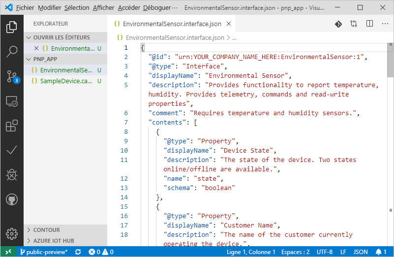
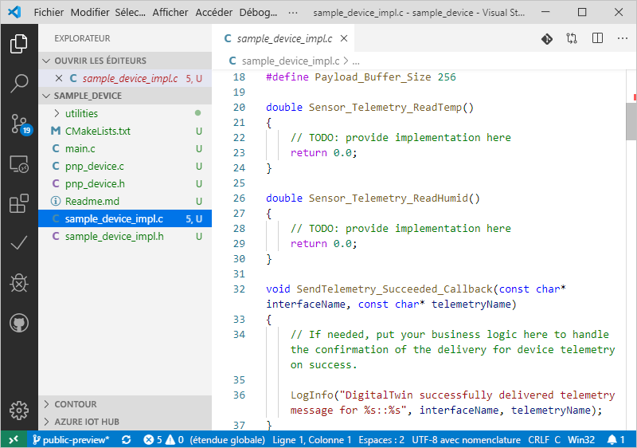

# <a name="quickstart-use-a-device-capability-model-to-create-an-iot-plug-and-play-preview-device-linux"></a>Démarrage rapide : Utiliser un modèle de fonctionnalité d’appareil pour créer un appareil IoT Plug-and-Play Preview (Linux)

[!INCLUDE [iot-pnp-quickstarts-1-selector.md](../../includes/iot-pnp-quickstarts-1-selector.md)]

Un _modèle de fonctionnalité d’appareil_ décrit les fonctionnalités d’un appareil IoT Plug-and-Play. Un modèle de fonctionnalité d’appareil est souvent associé à une référence SKU de produit. Les fonctionnalités définies dans le modèle de fonctionnalité d’appareil sont organisées en interfaces réutilisables. Vous pouvez générer le code d’appareil squelette à partir d’un modèle de fonctionnalité d’appareil. Ce démarrage rapide vous montre comment utiliser VS Code sous Ubuntu Linux pour créer un appareil IoT Plug-and-Play à l’aide d’un modèle de fonctionnalité d’appareil.

## <a name="prerequisites"></a>Prérequis

Ce démarrage rapide suppose que vous utilisez Ubuntu Linux avec un environnement de bureau. Les étapes de ce didacticiel ont été testées à l’aide d’Ubuntu 18.04.

Pour suivre ce démarrage rapide, vous devez installer les logiciels suivants sur votre machine locale Linux :

* Installez **GCC**, **Git**, **cmake** et toutes les dépendances à l’aide de la commande `apt-get` :

    ```sh
    sudo apt-get update
    sudo apt-get install -y git cmake build-essential curl libcurl4-openssl-dev libssl-dev uuid-dev
    ```

    Vérifiez que la version de `cmake` est supérieure à **2.8.12** et que la version de **GCC** est supérieure à **4.4.7**.

    ```sh
    cmake --version
    gcc --version
    ```

* [Visual Studio Code](https://code.visualstudio.com/).

### <a name="install-azure-iot-tools"></a>Installer Azure IoT Tools

Pour installer le pack d’extension [Azure IoT Tools pour VS Code](https://marketplace.visualstudio.com/items?itemName=vsciot-vscode.azure-iot-tools), procédez comme suit :

1. Dans VS Code, sélectionnez l’onglet **Extensions**.
1. Recherchez **Azure IoT Tools**.
1. Sélectionnez **Installer**.

### <a name="get-the-connection-string-for-your-company-model-repository"></a>Obtenir la chaîne de connexion pour le référentiel de modèles de votre entreprise

Vous pouvez trouver la _chaîne de connexion du référentiel de modèles de l’entreprise_ dans le [portail Azure Certified pour IoT](https://preview.catalog.azureiotsolutions.com) quand vous vous connectez avec un compte professionnel ou scolaire Microsoft, ou votre ID de partenaire Microsoft si vous avez un. Une fois que vous êtes connecté, sélectionnez **Company repository (Référentiel d’entreprise)** , puis **Chaînes de connexion**.

[!INCLUDE [cloud-shell-try-it.md](../../includes/cloud-shell-try-it.md)]

[!INCLUDE [iot-pnp-prepare-iot-hub.md](../../includes/iot-pnp-prepare-iot-hub.md)]

## <a name="prepare-the-development-environment"></a>Préparer l’environnement de développement

Dans ce guide de démarrage rapide, vous utilisez le gestionnaire de bibliothèques [Vcpkg](https://github.com/microsoft/vcpkg) pour installer le kit Azure IoT C device SDK dans votre environnement de développement.

Ouvrez un interpréteur de commandes. Exécutez la commande suivante pour installer Vcpkg :

```bash
cd ~
git clone https://github.com/microsoft/vcpkg
cd vcpkg
./bootstrap-vcpkg.sh
./vcpkg install azure-iot-sdk-c[public-preview,use_prov_client]
```

Attendez-vous à ce que cette opération prenne plusieurs minutes.

## <a name="author-your-model"></a>Créer votre modèle

Dans ce démarrage rapide, vous utilisez un exemple de modèle de fonctionnalité d’appareil existant et les interfaces associées.

1. Créez un répertoire `pnp_app` sur votre lecteur local. Vous utilisez ce dossier pour les fichiers de modèle d’appareil et le stub de code d’appareil.

    ```bash
    cd ~
    mkdir pnp_app
    ```

1. Téléchargez le modèle de fonctionnalité d’appareil et les exemples de fichiers d'interface dans le dossier `pnp_app`.

    ```bash
    cd pnp_app
    curl -O -L https://raw.githubusercontent.com/Azure/IoTPlugandPlay/master/samples/SampleDevice.capabilitymodel.json
    curl -O -L https://raw.githubusercontent.com/Azure/IoTPlugandPlay/master/samples/EnvironmentalSensor.interface.json
    ```

1. Ouvrez le dossier `pnp_app` avec VS Code. Vous pouvez afficher les fichiers avec IntelliSense :

    

1. Dans les fichiers que vous avez téléchargés, remplacez `<YOUR_COMPANY_NAME_HERE>` dans les champs `@id` et `schema` par une valeur unique. Utilisez uniquement les caractères a-z, A-Z, 0-9 et le trait de soulignement. Pour plus d’informations, consultez la section [Digital Twin identifier format](https://github.com/Azure/IoTPlugandPlay/tree/master/DTDL#digital-twin-identifier-format) (Format d’identificateur pour les jumeaux numériques).

## <a name="generate-the-c-code-stub"></a>Générer le stub de code C

Maintenant que vous avez le modèle de fonctionnalité d’appareil et ses interfaces associées, vous pouvez générer le code de l’appareil qui implémente le modèle. Pour générer le stub de code C dans VS Code :

1. Une fois le dossier `pnp_app` ouvert dans VS Code, utilisez **Ctrl+Maj+P** pour ouvrir la palette de commandes, entrez **IoT Plug-and-Play** et sélectionnez **Générer le stub de code de l'appareil**.

    > [!NOTE]
    > La première fois que vous utilisez l’utilitaire IoT Plug-and-Play Code Generator, le téléchargement et l’installation prennent quelques secondes.

1. Choisissez le fichier **SampleDevice.capabilitymodel.json** à utiliser pour générer le stub de code de l’appareil.

1. Entrez le nom du projet **sample_device**. Il s’agit du nom de votre application d’appareil.

1. Choisissez **ANSI C** comme langage.

1. Choisissez le mode de connexion **Via IoT Hub device connection string (Avec une chaîne de connexion d’appareil IoT Hub)** .

1. Choisissez **Projet CMake sur Linux** en tant que modèle de projet.

1. Choisissez **Via Vcpkg** pour inclure le kit SDK pour appareils.

1. Créé au même emplacement que le fichier DCM, le dossier **sample_device** contient les fichiers stub d’appareil générés. VS Code ouvre une nouvelle fenêtre pour les afficher.
    

## <a name="build-and-run-the-code"></a>Générer et exécuter le code

Vous utilisez le code source du kit de développement logiciel (SDK) de l'appareil pour générer le stub de code d’appareil généré. L’application que vous créez simule un appareil qui se connecte à un hub IoT. L’application envoie les données de télémétrie et les propriétés et reçoit des commandes.

1. Créez un dossier de build **CMake** pour l’application **sample_device** :

    ```bash
    cd ~/pnp_app/sample_device
    mkdir cmake
    cd cmake
    ```

1. Exécutez CMake pour générer votre application avec le kit SDK. La commande suivante suppose que vous avez installé **vcpkg** dans votre dossier de base :

    ```bash
    cmake .. -DCMAKE_TOOLCHAIN_FILE=~/vcpkg/scripts/buildsystems/vcpkg.cmake -Duse_prov_client=ON -Dhsm_type_symm_key:BOOL=ON
    cmake --build .
    ```

1. Une fois que la génération a été effectuée correctement, exécutez votre application en transmettant la chaîne de connexion de l’appareil IoT Hub en tant que paramètre.

    ```sh
    cd ~/pnp_app/sample_device/cmake
    ./sample_device "<YourDeviceConnectionString>"
    ```

1. L’application de l’appareil commence à envoyer des données à IoT Hub.

    

## <a name="validate-the-code"></a>Valider le code

### <a name="publish-device-model-files-to-model-repository"></a>Publier les fichiers de modèle d’appareil vers le référentiel de modèles

Pour valider le code de l’appareil avec la CLI **az**, vous devez publier les fichiers dans le référentiel de modèles.

1. Une fois le dossier `pnp_app` ouvert dans VS Code, utilisez **Ctrl+Maj+P** pour ouvrir la palette de commandes, entrez et sélectionnez **IoT Plug-and-Play : Submit files to Model Repository (Envoyer les fichiers vers le référentiel de modèles)** .

1. Sélectionnez les fichiers `SampleDevice.capabilitymodel.json` et `EnvironmentalSensor.interface.json`.

1. Entrez la chaîne de connexion du référentiel de modèles d’entreprise.

    > [!NOTE]
    > La chaîne de connexion est requise uniquement la première fois que vous vous connectez au référentiel.

1. Dans la fenêtre de sortie et la notification VS Code, vous pouvez vérifier que les fichiers ont été correctement publiés.

    > [!NOTE]
    > Si vous recevez des erreurs lors de la publication des fichiers de modèle d’appareil, vous pouvez essayer d’utiliser la commande **IoT Plug-and-Play: Sign out Model Repository** pour vous déconnecter et suivre à nouveau les étapes.

### <a name="use-the-azure-iot-cli-to-validate-the-code"></a>Utiliser Azure IoT CLI pour valider le code

Une fois l’exemple de client d’appareil démarré, vous pouvez vérifier qu’il fonctionne avec Azure CLI.

Utilisez la commande suivante pour afficher les données de télémétrie que l’exemple d’appareil envoie. Vous devrez peut-être attendre une minute ou deux avant de voir les données de télémétrie dans la sortie :

```azurecli-interactive
az iot dt monitor-events --hub-name <YourIoTHubNme> --device-id <YourDeviceID>
```

Utilisez la commande suivante pour afficher toutes les propriétés envoyées par l’appareil :

```azurecli-interactive
az iot dt list-properties --device-id <YourDeviceID> --hub-name <YourIoTHubNme> --source private --repo-login "<YourCompanyModelRepositoryConnectionString>"
```

[!INCLUDE [iot-pnp-clean-resources.md](../../includes/iot-pnp-clean-resources.md)]

## <a name="next-steps"></a>Étapes suivantes

Dans ce démarrage rapide, vous avez appris à créer un appareil IoT Plug-and-Play à l’aide d’un modèle de fonctionnalité d’appareil.

Pour en savoir plus sur les modèles de fonctionnalités d’appareils et la façon de créer vos propres modèles, poursuivez avec le tutoriel :

> [!div class="nextstepaction"]
> [Tutoriel : Créer et tester un modèle de fonctionnalité d’appareil avec Visual Studio Code](tutorial-pnp-visual-studio-code.md)
