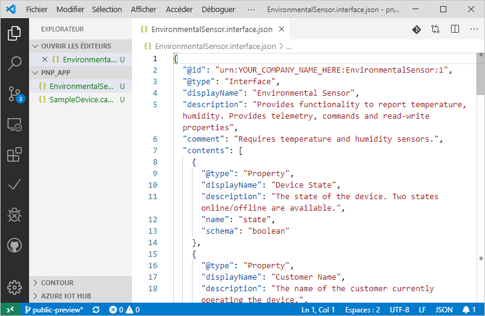
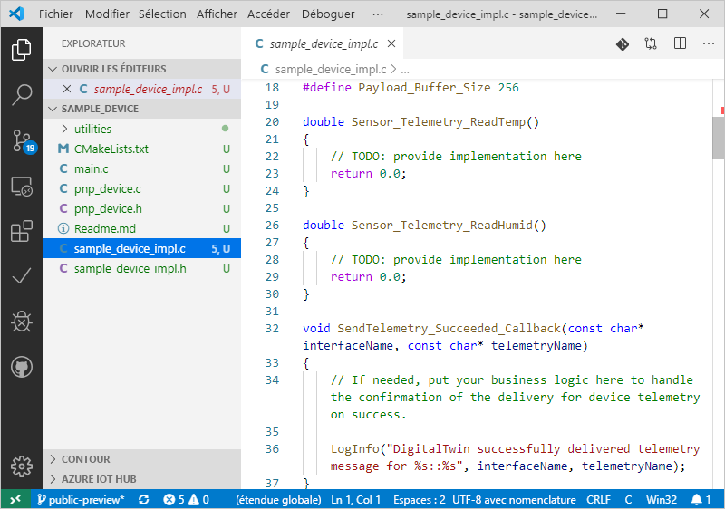

# <a name="quickstart-use-a-device-capability-model-to-create-an-iot-plug-and-play-preview-device-windows"></a>Démarrage rapide : Utiliser un modèle de fonctionnalité d’appareil pour créer un appareil IoT Plug-and-Play Preview (Windows)

Un _modèle de fonctionnalité d’appareil_ décrit les fonctionnalités d’un appareil IoT Plug-and-Play. Un modèle de fonctionnalité d’appareil est souvent associé à une référence SKU de produit. Les fonctionnalités définies dans le modèle de fonctionnalité d’appareil sont organisées en interfaces réutilisables. Vous pouvez générer le code d’appareil squelette à partir d’un modèle de fonctionnalité d’appareil. Ce démarrage rapide vous montre comment utiliser VS Code sous Windows pour créer un appareil IoT Plug-and-Play à l’aide d’un modèle de fonctionnalité d’appareil.

## <a name="prerequisites"></a>Prérequis

Pour suivre ce démarrage rapide, vous devez installer les logiciels suivants sur votre machine locale :

* [Build Tools pour Visual Studio](https://visualstudio.microsoft.com/thank-you-downloading-visual-studio/?sku=BuildTools&rel=16) avec les **outils de génération C++** et les charges de travail du **composant Gestionnaire de package NuGet**. Ou, si vous l’avez déjà, [Visual Studio (Community, Professional ou Enterprise)](https://visualstudio.microsoft.com/downloads/) 2019, 2017 ou 2015 avec les mêmes charges de travail.
* [Git](https://git-scm.com/download/).
* [CMake](https://cmake.org/download/).
* [Visual Studio Code](https://code.visualstudio.com/).

### <a name="install-azure-iot-tools"></a>Installer Azure IoT Tools

Pour installer le pack d’extension [Azure IoT Tools pour VS Code](https://marketplace.visualstudio.com/items?itemName=vsciot-vscode.azure-iot-tools), procédez comme suit :

1. Dans VS Code, sélectionnez l’onglet **Extensions**.
1. Recherchez **Azure IoT Tools**.
1. Sélectionnez **Installer**.

### <a name="install-the-azure-iot-explorer"></a>Installer l’explorateur Azure IoT

Téléchargez et installez la dernière version de l’**explorateur Azure IoT** à partir de la page [référentiel](https://github.com/Azure/azure-iot-explorer/releases) de l’outil, en sélectionnant le fichier . msi sous « Assets » pour obtenir la mise à jour la plus récente.

### <a name="get-the-connection-string-for-your-company-model-repository"></a>Obtenir la chaîne de connexion pour le référentiel de modèles de votre entreprise

Vous pouvez trouver la _chaîne de connexion du référentiel de modèles de l’entreprise_ dans le [portail Azure Certified pour IoT](https://preview.catalog.azureiotsolutions.com) quand vous vous connectez avec un compte professionnel ou scolaire Microsoft, ou votre ID de partenaire Microsoft si vous avez un. Une fois que vous êtes connecté, sélectionnez **Company repository (Référentiel d’entreprise)** , puis **Chaînes de connexion**.

[!INCLUDE [cloud-shell-try-it.md](../../includes/cloud-shell-try-it.md)]

[!INCLUDE [iot-pnp-prepare-iot-hub-windows.md](../../includes/iot-pnp-prepare-iot-hub-windows.md)]

## <a name="prepare-the-development-environment"></a>Préparer l’environnement de développement

Dans ce guide de démarrage rapide, vous utilisez le gestionnaire de bibliothèques [Vcpkg](https://github.com/microsoft/vcpkg) pour installer le kit Azure IoT C device SDK dans votre environnement de développement.

1. Ouvrez une invite de commandes. Exécutez la commande suivante pour installer Vcpkg :

    ```cmd
    git clone https://github.com/Microsoft/vcpkg.git
    cd vcpkg

    .\bootstrap-vcpkg.bat
    ```

    Ensuite, pour raccorder une [intégration](https://github.com/microsoft/vcpkg/blob/master/docs/users/integration.md) applicable à l’utilisateur, exécutez la commande suivante (remarque : requiert un administrateur lors de la première utilisation) :

    ```cmd
    .\vcpkg.exe integrate install
    ```

1. Installez le Vcpkg du kit de développement logiciel (SDK) C de l’appareil Azure IoT :

    ```cmd
    .\vcpkg.exe install azure-iot-sdk-c[public-preview,use_prov_client]
    ```

## <a name="author-your-model"></a>Créer votre modèle

Dans ce démarrage rapide, vous utilisez un exemple de modèle de fonctionnalité d’appareil existant et les interfaces associées.

1. Créez un répertoire `pnp_app` sur votre lecteur local. Vous utilisez ce dossier pour les fichiers de modèle d’appareil et le stub de code d’appareil.

1. Téléchargez le [modèle de fonctionnalité d’appareil et les exemples de fichiers de l’interface](https://github.com/Azure/IoTPlugandPlay/blob/master/samples/SampleDevice.capabilitymodel.json) ainsi que l’[exemple d’interface](https://github.com/Azure/IoTPlugandPlay/blob/master/samples/EnvironmentalSensor.interface.json), puis enregistrez les fichiers dans le dossier `pnp_app`.

    > [!TIP]
    > Pour télécharger un fichier à partir de GitHub, accédez au fichier, cliquez avec le bouton droit sur **Brut**, puis sélectionnez **Enregistrer le lien sous**.

1. Ouvrez le dossier `pnp_app` avec VS Code. Vous pouvez afficher les fichiers avec IntelliSense :

    

1. Dans les fichiers que vous avez téléchargés, remplacez `<YOUR_COMPANY_NAME_HERE>` dans les champs `@id` et `schema` par une valeur unique. Utilisez uniquement les caractères a-z, A-Z, 0-9 et le trait de soulignement. Pour plus d’informations, consultez la section [Digital Twin identifier format](https://github.com/Azure/IoTPlugandPlay/tree/master/DTDL#digital-twin-identifier-format) (Format d’identificateur pour les jumeaux numériques).

## <a name="generate-the-c-code-stub"></a>Générer le stub de code C

Maintenant que vous avez le modèle de fonctionnalité d’appareil et ses interfaces associées, vous pouvez générer le code de l’appareil qui implémente le modèle. Pour générer le stub de code C dans VS Code :

1. Une fois le dossier `pnp_app` ouvert dans VS Code, utilisez **Ctrl+Maj+P** pour ouvrir la palette de commandes, entrez **IoT Plug-and-Play** et sélectionnez **Générer le stub de code de l’appareil**.

    > [!NOTE]
    > La première fois que vous utilisez l’interface CLI CodeGen IoT Plug-and-Play, le téléchargement et l’installation prennent quelques secondes.

1. Choisissez le fichier **SampleDevice.capabilitymodel.json** à utiliser pour générer le stub de code de l’appareil.

1. Entrez le nom du projet **sample_device**. Il s’agit du nom de votre application d’appareil.

1. Choisissez **ANSI C** comme langage.

1. Choisissez le mode de connexion **Via IoT Hub device connection string (Avec une chaîne de connexion d’appareil IoT Hub)** .

1. Choisissez **Projet CMake sur Windows** en tant que modèle de projet.

1. Choisissez **Via Vcpkg** pour inclure le kit SDK pour appareils.

1. Créé au même emplacement que le fichier DCM, le dossier **sample_device** contient les fichiers stub d’appareil générés. VS Code ouvre une nouvelle fenêtre pour les afficher.
    

## <a name="build-and-run-the-code"></a>Générer et exécuter le code

Vous utilisez le code source du kit de développement logiciel (SDK) de l'appareil pour générer le stub de code d’appareil généré. L’application que vous créez simule un appareil qui se connecte à un hub IoT. L’application envoie les données de télémétrie et les propriétés et reçoit des commandes.

1. Créez un sous-répertoire `cmake` dans le dossier `sample_device`, puis accédez à ce dossier :

    ```cmd
    mkdir cmake
    cd cmake
    ```

1. Exécutez les commandes suivantes pour compiler le stub de code généré (en remplaçant l’espace réservé par le répertoire de votre référentiel Vcpkg) :

    ```cmd
    cmake .. -G "Visual Studio 16 2019" -A Win32 -Duse_prov_client=ON -Dhsm_type_symm_key:BOOL=ON -DCMAKE_TOOLCHAIN_FILE="<directory of your Vcpkg repo>\scripts\buildsystems\vcpkg.cmake"

    cmake --build .
    ```
    
    > [!NOTE]
    > Si vous utilisez Visual Studio 2017 ou 2015, vous devez spécifier le générateur CMake en fonction des outils de génération employés :
    >```cmd
    ># Either
    >cmake .. -G "Visual Studio 15 2017" -Duse_prov_client=ON -Dhsm_type_symm_key:BOOL=ON -DCMAKE_TOOLCHAIN_FILE="{directory of your Vcpkg repo}\scripts\buildsystems\vcpkg.cmake"
    ># or
    >cmake .. -G "Visual Studio 14 2015" -Duse_prov_client=ON -Dhsm_type_symm_key:BOOL=ON -DCMAKE_TOOLCHAIN_FILE="{directory of your Vcpkg repo}\scripts\buildsystems\vcpkg.cmake"
    >```

    > [!NOTE]
    > Si cmake ne parvient pas à trouver votre compilateur C++, vous obtenez des erreurs de build lorsque vous exécutez la commande précédente. Si cela se produit, essayez d’exécuter cette commande dans [l’invite de commandes Visual Studio](https://docs.microsoft.com/dotnet/framework/tools/developer-command-prompt-for-vs).

1. Une fois que la génération a été effectuée correctement, exécutez votre application en transmettant la chaîne de connexion de l’appareil IoT Hub en tant que paramètre.

    ```cmd
    .\Debug\sample_device.exe "<device connection string>"
    ```

1. L’application de l’appareil commence à envoyer des données à IoT Hub.

    

## <a name="validate-the-code"></a>Valider le code

### <a name="publish-device-model-files-to-model-repository"></a>Publier les fichiers de modèle d’appareil vers le référentiel de modèles

Pour valider le code de l’appareil avec **Azure IoT Explorer**, vous devez publier les fichiers dans le référentiel de modèles.

1. Une fois le dossier `pnp_app` ouvert dans VS Code, utilisez **Ctrl+Maj+P** pour ouvrir la palette de commandes, puis entrez et sélectionnez **IoT Plug-and-Play : Submit files to Model Repository (Envoyer les fichiers vers le référentiel de modèles)** .

1. Sélectionnez les fichiers `SampleDevice.capabilitymodel.json` et `EnvironmentalSensor.interface.json`.

1. Entrez la chaîne de connexion du référentiel de modèles d’entreprise.

    > [!NOTE]
    > La chaîne de connexion est requise uniquement la première fois que vous vous connectez au référentiel.

1. Dans la fenêtre de sortie et la notification VS Code, vous pouvez vérifier que les fichiers ont été correctement publiés.

    > [!NOTE]
    > Si vous recevez des erreurs lors de la publication des fichiers de modèle d’appareil, vous pouvez essayer d’utiliser la commande **IoT Plug-and-Play: Sign out Model Repository** pour vous déconnecter et suivre à nouveau les étapes.

### <a name="use-the-azure-iot-explorer-to-validate-the-code"></a>Utiliser l’Explorateur Azure IoT pour valider le code

1. Ouvrez l’explorateur Azure IoT. La page **Configurations de l’application** apparaît.

1. Entrez votre _chaîne de connexion IoT Hub_, puis sélectionnez **Se connecter**.

1. Une fois que vous êtes connecté, la page de vue d’ensemble **Appareils** s’affiche.

1. Pour ajouter le référentiel de votre entreprise, sélectionnez **Paramètres**, puis **+ Add module definition source** (Ajouter une source de définition de module), puis **Company repository (Référentiel de l’entreprise)** . Ajoutez la chaîne de connexion du référentiel de modèles d’entreprise et sélectionnez **Enregistrer et se connecter**.

1. Dans la page de vue d’ensemble **Appareils**, recherchez l’identité d’appareil que vous avez créée précédemment. L’application de l’appareil étant toujours en cours d’exécution à l’invite de commandes, vérifiez que l’**État de connexion** de l’appareil dans Azure IoT Explorer indique _Connecté_ (dans le cas contraire, appuyez sur **Actualiser** jusqu’à ce que cet état apparaisse). Sélectionnez l’appareil pour afficher plus de détails.

1. Développez l’interface avec l’ID **urn:<YOUR_INTERFACE_NAME>:EnvironmentalSensor:1** pour voir les primitives IoT Plug-and-Play (propriétés, commandes et télémétrie). Le nom de l’interface qui s’affiche est le nom que vous avez utilisé lors de la création de votre modèle.

1. Sélectionnez la page **Télémétrie** et appuyez sur _Démarrer_ pour afficher les données de télémétrie envoyées par l’appareil.

1. Sélectionnez la page **Properties(non-writable)** (Propriétés (non accessibles en écriture)) pour afficher les propriétés non accessibles en écriture signalées par l’appareil.

1. Sélectionnez la page **Properties(writable)** (Propriétés (accessibles en écriture)) pour afficher les propriétés accessibles en écriture que vous pouvez mettre à jour.

1. Développez le **nom** de la propriété, mettez-le à jour avec un nouveau nom et sélectionnez **Update writable property** (Mettre à jour la propriété accessible en écriture). 

1. Pour voir le nouveau nom s’afficher dans la colonne **Propriété rapportée**, cliquez sur le bouton **Actualiser** en haut de la page.

1. Sélectionnez la page **Commandes** pour afficher toutes les commandes prises en charge par l’appareil.

1. Développez la commande **blink** et définissez un nouvel intervalle de clignotement. Sélectionnez **Envoyer la commande** pour appeler la commande sur l’appareil.

1. Accédez à l’invite de commandes de l’appareil simulé et lisez les messages de confirmation imprimés pour vérifier que les commandes sont exécutées comme prévu.

[!INCLUDE [iot-pnp-clean-resources.md](../../includes/iot-pnp-clean-resources.md)]

## <a name="next-steps"></a>Étapes suivantes

Dans ce démarrage rapide, vous avez appris à créer un appareil IoT Plug-and-Play à l’aide d’un modèle de fonctionnalité d’appareil.

Pour en savoir plus sur les modèles de fonctionnalités d’appareils et la façon de créer vos propres modèles, poursuivez avec le tutoriel :

> [!div class="nextstepaction"]
> [Tutoriel : Créer et tester un modèle de fonctionnalité d’appareil avec Visual Studio Code](tutorial-pnp-visual-studio-code.md)
