# Intégrer Azure Key Vault à Azure Policy

[Azure Policy](../governance/policy/index.yml) est un outil de gouvernance qui permet aux utilisateurs d’auditer et de gérer leur environnement Azure à grande échelle. Azure Policy offre la possibilité de placer des barrières sur les ressources Azure afin de s’assurer que celles-ci sont conformes aux règles de stratégie affectées. Il permet aux utilisateurs d’effectuer des audits, l’application en temps réel et la correction de leur environnement Azure. Les résultats des audits réalisés par la stratégie sont mis à disposition des utilisateurs dans un tableau de bord de conformité qui présente une vue détaillée des ressources et composants conformes et non conformes.  Pour plus d’informations, reportez-vous à la rubrique [Présentation du service Azure Policy](../governance/policy/overview.md).

Exemples de scénarios d’utilisation :

- Vous souhaitez améliorer la position de sécurité de votre entreprise en implémentant des exigences en matière de taille de clé minimale et de durée de validité maximale des certificats présents dans les coffres de clés de votre entreprise, mais vous ne savez pas quelles équipes sont conformes et lesquelles ne le sont pas. 
- Vous ne disposez actuellement d’aucune solution pour effectuer un audit au sein de votre organisation ou vous effectuez des audits manuels de votre environnement en demandant à chaque équipe de votre organisation d’établir un état de leur conformité. Vous recherchez un moyen d’automatiser cette tâche, d’effectuer des audits en temps réel et de garantir l’exactitude de l’audit.
- Vous voulez appliquer les stratégies de sécurité de votre entreprise et empêcher la création de certificats auto-signés, mais vous ne disposez d’aucun moyen automatisé pour bloquer leur création. 
- Vous souhaitez assouplir certaines exigences pour vos équipes de test, tout en conservant des contrôles étroits sur votre environnement de production. Vous recherchez une méthode automatisée simple pour séparer l’application de vos ressources. 
- Vous voulez être sûr de pouvoir annuler l’application des nouvelles stratégies en cas de problème de site actif. Vous recherchez une solution en un clic pour désactiver l’application de la stratégie. 
- Vous faites appel à une solution tierce pour réaliser l’audit de votre environnement et vous souhaitez utiliser une offre Microsoft interne. 

## Types d’effets des stratégies et conseils

**Audit** : Lorsque l’effet d’une stratégie est défini sur audit, celle-ci n’entraînera aucun changement cassant sur votre environnement. Elle vous informera simplement du fait que des composants tels que des certificats ne sont pas conformes aux définitions de la stratégie au sein d’une étendue spécifiée, en les marquant comme non conformes dans le tableau de bord de conformité aux stratégies. L’audit est le paramètre par défaut si aucun effet de stratégie n’est sélectionné. 

**Refuser** : Lorsque l’effet d’une stratégie est défini sur refuser, celle-ci bloque la création de nouveaux composants tels que des certificats et bloque les nouvelles versions de composants existants qui ne sont pas conformes à la définition de stratégie. Les ressources non conformes existantes au sein d’un coffre de clés ne sont pas affectées. Les capacités « audit » continuent de fonctionner.

## Définitions de stratégie « prédéfinies » disponibles

Key Vault a créé un ensemble de stratégies que vous pouvez attribuer pour que des scénarios courants gèrent les certificats. Ces stratégies sont « prédéfinies », autrement dit elles peuvent être activées sans que vous n’ayez à écrire de code JSON personnalisé et elles sont prêtes à être attribuées dans le portail Azure. Vous pouvez cependant personnaliser certains paramètres pour répondre aux besoins de votre organisation. 

Les huit stratégies d’évaluation disponibles sont les suivantes.

### Gérer la durée de validité de certificat (préversion)

Cette stratégie vous permet de gérer la durée de validité maximale de vos certificats stockés dans le coffre de clés. La limitation de la durée de validité maximale de vos certificats est une pratique de sécurité recommandée. Si une clé privée de votre certificat devenait compromise sans que cela ne soit détecté, l’utilisation de certificats à durée de vie limitée réduit le délai d’exécution des dégâts en cours et également la valeur du certificat pour un attaquant. 

### Gérer les types de clés de certificat autorisés (préversion)
Cette stratégie vous permet de restreindre le type de certificats acceptés dans votre coffre de clés. Vous pouvez utiliser cette stratégie pour vous assurer que les clés privées de vos certificats sont RSA, ECC ou sauvegardées par HSM. Vous pouvez choisir les types de certificats autorisés dans la liste suivante.
- RSA
- RSA - HSM
- ECC 
- ECC - HSM 

### Gérer les déclencheurs d’action de durée de vie de certificat (préversion)

Cette stratégie vous permet de gérer l’action de durée de vie spécifiée pour les certificats qui expirent dans un certain nombre de jours ou qui ont atteint un certain pourcentage de durée de vie. 

### Gérer les certificat émis par une autorité de certification intégrée (préversion)

Si vous utilisez une autorité de certification intégrée Key Vault (Digicert ou GlobalSign) et que vous voulez que les utilisateurs fassent appel à l’un de ces deux fournisseurs, vous pouvez utiliser cette stratégie pour mener un audit ou appliquer votre sélection. Cette stratégie peut également être utilisée pour auditer ou refuser la création de certificats auto-signés dans le coffre de clés. 

### Gérer les certificat émis par une autorité de certification intégrée (préversion)

Si vous utilisez une autorité de certification interne ou non intégrée à Key Vault et que vous voulez que les utilisateurs fassent appel à une autorité de certification figurant dans une liste que vous fournissez, vous pouvez utiliser cette stratégie pour créer une liste autorisée d’autorités de certification par nom d’émetteur. Cette stratégie peut également être utilisée pour auditer ou refuser la création de certificats auto-signés dans le coffre de clés. 

### Gérer les noms de courbe autorisés pour les certificats de chiffrement à courbe elliptique (préversion)
Si vous utilisez des certificats à courbe elliptique ou ECC, vous pouvez personnaliser une liste autorisée de noms de courbe à partir de la liste ci-dessous. L’option par défaut autorise tous les noms de courbe suivants. 
- P-256
- P-256K
- P-384
- P-521

### Gérer la taille minimale de clé pour les certificats RSA (préversion)
Si vous utilisez des certificats RSA, vous pouvez choisir une taille de clé minimale requise pour vos certificats. Vous pouvez sélectionner une option dans la liste ci-dessous. 
- 2048 bits
- 3072 bits
- 4096 bits

### Gérer les certificats arrivés à un nombre de jours spécifié avant expiration (préversion)
Votre service peut subir une panne si un certificat qui n’est pas surveillé correctement n’est pas pivoté avant son expiration. Cette stratégie est critique pour vous assurer que vos certificats stockés dans un coffre de clés sont sous surveillance. Nous vous recommandons d’appliquer cette stratégie plusieurs fois avec différents seuils d’expiration, par exemple 180, 90, 60 et 30 jours. Cette stratégie peut être utilisée pour surveiller et trier l’expiration des certificats dans votre organisation. 

## Exemple de scénario

Vous gérez un coffre de clés utilisé par plusieurs équipes qui contient 100 certificats et vous voulez être sûr qu’aucun des certificats du coffre de clés n’est valide plus de 2 ans.

1. Vous attribuez la stratégie [Gérer la durée de validité des certificats](#manage-certificate-validity-period-preview), spécifiez que la durée de validité maximale d’un certificat est 24 mois, puis définissez l’effet de la stratégie sur « audit ». 
1. En consultant le [rapport de conformité sur le portail Azure](#view-compliance-results), vous constatez que 20 certificats sont non conformes et valides plus de 2 ans, et que les autres certificats sont conformes. 
1. Vous contactez les propriétaires de ces certificats et les informez de la nouvelle exigence de sécurité spécifiant que les certificats ne doivent pas être valides plus de 2 ans. Certaines équipes répondent et 15 des certificats sont renouvelés avec une durée de validité maximale de 2 ans ou moins. Les autres équipes ne répondent pas et il reste 5 certificats non conformes dans votre coffre de clés.
1. Vous remplacez l’effet de la stratégie attribuée par « refuser ». Les 5 certificats non conformes ne sont pas révoqués et continuent à fonctionner. Toutefois, ils ne peuvent pas être renouvelés avec une durée de validité supérieure à 2 ans. 

## Activer et gérer une stratégie Key Vault via le portail Azure

### Sélectionner une définition de stratégie

1. Connectez-vous au portail Azure. 
1. Recherchez « Stratégie » dans la barre de recherche et sélectionnez **Stratégie**.

    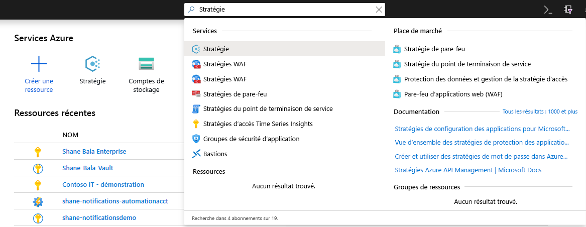

1. Dans la fenêtre Stratégie, sélectionnez **Définitions**.

    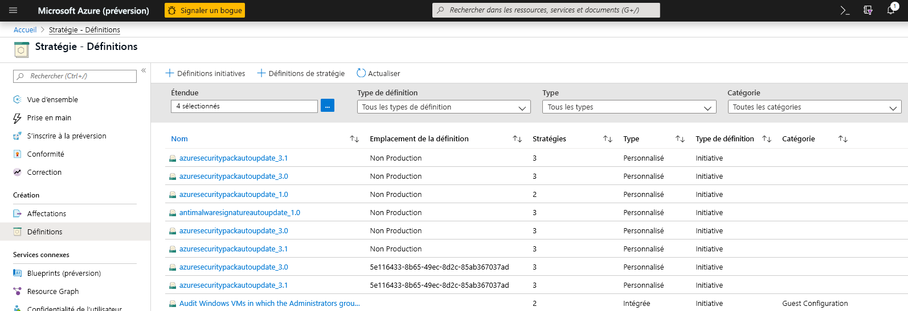

1. Dans le filtre Catégorie, désélectionnez **Sélectionner tout** et sélectionnez **Key Vault**. 

    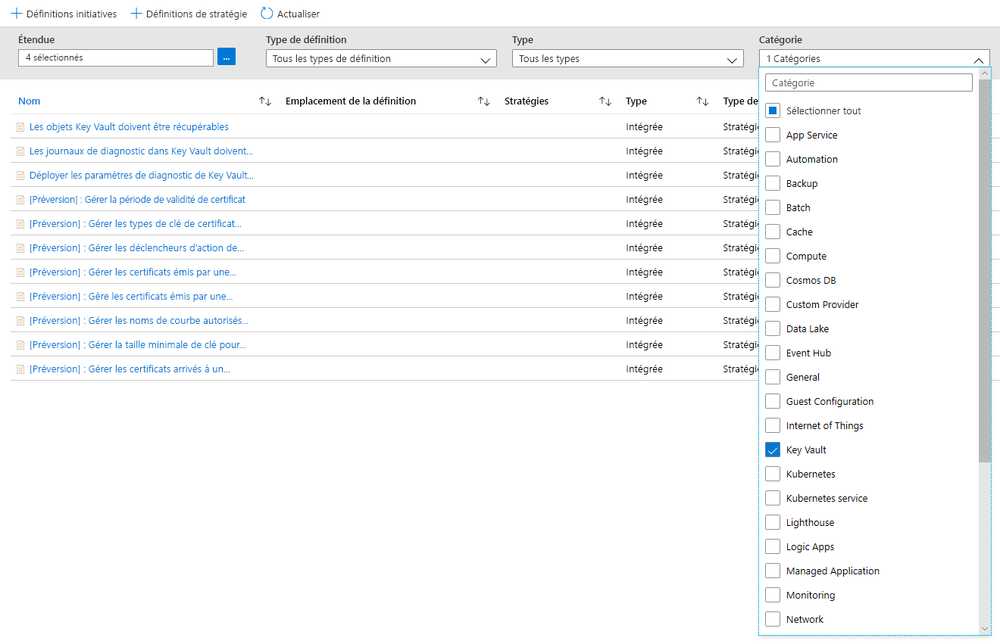

1. Vous devriez maintenant voir toutes les stratégies disponibles pour la préversion publique, pour Azure Key Vault. Veillez à lire et comprendre la section sur les conseils de stratégie ci-dessus et sélectionnez la stratégie que vous voulez attribuer à une étendue.  

    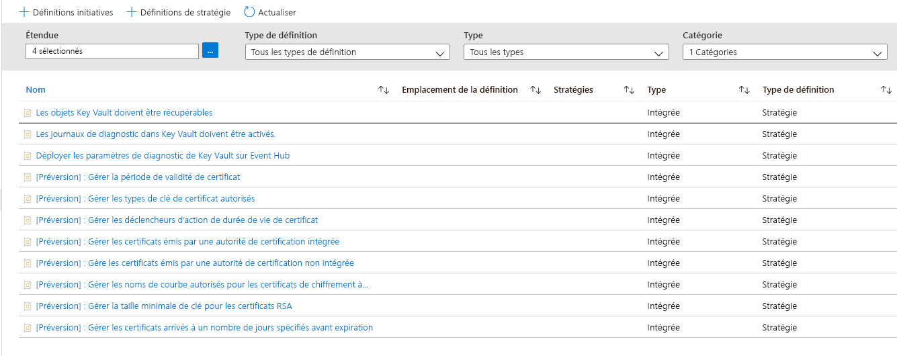

### Attribuer une stratégie à une étendue 

1. Sélectionnez une stratégie à appliquer. Dans cet exemple, il s’agit de la stratégie **Gérer la durée de validité des certificats**. Cliquez sur le bouton Attribuer dans le coin supérieur gauche.

    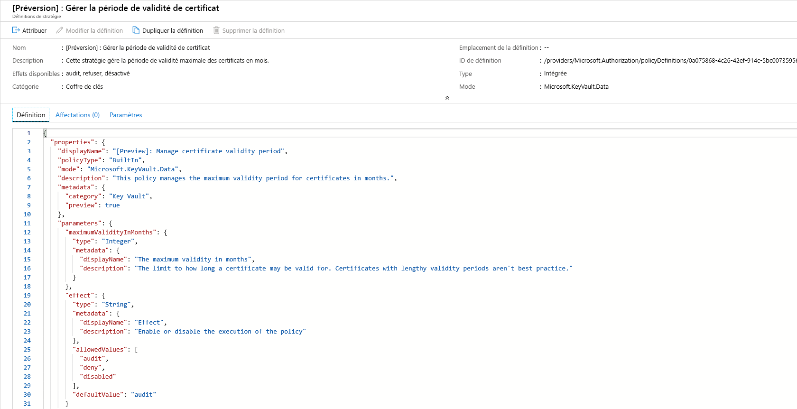
  
1. Sélectionnez l’abonnement dans lequel vous voulez appliquer la stratégie. Vous pouvez choisir de restreindre l’étendue à un seul groupe de ressources au sein d’un abonnement. Si vous souhaitez appliquer la stratégie à l’ensemble de l’abonnement et exclure certains groupes de ressources, vous pouvez également configurer une liste d’exclusions. Définissez le sélecteur d’application de stratégie sur **Activé** si vous voulez que l’effet de la stratégie (audit ou refuser) se produise ou sur **Désactivé** pour désactiver l’effet (audit ou refuser). 

    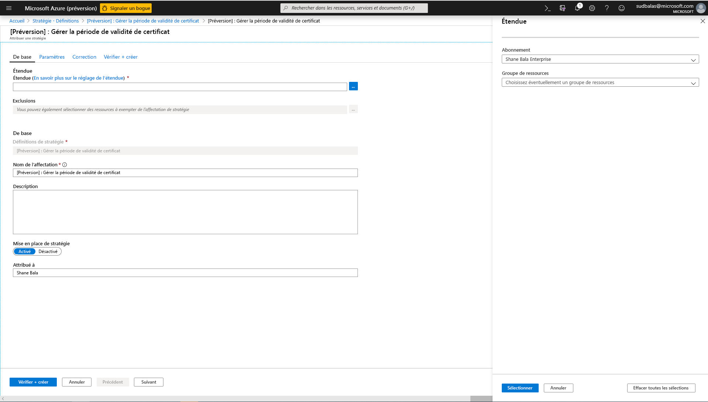

1. Cliquez sur l’onglet des paramètres en haut de l’écran pour indiquer la durée de validité maximale en mois souhaitée. Sélectionnez **audit** ou **refuser** pour l’effet de la stratégie selon les conseils fournis dans les sections précédentes. Sélectionnez ensuite le bouton Vérifier + Créer. 

    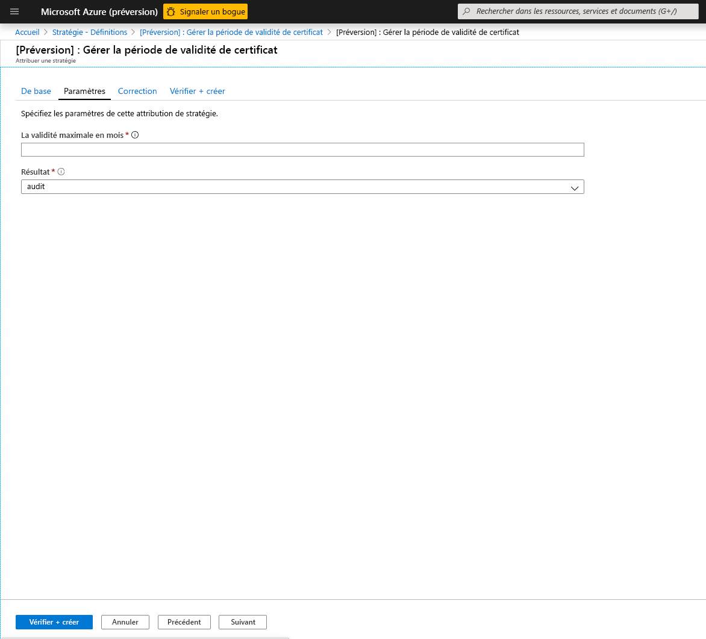

### Afficher les résultats de conformité

1. Revenez au panneau Stratégie et sélectionnez l’onglet Conformité. Cliquez sur l’attribution de stratégie dont vous voulez afficher les résultats de conformité.

    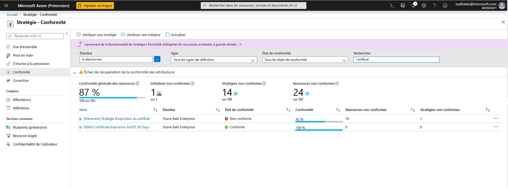

1. Sur cette page, vous pouvez filtrer les résultats par coffres conformes et non conformes. Vous pouvez consulter ici une liste des coffres de clés non conformes dans l’étendue de l’attribution de stratégie. Un coffre est jugé non conforme si un ou plusieurs de ses composants (certificats) sont non conformes. Vous pouvez sélectionner un coffre particulier pour afficher les composants (certificats) non conformes. 

    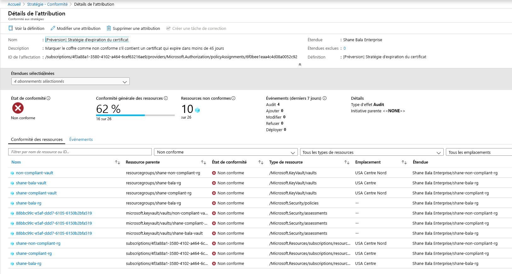

1. Afficher le nom des composants non conformes au sein d’un coffre

    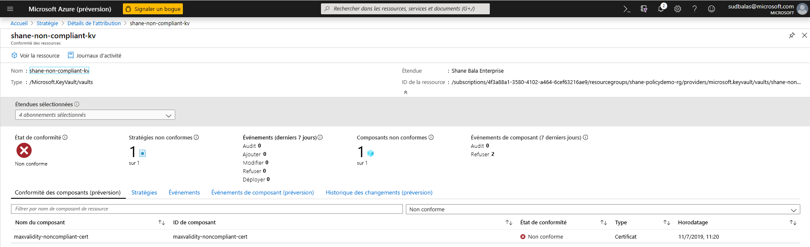

1. Si vous devez vérifier si les utilisateurs se voient refuser la possibilité de créer des ressources dans le coffre de clés, vous pouvez cliquer sur l’onglet **Événements des composants (préversion)** pour afficher une synthèse des opérations de refus de certificat indiquant le demandeur et le timestamp des requêtes. 

    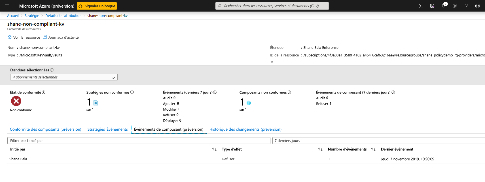

## Limitations des fonctionnalités

Après avoir attribué une stratégie avec un effet « refuser », la prise d’effet du refus de créer des ressources non conformes peut prendre entre 30 minutes (en moyenne) et 1 heure (pire des cas). Une fois l’évaluation de stratégie des composants existants d’un coffre effectuée, l’affichage des résultats de conformité dans l’interface utilisateur du portail peut prendre entre 1 heure (en moyenne) et 2 heures (pire des cas). Si les résultats de conformité présentent le statut « Non démarré », cela peut être dû aux raisons suivantes :
- L’évaluation des stratégies n’est pas encore terminée. La latence de l’évaluation initiale peut atteindre 2 heures dans le pire des cas. 
- Il n’y a pas de coffres de clés dans l’étendue de l’attribution de stratégie.
- Il n’y a pas de coffres de clés avec des certificats dans l’étendue de l’attribution de stratégie. 

## Étapes suivantes

- En savoir plus sur le [service Azure Policy](../governance/policy/overview.md)
- Consultez des exemples Key Vault : [Définitions de stratégies prédéfinies Key Vault](../governance/policy/samples/built-in-policies.md#key-vault)