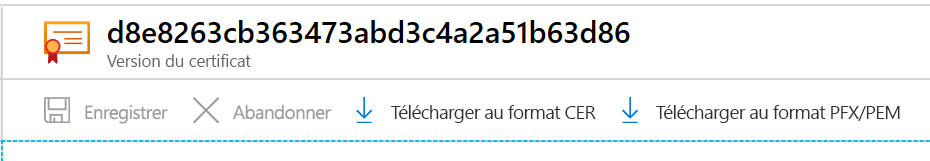

# <a name="export-certificates-from-azure-key-vault"></a>Exporter des certificats depuis Azure Key Vault

Découvrez comment exporter des certificats depuis Azure Key Vault. Vous pouvez exporter des certificats en utilisant Azure CLI, Azure PowerShell ou le portail Azure. Vous pouvez également utiliser le portail Azure pour exporter des certificats Azure App Service.

## <a name="about-azure-key-vault-certificates"></a>À propos des certificats Azure Key Vault

Azure Key Vault vous permet de provisionner, gérer et déployer facilement des certificats numériques pour votre réseau. Il permet également des communications sécurisées pour les applications. Pour plus d’informations, consultez [Certificats Azure Key Vault](./about-certificates.md).

### <a name="composition-of-a-certificate"></a>Composition d’un certificat

Quand un certificat Key Vault est créé, une *clé* et un *secret* adressables sont créés avec le même nom. La clé Key Vault permet les opérations sur les clés. Le secret Key Vault permet de récupérer la valeur du certificat en tant que secret. Un certificat Key Vault contient également des métadonnées de certificat x509 publiques. Pour plus d’informations, consultez [Composition d’un certificat](./about-certificates.md#composition-of-a-certificate).

### <a name="exportable-and-non-exportable-keys"></a>Clés exportables et non exportables

Une fois qu’un certificat Key Vault est créé, vous pouvez le récupérer auprès du secret adressable avec la clé privée. Récupérez le certificat au format PFX ou PEM.

- **Exportable** : La stratégie utilisée pour créer le certificat indique que la clé est exportable.
- **Non exportable** : La stratégie utilisée pour créer le certificat indique que la clé n’est pas exportable. Dans ce cas, la clé privée ne fait pas partie de la valeur quand elle est récupérée en tant que secret.

Types de clés pris en charge : RSA, RSA-HSM, EC, EC-HSM, oct (listés [ici](/rest/api/keyvault/createcertificate/createcertificate#jsonwebkeytype)) : « Exportable » est autorisé seulement avec RSA et EC. Les clés HSM sont non exportables.

Pour plus d’informations, consultez [À propos des certificats Azure Key Vault](./about-certificates.md#exportable-or-non-exportable-key).

## <a name="export-stored-certificates"></a>Exporter des certificats stockés

Vous pouvez exporter des certificats stockés dans Azure Key Vault en utilisant Azure CLI, Azure PowerShell ou le portail Azure.

> [!NOTE]
> Exigez un mot de passe de certificat seulement quand vous importez le certificat dans le coffre de clés. Key Vault n’enregistre pas le mot de passe associé. Quand vous exportez le certificat, le mot de passe est vide.

# <a name="azure-cli"></a>[Azure CLI](#tab/azure-cli)

Utilisez la commande suivante dans Azure CLI pour télécharger la **partie publique** d’un certificat Key Vault.

```azurecli
az keyvault certificate download --file
                                 [--encoding {DER, PEM}]
                                 [--id]
                                 [--name]
                                 [--subscription]
                                 [--vault-name]
                                 [--version]
```

Pour plus d’informations, consultez [Exemples et définitions de paramètres](/cli/azure/keyvault/certificate?view=azure-cli-latest#az-keyvault-certificate-download).

Le téléchargement sous forme de certificat suppose l’obtention de la partie publique. Si vous souhaitez disposer de la clé privée et des métadonnées publiques, procédez au téléchargement sous forme de secret.

```azurecli
az keyvault secret download -–file {nameofcert.pfx}
                            [--encoding {ascii, base64, hex, utf-16be, utf-16le, utf-8}]
                            [--id]
                            [--name]
                            [--subscription]
                            [--vault-name]
                            [--version]
```

Pour plus d’informations, consultez [Définitions de paramètres](/cli/azure/keyvault/secret?view=azure-cli-latest#az-keyvault-secret-download).

# <a name="powershell"></a>[PowerShell](#tab/azure-powershell)

Utilisez cette commande dans Azure PowerShell pour récupérer le certificat nommé **TestCert01** auprès du coffre de clés nommé **ContosoKV01**. Pour télécharger le certificat sous forme de fichier PFX, exécutez la commande suivante. Ces commandes accèdent à **SecretId**, puis enregistrent le contenu sous la forme d’un fichier PFX.

```azurepowershell
$cert = Get-AzKeyVaultCertificate -VaultName "ContosoKV01" -Name "TestCert01"
$secret = Get-AzKeyVaultSecret -VaultName "ContosoKV01" -Name $cert.Name
$secretValueText = '';
$ssPtr = [System.Runtime.InteropServices.Marshal]::SecureStringToBSTR($secret.SecretValue)
try {
    $secretValueText = [System.Runtime.InteropServices.Marshal]::PtrToStringBSTR($ssPtr)
} finally {
    [System.Runtime.InteropServices.Marshal]::ZeroFreeBSTR($ssPtr)
}
$secretByte = [Convert]::FromBase64String($secretValueText)
$x509Cert = new-object System.Security.Cryptography.X509Certificates.X509Certificate2
$x509Cert.Import($secretByte, "", "Exportable,PersistKeySet")
$type = [System.Security.Cryptography.X509Certificates.X509ContentType]::Pfx
$pfxFileByte = $x509Cert.Export($type, $password)

# Write to a file
[System.IO.File]::WriteAllBytes("KeyVault.pfx", $pfxFileByte)
```

Cette commande exporte la chaîne entière de certificats avec la clé privée. Le certificat est protégé par un mot de passe.
Pour plus d’informations sur la commande et les paramètres de **Get-AzKeyVaultCertificate**, consultez [Get-AzKeyVaultCertificate - Exemple 2](/powershell/module/az.keyvault/Get-AzKeyVaultCertificate?view=azps-4.4.0).

# <a name="portal"></a>[Portail](#tab/azure-portal)

Sur le portail Azure, après avoir créé/importé un certificat dans le panneau **Certificat**, vous recevez une notification indiquant que le certificat a été correctement créé. Sélectionnez le certificat et la version actuelle pour voir l’option de téléchargement.

Pour télécharger le certificat, sélectionnez **Télécharger au format CER** ou **Télécharger au format PFX/PEM**.



**Exporter des certificats Azure App Service**

Les certificats Azure App Service sont un moyen pratique d’acheter des certificats SSL. Vous pouvez les affecter à des applications Azure à partir du portail. Vous pouvez également exporter ces certificats à partir du portail en tant que fichiers PFX à utiliser ailleurs. Une fois importés, les certificats App Service se trouvent sous des **secrets**.

Pour plus d’informations, consultez les étapes pour [exporter des certificats Azure App Service](https://social.technet.microsoft.com/wiki/contents/articles/37431.exporting-azure-app-service-certificates.aspx).

---

## <a name="read-more"></a>En savoir plus
* [Différents types et définitions de fichiers de certificats](/archive/blogs/kaushal/various-ssltls-certificate-file-typesextensions)
