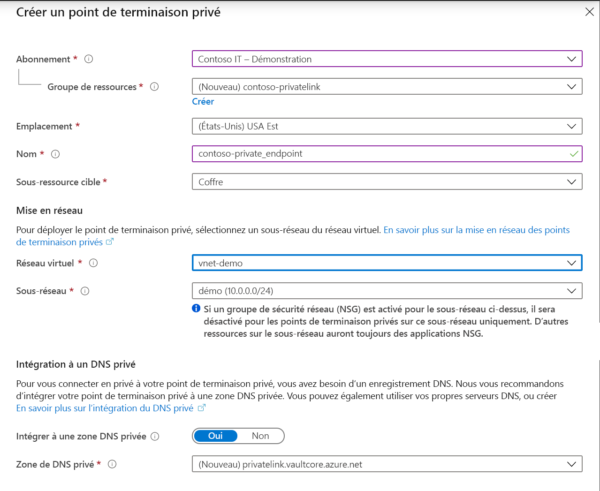

# <a name="integrate-key-vault-with-azure-private-link"></a>Intégrer Key Vault avec Azure Private Link

Le service Azure Private Link vous permet d’accéder aux services Azure (par exemple, Azure Key Vault, Stockage Azure et Azure Cosmos DB) ainsi qu’aux services de partenaires ou de clients hébergés par Azure via un point de terminaison privé de votre réseau virtuel.

Un point de terminaison privé Azure est une interface réseau qui vous connecte de façon privée et sécurisée à un service basé sur la technologie Azure Private Link. Le point de terminaison privé utilise une adresse IP privée de votre réseau virtuel, plaçant de fait le service dans votre réseau virtuel. Sachant que l’ensemble du trafic à destination du service peut être routé via le point de terminaison privé, il n’y a aucun besoin de passerelles, d’appareils NAT, de connexions ExpressRoute ou VPN ou d’adresses IP publiques. Le trafic entre votre réseau virtuel et le service transite par le réseau principal de Microsoft, éliminant ainsi toute exposition à l’Internet public. Vous pouvez vous connecter à une instance d’une ressource Azure, ce qui vous donne le plus haut niveau de granularité en matière de contrôle d’accès.

Pour plus d’informations, consultez [Qu’est-ce qu’Azure Private Link ?](../../private-link/private-link-overview.md)

## <a name="prerequisites"></a>Prérequis

Pour intégrer un coffre de clés avec Azure Private Link, vous avez besoin des éléments suivants :

- Un coffre de clés.
- Un réseau virtuel Azure.
- Un sous-réseau dans le réseau virtuel.
- Des autorisations de propriétaire ou de contributeur à la fois pour le coffre de clés et le réseau virtuel.

Votre point de terminaison privé et votre réseau virtuel doivent se trouver dans la même région. Au moment de sélectionner la région du point de terminaison privé sur le portail, les réseaux virtuels qui se trouvent dans cette région sont filtrés automatiquement. Votre coffre de clés peut se trouver dans une autre région.

Votre point de terminaison privé utilise une adresse IP privée de votre réseau virtuel.

# <a name="azure-portal"></a>[Azure portal](#tab/portal)

## <a name="establish-a-private-link-connection-to-key-vault-using-the-azure-portal"></a>Établir une connexion de liaison privée avec le coffre de clés à l’aide du portail Azure 

Tout d’abord, créez un réseau virtuel en suivant les étapes décrites dans [Créer un réseau virtuel à partir du portail Azure](../../virtual-network/quick-create-portal.md).

Vous pouvez ensuite soit créer un coffre de clés, soit établir une connexion de liaison privée avec un coffre de clés existant.

### <a name="create-a-new-key-vault-and-establish-a-private-link-connection"></a>Créer un coffre de clés et établir une connexion de liaison privée

Vous pouvez créer un coffre de clés avec le [portail Azure](../general/quick-create-portal.md), l’interface [Azure CLI](../general/quick-create-cli.md) ou [Azure PowerShell](../general/quick-create-powershell.md).

Après avoir configuré les éléments de base du coffre de clés, sélectionnez l’onglet Mise en réseau et suivez ces étapes :

1. Sélectionnez la case d’option Point de terminaison privé sous l’onglet Réseau.
1. Cliquer sur le bouton « + Ajouter » pour ajouter un point de terminaison privé.

    
 
1. Dans le champ « Région » du panneau Créer un point de terminaison privé, sélectionnez la région dans laquelle se trouve votre réseau virtuel. 
1. Dans le champ « Nom », créez un nom descriptif qui vous permettra d’identifier ce point de terminaison privé. 
1. Dans le menu déroulant, sélectionnez le réseau virtuel et le sous-réseau dans lesquels vous souhaitez que ce point de terminaison privé soit créé. 
1. Laissez l’option « intégrer à la zone DNS privée » inchangée.  
1. Sélectionnez « OK ».

    
 
Le point de terminaison privé configuré est maintenant visible. Vous avez maintenant la possibilité de supprimer et de modifier ce point de terminaison privé. Sélectionnez le bouton « Vérifier + créer » et créez le coffre de clés. Le déploiement prend entre 5 et 10 minutes. 

### <a name="establish-a-private-link-connection-to-an-existing-key-vault"></a>Établir une connexion de liaison privée avec un coffre de clés existant

Si vous disposez déjà d’un coffre de clés, vous pouvez créer une connexion de liaison privée en suivant ces étapes :

1. Connectez-vous au portail Azure. 
1. Dans la barre de recherche, tapez « coffres de clés ».
1. Dans la liste, sélectionnez le coffre de clés auquel vous voulez ajouter un point de terminaison privé.
1. Sélectionnez l’onglet « Mise en réseau » en dessous de Paramètres.
1. Sélectionnez l’onglet Connexions des points de terminaison privés en haut de la page
1. Sélectionnez le bouton « + Point de terminaison privé » en haut de la page.

     

Vous pouvez choisir de créer un point de terminaison privé pour n’importe quelle ressource Azure à l’aide de ce panneau. Vous pouvez soit utiliser les menus déroulants pour sélectionner un type de ressource et sélectionner une ressource dans votre annuaire, soit vous connecter à une ressource Azure en utilisant un ID de ressource. Laissez l’option « intégrer à la zone DNS privée » inchangée.  


Quand vous créez un point de terminaison privé, la connexion doit être approuvée. Si la ressource pour laquelle vous créez un point de terminaison privé se trouve dans votre annuaire, vous pouvez approuver la demande de connexion à condition de bénéficier d’autorisations suffisantes. Si vous vous connectez à une ressource Azure située dans un autre annuaire, vous devez attendre que le propriétaire de cette ressource approuve votre demande de connexion.

Il existe quatre états de provisionnement :

| Action du fournisseur de service | État du point de terminaison privé de l’utilisateur du service | Description |
|--|--|--|
| None | Pending | La connexion est créée manuellement et est en attente d’approbation du propriétaire de la ressource Private Link. |
| Approbation | Approved | La connexion a été approuvée automatiquement ou manuellement et est prête à être utilisée. |
| Rejeter | Rejeté | La connexion a été rejetée par le propriétaire de la ressource Private Link. |
| Supprimer | Déconnecté | La connexion a été supprimée par le propriétaire de la ressource Private Link, le point de terminaison privé devient donc informatif et doit être supprimé dans le cadre d’un nettoyage. |

### <a name="how-to-manage-a-private-endpoint-connection-to-key-vault-using-the-azure-portal"></a>Comment gérer une connexion de point de terminaison privé à un coffre de clés à l’aide du portail Azure 

1. Connectez-vous au portail Azure.
1. Dans la barre de recherche, tapez « coffres de clés ».
1. Sélectionnez le coffre de clés que vous voulez gérer.
1. Sélectionnez l’onglet « Mise en réseau ».
1. Si une connexion est en attente, celle-ci présente l’état de provisionnement « En attente ». 
1. Sélectionnez le point de terminaison privé que vous souhaitez approuver.
1. Sélectionnez le bouton Approuver.
1. Si vous voulez rejeter une connexion de point de terminaison privé, qu’il s’agisse d’une demande en attente ou d’une connexion existante, sélectionnez cette connexion et cliquez sur le bouton « Rejeter ».

    

# <a name="azure-cli"></a>[Azure CLI](#tab/cli)

## <a name="establish-a-private-link-connection-to-key-vault-using-cli-initial-setup"></a>Établir une connexion de liaison privée avec le coffre de clés à l’aide de l’interface CLI (installation initiale)

```console
az login                                                         # Login to Azure CLI
az account set --subscription {SUBSCRIPTION ID}                  # Select your Azure Subscription
az group create -n {RESOURCE GROUP} -l {REGION}                  # Create a new Resource Group
az provider register -n Microsoft.KeyVault                       # Register KeyVault as a provider
az keyvault create -n {VAULT NAME} -g {RG} -l {REGION}           # Create a Key Vault
az keyvault update -n {VAULT NAME} -g {RG} --default-action deny # Turn on Key Vault Firewall
az network vnet create -g {RG} -n {vNet NAME} -location {REGION} # Create a Virtual Network

    # Create a Subnet
az network vnet subnet create -g {RG} --vnet-name {vNet NAME} --name {subnet NAME} --address-prefixes {addressPrefix}

    # Disable Virtual Network Policies
az network vnet subnet update --name {subnet NAME} --resource-group {RG} --vnet-name {vNet NAME} --disable-private-endpoint-network-policies true

    # Create a Private DNS Zone
az network private-dns zone create --resource-group {RG} --name privatelink.vaultcore.azure.net

    # Link the Private DNS Zone to the Virtual Network
az network private-dns link vnet create --resource-group {RG} --virtual-network {vNet NAME} --zone-name privatelink.vaultcore.azure.net --name {dnsZoneLinkName} --registration-enabled true

```

### <a name="add-private-dns-records"></a>Ajouter des enregistrements DNS privés
```console
# https://docs.microsoft.com/en-us/azure/dns/private-dns-getstarted-cli#create-an-additional-dns-record
az network private-dns zone list -g $rg_name
az network private-dns record-set a add-record -g $rg_name -z "privatelink.vaultcore.azure.net" -n $vault_name -a $kv_network_interface_private_ip
az network private-dns record-set list -g $rg_name -z "privatelink.vaultcore.azure.net"

# From home/public network, you wil get a public IP. If inside a vnet with private zone, nslookup will resolve to the private ip.
nslookup $vault_name.vault.azure.net
nslookup $vault_name.privatelink.vaultcore.azure.net
```

### <a name="create-a-private-endpoint-automatically-approve"></a>Créer un point de terminaison privé (approuver automatiquement) 
```console
az network private-endpoint create --resource-group {RG} --vnet-name {vNet NAME} --subnet {subnet NAME} --name {Private Endpoint Name}  --private-connection-resource-id "/subscriptions/{AZURE SUBSCRIPTION ID}/resourceGroups/{RG}/providers/Microsoft.KeyVault/vaults/ {KEY VAULT NAME}" --group-ids vault --connection-name {Private Link Connection Name} --location {AZURE REGION}
```

### <a name="create-a-private-endpoint-manually-request-approval"></a>Créer un point de terminaison privé (demander manuellement une approbation) 
```console
az network private-endpoint create --resource-group {RG} --vnet-name {vNet NAME} --subnet {subnet NAME} --name {Private Endpoint Name}  --private-connection-resource-id "/subscriptions/{AZURE SUBSCRIPTION ID}/resourceGroups/{RG}/providers/Microsoft.KeyVault/vaults/ {KEY VAULT NAME}" --group-ids vault --connection-name {Private Link Connection Name} --location {AZURE REGION} --manual-request
```

### <a name="manage-private-link-connections"></a>Gérer des connexions à liaison privée

```console
# Show Connection Status
az network private-endpoint show --resource-group {RG} --name {Private Endpoint Name}

# Approve a Private Link Connection Request
az keyvault private-endpoint-connection approve --approval-description {"OPTIONAL DESCRIPTION"} --resource-group {RG} --vault-name {KEY VAULT NAME} –name {PRIVATE LINK CONNECTION NAME}

# Deny a Private Link Connection Request
az keyvault private-endpoint-connection reject --rejection-description {"OPTIONAL DESCRIPTION"} --resource-group {RG} --vault-name {KEY VAULT NAME} –name {PRIVATE LINK CONNECTION NAME}

# Delete a Private Link Connection Request
az keyvault private-endpoint-connection delete --resource-group {RG} --vault-name {KEY VAULT NAME} --name {PRIVATE LINK CONNECTION NAME}
```

---

## <a name="validate-that-the-private-link-connection-works"></a>Vérifier le fonctionnement de la connexion à liaison privée

Vous devez vérifier que les ressources contenues dans le sous-réseau de la ressource de point de terminaison privé se connectent à votre coffre de clés via une adresse IP privée, et qu’elles sont intégrées à la zone DNS privée appropriée.

Commencez par créer une machine virtuelle en suivant les étapes décrites dans [Créer une machine virtuelle Windows sur le portail Azure](../../virtual-machines/windows/quick-create-portal.md).

Sous l’onglet « Mise en réseau » :

1. Spécifiez un réseau virtuel et un sous-réseau. Vous pouvez créer un nouveau réseau virtuel ou en utiliser un existant. Si vous en sélectionnez un existant, veillez à ce que la région corresponde.
1. Spécifiez une ressource IP publique.
1. Dans « Groupe de sécurité réseau de la carte réseau », sélectionnez « Aucun ».
1. Dans « Équilibrage de charge », sélectionnez « Non ».

Ouvrez la ligne de commande et exécutez la commande suivante :

```console
nslookup <your-key-vault-name>.vault.azure.net
```

Si vous exécutez la commande ns lookup pour résoudre l’adresse IP d’un coffre de clés via un point de terminaison public, vous obtenez un résultat semblable à ceci :

```console
c:\ >nslookup <your-key-vault-name>.vault.azure.net

Non-authoritative answer:
Name:    
Address:  (public IP address)
Aliases:  <your-key-vault-name>.vault.azure.net
```

Si vous exécutez la commande ns lookup pour résoudre l’adresse IP d’un coffre de clés via un point de terminaison privé, vous obtenez un résultat semblable à ceci :

```console
c:\ >nslookup your_vault_name.vault.azure.net

Non-authoritative answer:
Name:    
Address:  10.1.0.5 (private IP address)
Aliases:  <your-key-vault-name>.vault.azure.net
          <your-key-vault-name>.privatelink.vaultcore.azure.net
```

## <a name="troubleshooting-guide"></a>Guide de résolution des problèmes

* Vérifiez que le point de terminaison privé est dans l’état Approuvé. 
    1. Vous pouvez vérifier et corriger cela dans le portail Azure. Ouvrez la ressource Key Vault, puis cliquez sur l’option Réseau. 
    2. Sélectionnez ensuite l’onglet Connexions de point de terminaison privé. 
    3. Vérifiez que l’état de la connexion est Approuvé et que l’état de provisionnement est Réussite. 
    4. Vous pouvez également accéder à la ressource de point de terminaison privé et y examiner les mêmes propriétés, et vérifier que le réseau virtuel correspond à celui que vous utilisez.

* Vérifiez que vous disposez d’une ressource de zone DNS privée. 
    1. Vous devez avoir d’une ressource de zone DNS privée avec ce nom exact : privatelink.vaultcore.azure.net. 
    2. Pour savoir comment configurer cela, consultez le lien suivant. [Zones DNS privées](https://docs.microsoft.com/azure/dns/private-dns-privatednszone)
    
* Vérifiez que la zone DNS privée n’est pas liée au réseau virtuel. Ceci peut être le problème si vous continuez de recevoir l’adresse IP publique en retour. 
    1. Si la zone DNS privée n’est pas liée au réseau virtuel, la requête DNS provenant du réseau virtuel va retourner l’adresse IP publique du coffre de clés. 
    2. Accédez à la ressource de zone DNS privée dans le portail Azure et cliquez sur l’option des liens du réseau virtuel. 
    4. Le réseau virtuel qui va effectuer les appels au coffre de clés doit être listé. 
    5. Si ce n’est pas le cas, ajoutez-le. 
    6. Pour obtenir des étapes détaillées, consultez le document suivant : [Lier un réseau virtuel à une zone DNS privée](https://docs.microsoft.com/azure/dns/private-dns-getstarted-portal#link-the-virtual-network)

* Vérifiez que la zone DNS privée contient bien un enregistrement A pour le coffre de clés. 
    1. Accédez à la page Zone DNS privée. 
    2. Cliquez sur Vue d’ensemble et vérifiez qu’il existe un enregistrement A avec le nom simple de votre coffre de clés (par exemple fabrikam). Ne spécifiez aucun suffixe.
    3. Vérifiez bien l’orthographe, puis créez ou corrigez l’enregistrement A. Vous pouvez utiliser une durée de vie de 3600 (1 heure). 
    4. Veillez à spécifier l’adresse IP privée correcte. 
    
* Vérifiez que l’enregistrement a l’adresse IP correcte. 
    1. Vous pouvez confirmer l’adresse IP en ouvrant la ressource de point de terminaison privé dans le portail Azure.
    2. Accédez à la ressource Microsoft.Network/privateEndpoints dans le portail Azure (et non pas à la ressource Key Vault).
    3. Dans la page Vue d’ensemble, recherchez interface réseau, puis cliquez sur ce lien. 
    4. Le lien montre la vue d’ensemble de la ressource de carte réseau, qui contient la propriété Adresse IP privée. 
    5. Vérifiez qu’il s’agit de l’adresse IP correcte spécifiée dans l’enregistrement A.

## <a name="limitations-and-design-considerations"></a>Limitations et remarques sur la conception

> [!NOTE]
> Le nombre de coffres de clés avec des points de terminaison privés activés par abonnement est une limite modifiable. La limite indiquée ci-dessous est la limite par défaut. Si vous souhaitez demander une augmentation de la limite pour votre service, veuillez envoyer un e-mail à akv-privatelink@microsoft.com. Nous approuverons ces demandes au cas par cas.

**Prix** : Pour plus d’informations sur les prix, consultez [Prix d’Azure Private Link](https://azure.microsoft.com/pricing/details/private-link/).

**Limitations** :  Le point de terminaison privé pour Azure Key Vault est disponible uniquement dans les régions publiques Azure.

**Nombre maximal de points de terminaison privés par coffre de clés** : 64.

**Nombre par défaut de coffres de clés avec points de terminaison privés par abonnement** : 400.

Pour plus d’informations, consultez [Service Azure Private Link : Limitations](../../private-link/private-link-service-overview.md#limitations)

## <a name="next-steps"></a>Étapes suivantes

- En savoir plus sur [Azure Private Link](../../private-link/private-link-service-overview.md)
- En savoir plus sur [Azure Key Vault](overview.md)
