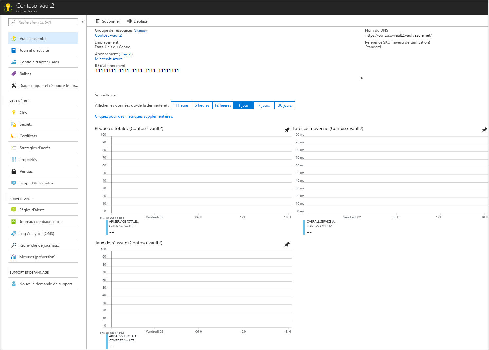

# Démarrage rapide : Créer un coffre de clés avec le portail Azure

Azure Key Vault est un service cloud qui fonctionne comme un magasin sécurisé contenant des [clés](../keys/index.yml), des [secrets](../secrets/index.yml), et des [certificats](../certificates/index.yml). Pour plus d’informations sur Key Vault, consultez [À propos d’Azure Key Vault](overview.md) ; pour plus d’informations sur ce qui peut être stocké dans un coffre de clés, consultez [À propos des clés, des secrets et des certificats](about-keys-secrets-certificates.md).

Si vous n’avez pas d’abonnement Azure, créez un [compte gratuit](https://azure.microsoft.com/free/?WT.mc_id=A261C142F) avant de commencer.

[!INCLUDE [cloud-shell-try-it.md](../../../includes/cloud-shell-try-it.md)]

Dans ce guide de démarrage rapide, vous créez un coffre de clés avec le [portail Azure](https://portal.azure.com). 

## Connexion à Azure

Connectez-vous au portail Azure sur https://portal.azure.com.

## Création d'un coffre

1. Dans le menu du Portail Azure ou dans la page **Accueil**, sélectionnez **Créer une ressource**.
2. Dans la zone de recherche, entrez **Key Vault**.
3. Dans la liste des résultats, choisissez **Key Vault**.
4. Dans la section Key Vault, choisissez **Créer**.
5. Dans la section **Créer un coffre de clés**, renseignez les informations suivantes :
    - **Name** : un nom unique est obligatoire. Pour ce démarrage rapide, nous utilisons **Contoso-vault2**. 
    - **Abonnement**: Choisissez un abonnement.
    - Sous **Groupe de ressources**, choisissez **Créer** et entrez le nom du groupe de ressources.
    - Dans le menu déroulant **Emplacement**, choisissez un emplacement.
    - Conservez les valeurs par défaut des autres options.
6. Après avoir renseigné les informations ci-dessus, sélectionnez **Créer**.

Notez les deux propriétés ci-dessous :

* **Nom du coffre** : dans l’exemple, il s’agit de **Contoso-Vault2**. Vous allez utiliser ce nom pour les autres étapes.
* **URI du coffre** : dans l’exemple, il s’agit de https://contoso-vault2.vault.azure.net/. Les applications qui utilisent votre coffre via son API REST doivent utiliser cet URI.

À ce stade, votre compte Azure est le seul autorisé à effectuer des opérations sur ce nouveau coffre.

## Nettoyer les ressources

D’autres démarrages rapides et didacticiels sur les coffres de clés reposent sur ce démarrage rapide. Si vous prévoyez d’utiliser d’autres démarrages rapides et didacticiels, il peut être utile de conserver ces ressources.
Si vous n’en avez plus besoin, supprimez le groupe de ressources. Ce faisant, vous supprimez le coffre de clés et les ressources associées. Pour supprimer le groupe de ressources à l’aide du portail :

1. Entrez le nom de votre groupe de ressources dans la zone Recherche en haut du portail. Lorsque vous voyez le groupe de ressources utilisé dans ce démarrage rapide dans les résultats de recherche, sélectionnez-le.
2. Sélectionnez **Supprimer le groupe de ressources**.
3. Dans le champ **TYPE THE RESOURCE GROUP NAME: (TAPER LE NOM DU GROUPE DE RESSOURCES :)** , tapez le nom du groupe de ressources et sélectionnez **Supprimer**.

## Étapes suivantes

Dans ce guide de démarrage rapide, vous avez créé un coffre de clés et vous y avez stocké un secret. Pour en savoir plus sur Key Vault et sur la manière de l’intégrer à vos applications, consultez les articles ci-dessous.

- Lire la [vue d’ensemble Azure Key Vault](overview.md)
- Consulter le [Guide du développeur Azure Key Vault](developers-guide.md)
- Passer en revue les [bonnes pratiques relatives à Azure Key Vault](best-practices.md)
