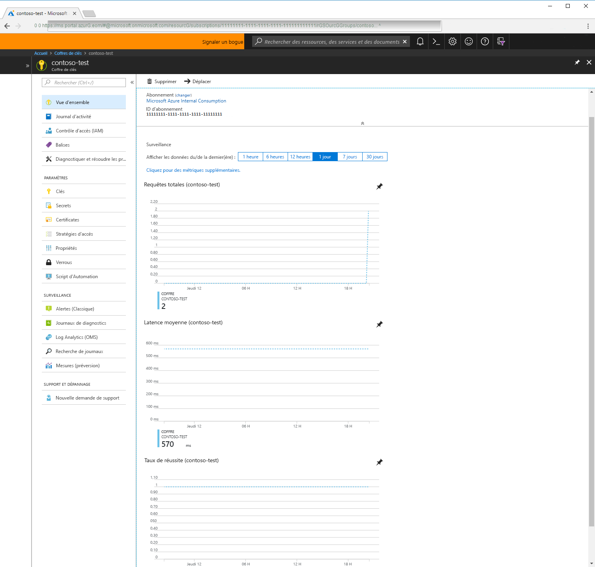

# Qu’est-ce qu’Azure Key Vault ?

Azure Key Vault est un service cloud qui fonctionne comme un magasin des secrets sécurisé.

Vous disposez de mots de passe, de chaînes de connexion et d’autres informations qui sont nécessaires pour garantir le fonctionnement continu de vos applications. Vous souhaitez vous assurer que ces informations soient disponibles, mais également sécurisées. Azure Key Vault vous aide à atteindre cet objectif en vous permettant de stocker et gérer vos secrets d’application en toute sécurité.

Key Vault vous offre la possibilité de créer plusieurs conteneurs sécurisés, désignés sous le terme de coffres. Ces coffres sont secondés par des modules de sécurité matériels (HSM). Les coffres contribuent à réduire les risques de perte accidentelle des informations de sécurité en centralisant le stockage des secrets d’application. En outre, les coffres de clés contrôlent et journalisent l’accès à l’ensemble de leur contenu. Azure Key Vault peut traiter les requêtes et le renouvellement de certificats TLS et vous offre ainsi les fonctionnalités requises pour l’obtention d’une solution robuste en matière de gestion du cycle de vie des certificats.

 La solution Azure Key Vault a été conçue pour prendre en charge les clés et les secrets d’application. Elle n’est pas destinée à faire office de magasin des mots de passe utilisateur.

## Pourquoi utiliser Azure Key Vault ?

### Centraliser les secrets d’application

La centralisation du stockage des secrets d’application dans Azure Key Vault vous permet de contrôler la distribution de ces secrets. Cette fonctionnalité réduit considérablement les risques de fuite accidentelle des secrets. Grâce à Key Vault, les développeurs d’applications n’ont plus besoin de stocker les informations de sécurité dans leur application. Ceci vous épargne l’obligation d’intégrer ces informations dans le code. Considérons l’exemple d’une application ayant besoin de se connecter à une base de données. Dans ce cas, plutôt que d’inclure la chaîne de connexion dans les codes de l’application, stockez-la simplement en toute sécurité dans Key Vault.

Vos applications peuvent accéder de façon sécurisée aux informations qui leur sont nécessaires en utilisant des URI qui leur permettent de récupérer des versions spécifiques d’un secret après le stockage de la clé ou du secret des applications dans Azure Key Vault. Cette opération s’effectue sans nécessiter l’écriture de code personnalisé pour protéger les informations secrètes.

### Stocker les secrets en toute sécurité

Les clés sont protégées par Azure à l’aide d’algorithmes standard, de longueurs de clé et de modules de sécurité matériels (HSM). Les HSM utilisés sont garantis conformes aux normes FIPS (Federal Information Processing Standard) 140-2 de niveau 2.

L’accès à un coffre de clés par un appelant (utilisateur ou application) requiert une authentification et une autorisation adéquates. L’authentification établit l’identité de l’appelant, tandis que l’autorisation détermine les opérations que ce dernier est autorisé à effectuer.

L’authentification s’effectue par le biais d’Azure Active Directory. L’autorisation peut être assurée par l’intermédiaire du mécanisme de contrôle d’accès en fonction du rôle (RBQC) ou d’une stratégie d’accès à Key Vault. RBAC est utilisé dans le cadre de la gestion des coffres, et la stratégie d’accès au coffre de clés est appliquée lors d’une tentative d’accès aux données stockées dans un coffre.

Azure Key Vault peut être protégé par un logiciel ou par un HSM matériel. Dans les situations qui nécessitent un surcroît de vigilance, vous pouvez importer ou générer des clés dans des HSM dont les clés ne franchissent jamais les limites. Microsoft utilise les HSM Thales. Pour déplacer une clé de votre HSM vers Azure Key Vault, vous pouvez utiliser les outils Thales.

Enfin, Key Vault a été conçu de façon que Microsoft ne puisse pas visualiser ni extraire vos clés.

### Surveiller les accès et l’utilisation

Après avoir créé plusieurs coffres de clés, vous voudrez surveiller le mode et le moment des accès à vos clés et secrets. Vous pouvez accomplir cette tâche en activant la journalisation pour Key Vault. La solution Azure Key Vault est configurable pour l’exécution des opérations suivantes :

- archivage dans un compte de stockage ;
- diffusion sur un Event Hub ;
- envoi des journaux à Log Analytics.

Vous pouvez contrôler vos journaux et les sécuriser en limitant l’accès, ainsi que supprimer les journaux dont vous n’avez plus besoin.

### Administration simplifiée des secrets d’application

Lorsque vous stockez vos données les plus précieuses, vous devez prendre différentes mesures. Les informations de sécurité doivent être sécurisées, suivre un cycle de vie spécifique et se révéler hautement disponibles. Azure Key Vault simplifie une grande partie de ces obligations en assurant les opérations suivantes :

- Suppression de la nécessité de connaissances en interne relatives aux modules HSM.
- Montée en puissance dans un délai très court pour répondre aux pics d’utilisation de votre organisation.
- Réplication du contenu de votre coffre de clés au sein d’une région et vers une région secondaire. Cette opération garantit la haute disponibilité et élimine l’obligation pour l’administrateur de déclencher le basculement.
- Fourniture des options d’administration Azure standard par le biais du Portail, de l’interface de ligne de commande Azure et de PowerShell.
- Automatisation de certaines tâches sur les certificats que vous achetez auprès d’une autorité de certification publique, comme l’inscription et le renouvellement.

En outre, les coffres de clé Azure vous permettent de séparer les secrets d’application. Les applications sont uniquement en mesure d’accéder au coffre dont l’accès leur a été autorisé, et elles ne peuvent effectuer que des opérations spécifiques. Vous pouvez créer un coffre de clés Azure par application et restreindre les secrets stockés dans un coffre de clés à une application et une équipe de développeurs spécifiques.

### Intégrer à d’autres services Azure

En qualité de magasin sécurisé dans Azure, Key Vault est destiné à simplifier les scénarios tels que le service [Azure Disk Encryption](../security/azure-security-disk-encryption.md), la fonctionnalité [Always Encrypted]( https://docs.microsoft.com/sql/relational-databases/security/encryption/always-encrypted-database-engine) dans SQL Server et Azure SQL, ainsi que les [applications web Azure]( https://docs.microsoft.com/azure/app-service/web-sites-purchase-ssl-web-site). La solution Key Vault proprement dite peut s’intégrer aux comptes de stockage, ainsi qu’aux services Event Hubs et Log Analytics.

## Étapes suivantes

- [Démarrage rapide : créer un coffre de clés Azure Key Vault à l’aide de l’interface de ligne de commande](quick-create-cli.md)
- [Configurer une application web Azure pour lire un secret dans le coffre de clés](tutorial-web-application-keyvault.md)