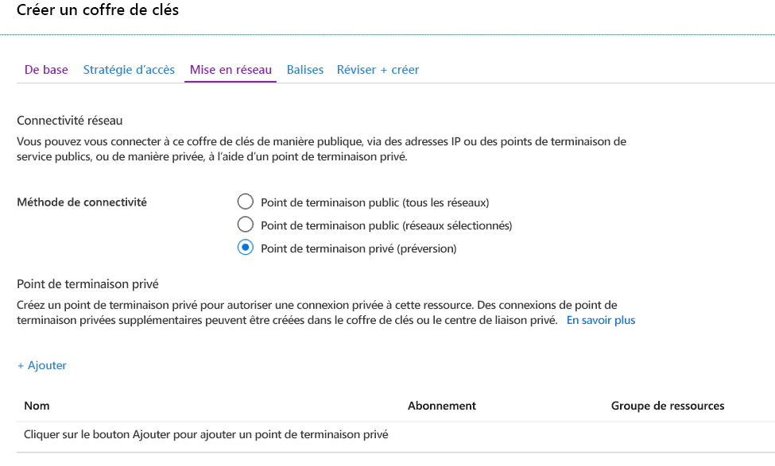
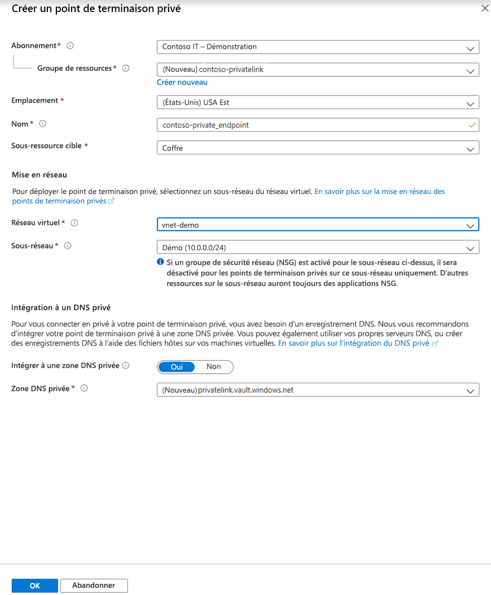
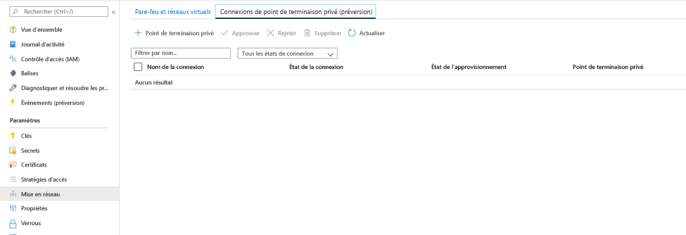
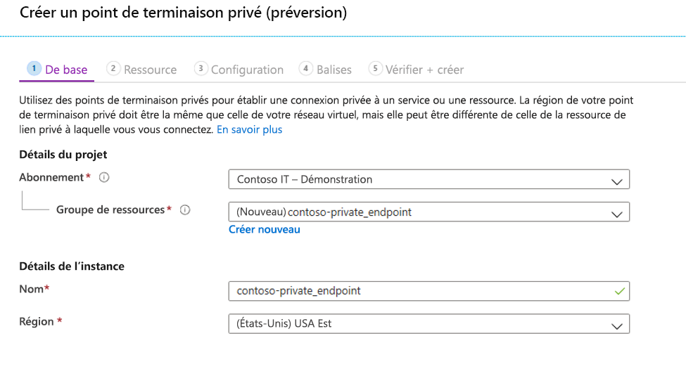
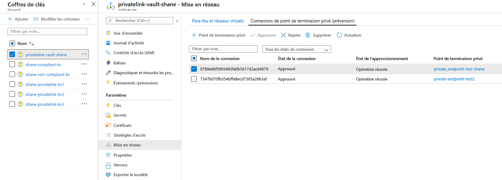

# <a name="integrate-key-vault-with-azure-private-link-preview"></a>Intégrer Key Vault à Azure Private Link (préversion)

Le service Azure Private Link vous permet d’accéder aux services Azure (par exemple, Azure Key Vault, Stockage Azure et Azure Cosmos DB) ainsi qu’aux services de partenaires ou de clients hébergés par Azure via un point de terminaison privé de votre réseau virtuel.

Un point de terminaison privé Azure est une interface réseau qui vous connecte de façon privée et sécurisée à un service basé sur la technologie Azure Private Link. Le point de terminaison privé utilise une adresse IP privée de votre réseau virtuel, plaçant de fait le service dans votre réseau virtuel. Sachant que l’ensemble du trafic à destination du service peut être routé via le point de terminaison privé, il n’y a aucun besoin de passerelles, d’appareils NAT, de connexions ExpressRoute ou VPN ou d’adresses IP publiques. Le trafic entre votre réseau virtuel et le service transite par le réseau principal de Microsoft, éliminant ainsi toute exposition à l’Internet public. Vous pouvez vous connecter à une instance d’une ressource Azure, ce qui vous donne le plus haut niveau de granularité en matière de contrôle d’accès.

Pour plus d’informations, consultez [Qu’est-ce qu’Azure Private Link (préversion) ?](../private-link/private-link-overview.md)

## <a name="prerequisites"></a>Conditions préalables requises

Pour intégrer un coffre de clés à Azure Private Link (préversion), vous avez besoin des éléments suivants :

- Un coffre de clés.
- Un réseau virtuel Azure.
- Un sous-réseau dans le réseau virtuel.
- Des autorisations de propriétaire ou de contributeur à la fois pour le coffre de clés et le réseau virtuel.

Votre point de terminaison privé et votre réseau virtuel doivent se trouver dans la même région. Au moment de sélectionner la région du point de terminaison privé sur le portail, les réseaux virtuels qui se trouvent dans cette région sont filtrés automatiquement. Votre coffre de clés peut se trouver dans une autre région.

Votre point de terminaison privé utilise une adresse IP privée de votre réseau virtuel.

## <a name="establish-a-private-link-connection-to-key-vault"></a>Établir une connexion de liaison privée avec le coffre de clés

Tout d’abord, créez un réseau virtuel en suivant les étapes décrites dans [Créer un réseau virtuel à partir du portail Azure](../virtual-network/quick-create-portal.md).

Vous pouvez ensuite soit créer un coffre de clés, soit établir une connexion de liaison privée avec un coffre de clés existant.

### <a name="create-a-new-key-vault-and-establish-a-private-link-connection"></a>Créer un coffre de clés et établir une connexion de liaison privée

Vous pouvez créer un coffre de clés en suivant les étapes décrites dans [Définir et récupérer un secret depuis Azure Key Vault à l’aide du portail Azure](quick-create-portal.md).

Après avoir configuré les éléments de base du coffre de clés, sélectionnez l’onglet Mise en réseau et suivez ces étapes :

1. Sélectionnez la case d’option Point de terminaison privé (préversion) sous l’onglet Mise en réseau.
1. Cliquer sur le bouton « + Ajouter » pour ajouter un point de terminaison privé.

    
 
1. Dans le champ « Région » du panneau Créer un point de terminaison privé, sélectionnez la région dans laquelle se trouve votre réseau virtuel. 
1. Dans le champ « Nom », créez un nom descriptif qui vous permettra d’identifier ce point de terminaison privé. 
1. Dans le menu déroulant, sélectionnez le réseau virtuel et le sous-réseau dans lesquels vous souhaitez que ce point de terminaison privé soit créé. 
1. Laissez l’option « intégrer à la zone DNS privée » inchangée.  
1. Sélectionnez « OK ».

    
 
Le point de terminaison privé configuré est maintenant visible. Vous avez maintenant la possibilité de supprimer et de modifier ce point de terminaison privé. Sélectionnez le bouton « Vérifier + créer » et créez le coffre de clés. Le déploiement prend entre 5 et 10 minutes. 

### <a name="establish-a-private-link-connection-to-an-existing-key-vault"></a>Établir une connexion de liaison privée avec un coffre de clés existant

Si vous disposez déjà d’un coffre de clés, vous pouvez créer une connexion de liaison privée en suivant ces étapes :

1. Connectez-vous au portail Azure. 
1. Dans la barre de recherche, tapez « coffres de clés ».
1. Dans la liste, sélectionnez le coffre de clés auquel vous voulez ajouter un point de terminaison privé.
1. Sélectionnez l’onglet « Mise en réseau » en dessous de Paramètres.
1. Sélectionnez l’onglet Connexions des points de terminaison privés (préversion) en haut de la page.
1. Sélectionnez le bouton « + Point de terminaison privé » en haut de la page.

     

Vous pouvez choisir de créer un point de terminaison privé pour n’importe quelle ressource Azure à l’aide de ce panneau. Vous pouvez soit utiliser les menus déroulants pour sélectionner un type de ressource et sélectionner une ressource dans votre annuaire, soit vous connecter à une ressource Azure en utilisant un ID de ressource. Laissez l’option « intégrer à la zone DNS privée » inchangée.  


## <a name="manage-private-link-connection"></a>Gérer une connexion à liaison privée

Quand vous créez un point de terminaison privé, la connexion doit être approuvée. Si la ressource pour laquelle vous créez un point de terminaison privé se trouve dans votre annuaire, vous pouvez approuver la demande de connexion à condition de bénéficier d’autorisations suffisantes. Si vous vous connectez à une ressource Azure située dans un autre annuaire, vous devez attendre que le propriétaire de cette ressource approuve votre demande de connexion.

Il existe quatre états de provisionnement :

| Action du fournisseur de service | État du point de terminaison privé de l’utilisateur du service | Description |
|--|--|--|
| None | Pending | La connexion est créée manuellement et est en attente d’approbation du propriétaire de la ressource Private Link. |
| Approbation | Approved | La connexion a été approuvée automatiquement ou manuellement et est prête à être utilisée. |
| Rejeter | Rejeté | La connexion a été rejetée par le propriétaire de la ressource Private Link. |
| Supprimer | Déconnecté | La connexion a été supprimée par le propriétaire de la ressource Private Link, le point de terminaison privé devient donc informatif et doit être supprimé dans le cadre d’un nettoyage. |
 
###  <a name="how-to-manage-a-private-endpoint-connection-to-key-vault"></a>Comment gérer une connexion de point de terminaison privé à un coffre de clés

1. Connectez-vous au portail Azure.
1. Dans la barre de recherche, tapez « coffres de clés ».
1. Sélectionnez le coffre de clés que vous voulez gérer.
1. Sélectionnez l’onglet « Mise en réseau ».
1. Si une connexion est en attente, celle-ci présente l’état de provisionnement « En attente ». 
1. Sélectionnez le point de terminaison privé que vous souhaitez approuver.
1. Sélectionnez le bouton Approuver.
1. Si vous voulez rejeter une connexion de point de terminaison privé, qu’il s’agisse d’une demande en attente ou d’une connexion existante, sélectionnez cette connexion et cliquez sur le bouton « Rejeter ».

    

## <a name="validate-that-the-private-link-connection-works"></a>Vérifier le fonctionnement de la connexion à liaison privée

Vous devez vérifier que les ressources contenues dans le sous-réseau de la ressource de point de terminaison privé se connectent à votre coffre de clés via une adresse IP privée, et qu’elles sont intégrées à la zone DNS privée appropriée.

Commencez par créer une machine virtuelle en suivant les étapes décrites dans [Créer une machine virtuelle Windows sur le portail Azure](../virtual-machines/windows/quick-create-portal.md).

Sous l’onglet « Mise en réseau » :

1. Spécifiez un réseau virtuel et un sous-réseau. Vous pouvez créer un nouveau réseau virtuel ou en utiliser un existant. Si vous en sélectionnez un existant, veillez à ce que la région corresponde.
1. Spécifiez une ressource IP publique.
1. Dans « Groupe de sécurité réseau de la carte réseau », sélectionnez « Aucun ».
1. Dans « Équilibrage de charge », sélectionnez « Non ».

Ouvrez la ligne de commande et exécutez la commande suivante :

```console
nslookup <your-key-vault-name>.vault.azure.net
```

Si vous exécutez la commande ns lookup pour résoudre l’adresse IP d’un coffre de clés via un point de terminaison public, vous obtenez un résultat semblable à ceci :

```console
c:\ >nslookup <your-key-vault-name>.vault.azure.net

Non-authoritative answer:
Name:    
Address:  (public IP address)
Aliases:  <your-key-vault-name>.vault.azure.net
```

Si vous exécutez la commande ns lookup pour résoudre l’adresse IP d’un coffre de clés via un point de terminaison privé, vous obtenez un résultat semblable à ceci :

```console
c:\ >nslookup your_vault_name.vault.azure.net

Non-authoritative answer:
Name:    
Address:  10.1.0.5 (private IP address)
Aliases:  <your-key-vault-name>.vault.azure.net
          <your-key-vault-name>.privatelink.vaultcore.azure.net
```

## <a name="limitations-and-design-considerations"></a>Limitations et remarques sur la conception

**Prix** : Pour obtenir des informations sur les prix, consultez [Tarifs Azure Private Link (préversion)](https://azure.microsoft.com/pricing/details/private-link/).

**Limitations** :  Le point de terminaison privé pour Azure Key Vault est en préversion publique. Cette fonctionnalité est disponible dans toutes les régions publiques Azure.

**Nombre maximal de points de terminaison privés par coffre de clés** : 64.

**Nombre maximal de coffres de clés avec points de terminaison privés par abonnement** : 64.

Pour plus d’informations, consultez [Service Azure Private Link : Limitations](../private-link/private-link-service-overview.md#limitations)

## <a name="next-steps"></a>Étapes suivantes

- Découvrir plus en détail [Azure Private Link (préversion)](../private-link/private-link-service-overview.md)
- En savoir plus sur [Azure Key Vault](key-vault-overview.md)
