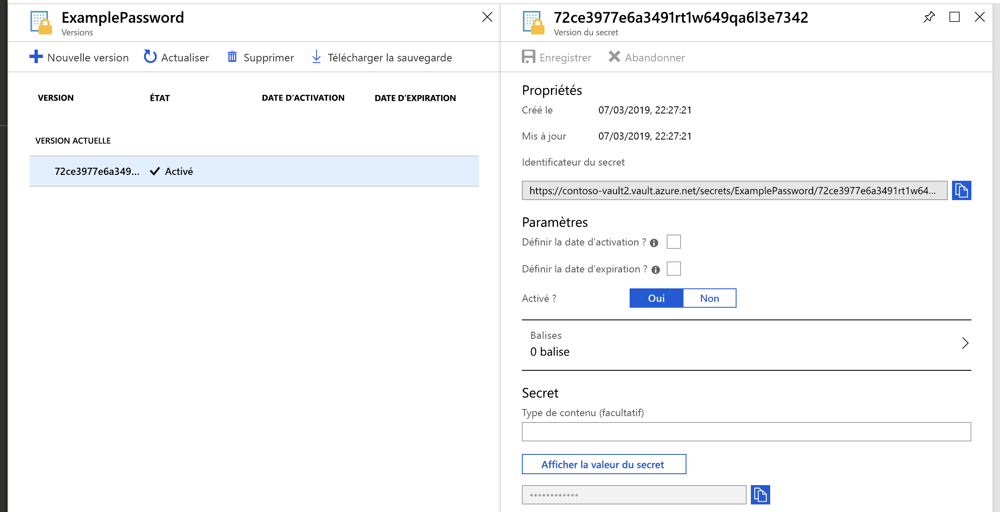
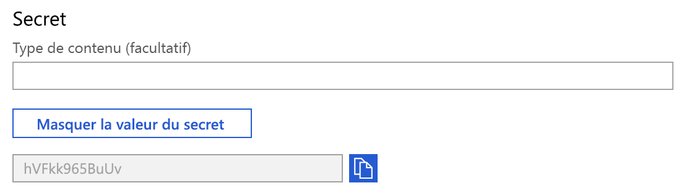

# Démarrage rapide : Définir et récupérer un secret depuis Azure Key Vault à l’aide du portail Azure

Azure Key Vault est un service cloud qui fonctionne comme un magasin sécurisé contenant des secrets. Vous pouvez stocker des clés, des mots de passe, des certificats et d’autres secrets en toute sécurité. Vous pouvez créer et gérer des coffres de clés Azure grâce au portail Azure. Dans ce démarrage rapide, vous créez un coffre de clés, puis l’utilisez pour stocker un secret. 

Pour plus d’informations, consultez 
- [Vue d’ensemble du coffre de clés](../general/overview.md)
- [Vue d’ensemble des secrets](about-secrets.md).

## Prérequis

Pour accéder à Azure Key Vault, vous avez besoin d’un abonnement Azure. Si vous n’avez pas d’abonnement, vous pouvez créer un [compte gratuit](https://azure.microsoft.com/free/?WT.mc_id=A261C142F) avant de commencer.

Tout accès aux secrets s’effectue par le biais d’Azure Key Vault. Pour ce guide de démarrage rapide, créez un coffre de clés à l’aide du [portail Azure](../general/quick-create-portal.md), de l’interface [Azure CLI](../general/quick-create-cli.md) ou d’[Azure PowerShell](../general/quick-create-powershell.md).

## Connexion à Azure

Connectez-vous au portail Azure sur https://portal.azure.com.

## Ajouter un secret au coffre de clés

Pour ajouter un secret au coffre, procédez comme suit :

1. Accédez à votre nouveau coffre de clés dans le portail Azure.
1. Dans les pages des paramètres de coffre de clés, sélectionnez **Secrets**.
1. Cliquez sur **Generate/Import (Générer/Importer)** .
1. Dans l’écran **Create a secret (Créer un secret)** , choisissez les valeurs suivantes :
    - **Options de chargement** : Manuel.
    - **Nom** : Entrez un nom pour le secret. Le nom du secret doit être unique dans le coffre de clés. Le nom doit être une chaîne comprise entre 1 et 127 caractères, commençant par une lettre et qui doit contenir uniquement des chiffres, des lettres et des tirets (0-9, a-z, A-Z et -). Pour plus d’informations sur le nommage, consultez [Objets, identificateurs et gestion de versions Key Vault](../general/about-keys-secrets-certificates.md#objects-identifiers-and-versioning).
    - **Valeur** : Entrez une valeur pour le secret. Les API Key Vault acceptent et retournent des valeurs de secret sous forme de chaînes. 
    - Conservez les valeurs par défaut des autres options. Cliquez sur **Créer**.

Lorsque vous recevez le message confirmant la création du secret, cliquez dessus dans la liste. 

Pour plus d’informations sur les attributs des secrets, consultez [À propos des secrets Azure Key Vault](./about-secrets.md).

## Récupérer un secret à partir de Key Vault

Si vous cliquez sur la version actuelle, vous voyez la valeur que vous avez spécifiée à l’étape précédente.

Vous pouvez afficher la valeur masquée en cliquant sur le bouton « Afficher la valeur secrète » dans le volet de droit. 

Vous pouvez également utiliser l’interface [Azure CLI]() ou [Azure PowerShell]() pour récupérer le secret créé précédemment.

## Nettoyer les ressources

D’autres démarrages rapides et didacticiels sur les coffres de clés reposent sur ce démarrage rapide. Si vous prévoyez d’utiliser d’autres démarrages rapides et didacticiels, il peut être utile de conserver ces ressources.
Si vous n’en avez plus besoin, supprimez le groupe de ressources. Ce faisant, vous supprimez le coffre de clés et les ressources associées. Pour supprimer le groupe de ressources à l’aide du portail :

1. Entrez le nom de votre groupe de ressources dans la zone Recherche en haut du portail. Lorsque vous voyez le groupe de ressources utilisé dans ce démarrage rapide dans les résultats de recherche, sélectionnez-le.
2. Sélectionnez **Supprimer le groupe de ressources**.
3. Dans le champ **TYPE THE RESOURCE GROUP NAME: (TAPER LE NOM DU GROUPE DE RESSOURCES :)** , tapez le nom du groupe de ressources et sélectionnez **Supprimer**.

> [!NOTE]
> Il est important de noter qu’après la suppression d’un secret, d’une clé, d’un certificat ou d’un coffre de clés, ces derniers restent récupérables pendant une période configurable de 7 à 90 jours civils. Si aucune configuration n’est spécifiée, la période de récupération par défaut est définie sur 90 jours. Les utilisateurs disposent ainsi de suffisamment de temps pour remarquer la suppression accidentelle d’un secret et y remédier. Pour plus d’informations sur la suppression et la récupération des coffres de clés et des objets de coffre de clés, consultez [Vue d’ensemble de la suppression réversible d’Azure Key Vault](../general/soft-delete-overview.md).

## Étapes suivantes

Dans ce guide de démarrage rapide, vous avez créé un coffre de clés et vous y avez stocké un secret. Pour en savoir plus sur Key Vault et sur la manière de l’intégrer à vos applications, consultez les articles ci-dessous.

- Lire la [vue d’ensemble Azure Key Vault](../general/overview.md)
- Lire [Sécuriser l’accès à un coffre de clés](../general/security-features.md)
- Consulter [Utiliser Key Vault avec une application web App Service](../general/tutorial-net-create-vault-azure-web-app.md)
- Consulter [Utiliser Key Vault avec une application déployée sur une machine virtuelle](../general/tutorial-net-virtual-machine.md)
- Consulter le [Guide du développeur Azure Key Vault](../general/developers-guide.md)
- Passer en revue la [Vue d’ensemble de la sécurité de Key Vault](../general/security-features.md)