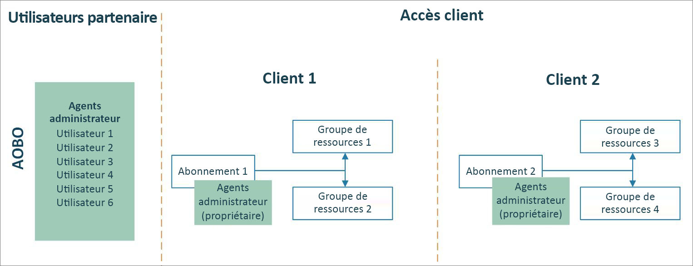
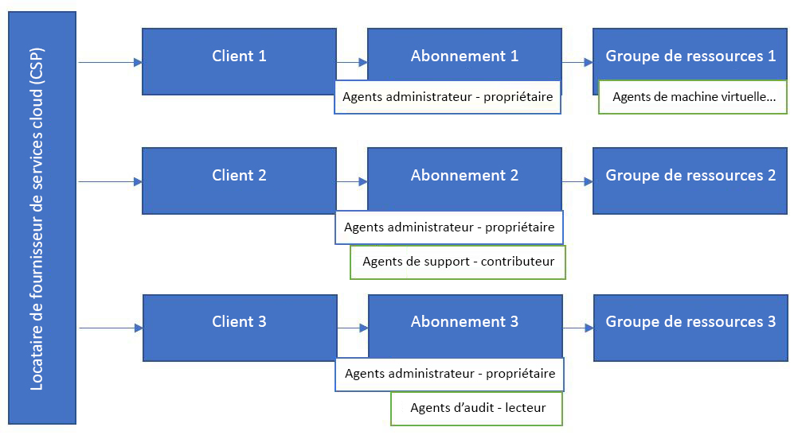

# Azure Lighthouse et le programme Fournisseur de solutions cloud

Si vous êtes un partenaire [Fournisseur de solutions cloud (CSP)](/partner-center/csp-overview), vous pouvez déjà accéder aux abonnements Azure créés pour vos clients par le biais du programme Fournisseur de solutions cloud en utilisant la fonctionnalité [Administrer au nom de](https://channel9.msdn.com/Series/cspdev/Module-11-Admin-On-Behalf-Of-AOBO). Cet accès vous permet de prendre en charge, de configurer et de gérer directement les abonnements de vos clients.

Avec [Azure Lighthouse](../overview.md), vous pouvez utiliser la gestion des ressources déléguées Azure avec la fonctionnalité Administrer au nom de. Cela contribue à améliorer la sécurité et réduit l’accès inutile en autorisant des autorisations plus granulaires pour vos utilisateurs. Cela permet également une plus grande efficacité et une plus grande scalabilité, car vos utilisateurs peuvent travailler sur plusieurs abonnements client à l’aide d’une seule connexion dans votre locataire.

> [!TIP]
> Pour optimiser la protection des ressources de clients, veillez à consulter et suivre nos [pratiques de sécurité recommandées](recommended-security-practices.md) ainsi que les [conditions de sécurité du partenaire](/partner-center/partner-security-requirements).

## Administrer au nom de

Avec le mécanisme Administrer au nom de, tout utilisateur auquel le rôle [Agent d’administration](/partner-center/permissions-overview#manage-commercial-transactions-in-partner-center-azure-ad-and-csp-roles) est attribué dans votre locataire dispose d’un accès Administrer au nom de aux abonnements Azure que vous créez via le programme Fournisseur de solutions cloud. Tous les utilisateurs qui ont besoin d’accéder aux abonnements de tous les clients doivent être membres de ce groupe. Le mécanisme Administrer au nom de ne permet pas de créer des groupes distincts fonctionnant avec différents clients, ou d’activer des rôles différents à des groupes ou à des utilisateurs.

## Gestion des ressources déléguées Azure

Azure Lighthouse permet d’attribuer différents groupes aux clients et aux rôles, comme l’illustre le diagramme suivant. Étant donné que les utilisateurs disposent du niveau d’accès approprié attribué par le biais de la gestion des ressources déléguées Azure, vous pouvez réduire le nombre d’utilisateurs ayant le rôle Agent d’administration (et disposant ainsi d’un accès Administrer au nom de complet). Cela contribue à améliorer la sécurité en limitant les accès inutiles aux ressources de vos clients. Cela vous offre également une plus grande flexibilité pour gérer plusieurs clients à grande échelle.

L’intégration d’un abonnement créé par le biais du programme CSP suit les étapes décrites dans [Intégration d’un abonnement à Azure Lighthouse](../how-to/onboard-customer.md). Tout utilisateur auquel le rôle Agent d’administration est attribué dans votre locataire peut effectuer cette intégration.

> [!TIP]
> Les [offres de services managés](managed-services-offers.md) avec des plans privés ne sont pas prises en charge avec les abonnements souscrits via un revendeur participant au programme des fournisseurs de solutions cloud (CSP). Vous pouvez intégrer ces abonnements à Azure Lighthouse en [à l’aide de modèles Azure Resource Manager](../how-to/onboard-customer.md).

> [!NOTE]
> La page [**Mes clients** du portail Azure](../how-to/view-manage-customers.md) comprend désormais une section **Fournisseur de solutions cloud (préversion)** , qui affiche des informations de facturation et des ressources pour les clients CSP qui ont [signé le contrat client Microsoft (MCA)](/partner-center/confirm-customer-agreement) et sont [sous le plan Azure](/partner-center/azure-plan-get-started). Pour plus d’informations, voir [Bien démarrer avec votre compte de facturation dans le cadre d’un Contrat Partenaire Microsoft](../../cost-management-billing/understand/mpa-overview.md).
>
> Des clients CSP peuvent apparaître dans cette section, qu’ils aient ou non aussi été intégrés à Azure Lighthouse. Si c'est le cas, ils apparaîtront également dans la section **Clients**, comme décrit dans [Voir et gérer les clients et les ressources déléguées](../how-to/view-manage-customers.md). De même, il n’est pas nécessaire qu’un client CSP apparaisse dans la section **Fournisseur de solutions cloud (préversion)** de **Mes clients** pour pouvoir les intégrer à Azure Lighthouse.

## Étapes suivantes

- Découvrez les [Expériences de gestion inter-locataire](cross-tenant-management-experience.md).
- Découvrez comment [intégrer un abonnement à Azure Lighthouse](../how-to/onboard-customer.md).
- Découvrez le [Programme Fournisseur de solutions cloud](/partner-center/csp-overview).
