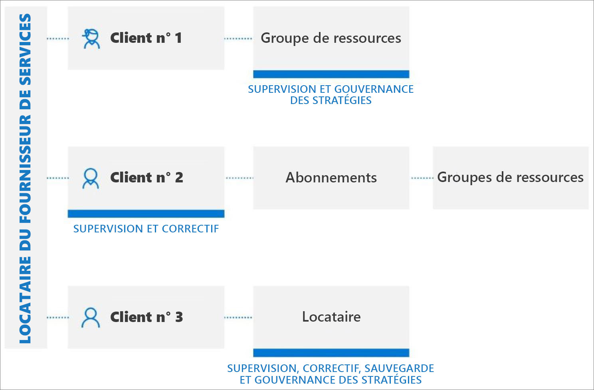

# Expériences de la gestion multilocataire

En tant que fournisseur de services, vous pouvez utiliser [Azure Lighthouse](../overview.md) pour gérer les ressources de plusieurs clients à partir de votre propre locataire Azure Active Directory (Azure AD). De nombreuses tâches et de nombreux services peuvent être exécutés sur tous les locataires gérés en utilisant la [gestion des ressources déléguées Azure](../concepts/azure-delegated-resource-management.md).

> [!TIP]
> La gestion des ressources déléguées Azure peut également être utilisée [au sein d’une entreprise qui dispose de plusieurs locataires Azure AD](enterprise.md) pour simplifier l’administration entre locataires.

## Comprendre les locataires et la délégation

Un locataire Azure AD est la représentation d’une organisation. Il s’agit d’une instance dédiée d’Azure AD qu’une organisation reçoit quand elle crée une relation avec Microsoft en s’inscrivant à Azure, à Microsoft 365 ou à d’autres services. Chaque locataire Azure AD est distinct et indépendant des autres, et a son propre ID de locataire (GUID). Pour plus d’informations, voir [Qu’est-ce qu’Azure Active Directory ?](../../active-directory/fundamentals/active-directory-whatis.md)

En règle générale, pour gérer des ressources Azure pour un client, les fournisseurs de services doivent se connecter au portail Azure à l’aide d’un compte associé au locataire de ce client, ce qui requiert qu’un administrateur dans le locataire du client crée et gère des comptes d’utilisateur pour le fournisseur de services.

Avec Azure Lighthouse, le processus d'intégration désigne les utilisateurs du locataire du fournisseur de services qui pourront travailler sur les abonnements et les groupes de ressources délégués au sein du locataire du client. Ces utilisateurs peuvent ensuite se connecter au portail Azure en utilisant leurs propres informations d’identification. Dans le portail Azure, ils peuvent gérer les ressources appartenant à tous les clients auxquels ils ont accès. Pour ce faire, ils peuvent accéder à la page [Mes clients](../how-to/view-manage-customers.md) du portail Azure ou travailler directement dans le contexte de l’abonnement de ce client, soit sur le portail Azure ou via des API.

Azure Lighthouse offre une plus grande flexibilité pour gérer les ressources de plusieurs clients sans avoir à se connecter à différents comptes associés à différents locataires. Par exemple, un fournisseur de services peut avoir deux clients, avec des responsabilités et des niveaux d’accès différents. À l'aide d'Azure Lighthouse, les utilisateurs autorisés peuvent se connecter au locataire du fournisseur de services pour accéder à ces ressources.

## Prise en charge des API et de l’outil de gestion

Vous pouvez effectuer des tâches de gestion sur les ressources déléguées directement sur le portail ou à l’aide d’API et d’outils de gestion (tels que Azure CLI et Azure PowerShell). Toutes les API existantes peuvent être utilisées lorsque vous travaillez avec des ressources déléguées, tant que la fonctionnalité est prise en charge pour la gestion entre inter-locataires et que l’utilisateur dispose des autorisations appropriées.

La [cmdlet Get-AzSubscription](/powershell/module/Az.Accounts/Get-AzSubscription) Azure PowerShell affiche les attributs `HomeTenantId` et `ManagedByTenantIds` de chaque abonnement, ce qui vous permet de savoir si un abonnement retourné appartient à un locataire géré ou à votre locataire gérant.

De même, des commandes Azure CLI comme [az account list](/cli/azure/account#az-account-list) affichent les attributs `homeTenantId` et `managedByTenants`. Si vous ne voyez pas ces valeurs lors de l’utilisation d'Azure CLI, essayez d’effacer votre cache en exécutant `az account clear`, puis `az login --identity`.

Dans l’API REST Azure, les commandes [Abonnements – Get](/rest/api/resources/subscriptions/get) et [Abonnements – List](/rest/api/resources/subscriptions/list) incluent `ManagedByTenant`.

> [!NOTE]
> En plus des informations sur les locataires liées à Azure Lighthouse, les locataires indiqués par ces API peuvent également refléter les locataires partenaires des applications managées Azure ou Azure Databricks.

Nous fournissons également des API spécifiques pour l'exécution de tâches Azure Lighthouse. Pour plus d’informations, voir la section **Référence**.

## Services et scénarios améliorés

La plupart des tâches et des services peuvent être exécutés sur des ressources déléguées sur des locataires gérés. Voici quelques-uns des principaux scénarios dans lesquels la gestion inter-locataires peut être particulièrement efficace.

[Azure Arc](../../azure-arc/index.yml) :

- Gérer des serveurs hybrides à grande échelle – [Serveurs compatibles Azure Arc](../../azure-arc/servers/overview.md) :
  - [Gérer des machines Windows Server ou Linux en dehors d’Azure, qui sont connectées](../../azure-arc/servers/onboard-portal.md) à des abonnements et/ou à des groupes de ressources délégués dans Azure
  - Gérer des machines connectées à l’aide de constructions Azure, comme Azure Policy et le marquage
  - S’assurer que le même ensemble de stratégies est appliqué dans les environnements hybrides des clients
  - Utiliser Azure Security Center pour surveiller la conformité des environnements hybrides des clients
- Gérer des clusters Kubernetes hybrides à grande échelle – [Kubernetes avec Azure Arc (préversion)](../../azure-arc/kubernetes/overview.md) :
  - [Gérer des clusters Kubernetes connectés](../../azure-arc/kubernetes/connect-cluster.md) à des abonnements délégués et/ou à des groupes de ressources dans Azure
  - [Utiliser GitOps](../../azure-arc/kubernetes/use-gitops-connected-cluster.md) dans des clusters connectés
  - Appliquer des stratégies entre les clusters connectés

[Azure Automation](../../automation/index.yml) :

- Utiliser des comptes Automation pour accéder à des ressources du déléguées et les utiliser

[Sauvegarde Azure](../../backup/index.yml) :

- Sauvegarder et restaurer des données client [à partir de charges de travail locales, de machines virtuelles Azure, de partages de fichiers Azure, etc.](../..//backup/backup-overview.md#what-can-i-back-up)
- Utilisez l'[Explorateur de sauvegarde](../../backup/monitor-azure-backup-with-backup-explorer.md) pour visualiser les informations opérationnelles des éléments de sauvegarde (y compris les ressources Azure qui n'ont pas encore été configurées pour la sauvegarde) et les informations de supervision (travaux et alertes) des abonnements délégués. Pour l’instant, l’Explorateur de sauvegarde est uniquement disponible pour les données de machines virtuelles Azure.
- Utilisez [Rapports de sauvegarde](../../backup/configure-reports.md) dans les abonnements délégués pour suivre les tendances historiques, analyser la consommation du stockage de sauvegarde et auditer les sauvegardes et les restaurations.

[Azure Blueprints](../../governance/blueprints/index.yml) :

- Utiliser Azure Blueprints pour orchestrer le déploiement de modèles de ressource et d’autres artefacts (nécessite un [accès supplémentaire](https://www.wesleyhaakman.org/preparing-azure-lighthouse-customer-subscriptions-for-azure-blueprints/) pour préparer l’abonnement client)

[Azure Cost Management + Facturation](../../cost-management-billing/index.yml) :

- À partir du locataire de gestion, les fournisseurs de solutions Cloud partenaires peuvent visualiser, gérer et analyser les coûts de consommation hors taxes (hors achats) pour les clients qui relèvent du plan Azure. Le coût est basé sur les tarifs de vente au détail et l’accès Azure RBAC (contrôle d’accès en fonction du rôle Azure) dont dispose le partenaire pour l’abonnement du client.

[Azure Kubernetes Service (AKS)](../../aks/index.yml) :

- Gérer des environnements Kubernetes hébergés, ainsi que déployer et gérer des applications en conteneur au sein des locataires du client
- Déployer et gérer des clusters dans les locataires client
-   Utiliser Azure Monitor pour les conteneurs afin de surveiller les performances des locataires clients

[Azure Migrate](../../migrate/index.yml) :

- Créer des projets de migration dans le locataire client et migrer des machines virtuelles

[Azure Monitor](../../azure-monitor/index.yml) :

- Afficher les alertes pour les abonnements délégués, avec la possibilité d’afficher des alertes à travers tous les abonnements
- Afficher les détails du journal d’activité pour des abonnements délégués
- Log Analytics : Interroger des données à partir d’espaces de travail distants dans plusieurs locataires
- Créer des alertes dans les locataires du client qui déclenchent une automatisation, par exemple des runbooks Azure Automation ou des fonctions Azure Functions, dans le locataire gérant par le biais de webhooks
- Créer des paramètres de diagnostic dans des locataires clients pour envoyer des journaux de ressources à des espaces de travail dans le locataire gérant
- Pour les charges de travail SAP, [surveiller les métriques des solutions SAP avec une vue agrégée sur les locataires clients](https://techcommunity.microsoft.com/t5/running-sap-applications-on-the/using-azure-lighthouse-and-azure-monitor-for-sap-solutions-to/ba-p/1537293)

[Azure Networking](../../networking/networking-overview.md) :

- Déployer et gérer des [Réseaux virtuels Azure](../../virtual-network/index.yml) et des cartes virtuelles d’interface réseau (cartes réseau virtuelles) au sein des locataires gérés
- Déployer et configurer [Pare-feu Azure](../../firewall/overview.md) pour protéger les ressources Réseau virtuel des clients
- Gérer des services de connectivité comme [Azure Virtual WAN](../../virtual-wan/virtual-wan-about.md), [ExpressRoute](../../expressroute/expressroute-introduction.md) et les [passerelles VPN](../../vpn-gateway/vpn-gateway-about-vpngateways.md)
- Utiliser Azure Lighthouse pour prendre en charge des scénarios clés pour le [programme MSP Azure Networking](../../networking/networking-partners-msp.md)

[Azure Policy](../../governance/policy/index.yml) :

- Créer et modifier des définitions de stratégie au sein d’abonnements délégués
- Affecter des définitions de stratégie définies par le client au sein d’abonnements délégués
- Les clients voient les stratégies créées par le fournisseur de services en même temps que les stratégies qu’ils ont créées eux-mêmes
- Peut [corriger deployIfNotExists ou modifier des affectations au sein du locataire géré](../how-to/deploy-policy-remediation.md)

[Azure Resource Graph](../../governance/resource-graph/index.yml) :

- Inclut désormais l’ID de locataire dans les résultats de requête renvoyés, ce qui vous permet d’identifier si un abonnement appartient à un locataire géré

[Azure Security Center](../../security-center/index.yml) :

- Visibilité inter-locataire
  - Superviser la conformité aux stratégies de sécurité et garantir la couverture de sécurité des ressources de tous les locataires
  - Surveillance continue de la conformité réglementaire de plusieurs locataires dans une seule vue
  - Surveiller, trier et hiérarchiser les recommandations de sécurité actionnables avec un calcul du degré de sécurisation
- Gestion d’état de la sécurité inter-locataire
  - Gérer les stratégies de sécurité
  - Agir sur des ressources non conformes à l’aide de recommandations de sécurité actionnables
  - Collecter et stocker des données liées à la sécurité
- Détection et traitement des menaces inter-locataires
  - Détecter des menaces pesant sur des ressources inter-locataires
  - Appliquer des contrôles de protection avancée contre les menaces tels que l’accès à la machine virtuelle juste-à-temps (JIT)
  - Renforcer la configuration du groupe de sécurité réseau avec le renforcement du réseau adaptatif
  - S’assurer que les serveurs exécutent uniquement les applications et processus qu’ils doivent exécuter avec des contrôles d’application adaptatifs
  - Surveiller les modifications apportées aux fichiers et aux entrées de Registre importants avec le monitoring d’intégrité de fichier
- À savoir : l’intégralité de l’abonnement doit être déléguée au locataire gérant ; les scénarios Azure Security Center ne sont pas pris en charge avec les groupes de ressources délégués.

[Azure Sentinel](../../sentinel/multiple-tenants-service-providers.md) :

- Gérer les ressources Azure Sentinel [dans les locataires clients](../../sentinel/multiple-tenants-service-providers.md)
- [Suivre les attaques et afficher les alertes de sécurité sur plusieurs locataires](https://techcommunity.microsoft.com/t5/azure-sentinel/using-azure-lighthouse-and-azure-sentinel-to-monitor-across/ba-p/1043899)
- [Afficher les incidents](../../sentinel/multiple-workspace-view.md) dans plusieurs espaces de travail Sentinel répartis entre les locataires

[Azure Service Health](../../service-health/index.yml) :

- Surveiller l’intégrité des ressources du client avec Azure Resource Health
- Suivre l’intégrité des services Azure utilisés par les clients

[Azure Site Recovery](../../site-recovery/index.yml) :

- Gérer les options de récupération d’urgence pour les machines virtuelles Azure dans les locataires du client (notez que vous ne pouvez pas utiliser de comptes `RunAs` pour copier des extensions de machines virtuelles)

[Machines virtuelles Azure](../../virtual-machines/index.yml) :

- Utiliser des extensions de machine virtuelle pour accomplir des tâches d’automatisation et de configuration après déploiement sur des machines virtuelles Azure
- Utiliser des diagnostics de démarrage pour résoudre des problèmes de machines virtuelles Azure
- Accéder à des machines virtuelles avec la console série
- Intégrer des machines virtuelles à Azure Key Vault pour les mots de passe, les secrets ou les clés de chiffrement pour le chiffrement de disque à l’aide d’une [identité managée par le biais d’une stratégie](https://github.com/Azure/Azure-Lighthouse-samples/tree/master/templates/create-keyvault-secret), garantissant que les secrets sont stockés dans un coffre Key Vault dans les locataires gérés
- Notez que vous ne pouvez pas utiliser Azure Active Directory pour l’ouverture de session à distance sur les machines virtuelles

Demandes de support :

- [Ouvrir des demandes de support à partir du panneau **Aide + Support**](../../azure-portal/supportability/how-to-create-azure-support-request.md#getting-started) dans le portail Azure pour les ressources déléguées (en sélectionnant le plan de support disponible pour l’étendue déléguée)

## Limites actuelles

Dans tous les scénarios, gardez à l’esprit les limitations actuelles suivantes :

- Les demandes traitées par Azure Resource Manager peuvent être effectuées à l’aide d’Azure Lighthouse. Les URI d’opération pour ces demandes commencent par `https://management.azure.com`. Toutefois, les demandes qui sont gérées par une instance d’un type de ressource (par exemple, accès aux secrets du coffre de clés ou accès aux données de stockage) ne sont pas prises en charge avec Azure Lighthouse. Les URI d’opération pour ces demandes commencent généralement par une adresse propre à votre instance, telle que `https://myaccount.blob.core.windows.net` ou `https://mykeyvault.vault.azure.net/`. Ces dernières sont également des opérations sur les données plutôt que des opérations de gestion.
- Les attributions de rôles doivent utiliser les [rôles intégrés Azure](../../role-based-access-control/built-in-roles.md). Tous les rôles intégrés sont actuellement pris en charge avec la gestion des ressources déléguées Azure, à l’exception du propriétaire et des rôles intégrés avec l’autorisation [`DataActions`](../../role-based-access-control/role-definitions.md#dataactions). Le rôle Administrateur de l’accès utilisateur est pris en charge uniquement pour une utilisation limitée dans [l’affectation de rôles à des identités gérées](../how-to/deploy-policy-remediation.md#create-a-user-who-can-assign-roles-to-a-managed-identity-in-the-customer-tenant).  Les rôles personnalisés et les [Rôles Administrateur classique de l’abonnement](../../role-based-access-control/classic-administrators.md) ne sont pas pris en charge.
- S’il vous est possible d’intégrer des abonnements utilisant Azure Databricks, les utilisateurs du locataire gestionnaire ne peuvent pas lancer d’espaces de travail Azure Databricks sur un abonnement délégué pour le moment.
- Bien que vous puissiez intégrer des abonnements et des groupes de ressources qui ont des verrous de ressources, ces verrous n’empêchent pas les actions d’être effectuées par les utilisateurs dans le locataire gestionnaire. Les [affectations de refus](../../role-based-access-control/deny-assignments.md), qui protègent les ressources managées par le système, telles que celles créées par les applications managées Azure ou Azure Blueprints (affectations de refus émises par le système), empêchent les utilisateurs du locataire gestionnaire d’agir sur ces ressources. Toutefois, à ce moment-là, les utilisateurs du locataire client ne peuvent pas créer leurs propres affectations de refus (affectations de refus émises par l’utilisateur).

## Étapes suivantes

- Intégrez vos clients à Azure Lighthouse [en utilisant des modèles Azure Resource Manager](../how-to/onboard-customer.md) ou [en publiant une offre de services managés privés ou publics sur la Place de marché Azure](../how-to/publish-managed-services-offers.md).
- [Affichez et gérez les clients](../how-to/view-manage-customers.md) en accédant à **Mes clients** sur le portail Azure.
