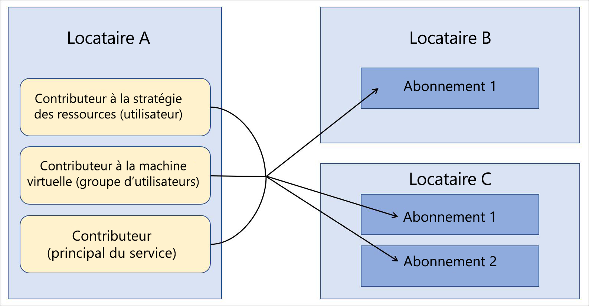

# Azure Lighthouse dans les scénarios d’entreprise

Un scénario courant pour [Azure Lighthouse](../overview.md) met en jeu un fournisseur de services qui gère des ressources dans les locataires Azure Active Directory (Azure AD) de ses clients. Cependant, les fonctionnalités d’Azure Lighthouse peuvent également être utilisées pour simplifier la gestion inter-locataire au sein d’une entreprise qui utilise plusieurs locataires Azure AD.

## Un ou plusieurs locataires

Pour la plupart des organisations, la gestion est plus facile avec un seul locataire Azure AD. Le fait de disposer de toutes les ressources dans un seul et même locataire permet de centraliser les tâches de gestion par des utilisateurs désignés, des groupes d’utilisateurs ou des principaux de service au sein de ce locataire. Nous vous recommandons d’utiliser un seul locataire pour votre organisation chaque fois que cela est possible. Toutefois, certaines organisations peuvent avoir un certain nombre de locataires Azure AD. Dans certains cas, il peut s’agir d’une situation temporaire, comme quand des acquisitions ont eu lieu et qu’une stratégie de consolidation du locataire à long terme n’a pas encore été définie. Parfois, une organisation peut avoir à assurer en permanence la maintenance de plusieurs locataires en raison de filiales totalement indépendantes, de conditions géographiques ou légales, entre autres.

Dans les cas où une architecture multilocataire est nécessaire, Azure Lighthouse contribue à centraliser et simplifier les opérations de gestion. En utilisant la [gestion déléguée des ressources Azure](azure-delegated-resource-management.md), les utilisateurs d’un locataire gérant peuvent effectuer des [ fonctions de gestion inter-locataires](cross-tenant-management-experience.md) de manière centralisée et évolutive.

## Architecture de gestion des locataires

Pour utiliser Azure Lighthouse dans une entreprise, vous devez déterminer quel locataire inclut les utilisateurs qui effectuent des opérations de gestion sur les autres locataires. En d’autres termes, vous devez déterminer quel locataire sera le locataire gestionnaire des autres locataires.

Par exemple, supposons que votre organisation dispose d’un seul locataire que nous appellerons *Locataire A* (Tenant A). Votre organisation acquiert ensuite *Locataire B* (Tenant B) et *Locataire C* (Tenant C) et vous avez des raisons métier qui exigent d’assurer la maintenance en tant que locataires distincts.

Votre organisation souhaite utiliser les mêmes définitions de stratégie, pratiques de sauvegarde et processus de sécurité sur tous les locataires. Étant donné que le Locataire A contient déjà des utilisateurs qui sont responsables de ces tâches, vous pouvez intégrer des abonnements dans Locataire B et Locataire C, ce qui permet aux mêmes utilisateurs de Locataire A d’effectuer ces tâches.

## Considérations relatives à la sécurité et au contrôle

Dans la plupart des scénarios d’entreprise, vous souhaiterez déléguer un abonnement complet à Azure Lighthouse. Vous pouvez également choisir de déléguer uniquement des groupes de ressources spécifiques au sein d’un abonnement.

Dans les deux cas, veillez à [suivre le principe des privilèges minimum lors de la définition des utilisateurs qui auront accès aux ressources déléguées](recommended-security-practices.md#assign-permissions-to-groups-using-the-principle-of-least-privilege). Cela permet de garantir que les utilisateurs disposent uniquement des autorisations requises pour effectuer les tâches nécessaires et réduit le risque d’erreurs accidentelles.

Azure Lighthouse fournit uniquement des liens logiques entre un locataire gestionnaire et des locataires gérés, au lieu de déplacer physiquement les données ou les ressources. De plus, l’accès s’effectue toujours dans un seul sens, du locataire gestionnaire vers les locataires gérés.  Les utilisateurs et les groupes du locataire gestionnaire doivent continuer à utiliser l’authentification multifacteur lors de l’exécution d’opérations de gestion sur des ressources de locataire managées.

Les entreprises bénéficiant d’une gouvernance interne ou externe et de garde-fous de conformité peuvent utiliser des [journaux d’activité Azure](../../azure-monitor/platform/platform-logs-overview.md) pour répondre à leurs besoins de transparence. Quand des locataires d’entreprise ont établi des relations entre le locataire gestionnaire et les locataires gérés, les utilisateurs de chaque locataire peuvent visualiser l’activité journalisée afin de connaître les actions effectuées par les utilisateurs dans le locataire gestionnaire.

## Éléments à prendre en considération lors de l’intégration

Les abonnements (ou groupes de ressources au sein d’un abonnement) peuvent être intégrés à Azure Lighthouse, soit en déployant des modèles Azure Resource Manager, soit par l’intermédiaire d’offres de services managés publiées sur la Place de marché Azure.

Étant donné que les utilisateurs en entreprise pourront généralement accéder directement aux locataires de l’entreprise et qu’il n’est pas nécessaire de commercialiser ou de promouvoir une offre de gestion, il est habituellement plus rapide et plus simple d’effectuer le déploiement des modèles Azure Resource Manager. Même si les [conseils d’intégration](../how-to/onboard-customer.md) font référence aux fournisseurs de services et aux clients , les entreprises peuvent utiliser les mêmes processus pour intégrer leurs locataires.

Si vous préférez, les locataires d’une entreprise peuvent être intégrés en [publiant une offre de services managés sur la Place de marché Azure](../how-to/publish-managed-services-offers.md). Pour être sûr que l’offre n’est disponible que pour les locataires appropriés, vérifiez que vos plans sont marqués comme privés. Avec un plan privé, vous fournissez les ID d’abonnement de chaque locataire que vous envisagez d’intégrer, et personne d’autre ne pourra obtenir votre offre.

## Remarques relatives à la terminologie

Pour la gestion inter-locataire au sein de l’entreprise, les références aux fournisseurs de services dans la documentation Azure Lighthouse peuvent être comprises comme s’appliquant au locataire gestionnaire dans une entreprise, c’est-à-dire au locataire comprenant les utilisateurs qui géreront les ressources présentes dans d’autres locataires par le biais d’Azure Lighthouse. De même, les références aux clients peuvent être comprises comme s’appliquant aux locataires déléguant les ressources qui doivent être gérées par le biais d’utilisateurs dans le locataire gestionnaire.

Par exemple, dans l’exemple décrit ci-dessus, le Locataire A peut être considéré comme le locataire du fournisseur de services (le locataire gestionnaire), tandis que le Locataire B et le locataire C peuvent être considérés comme les locataires clients.

Dans cet exemple, les utilisateurs du Locataire A disposant des autorisations appropriées peuvent [voir et gérer les ressources déléguées](../how-to/view-manage-customers.md) dans la page **Mes clients** du portail Azure. De même, les utilisateurs du Locataire B et du Locataire C disposant des autorisations appropriées peuvent [voir et gérer les ressources qui ont été déléguées](../how-to/view-manage-service-providers.md) au locataire A dans la page **Fournisseurs de services** du portail Azure.

## Étapes suivantes

- Découvrez les [Expériences de gestion inter-locataire](cross-tenant-management-experience.md).
- Découvrez [Gestion des ressources déléguées Azure](azure-delegated-resource-management.md).